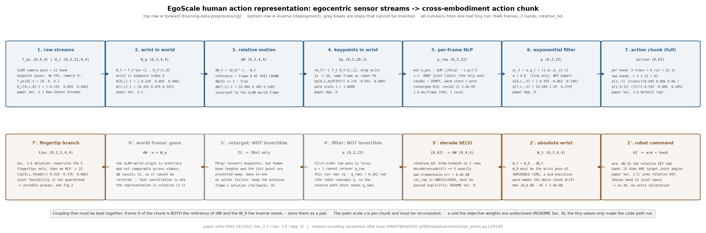
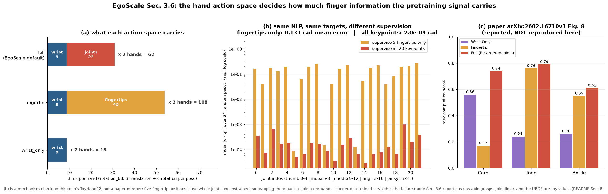

# egoscale · action: 把第一视角视频里的手变成跨本体的动作向量

**TL;DR.** 第一视角人类视频没有机器人动作标签, 只有相机位姿和估计出来的手部姿态; 要把 20,854 小时这样的视频当预训练监督, 必须先定义一个 "人和机器人共用" 的动作空间 —— 这是**训练侧**的问题, 出自论文 §2.1 与附录 D. EgoScale 的做法是两条腿: 手臂用 **chunk 内相对首帧的腕部 SE(3) 运动** `ΔW_t = (W_0^w)^{-1} W_t^w` (天然与全局相机运动无关), 手指用 **逐帧非线性规划把 21 个人手关键点重定向到 22 自由度 Sharpa 手的关节角** (只受 URDF 关节限位约束, CasADi + IPOPT 求解, 用前一帧的解 warm start, 再过一阶指数滤波). 代价是每帧一次 NLP 的离线预处理开销与重定向误差; 收益是论文 §3.6 图 8 里这个动作空间在三个任务上都最好: Card 0.74 / Tong 0.79 / Bottle 0.61, 对比只用腕部的 0.56 / 0.24 / 0.26 和指尖表示的 0.17 / 0.76 / 0.55.

**流程图**: 上排是正过程 —— 从原始传感器流 (相机位姿 + 21 关键点) 一路走到一个 chunk 的动作向量, 每框标了 shape 和一次真实 tiny 运行 (T=8 帧, 双手) 的具体数值; 下排是镜像的逆过程 —— 从动作向量还原回可执行的机器人命令, 并标出上游在求解失败时的行为.



**第二幅图的论点**: `figs/action_spaces.png` 要让读者看出, 三种动作空间的区别不只是维度 (18 / 108 / 62), 而是"监督信号把手指钉死了多少". 中间那张图是本仓库的机制自测: 同一个 NLP、同一组目标, 只把监督从 20 个关键点换成 5 个指尖, 关节角误差就从 2.0e-4 rad 涨到 0.131 rad —— 整根手指的内部构型没有被约束住. 这正是论文 §3.6 说指尖表示"映射后常产生不可行关节构型, 在 Card / Bottle 这种接触敏感任务上抓取不稳"的机制. 右边那张是论文图 8 的原始数字, 只引用不复现.

本 module 只复现**动作表示与重定向本身**: 从原始位姿流到动作向量, 以及逆过程. 动作向量怎么被拼进 batch、怎么归一化、怎么按本体 padding, 在 [`../data`](../data/README.md); 动作向量怎么被模型消费, 在 [`../dit`](../dit/README.md). 它是整条链路的**第 0 步**: 没有它, 20,854 小时视频只是像素.

上游: EgoScale **本身未开源** (项目页 https://research.nvidia.com/labs/gear/egoscale/ 的 GitHub 标注 "Coming Soon!", 2026-09-17 访问), 本 module 按论文 [arXiv:2602.16710v1](https://arxiv.org/abs/2602.16710v1) §2.1、§3.6、附录 D 实现. 旋转表示的候选集合与转换约定参照架构上游 [NVIDIA/Isaac-GR00T](https://github.com/NVIDIA/Isaac-GR00T) @ `4af2b622892f7dcb5aae5a3fb70bcb02dc217b96` (`Isaac-GR00T@4af2b62`) 的 `gr00t/data/transform/state_action.py` `RotationTransform` (L29-L95). PyTorch 重写, 不 import 上游.



## 1. I/O 契约

本 module 没有模型, 主文件是 `action.py`. 所有函数都是纯张量 / 纯 numpy 变换, 无参数 (唯一带参数的是 §1.3 的指尖映射头, 它属于消融分支).

### 1.1 人类动作表示: `action.py`

**`wrist_pose_world(T_wc, H_c)`** (论文 §2.1 "Raw Sensor Streams")

| 名称 | shape / dtype | 取值 | 说明 |
|---|---|---|---|
| 入 `T_wc` | `(T, 4, 4)` float32 | 齐次变换, 旋转块正交 | 时刻 `t` 的相机位姿 `T_t^{w←c} ∈ SE(3)`, 由 off-the-shelf SLAM 估计 |
| 入 `H_c` | `(T, 2, 21, 4, 4)` float32 | 齐次变换 | 21 个手部关键点在**相机系**下的刚体变换 `H_t^{c,i}`; 维 1 是左右手; 论文用 1-based 索引且 `i = 1` 是腕部, 本仓库用 0-based, 腕部是 `i = 0` |
| 出 `W_w` | `(T, 2, 4, 4)` float32 | 齐次变换 | 世界系腕部位姿 `W_t^w = T_t^{w←c} · H_t^{c,0}` |

**`relative_wrist_motion(W_w)`** (论文 §2.1 "Wrist-level Arm Motion")

| 名称 | shape / dtype | 取值 | 说明 |
|---|---|---|---|
| 入 `W_w` | `(T, 2, 4, 4)` float32 | 齐次变换 | 一个 action chunk 内的世界系腕部位姿 |
| 出 `dW` | `(T, 2, 4, 4)` float32 | `dW[0]` 恒为单位阵 | `ΔW_t = (W_0^w)^{-1} W_t^w`, 参考帧是 **chunk 的第 0 帧**, 见 §1.4 冲突记录 |

**`encode_se3(dW, rot_rep)`** / **`decode_se3(vec, rot_rep)`** (旋转表示候选集合见 `Isaac-GR00T@4af2b62` `state_action.py` L32)

| 名称 | shape / dtype | 取值 | 说明 |
|---|---|---|---|
| 入 `dW` | `(..., 4, 4)` float32 | 齐次变换 | |
| 入 `rot_rep` | `str` | `"rotation_6d"` / `"quaternion"` / `"axis_angle"` / `"euler_angles"` | EgoScale **未披露**用哪一种, 必须显式传入, 见 §8 |
| 出 `vec` | `(..., 3 + R)` float32 | 平移单位为米 | `R = 6 / 4 / 3 / 3`; 前 3 维是平移, 后 `R` 维是旋转 |

`decode_se3` 是 `encode_se3` 的左逆: `rotation_6d` 走 Gram-Schmidt 正交化, 因此 `decode(encode(X)) == X` 精确成立 (在 float32 容差内), 反向 `encode(decode(v))` 只在 `v` 的旋转块本身合法时成立.

### 1.2 手部重定向: `action.py`

**`ToyHand22`** —— 22 自由度手的 URDF 式正运动学 (论文附录 D: "URDF-based forward kinematics, which maps joint angles to 20 robot keypoint poses")

| 名称 | shape / dtype | 取值 | 说明 |
|---|---|---|---|
| 属性 `n_joints` | `int` | `22` | 5 指: 拇指 5 + 食指 4 + 中指 4 + 无名指 4 + 小指 5 |
| 属性 `limits` | `(22, 2)` float64 | 弧度 | 关节下/上限; **真实 Sharpa Wave 的 URDF 不公开**, 这里是玩具值, 见 §8 |
| `fk(q)` 入 `q` | `(22,)` float64 | 弧度, 落在 `limits` 内 | 关节角 |
| `fk(q)` 出 `p` | `(20, 3)` float64 | 米, 腕部坐标系 | 20 个机器人关键点位置 (每指 4 个: MCP / PIP / DIP / TIP) |
| `fk_pose(q)` 出 | `(20, 4, 4)` float64 | 齐次变换 | 同上但带朝向 (附录 D 的 "positions and quaternions") |

**`retarget_chunk(kp_human, hand, cfg, q_init=None, kp_weight=None)`** (论文附录 D)

| 名称 | shape / dtype | 取值 | 说明 |
|---|---|---|---|
| 入 `kp_human` | `(T, 20, 3)` float64 | 米, **腕部坐标系** | 去掉腕部后的 20 个人手关键点位置; 由 `human_keypoints_in_wrist_frame` 从 `(T, 21, 4, 4)` 得到 |
| 入 `hand` | `ToyHand22` | | 目标手 |
| 入 `cfg` | `ActionConfig` | | 其中 `weights` 是目标函数三项权重 (**论文只说 "a weighted combination of different objectives", 项与权重均未披露**), `alpha` 是滤波系数 (**未披露**), `ipopt_*` 是求解器选项 (**未披露**), 见 §8 |
| 入 `q_init` | `(22,)` float64 或 `None` | | 第 0 帧的 warm start; `None` 取 `limits` 的中点 |
| 入 `kp_weight` | `(20,)` float64 或 `None` | ≥ 0 | 每个关键点的监督权重, 默认全 1 (附录 D 的默认). 只把 5 个 TIP 置 1 就退化成 §3.6 fingertip 表示所携带的信息量 —— `figs/action_spaces.png` 的 (b) 图就是这样测出来的 |
| 出 `q` | `(T, 22)` float64 | 弧度, 落在 `limits` 内 | 滤波后的关节角序列 |
| 出 `info` | `dict` | `raw (T,22)`, `residual (T,)`, `converged (T,) bool`, `n_fallback int`, `scale float` | 滤波前的解、每帧 IPOPT 的目标值与收敛标志、尺度比 |

单帧求解的数学形式 (附录 D: "solve a nonlinear program over the 22 joint angles, subject only to joint limits from the URDF"):

```
min_q  w_pos · Σ_k ‖ FK_k(q) − s · p_k^human ‖²          # 关键点位置匹配
     + w_smooth · ‖ q − q_prev ‖²                        # 时间平滑 (warm start 帧)
     + w_reg · ‖ q − q_rest ‖²                           # 静息姿态正则
s.t.  limits[:, 0] ≤ q ≤ limits[:, 1]                    # 唯一的约束
```

`s` 是手掌尺度比 (机器人中指 MCP→PIP→DIP→TIP 三段骨长之和 / 人手同一量), 用来消除人手与机器人手的尺寸差. 用相邻关键点之间的骨长而不是指尖到腕部的直线距离: 前者恒等于刚性连杆长度, 与姿态无关; 后者会随掌指关节转动而变. 三项权重都在 `RetargetWeights` 里, `paper()` 配置下全是 `None` (未披露), `tiny()` 下有能跑通的值并标注为非论文值.

### 1.3 三种动作空间: `action.py` (论文 §3.6)

**`build_action_chunk(dW, q_hand, space, rot_rep, kp_fingertip=None)`**

| `space` | 每只手的维度 | 双手合计 | 内容 |
|---|---|---|---|
| `"wrist_only"` | `3 + R` | `2(3+R)` = **18** (R=6) | 只有 `ΔW`, 无任何手指监督 |
| `"fingertip"` | `(3+R)(1 + 5)` | `12(3+R)` = **108** (R=6) | 腕部 + 5 个指尖的 SE(3) 轨迹; 需要一个 MLP 再映射到关节命令 |
| `"full"` | `3 + R + 22` | `2(3+R+22)` = **62** (R=6) | 腕部 + 22 个重定向关节角 (**EgoScale 默认**) |

**`FingertipToJointMLP(n_fingers=5, rot_dim=R, n_joints=22, hidden=None)`** —— 论文 §3.6 对指尖表示的描述是 "predicts SE(3) trajectories of the wrist and fingertips, followed by an MLP mapping to robot joint commands", 引 EgoVLA [arXiv:2507.12440]. 这个 MLP 的层数、宽度、激活**均未披露**, 见 §8.

| 名称 | shape / dtype | 说明 |
|---|---|---|
| 入 | `(B, T, 5·(3+R))` float32 | 5 个指尖的 SE(3) 编码 |
| 出 | `(B, T, 22)` float32 | 关节命令 |

### 1.4 符号 / 约定差异与冲突记录

| # | 论文 / 上游 | 本仓库 | 采信理由 |
|---|---|---|---|
| 1 | §2.1 正文写 "relative wrist motion **between consecutive timesteps**", 附录 D.1 写 "**frame-to-frame** wrist transformations"; 但同段给出的公式是 `ΔW_t = (W_0^w)^{-1} W_t^w` | 按**公式**实现: 参考帧是 chunk 第 0 帧 | 公式是显式数学, 措辞是散文; 且"帧间差分"会让 `ΔW_0` 无定义. 两种口径都记在 §8 |
| 2 | §2.1 写手部姿态是 **21 个关键点**; 附录 D 写 "21 human hand keypoints (**represented as 25 keypoints per hand** with 3D position and orientation)"; §2.2 又说 Manus 手套记录 **25 个关节 transform** | 接口按 **21**, 并允许多出来的关键点由调用方裁掉 | 21 是 §2.1 的模型定义, 25 是 Manus 硬件的原始输出. 记在 §8 |
| 3 | 附录 D 写正运动学映射到 **20 个** 机器人关键点; 人手侧是 21 个 (含腕部) | 去掉腕部后 21 → 20, 一一对应 | 腕部已经由 `ΔW` 单独监督, 不应在手指目标里重复计一次 |
| 4 | §3.6 正文说 "wrist-only 在所有任务上都差, 尤其是 Tongs、Cards"; 但图 8 里 Card 的 wrist-only 是 0.56, 高于 fingertip 的 0.17 | 代码不依赖此结论; 图里照抄图 8 的数字 | 正文与图不一致, 如实记在 §8 |
| 5 | 上游 `Isaac-GR00T@4af2b62` `state_action.py` L34 的默认是 `from_rep="axis_angle", to_rep="rotation_6d"` | `rot_rep` 必须显式传入, 无默认 | EgoScale 没说它用哪个; 不把 GR00T 的默认冒充成 EgoScale 的值 |

## 2. 复现范围

| 有代码 | 只有事实 (背景) |
|---|---|
| `W_t^w = T_t^{w←c} H_t^{c,0}` 的构造 | 相机位姿与手部姿态由 "off-the-shelf" SLAM / hand-pose 估计得到, 论文未指明具体方法 (§2.1) |
| `ΔW_t = (W_0^w)^{-1} W_t^w` 与它对全局世界系变换的不变性 | 20,854 小时数据的采集方式、场景/任务/物体分布 (§2.2, 附录 C) |
| SE(3) ↔ 向量的四种编码及其逆 | EgoScale 实际选用哪种旋转表示 |
| 22 自由度手的 URDF 式正运动学 (玩具 URDF) | 真实 Sharpa Wave 手的 URDF、连杆尺寸、关节限位 (产品页 https://www.sharpa.com/pages/wave, 论文引 [29]) |
| 逐帧 NLP 重定向: 关节限位约束、warm start、IPOPT 求解、一阶指数滤波 | 目标函数的完整项与权重、滤波系数、IPOPT 的求解器选项 |
| 三种动作空间的并排构造与维度 | 三种表示在真机上的得分 (§3.6 图 8, 本仓库只在图里引用, 不复现) |
| 指尖 → 关节的 MLP 映射头 (结构占位) | 该 MLP 的层数 / 宽度 / 训练方式 |

## 3. 推理侧

本 module 在推理侧只出现在**输出端的逆变换**上. 策略输出的是 62 维动作向量; 部署时:

1. `decode_se3(vec[..., :9], "rotation_6d")` → `ΔW_t` (4×4);
2. 机器人侧的相对末端位姿命令直接就是 `ΔW_t` —— 论文 §2.5 说 R1Pro 的两条 7 自由度臂 "controlling both 7-DoF arms in relative end-effector space where actions specify incremental position and orientation changes", 与人类侧的腕部表示同构, 所以**没有额外的 IK 或标定步骤**;
3. `vec[..., 9:31]` 的 22 维直接就是目标关节角 —— 论文 §2.5: Sharpa Wave 手是 "joint-space control, where actions directly specify target joint angles";
4. 若要还原绝对腕部位姿 (例如做可视化), 用 `W_t^w = W_0^w · ΔW_t`, 其中 `W_0^w` 必须是**推理那一刻**的腕部位姿, 不是执行过程中的新位姿.

延时: 重定向是**离线预处理**, 不在推理链路上. 论文未披露单帧 NLP 的耗时, 见 §8. 本仓库 tiny 配置下单帧 IPOPT 在 CPU 上约 10-30 ms (见 `action.py` 的 `main()` 打印).

## 4. 训练侧

### 4.1 数据组织形式

一条人类演示 = 第一视角 RGB 视频 (30 FPS, 论文 §2.2) + 每帧的相机位姿 `T_t^{w←c}` + 每帧双手的 21 个关键点 `H_t^{c,i}`. 训练样本按 action chunk 切分, 每个 chunk 内部用**自己的第 0 帧**做参考帧. chunk 长度 `H` **EgoScale 未披露**, 见 §8.

### 4.2 数据预处理, 逐步

| # | 步骤 | 依据 |
|---|---|---|
| 1 | 相机系关键点 → 世界系腕部位姿 `W_t^w = T_t^{w←c} H_t^{c,0}` | §2.1 |
| 2 | 世界系 → chunk 内相对 `ΔW_t = (W_0^w)^{-1} W_t^w` | §2.1 |
| 3 | 21 个关键点转到**腕部坐标系** `(W_t^w)^{-1} T_t^{w←c} H_t^{c,i}`, 去掉腕部得 20 个 | 附录 D (FK 输出在腕部系) |
| 4 | 按手掌尺度比 `s` 缩放人手关键点 | 附录 D 的 "kinematic consistency"; 尺度项本身未披露, 见 §8 |
| 5 | 逐帧 NLP 求 22 个关节角, 只受关节限位约束, 用前帧解 warm start | 附录 D |
| 6 | 一阶指数滤波 `q̃_t = α q_t + (1−α) q̃_{t−1}` 去抖 | 附录 D |
| 7 | `ΔW` 编码成向量与 22 个关节角拼接成动作 chunk | §2.1 + §3.6 |
| 8 | 归一化、跨本体 padding、`action_mask` | 不在本 module, 见 [`../data`](../data/README.md) |

### 4.3 training objective / curriculum

本 module 不产生 loss. 它产生的是 flow matching 的**回归目标** `A_t`, 目标怎么被用见 [`../dit`](../dit/README.md), 三阶段 curriculum 见 [`../train`](../train/README.md).

## 5. 评测

(a) **接口**: 本 module 没有环境交互, 评测对象是**重定向本身的保真度**. 定义一个 oracle 接口: 给定一组真关节角 `q*`, 用 `hand.fk(q*)` 生成"人手"关键点, 再喂给 `retarget_chunk`, 看能否还原 `q*`. 观测键 `kp_human (T,20,3)`, 输出 `q (T,22)`, 无终止条件, episode 长度就是 chunk 长度.

(b) **task 列表**: 三个 oracle 轨迹 —— 静止的张开手、从张开到握拳的插值、随机游走. 覆盖 warm start 有用 / 无用两种情形.

(c) **metric**: 关节角均方根误差 `RMSE(q, q*)` (弧度) 与关键点位置均方根误差 (米); 以及 IPOPT 收敛率. 论文没有给任何重定向精度数字, 所以**这里不与论文对齐**, 只作为机制自检.

(d) **流程**: 见 `test_parity.py::test_oracle_roundtrip`. 完整的 episode 循环与打分在 [`../infer/eval.py`](../infer/README.md), 本 module 不重复.

(e) **与论文对齐程度**: 只对齐机制 (NLP 形式、约束、warm start、滤波、维度), 不对齐任何数字.

`test_parity.py` (CPU, 约 40 秒) 检查什么:
- **shape / 维度**: `wrist_pose_world`、`relative_wrist_motion`、`encode_se3` 四种表示、`ToyHand22.fk`、三种动作空间的 18 / 108 / 62 维、`FingertipToJointMLP` 的参数量与手算值一致;
- **解析性质**: `ΔW_0` 是单位阵; `W_t = W_0 · ΔW_t` 复原; `decode(encode(X)) == X` 对四种表示成立; `ΔW` 对任意全局世界系变换 `G`(左乘所有 `T_wc`) 不变; `α = 1` 时指数滤波是恒等; oracle 重定向的残差趋于 0 且关节角落在限位内;
- **分布 / 不变性**: 12 个随机可达姿态经 FK → 重定向 → FK 的关键点误差中位数 < 1e-4 m、95 分位 < 1e-3 m; 给物理上不可达的目标时关节角仍然不越界.

```
uv run pytest gear/egoscale/action -q
uv run python -m gear.egoscale.action.action
uv run python gear/egoscale/action/figs/make_pipeline.py
uv run python gear/egoscale/action/figs/make_figs.py
```

## 6. cost 信息

| 项目 | 值 | 来源 |
|---|---|---|
| 训练算力 | 本 module 不训练; 重定向是离线预处理, 论文未披露其 CPU 成本 | 未披露 → §8 |
| 训练数据规模 | Stage I 共 20,854 小时第一视角视频, 30 FPS; 其中 EgoDex 829 小时 (194 个桌面任务); in-the-wild 部分覆盖 9,869 场景 / 6,015 任务 / 43,237 物体 | 论文 §2.2 |
| | 按 20,854 h × 3600 s × 30 FPS × 2 只手 ≈ **4.5 × 10⁹ 次单帧 NLP 求解** (本仓库据披露的时长与帧率推算, 非论文数字) | 推算 |
| token 数 | 不适用 (本 module 不产生 token) | — |
| 模型大小 | `ToyHand22` 与所有位姿变换都**无参数**; `FingertipToJointMLP` 在 tiny 配置下 4,374 参数 (结构未披露) | 本仓库 / 未披露 → §8 |
| 推理延时 | 重定向不在推理链路上; tiny 配置单帧 IPOPT 约 10-30 ms (Apple M 系列 CPU, 单核) | 本仓库实测 |

## 7. reference 映射表

| 本仓库 | 上游 |
|---|---|
| `wrist_pose_world` | 论文 [arXiv:2602.16710v1](https://arxiv.org/abs/2602.16710v1) §2.1 "Raw Sensor Streams" |
| `relative_wrist_motion` | 论文 §2.1 "Wrist-level Arm Motion"; 附录 D.1 "Shared Wrist Action" |
| `encode_se3` / `decode_se3` | 旋转表示候选集合与"总是以矩阵为中间表示"的约定: `Isaac-GR00T@4af2b62` `gr00t/data/transform/state_action.py` L29-L95 (`RotationTransform`, `valid_reps` 在 L32) |
| `ToyHand22.fk` / `fk_pose` | 论文附录 D "URDF-based forward kinematics, which maps joint angles to 20 robot keypoint poses (positions and quaternions)" |
| `RetargetWeights` | 论文附录 D "minimize a weighted combination of different objectives" (项与权重未披露) |
| `retarget_frame` | 论文附录 D "solve a nonlinear program over the 22 joint angles, subject only to joint limits from the URDF ... implemented in CasADi and solved using IPOPT, warm-started from the previous frame's solution" |
| `exponential_filter` | 论文附录 D "further smoothed using a first-order exponential filter" |
| `retarget_chunk` | 论文附录 D 全段 |
| `human_keypoints_in_wrist_frame` | 论文 §2.1 + 附录 D (FK 的输出在腕部系, 人手侧需转到同一系) |
| `retarget_chunk` 的 `kp_weight` | 论文 §3.6 的 fingertip 分支只给 5 个指尖的 SE(3) 轨迹; 本仓库用同一个 NLP 的监督掩码来度量它的信息量 |
| `build_action_chunk` (`wrist_only` / `fingertip` / `full`) | 论文 §3.6 与图 8 |
| `FingertipToJointMLP` | 论文 §3.6 "a fingertip-based representation [42] that predicts SE(3) trajectories of the wrist and fingertips, followed by an MLP mapping to robot joint commands"; [42] = EgoVLA [arXiv:2507.12440](https://arxiv.org/abs/2507.12440) |
| `paper()` 的 `n_keypoints_human=21`, `n_keypoints_robot=20`, `n_joints=22` | 论文 §2.1 / 附录 D |

## 8. gap ledger

| 未披露 / 未复现 | 说明 |
|---|---|
| 旋转表示 (`rot_rep`) | EgoScale 全篇未说 `ΔW` 的旋转用什么编码. 代码要求显式传入, 无默认值. 上游 GR00T 的 `RotationTransform` 默认 `axis_angle → rotation_6d` (`state_action.py` L34), 但那是 GR00T 的默认, 不是 EgoScale 的值. tiny 与图里用 `rotation_6d` 仅为跑通 |
| 重定向目标函数的项与权重 (`RetargetWeights`) | 论文只写 "a weighted combination of different objectives", 未列项也未给权重. `paper()` 里三项权重全为 `None`; `tiny()` 用 `w_pos=1.0, w_smooth=1e-4, w_reg=1e-5`, 仅为跑通, 非论文值 |
| 指数滤波系数 `α` | 附录 D 只说 "first-order exponential filter". `paper()` 为 `None`; `tiny()` 用 `0.6`, 仅为跑通, 非论文值 |
| 手掌尺度比 `s` 的定义 | 附录 D 只提 "kinematic consistency". 本仓库按"中指 MCP→PIP→DIP→TIP 三段骨长之和的比值"实现 (骨长恒等于刚性连杆长度, 与姿态无关), 这是本仓库的定义, 不是论文的 |
| 真实 Sharpa Wave 手的 URDF | 论文引 [29] 的是产品页 https://www.sharpa.com/pages/wave (2026-09-17 访问), 无公开 URDF. `ToyHand22` 的连杆长度与关节限位全是本仓库自造的玩具值, 仅保证 22 自由度、20 个关键点、限位约束这三条结构事实与附录 D 一致 |
| 每指关节数的划分 | 附录 D 只说总共 22 自由度. 本仓库按 5/4/4/4/5 划分, 这是本仓库的选择 |
| IPOPT 的求解器选项 (容差、最大迭代、线性求解器) | 论文未披露. `tiny()` 用 `max_iter=200, tol=1e-8`, 仅为跑通 |
| action chunk 长度 `H` | EgoScale 全篇未给. GR00T N1 用 `H = 16` ([arXiv:2503.14734](https://arxiv.org/abs/2503.14734) §2.1), 但那是 GR00T 的值. `paper()` 为 `None` |
| `FingertipToJointMLP` 的层数 / 宽度 / 激活 / 训练方式 | §3.6 只说 "an MLP". `paper()` 的 `hidden` 为 `None` |
| 关键点数 21 vs 25 | §2.1 说 21, 附录 D 说 "21 keypoints (represented as 25 keypoints per hand)", §2.2 说 Manus 手套录 25 个关节 transform. 三处口径不一致, 本仓库接口按 21 |
| 参考帧: 首帧 vs 相邻帧 | §2.1 正文与附录 D.1 的措辞是"相邻帧", 公式是"chunk 首帧". 本仓库按公式. 见 §1.4 第 1 条 |
| §3.6 正文与图 8 不一致 | 正文称 wrist-only 在 Card 上差, 图 8 显示 Card 的 wrist-only (0.56) 高于 fingertip (0.17). 本仓库不依赖该结论 |
| 单帧 NLP 的计算成本 | 论文未披露. 按披露的时长/帧率推算需约 4.5 × 10⁹ 次求解, 该推算是本仓库做的 |
| 重定向精度 | 论文未给任何重定向误差数字, 本 module 的 oracle 误差只是自检, 不对齐论文 |

## 9. 领域概念表

### domain 概念

**proprioceptive state (本体感受状态)**
- shape: 机器人侧 `(D_state,)` float32, 人类侧**不存在**
- 含义: 机器人自己关节 / 末端 / 手指的当前读数, 单位是弧度 (关节) 或米 (位置)
- 来源: 机器人电机编码器以控制频率回读; 人类第一视角视频里没有任何对应物 —— 摄像机拍不到"我的关节角是多少"
- 为什么需要: 策略要知道"我现在在哪"才能输出增量动作; 去掉它, 相同画面下的不同起始构型会被映射到相同动作
- 系统联系: 人类样本这一维的缺失正是 EgoScale 要用**可学习占位 token** 顶替的原因 (论文 §2.3), 具体实现在 [`../data`](../data/README.md)

**action chunk (动作块)**
- shape: `(H, D_action)` float32, 本 module 的 `full` 空间下 `D_action = 62`
- 含义: 一次推理输出的连续 `H` 步动作, 而不是单步
- 来源: 从人类演示或机器人轨迹里按固定窗口切出来
- 为什么需要: 推理延时远大于控制周期, 必须一次出多步开环执行; 另外多步目标能抑制单步模仿的抖动
- 系统联系: chunk 的第 0 帧同时是 `ΔW` 的参考帧 —— 这两件事在 EgoScale 里是绑定的, 换 chunk 就换参考系

**delta action vs absolute action (增量动作 vs 绝对动作)**
- shape: 本 module 里前 `3+R` 维 (腕部) 是 **delta**, 后 22 维 (手指) 是 **absolute**
- 含义: 腕部输出的是相对 chunk 起点的位姿增量; 手指输出的是目标关节角本身
- 来源: 腕部 delta 来自 `ΔW` 的定义; 手指 absolute 来自 Sharpa 手的关节空间控制接口 (论文 §2.5)
- 为什么需要: 腕部用增量才能跨本体 (人手和机器人臂的绝对工作空间完全不同); 手指用绝对是因为关节角本身已经是跨本体对齐过的量
- 系统联系: 逆变换时 `W_0^w` 必须取**推理那一刻**的腕部位姿, 用执行中途的新位姿会让整个 chunk 漂移

**跨本体重定向 (retargeting)**
- shape: `(20, 3)` 人手关键点 → `(22,)` 机器人关节角
- 含义: 把一种运动学结构上的运动"翻译"到另一种结构上, 保持语义 (捏、握、张开) 而非逐点几何
- 来源: 逐帧解一个以关键点距离为目标、以 URDF 关节限位为约束的非线性规划
- 为什么需要: 人手有 ~27 个自由度且骨长因人而异, 机器人手是固定的 22 个受限关节; 不翻译就没有可执行的监督信号
- 系统联系: 它决定了预训练监督信号的质量上限 —— 论文 §3.6 图 8 显示换成 wrist-only 后 Tong 任务从 0.79 掉到 0.24

**多相机与相机槽位**
- shape: 本 module 只用到头部第一视角相机的位姿 `(T, 4, 4)`
- 含义: 固定的相机命名位 (head / left_wrist / right_wrist), 缺相机时填黑加 mask 而不是跳过
- 来源: 头部 OAK-D-Wide + 两个腕部 OAK-1-Wide (论文 §2.5); 人类 mid-training 数据用**同样的三相机配置**采集, 视角与内参对齐 (论文 §2.2)
- 为什么需要: 相机位姿是 `W_t^w` 的左乘因子, 换相机等于换世界系
- 系统联系: `ΔW` 对全局世界系变换不变, 这正是"人类戴头显乱走"与"机器人固定底盘"能共用同一动作空间的原因; 槽位本身的处理在 [`../data`](../data/README.md)

### application 概念

**SLAM 估计的相机位姿**
- shape: `(T, 4, 4)` float32
- 含义: 每帧相机在一个任意但固定的世界系中的 6 自由度位姿
- 来源: off-the-shelf SLAM 跑在第一视角 RGB 上 (论文 §2.1); 世界系原点是 SLAM 自己选的, 不同视频之间**不可比**
- 为什么需要: 只有它能把相机系的手部姿态抬到一个在时间上连贯的系里
- 系统联系: 正因为世界系不可比, EgoScale 才必须用 `ΔW` 而不是绝对腕部位姿 —— 相对量把 SLAM 的任意原点约掉了

**动作捕捉手套 (Manus) 与 Vive tracker**
- shape: 手套 25 个关节 transform, tracker 一个 6 自由度腕部位姿
- 含义: Stage II 对齐数据里, 人类的手部与腕部运动用与机器人遥操作**完全相同**的采集栈录制
- 来源: 论文 §2.2; 所有信号与视频流同步
- 为什么需要: Stage I 的 in-the-wild 数据靠视觉估计, 噪声大; Stage II 需要高精度信号来把表示锚定到机器人的感知与控制空间
- 系统联系: 手套输出直接就是关节 transform, 因此 Stage II 的人类数据**不需要走本 module 的 NLP 重定向**这条路 —— 但论文没有明说这一点, 见 §8 的 21 vs 25 条目
