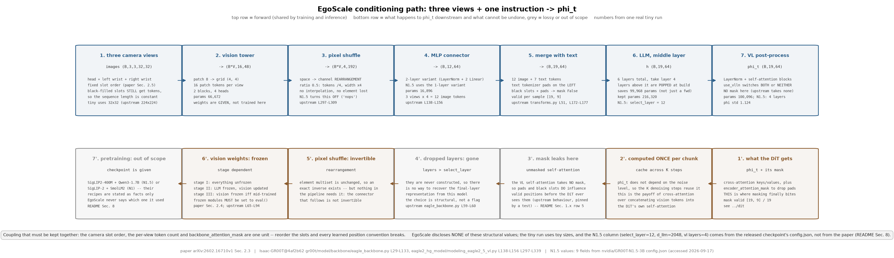
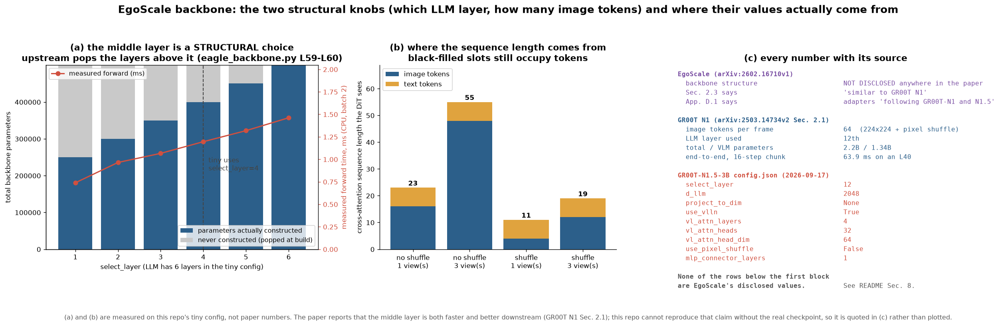

# egoscale · backbone: 把三路图像和一句指令压成一串条件向量

**TL;DR.** DiT action expert 需要一串"这一刻看到了什么、要做什么"的条件向量 `φ_t`; EgoScale 直接复用 GR00T 的视觉语言 backbone, 一个字没改 —— 这是**推理侧**的问题, 论文 §2.3 只用一句话带过 ("encoded into a vision-language embedding `φ_t`"). 机制是: 三路图像各自过 ViT 得到 patch token, 经一个 MLP connector 投到 LLM 宽度, 与指令 token 拼成一个序列进 LLM, 然后**取中间层而不是最后一层**的隐状态; 再过一层 LayerNorm 与几层自注意力做后处理. 收益与代价: GR00T N1 报告取第 12 层而非最后一层同时带来**更快的推理和更高的下游成功率** ([arXiv:2503.14734](https://arxiv.org/abs/2503.14734) §2.1); 代价是 backbone 占了整个模型参数量的大头 (GR00T-N1-2B 共 2.2B, 其中 VLM 1.34B, 同上 §2.1), 而且它的预训练 recipe 完全在本仓库的复现范围之外.

**流程图**: 上排是正过程 —— 从 `(T,V,H,W,3)` 的图像与一句指令走到 `(B,S,2048)` 的条件向量, 每框标了 shape 与一次真实 tiny 运行的数值, 并标出被丢弃的上层; 下排说明这条链路上哪些步骤不可逆, 以及推理时哪一部分可以被 cache.



**第二幅图的论点**: `figs/select_layer.png` 要让读者看出"取第 12 层"这个选择的两个后果 —— (a) 第 12 层之后的所有层都被**物理删除**了 (上游 `eagle_backbone.py` L59-L60 直接 `pop` 掉), 所以省下的不只是这一次前向, 而是参数量与显存; (b) 不同层的表征在下游线性可分性上不是单调的, 最后一层已经为"预测下一个词"而特化, 对控制反而更差 —— 这是论文报告"中间层更好"的机制解释.

本 module 只复现**结构与数据通路**: patch 化、pixel shuffle、connector、中间层抽取、VL 后处理. **checkpoint 视为给定**, 预训练 recipe 只做事实陈述. `φ_t` 怎么被 DiT 消费在 [`../dit`](../dit/README.md); 各阶段冻结哪些部分在 [`../train`](../train/README.md).

上游: EgoScale 未开源; 本 module 按论文 [arXiv:2602.16710v1](https://arxiv.org/abs/2602.16710v1) §2.3 与 GR00T 的实现对照, 上游是 [NVIDIA/Isaac-GR00T](https://github.com/NVIDIA/Isaac-GR00T) @ `4af2b622892f7dcb5aae5a3fb70bcb02dc217b96` (`Isaac-GR00T@4af2b62`) 的 `gr00t/model/backbone/eagle_backbone.py` `EagleBackbone` (L29-L133)、`gr00t/model/backbone/eagle2_hg_model/modeling_eagle2_5_vl.py` `pixel_shuffle` / `extract_feature` (L297-L339) 与 `mlp1` (L138-L156)、`gr00t/model/action_head/flow_matching_action_head.py` `process_backbone_output` (L263-L269) 与 `SelfAttentionTransformer` (`cross_attention_dit.py` L309-L375). 数值取自已发布的 [nvidia/GR00T-N1.5-3B](https://huggingface.co/nvidia/GR00T-N1.5-3B) 的 `config.json` (2026-09-17 访问). PyTorch 重写, 不 import 上游.



## 1. I/O 契约

主文件 `model.py`, 只有推理路径.

### 1.1 `VisionLanguageBackbone.forward(images, view_mask, token_ids, attention_mask)`

| 名称 | shape / dtype | 取值 | 说明 |
|---|---|---|---|
| 入 `images` | `(B, V, 3, H, W)` float32 | 已归一化 | `V = 3` 个相机槽位, 顺序由 [`../data`](../data/README.md) 固定 |
| 入 `view_mask` | `(B, V)` bool | | 哪些槽位是真实相机; 填黑的槽位仍然过 ViT (保持 token 数固定), 但在 attention mask 里被屏蔽 |
| 入 `token_ids` | `(B, L)` int64 | `[0, vocab)` | 指令的 token |
| 入 `attention_mask` | `(B, L)` bool | | 指令的 padding mask (上游 tokenizer 是 **left padding**, `transforms.py` L51) |
| 出 `backbone_features` | `(B, S, D_llm)` float32 | | `S = V·N_img + L`; `D_llm = 2048` (N1.5 的 `hidden_size`) |
| 出 `backbone_attention_mask` | `(B, S)` bool | | 上游把 LLM 的 attention_mask 原样传下去 (`eagle_backbone.py` L112) |

`N_img` = 每帧的图像 token 数: 关掉 pixel shuffle 时是 `(H/patch)²`, 开启且 `downsample_ratio = 0.5` 时是 `(H/patch)²/4`.

### 1.2 `pixel_shuffle(x, scale_factor)` (上游 `modeling_eagle2_5_vl.py` L297-L309)

| 名称 | shape | 说明 |
|---|---|---|
| 入 `x` | `(N, w, h, c)` | ViT 输出 reshape 成方阵后的 patch 网格 |
| 出 | `(N, w·s, h·s, c/s²)` | `s = 0.5` 时: token 数 ÷4, 通道 ×4 |

这是**空间到通道**的重排, 不是插值: 四个相邻 patch 的特征被拼成一个更宽的 token. 上游注释给的例子是 `[B, 1024, 1024] -> [B, 16, 16, 4096] -> [B, 256, 4096]` (L327-L333).

### 1.3 `connector` (`mlp1`, 上游 `modeling_eagle2_5_vl.py` L138-L156)

上游有三种形态, 由 `mlp_connector_layers` 与 `use_pixel_shuffle` 决定:

| 条件 | 结构 | 上游行号 |
|---|---|---|
| 2 层 + pixel shuffle | `LayerNorm(vit·4) → Linear(vit·4, llm) → GELU → Linear(llm, llm)` | L142-L147 |
| 1 层 + pixel shuffle | `Linear(vit·4, llm)` | L149-L151 |
| 1 层, 无 pixel shuffle | `Linear(vit, llm)` | L153-L155 |

已发布的 N1.5 checkpoint 的 `eagle_path` 是 `...er_v7_1mlp_nops`, 即**1 层 connector、不做 pixel shuffle** (`config.json`, 2026-09-17 访问). GR00T N1.5 的技术说明也提到"MLP connector 相对 N1 做了修改". 本仓库三种都实现, 由配置选择.

### 1.4 `select_layer` 与被删掉的上层

上游 `EagleBackbone.__init__` L59-L60:

```python
while len(self.eagle_model.language_model.model.layers) > select_layer:
    self.eagle_model.language_model.model.layers.pop(-1)
```

也就是说第 `select_layer` 层之后的层**在构造时就被删掉**, 不只是前向时跳过. N1.5 的 `select_layer = 12` (`config.json`). 本仓库的 `VisionLanguageBackbone` 照做: `n_layers_kept = select_layer`, 并在 §5 的 parity test 里检查参数量确实少了.

### 1.5 VL 后处理: `vlln` + `SelfAttentionTransformer`

上游把它放在 action head 的 `process_backbone_output` 里 (`flow_matching_action_head.py` L263-L269):

```python
backbone_features = self.vlln(backbone_features)          # LayerNorm(backbone_embedding_dim)
backbone_features = self.vl_self_attention(backbone_features)
```

`use_vlln = True` 时两者都生效, 否则两者都是 `Identity` (L198-L206) —— 注意**这两个开关是绑在一起的**, 不能只关一个. N1.5 的 `vl_self_attention_cfg` 是 4 层、32 头、每头 64 维 (inner dim 2048) (`config.json`). 本仓库把这一段放在 backbone 里, 因为它处理的是 backbone 的输出而不是动作.

### 1.x 符号 / 约定差异与冲突记录

| # | 论文 / 上游 | 本仓库 | 采信理由 |
|---|---|---|---|
| 1 | 论文 §2.3 与图 2b 画的是 "Text Encoder" + "Visual Encoder" → "Pretrained VLM" 两个分开的编码器 | 按上游实现: 图像过 ViT + connector 后与文本 token **拼在同一个 LLM 序列里**, 没有独立的 text encoder | 图 2b 是示意图; 上游 `extract_feature` + `language_model` 是实际数据通路 |
| 2 | GR00T N1 论文说 backbone 是 **Eagle-2** (SmolLM2 + SigLIP-2), 224×224 + pixel shuffle → 每帧 **64** 个图像 token, 取第 **12** 层 ([arXiv:2503.14734](https://arxiv.org/abs/2503.14734) §2.1) | 作为 N1 的事实陈述 | 但 EgoScale 用的是 N1.5 级别的 backbone |
| 3 | 已发布的 N1.5 checkpoint 的 `eagle_path` 显示是 **Qwen3-1.7B + SigLIP2-400M, 1 层 MLP connector, 无 pixel shuffle** (`config.json`, 2026-09-17 访问) | 作为 N1.5 的事实陈述 | 与 N1 论文的描述不同, 两代不能混用 |
| 4 | EgoScale 全篇没说自己用 N1 还是 N1.5 级别的 backbone | 结构做成可配置, `paper()` 全为 `None` | 论文 §2.3 说 "similar to GR00T N1", 附录 D.1 说适配器 "following GR00T-N1 and N1.5" —— 两处指向不同代, 见 §8 |
| 5 | 上游的 VL self-attention (`SelfAttentionTransformer.forward`, `cross_attention_dit.py` L358-L375) **不接受任何 mask**, 调用点 (`flow_matching_action_head.py` L263-L269) 也没传 | 照做, 并写测试把这个行为钉死 | 后果是: left padding 与填黑相机的 token 会经由这几层自注意力**泄漏**到有效 token 上, 屏蔽只在下游 DiT 的 cross-attention 里靠 `encoder_attention_mask` 生效. 这不是笔误也不是本仓库的 bug, 是上游的实际数据通路; 见 `test_parity.py::test_vl_self_attention_is_unmasked_upstream_so_isolation_leaks` |

## 2. 复现范围

| 有代码 | 只有事实 (背景) |
|---|---|
| patch 化与 ViT 的最小实现 (结构, 不是权重) | SigLIP2-400M 的预训练目标、数据与配方 |
| `pixel_shuffle` 的精确重排 | 为什么选 `downsample_ratio = 0.5` |
| 三种 connector 形态 | Eagle-2 / 2.5 的视觉语言对齐训练流程 |
| LLM 的最小实现与中间层抽取 (含上层被删) | Qwen3-1.7B / SmolLM2 的预训练 |
| `vlln` + VL self-attention 后处理 | 这两层的初始化与预训练来源 |
| 冻结开关 (`tune_llm` / `tune_visual`) 的语义 | EgoScale 用的具体 checkpoint |

## 3. 推理侧

链路: `images (B,V,3,H,W)` → ViT → `(B·V, N_patch, D_vit)` → (可选 pixel shuffle) → connector → `(B·V, N_img, D_llm)` → 与文本 embedding 拼接 → `(B, S, D_llm)` → LLM 前 `select_layer` 层 → `vlln` → VL self-attention → `φ_t`.

**可以 cache 的部分**: 在一个 action chunk 的 `K` 步去噪里, `φ_t` 只算一次, 每一步去噪都复用 —— 这是 DiT 用 **cross-attention** 而不是把视觉 token 拼进自注意力序列的直接好处. 具体见 [`../dit`](../dit/README.md).

论文未披露 backbone 的单次前向延时. GR00T N1 报告整条链路 (含 4 步去噪) 在 L40 上是 **63.9 ms** ([arXiv:2503.14734](https://arxiv.org/abs/2503.14734) §2.1), 未拆分到 backbone, 见 §8.

## 4. 训练侧

本 module 不产生 loss. 它在训练里的角色是**冻结策略的对象**:

| 阶段 | LLM | 视觉编码器 | 依据 |
|---|---|---|---|
| Stage I 人类预训练 | 解冻 | 解冻 | 论文 §2.4: "fully unfreezing every parameter of the VLA model" |
| Stage II 对齐 mid-training | **冻结** | **更新** | 论文 §2.4 + 附录 D.1: 冻结 vision-language backbone, 只更新 vision encoder、DiT 与 state/action 编解码器 |
| Stage III post-training | — | 有 mid-training 则冻结, 否则解冻 | 论文 §2.4 |

上游用 `set_trainable_parameters(tune_llm, tune_visual)` 实现这个切换 (`eagle_backbone.py` L65-L81), 并且在 `set_frozen_modules_to_eval_mode` 里把冻结的子模块切到 eval —— **这一步不能省**: HuggingFace 每个 training step 都会调 `model.train()`, 不切回去的话冻结部分的 dropout / batchnorm 仍然是训练行为 (L83-L94). 已发布的 N1.5 checkpoint 是 `tune_llm: false, tune_visual: true`, 与 EgoScale Stage II 的描述一致.

完整的三阶段 curriculum 见 [`../train`](../train/README.md).

## 5. 评测

(a) **接口**: 本 module 没有环境交互, 也不做表征质量的 benchmark. 可检查的是**结构与数据通路**: token 数、序列拼接顺序、被删层数、参数量.

(b) **task 列表**: 三种 connector 形态 × 开/关 pixel shuffle × 三个 `select_layer` 取值.

(c) **metric**: token 数与参数量的解析预期值; 被删层后的参数量差; `view_mask` 屏蔽是否真的让对应 token 不影响输出.

(d) **流程**: 见 `test_parity.py`. 表征质量的评测 (线性探针之类) **不做** —— 需要真实 checkpoint, 超出复现范围.

(e) **与论文对齐程度**: 只对齐结构; 不加载任何真实权重, 不复现任何下游数字.

`test_parity.py` (CPU, 约 10 秒) 检查什么:
- **shape / 参数量**: `pixel_shuffle` 的 `(N,w,h,c) → (N,w/2,h/2,4c)`; 每帧 token 数在开/关 shuffle 下分别是 `(H/p)²` 与 `(H/p)²/4`; 三种 connector 的参数量与手算值一致; `select_layer = k` 时 LLM 只剩 k 层且参数量正好少 `(n_total − k)` 层;
- **解析性质**: `pixel_shuffle` 是**重排**而非插值 (元素多重集不变), 且复现上游注释里 `[B,1024,1024] -> [B,256,4096]` 的例子; `use_vlln=False` 时 `vlln` 与 VL self-attention 同时退化成恒等; 在 **LLM 输出处**, 被 `view_mask` 屏蔽的相机与 left padding 的文本都不影响有效 token; 在 **VL 后处理之后**泄漏确实发生, 且关掉 `use_vlln` 后消失 —— 这条测试把上游 "自注意力不带 mask" 的行为钉死;
- **分布检查**: 随机输入下各层输出的 std 落在 `[0.1, 10]` (LayerNorm 生效, 没有数值爆炸).

```
uv run pytest gear/egoscale/backbone -q
uv run python -m gear.egoscale.backbone.model
uv run python gear/egoscale/backbone/figs/make_pipeline.py
uv run python gear/egoscale/backbone/figs/make_figs.py
```

## 6. cost 信息

| 项目 | 值 | 来源 |
|---|---|---|
| 训练算力 | backbone 的预训练成本未披露 (checkpoint 视为给定) | 未披露 → §8 |
| 训练数据规模 | Eagle-2 的视觉语言预训练数据未在 GR00T / EgoScale 中披露 | 未披露 → §8 |
| token 数 | GR00T N1: 224×224 + pixel shuffle → 每帧 **64** 个图像 token ([arXiv:2503.14734](https://arxiv.org/abs/2503.14734) §2.1) | 论文 |
| 模型大小 | GR00T-N1-2B: 总 **2.2B**, 其中 VLM **1.34B** (同上 §2.1) | 论文 |
| | GR00T-N1.5-3B: backbone 为 Qwen3-1.7B + SigLIP2-400M (`config.json` 的 `eagle_path`, 2026-09-17 访问), backbone 隐藏维 **2048**, `select_layer = 12` | HF checkpoint |
| | 本仓库 tiny 配置: 见 `model.py` `main()` 打印的逐模块参数量 | 本仓库 |
| 推理延时 | GR00T N1 端到端 (16 步动作块, 4 步去噪) 在 **L40** 上 **63.9 ms**; backbone 单独的延时未拆分 | 论文 §2.1 / 未披露 → §8 |

## 7. reference 映射表

| 本仓库 | 上游 |
|---|---|
| `VisionLanguageBackbone` | `Isaac-GR00T@4af2b62` `gr00t/model/backbone/eagle_backbone.py` `EagleBackbone` L29-L133 |
| `VisionLanguageBackbone.forward` 的中间层抽取 | 同上 L100-L113 (`hidden_states[self.select_layer]` + `eagle_linear`) |
| `VisionLanguageBackbone` 构造时删上层 | 同上 L59-L60 |
| `set_trainable_parameters` / `set_frozen_modules_to_eval_mode` | 同上 L65-L94; 论文 §2.4 的三阶段冻结 |
| `pixel_shuffle` | `gr00t/model/backbone/eagle2_hg_model/modeling_eagle2_5_vl.py` L297-L309 |
| `extract_feature` 的 reshape 顺序 | 同上 L311-L339 |
| `build_connector` (三种形态) | 同上 L138-L156 |
| `VLPostProcess` (`vlln` + self-attention) | `gr00t/model/action_head/flow_matching_action_head.py` L198-L206 (构造) 与 L263-L269 (前向); `gr00t/model/action_head/cross_attention_dit.py` `SelfAttentionTransformer` L309-L375 |
| `n15()` 里的 `select_layer=12`, `d_llm=2048`, `vl_attn_layers=4`, `vl_attn_heads=32`, `vl_attn_head_dim=64` | [nvidia/GR00T-N1.5-3B](https://huggingface.co/nvidia/GR00T-N1.5-3B) `config.json` (2026-09-17 访问) |

## 8. gap ledger

| 未披露 / 未复现 | 说明 |
|---|---|
| EgoScale 用的是哪一代 backbone | 论文 §2.3 说架构 "similar to GR00T N1", 附录 D.1 说适配器 "following the design of GR00T-N1 and N1.5". 两处指向不同代, 而 N1 (SmolLM2 + SigLIP-2, 有 pixel shuffle) 与 N1.5 (Qwen3-1.7B + SigLIP2-400M, 1 层 connector, 无 pixel shuffle) 的 backbone 结构不同. `paper()` 全为 `None`; 本仓库另给一个 `n15()` 配置, 其中每个值都标注来自 N1.5 的 `config.json`, **不是 EgoScale 的披露值** |
| backbone 的 checkpoint 与预训练 recipe | 完全在复现范围外, 只做事实陈述 |
| 图像分辨率与每帧 token 数 | EgoScale 未披露. N1 是 224×224 → 64 token/帧 |
| 三路相机怎么进同一个序列 | 上游把 `(t v) c h w` 展平后一并交给 processor (`transforms.py` L172-L177), 即三路的 token 顺序拼接; EgoScale 未说是否一样 |
| `view_mask` 如何进 attention | 上游没有 per-view mask 的概念 (缺视频键直接断言失败). 本仓库把填黑槽位的 token 在 `backbone_attention_mask` 里置 False, 这是本仓库的处理 |
| backbone 单独的前向延时 | 未披露; 只有端到端的 63.9 ms (L40, GR00T N1) |
| VL self-attention 不做屏蔽 | 见 §1.x 第 5 条. 屏蔽只在 DiT 的 cross-attention 里生效, 所以有效 token 的表征确实被 padding 影响了. 上游没有讨论这一点, EgoScale 也没有 |
| `vlln` / VL self-attention 的初始化 | 上游代码里是随机初始化后随 checkpoint 一起训的, 具体初始化方案未在论文中说明 |
| N1.5 的 action head 类 | 上游 `flow_matching_action_head.py` L105 的注释写 "N1.5 uses XEmbFlowmatchingPolicyHeadConfig as action head", 但这个类不在该文件里. 本仓库按文件内的 `FlowmatchingActionHead` 复现, 见 [`../dit`](../dit/README.md) |

## 9. 领域概念表

### domain 概念

**相机槽位 token 与 `view_mask` 的关系**
- shape: 图像侧 `(B, V·N_img, D_llm)`, mask 侧 `(B, V·N_img)` bool
- 含义: 每个相机贡献固定数量的 token; 填黑的槽位**仍然占位**, 只是被 attention 屏蔽
- 来源: 由 [`../data`](../data/README.md) 的 `build_video` 决定哪些槽位是真的
- 为什么需要: token 数固定, 序列长度才固定, batch 里不同本体 (1 路 vs 3 路相机) 才能对齐; 如果直接删掉缺失槽位的 token, Stage I 的人类样本和 Stage II 的机器人样本序列长度就不一样
- 系统联系: 这是 Stage I (只有头部相机) 与 Stage II/III (三路) 能共用一个 backbone 的前提

**中间层表征 (middle-layer features)**
- shape: `(B, S, D_llm)`, N1.5 下 `D_llm = 2048`
- 含义: 取 LLM 第 12 层的隐状态作为条件, 而不是最后一层
- 来源: LLM 前向的 `hidden_states[select_layer]`
- 为什么需要: 最后一层已经为"预测下一个词"特化, 携带的是词表方向上的信息; 中间层保留更多与场景、物体、空间关系有关的表征. GR00T N1 报告中间层同时更快且下游成功率更高
- 系统联系: 因为上层被物理删除, 这个选择直接决定了 backbone 的参数量与显存占用, 不只是一次前向的开销

### application 概念

**冻结的子模块必须切到 eval 模式**
- 含义: `requires_grad_(False)` 只关梯度, 不改 dropout / batchnorm 的行为
- 来源: HuggingFace Trainer 每个 training step 都会调 `model.train()`, 把所有子模块切回训练模式
- 为什么需要: 冻结的 backbone 如果还在跑 dropout, 同一张图每次前向给出的 `φ_t` 都不同, 相当于给条件加了噪声
- 系统联系: 上游在 `EagleBackbone.set_frozen_modules_to_eval_mode` (L83-L94) 与 action head 的同名方法里各做了一次; EgoScale 的 Stage II / III 都有冻结, 所以这一步在这条链路上是必需的
