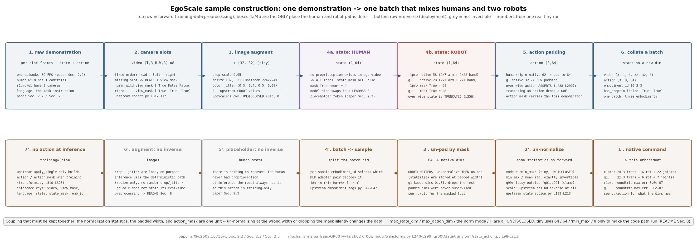
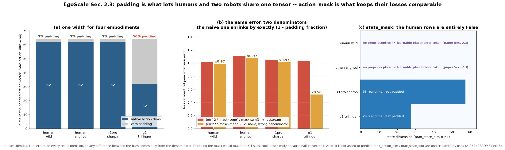

# egoscale · data: 让人和机器人进同一个 batch

**TL;DR.** 上一个 module 把人手变成了动作向量, 但人类样本和机器人样本仍然进不了同一个 batch: 人类没有本体感受状态, 人手与 22 自由度 Sharpa 手与 G1 的 7 自由度三指手动作维度各不相同, 相机数量也不一样 —— 这是**训练侧**的问题, 出自论文 §2.2、§2.3、§2.5. EgoScale 的做法是三条: 人类样本的本体感受**换成一个可学习的占位 token**(论文 §2.3: "we replace `q_t` with a learnable placeholder token, enabling a unified model formulation without architectural changes"), 各本体的 state / action **补零到统一宽度并带 mask**, 相机按**固定槽位**组织 (头部 1 + 双腕 2, 论文 §2.5). 代价是 batch 里有相当比例的维度是 padding; 收益是 20,854 小时人类数据 (其中 EgoDex 829 小时) 与 4 小时机器人数据能用同一个模型、同一个 loss 训练, 且新本体只要加一对 MLP 适配器 (论文 §2.3).

**流程图**: 上排是正过程 —— 从一条原始演示走到一个可以直接喂给模型的 batch, 每框标了 shape 与一次真实 tiny 运行的数值, 并把"人类样本"与"机器人样本"两条路并排画出来 (区别只在 state 那一格); 下排是镜像的逆过程 —— 模型输出怎么变回该本体的原生动作, 含上游遇到缺失字段时的行为.



**第二幅图的论点**: `figs/padding.png` 要让读者看出 padding 的真实代价与 mask 的必要性: 在统一宽度下, 人类 / R1Pro / G1 三种样本各有多大比例的 action 维度是补出来的; 如果 loss 不按 `action_mask` 加权, 这些补零维会直接把不同本体的 loss 尺度拉到不可比 —— 这就是 `action_mask` 不能省的原因.

本 module 只复现**样本的组织与预处理**: 相机槽位、占位状态、padding 与 mask、归一化、数据混合. 动作向量本身怎么来的在 [`../action`](../action/README.md); 占位 token 的**参数**长在哪里、mask 怎么进 loss 在 [`../dit`](../dit/README.md); 三个阶段各用哪份数据在 [`../train`](../train/README.md).

上游: EgoScale 未开源; 本 module 按论文 [arXiv:2602.16710v1](https://arxiv.org/abs/2602.16710v1) §2.2、§2.3、§2.5 实现, 机制对照 [NVIDIA/Isaac-GR00T](https://github.com/NVIDIA/Isaac-GR00T) @ `4af2b622892f7dcb5aae5a3fb70bcb02dc217b96` (`Isaac-GR00T@4af2b62`) 的 `gr00t/model/transforms.py` `GR00TTransform._prepare_state` / `_prepare_action` (L240-L299)、`gr00t/data/transform/state_action.py` `Normalizer` (L98-L213)、`gr00t/data/transform/concat.py` `ConcatTransform.apply` (L75-L112)、`gr00t/data/embodiment_tags.py` (L19-L47). PyTorch 重写, 不 import 上游.



## 1. I/O 契约

主文件是 `data.py`. 没有模型参数.

### 1.1 本体表: `Embodiment`

| 字段 | 类型 | 说明 |
|---|---|---|
| `name` | `str` | `"human_wild"` / `"human_aligned"` / `"r1pro_sharpa"` / `"g1_trifinger"` |
| `embodiment_id` | `int` | 进 DiT 时选哪一对 MLP 适配器; 上游用 `EMBODIMENT_TAG_MAPPING` 把字符串映射成 0-31 的整数 (`embodiment_tags.py` L42-L47), EgoScale 未披露自己的映射, 见 §8 |
| `state_dim` | `int \| None` | 该本体原生的本体感受维度; **EgoScale 未披露**, 见 §8 |
| `action_dim` | `int \| None` | 该本体原生的动作维度; 人类与 R1Pro 用 §3.6 的 `full` 空间 (rotation_6d 下 62), G1 的三指手不同, 见 §8 |
| `has_proprio` | `bool` | 人类演示为 `False` —— 论文 §2.3 的占位 token 分支 |
| `cameras` | `tuple[str, ...]` | 该本体实际有的相机槽位 |

### 1.2 归一化: `Normalizer(mode, stats)`

模式集合与公式逐字对照上游 `state_action.py` `Normalizer` (L98-L213). EgoScale **未披露**用哪种, 必须显式传入.

| `mode` | 正变换 | 逆变换 | 值域 | 上游行号 |
|---|---|---|---|---|
| `"min_max"` | `2(x−min)/(max−min) − 1` | `(x+1)/2·(max−min) + min` | `[−1, 1]` | L153-L173 |
| `"q99"` | `2(x−q01)/(q99−q01) − 1`, 再截断到 `[−1,1]` | `(x+1)/2·(q99−q01) + q01` | `[−1, 1]` | L113-L136 |
| `"mean_std"` | `(x−mean)/std` | `x·std + mean` | 不固定 | L139-L151 |
| `"scale"` | `x / max(|min|,|max|)` | 无逆 (上游 `inverse` 不支持) | `[−1, 1]` | L175-L183 |
| `"binary"` | `x > 0.5` | `x > 0.5` | `{0, 1}` | L185-L187 |

**退化维的处理必须照抄, 它改变数学**: `min == max` 时 `min_max` 把该维**置 0** (L170-L173, 上游把"保留原值"那行注释掉了), 而 `q99` 与 `mean_std` 在退化时**保留原值** (L133-L135 / L149-L151). 三种模式在这一点上不一致, 不是笔误, 见 `test_parity.py::test_degenerate_dims`.

### 1.3 padding 与 mask: `prepare_state` / `prepare_action`

**`prepare_state(state, max_state_dim, state_horizon, has_proprio)`** (对照上游 `transforms.py` L240-L270)

| 名称 | shape / dtype | 取值 | 说明 |
|---|---|---|---|
| 入 `state` | `(Ts, D_s)` float32 或 `None` | 归一化后 | `None` 表示该本体没有本体感受 |
| 出 `state` | `(Ts, max_state_dim)` float32 | 尾部补 0 | `D_s > max_state_dim` 时上游是**截断**而不是报错 (L256-L259) |
| 出 `state_mask` | `(Ts, max_state_dim)` bool | 前 `D_s` 个为 True | 人类样本**整行为 False** |
| 出 `n_state_tokens` | `int` | `Ts` | 一个时刻只占 1 个 token (上游注释 "We only have 1 'proprio' token") |

人类样本走上游 L245-L250 那条分支: `state` 全 0、`state_mask` 全 False. EgoScale 在这一点上**替换了上游语义** —— 上游把它当"没有这个模态", EgoScale 把它当"这里应该放一个可学习的占位 token"(论文 §2.3). 本 module 只负责把 `has_proprio=False` 这个信号传下去, 占位 token 的参数在 [`../dit`](../dit/README.md).

**`prepare_action(action, max_action_dim, action_horizon)`** (对照上游 `transforms.py` L272-L299)

| 名称 | shape / dtype | 取值 | 说明 |
|---|---|---|---|
| 入 `action` | `(H, D_a)` float32 | 归一化后 | |
| 出 `action` | `(H, max_action_dim)` float32 | 尾部补 0 | 与 state 不同, 上游在 `D_a > max_action_dim` 时**断言失败**而不是截断 (L288-L290): 动作截断会静默丢掉自由度 |
| 出 `action_mask` | `(H, max_action_dim)` bool | 前 `D_a` 个为 True | loss 的分母只数 True 的位置, 见 [`../dit`](../dit/README.md) |

### 1.4 相机槽位: `build_video(frames_by_slot, slots, hw)`

| 名称 | shape / dtype | 说明 |
|---|---|---|
| 入 `frames_by_slot` | `dict[str, (T,H,W,3) uint8]` | 只给该本体实际有的槽位 |
| 入 `slots` | `tuple[str, ...]` | 固定顺序 `("head", "left_wrist", "right_wrist")` (论文 §2.5) |
| 出 `video` | `(T, V, H, W, 3)` uint8 | 缺的槽位**填黑**, 不是跳过 |
| 出 `view_mask` | `(V,)` bool | 哪些槽位是真实的 |

上游 `ConcatTransform` 把各路视频 `expand_dims(axis=-4)` 后在新轴上拼接得到 `[..., V, H, W, C]` (`concat.py` L98-L112), 并**要求所有声明的键都存在**, 缺一个就断言失败. 填黑 + `view_mask` 是本仓库按读者契约补的处理, EgoScale 没说缺相机怎么办, 见 §8.

### 1.5 数据混合: `Mixture`

| 名称 | 类型 | 说明 |
|---|---|---|
| `sources` | `list[Source]` | 每条: 名字、小时数、本体、是不是 Stage II 的对齐数据 |
| `weights` | `np.ndarray \| None` | 采样权重; **EgoScale 未披露**, `paper()` 为 `None`, 见 §8 |
| `sample(rng, n)` | `list[Source]` | 按权重抽 n 条 |

模块级函数 `padding_fraction(cfg)` 给出每个本体有多大比例的 action 维度是补出来的, 是 `figs/padding.png` 的数据来源.

论文披露的规模 (§2.2):

| 来源 | 小时数 | 本体 | 阶段 |
|---|---|---|---|
| in-the-wild 第一视角 | 20,025 (= 20,854 − 829, 本仓库相减得到) | `human_wild` | I |
| EgoDex | 829 | `human_wild` | I |
| 对齐人类演示 | ≈ 50 | `human_aligned` | II |
| 对齐机器人遥操作 | ≈ 4 | `r1pro_sharpa` | II |
| G1 play 数据 | **未披露** | `g1_trifinger` | II (论文 §3.5 只说 mid-training 的混合里"includes G1 embodiment play data", 没给规模) |

### 1.x 符号 / 约定差异与冲突记录

| # | 论文 / 上游 | 本仓库 | 采信理由 |
|---|---|---|---|
| 1 | 上游 `data_config.py` 的每个配置都是 `max_action_dim=32` (L201-L202 等) | 作为**配置项**, `paper()` 为 `None` | EgoScale 的 `full` 动作空间在 rotation_6d 下是 2×31 = **62 维**, 超过 32, 上游 `_prepare_action` 会直接断言失败 (L288-L290). 说明 EgoScale 必然改了这个值, 但没说改成多少 |
| 2 | 上游 `max_state_dim=64` | 同上, `paper()` 为 `None` | EgoScale 未披露各本体的 state 维度 |
| 3 | 上游 `_prepare_state` 对超宽 state 是**截断**, `_prepare_action` 对超宽 action 是**断言失败** | 照抄两种行为 | 这是上游有意的不对称: state 多一维只是少看点信息, action 多一维是丢自由度 |
| 4 | 论文 §2.2 说 Manus 手套记录 **25 个关节 transform**, §2.1 说模型用 **21 个关键点** | Stage II 的人类样本仍按 21 走 | 见 [`../action`](../action/README.md) §1.4 第 2 条 |
| 5 | 上游 `ConcatTransform` 缺视频键直接断言失败 | 填黑 + `view_mask` | 读者契约要求"缺相机填黑 + mask, 不是跳过"; EgoScale 未说, 见 §8 |

## 2. 复现范围

| 有代码 | 只有事实 (背景) |
|---|---|
| 固定相机槽位与缺失填黑 + mask | 三路相机的具体型号: 头部 OAK-D-Wide, 双腕 OAK-1-Wide (论文 §2.5, 附录 A) |
| 人类样本的占位状态分支 (`has_proprio=False`) | 20,854 小时数据的采集与筛选流程; 9,869 场景 / 6,015 任务 / 43,237 物体的长尾分布 (论文 §2.2, 附录 C) |
| state / action 补零到统一宽度并产生 mask | EgoScale 实际用的 `max_state_dim` / `max_action_dim` |
| 五种归一化模式与它们各自的退化维处理 | EgoScale 用哪种模式, 统计量从哪个数据集算 (本仓库演示用的是从一小批样本算的, 真实来源未披露) |
| `embodiment_id` 与本体表 | EgoScale 的本体到整数的映射 |
| 数据混合与按权重采样 | Stage I / Stage II 的实际混合权重 |
| Stage II 对齐数据的字段差异 (有机器人本体感受) | Vive tracker + Manus 手套的标定与同步细节 (论文 §2.2) |

## 3. 推理侧

推理时本 module 只做两件事: (a) 把当前观测按同样的槽位与归一化组织成一个 batch 大小为 1 的样本; (b) 模型输出后, 用**同一套统计量**做逆归一化, 再按 `action_mask` 截回该本体的原生维度. 顺序不能颠倒: 先 unnormalize 再截维, 因为统计量是按统一宽度存的.

推理时 `action` / `action_mask` 不存在 —— 上游 `apply_single` 只在 `training=True` 时才准备它们 (`transforms.py` L316-L323). 本仓库用 `build_sample(..., training=False)` 对齐这个行为.

## 4. 训练侧

### 4.1 数据组织形式

一个样本 = `(video, view_mask, language, state, state_mask, action, action_mask, embodiment_id, has_proprio)`. `video` 是 `(T_obs, V, H, W, 3)` uint8, `language` 是任务的自然语言指令 (例如 "Roll the T-shirt and put it into the basket", 论文附录 B).

### 4.2 数据预处理, 逐步

| # | 步骤 | 依据 |
|---|---|---|
| 1 | 按固定槽位取相机帧, 缺的填黑并记 `view_mask` | 论文 §2.5; 上游 `concat.py` L98-L112 |
| 2 | 图像增广: 随机裁剪 `scale=0.95` → resize 到 224×224 (linear) → 色彩抖动 | 上游 `data_config.py` L171-L180; **EgoScale 未披露自己的增广参数**, 见 §8 |
| 3 | 动作 chunk 切分, 长度 `H` | 论文未披露 `H`, 见 §8 |
| 4 | state / action 归一化, 逐维用各自的统计量 | 上游 `state_action.py` L98-L211 |
| 5 | state 补零到 `max_state_dim` 并产生 `state_mask`; 人类样本整行 False | 论文 §2.3; 上游 `transforms.py` L238-L268 |
| 6 | action 补零到 `max_action_dim` 并产生 `action_mask` | 上游 `transforms.py` L269-L297 |
| 7 | 附 `embodiment_id` | 上游 `transforms.py` L329 |
| 8 | 按混合权重从各来源采样 | 论文 §2.2; 权重未披露 |

### 4.3 training objective / curriculum

本 module 不产生 loss. `action_mask` 怎么进 loss 见 [`../dit`](../dit/README.md), 三阶段各用哪份数据见 [`../train`](../train/README.md).

## 5. 评测

(a) **接口**: 本 module 没有环境交互. 可检查的是"往返一致性": 原生动作 → 归一化 → padding → (模型) → 逆 padding → 逆归一化 → 原生动作, 全链路必须是恒等 (`binary` 与 `scale` 除外, 它们本身不可逆).

(b) **task 列表**: 四个本体 (`human_wild` / `human_aligned` / `r1pro_sharpa` / `g1_trifinger`) × 五种归一化模式.

(c) **metric**: 往返最大绝对误差; padding 比例; mask 与原生维度是否一一对应.

(d) **流程**: 见 `test_parity.py::test_roundtrip`. 带环境的 episode 循环在 [`../infer/eval.py`](../infer/README.md).

(e) **与论文对齐程度**: 只对齐机制与 shape, 不对齐任何数字.

`test_parity.py` (CPU, 约 5 秒) 检查什么:
- **shape / 维度**: 四个本体的 `build_sample` 输出全部 shape; `video` 是 `(T,V,H,W,3)`; 超宽 state 被截断而超宽 action 断言失败;
- **解析性质**: 三种可逆模式的 `inverse(forward(x)) == x`; padding 往返恒等; `min_max` 在 `min==max` 时置 0 而 `q99` / `mean_std` 保留原值; 人类样本的 `state_mask` 全 False 且 `state` 全 0; 缺相机槽位被填黑且 `view_mask` 为 False; `training=False` 时没有 `action` 键;
- **分布检查**: 按权重采样 20,000 次后各来源的经验频率与权重一致 (±2%); `min_max` 归一化后的值全部落在 `[−1, 1]`.

```
uv run pytest gear/egoscale/data -q
uv run python -m gear.egoscale.data.data
uv run python gear/egoscale/data/figs/make_pipeline.py
uv run python gear/egoscale/data/figs/make_figs.py
```

## 6. cost 信息

| 项目 | 值 | 来源 |
|---|---|---|
| 训练算力 | 本 module 不训练 | — |
| 训练数据规模 | Stage I: 20,854 小时第一视角视频 (含 EgoDex 829 小时), 30 FPS, 9,869 场景 / 6,015 任务 / 43,237 物体; Stage II: 344 个桌面任务, 每任务约 30 条人类 + 5 条机器人轨迹, 合计约 50 小时人类 + 4 小时机器人 | 论文 §2.2 |
| | Stage III: 每个任务 100 条遥操作演示, Shirt Rolling 只用 20 条; Bottle 是 4 个瓶子各 25 条 | 论文 §3.1 |
| | 按 20,854 h × 3600 × 30 FPS ≈ **2.25 × 10⁹ 帧** (本仓库据披露值推算) | 推算 |
| token 数 | 不适用 | — |
| 模型大小 | 本 module 无参数 (占位 token 的参数在 `../dit`) | — |
| 推理延时 | 预处理不在推理链路的瓶颈上; 论文未披露 | 未披露 → §8 |

## 7. reference 映射表

| 本仓库 | 上游 |
|---|---|
| `Normalizer.forward` / `.inverse` | `Isaac-GR00T@4af2b62` `gr00t/data/transform/state_action.py` L98-L211 |
| `prepare_state` | 同上 `gr00t/model/transforms.py` L240-L270; 人类占位分支: 论文 §2.3 |
| `prepare_action` | 同上 `gr00t/model/transforms.py` L272-L299 |
| `build_video` | 同上 `gr00t/data/transform/concat.py` L98-L112 (视频拼接顺序); 相机槽位: 论文 §2.5 |
| `Embodiment` / `EMBODIMENT_TABLE` | 同上 `gr00t/data/embodiment_tags.py` L19-L47 (`EmbodimentTag` 与 `EMBODIMENT_TAG_MAPPING`); 多本体适配器: 论文 §2.3 与附录 D.1 |
| `build_sample` | 同上 `gr00t/model/transforms.py` `GR00TTransform.apply_single` L301-L338 |
| `Mixture` / `Source` | 论文 §2.2 (各来源的小时数) |
| `augment_params()` | 同上 `gr00t/experiment/data_config.py` L171-L180 (crop 0.95 / resize 224 / color jitter) |

## 8. gap ledger

| 未披露 / 未复现 | 说明 |
|---|---|
| `max_state_dim` / `max_action_dim` | EgoScale 未披露. 上游是 64 / 32, 但 32 装不下 EgoScale 的 62 维双手动作, 所以 EgoScale 必然改过. `paper()` 为 `None`; `tiny()` 用 32 / 64, 仅为跑通, 非论文值 |
| 各本体的原生 state / action 维度 | 论文只说 R1Pro 是双 7 自由度臂 + 22 自由度手, G1 是 7 自由度三指手, 没给本体感受向量的构成. `EMBODIMENT_TABLE` 里的维度是本仓库按这些描述算的, 标注为非论文值 |
| `embodiment_id` 的映射 | 上游把 4 个本体映到 {17, 24, 26, 31} (`embodiment_tags.py` L42-L47), 最多 32 个槽位 (`flow_matching_action_head.py` L137 的 `max_num_embodiments=32`). EgoScale 未披露自己的映射, 本仓库按出现顺序编号 |
| 归一化模式与统计量来源 | EgoScale 未提归一化. 上游各配置默认 `min_max` (`data_config.py` L189). `paper()` 的 `norm_mode` 为 `None` |
| 图像增广参数 | EgoScale 未披露. 上游是 crop `scale=0.95`、resize 224×224 linear、color jitter (0.3 / 0.4 / 0.5 / 0.08) (`data_config.py` L171-L180), 但那是 GR00T 的值 |
| action chunk 长度 `H` 与观测窗口 `T_obs` | EgoScale 未披露. GR00T N1 用 `H = 16`, `observation_indices = [0]` (`data_config.py` L165-L166; [arXiv:2503.14734](https://arxiv.org/abs/2503.14734) §2.1) |
| Stage I / Stage II 的混合权重 | 论文只给了各来源的小时数, 没给采样权重. `paper()` 的 `weights` 为 `None`; `tiny()` 按小时数成比例, 标注为本仓库的选择 |
| 缺相机槽位的处理 | EgoScale 未说. 上游直接断言失败. 填黑 + `view_mask` 是本仓库按读者契约补的 |
| in-the-wild 部分的小时数 | 论文只给总数 20,854 与 EgoDex 的 829, 20,025 是本仓库相减得到的 |
| 人类样本是否也走 `state_encoder` | 论文 §2.3 只说"换成可学习占位 token", 没说这个 token 是在 encoder 前还是后注入. 本仓库把决定权留给 [`../dit`](../dit/README.md), 这里只传 `has_proprio` |
| Stage II 人类数据是否跳过 NLP 重定向 | Manus 手套直接给关节 transform, 理论上不需要重定向, 但论文没明说. 本仓库两条路都支持 |

## 9. 领域概念表

### domain 概念

**跨本体 action 维度 padding**
- shape: `(H, D_a)` → `(H, max_action_dim)`, 补出来的位置全是 0
- 含义: 不同机器人的动作维度不同 (人类 / R1Pro 62 维, G1 三指手更少), 补零到同一宽度才能进同一个张量
- 来源: 由本体的硬件决定, 不是采集出来的
- 为什么需要: 一个共享的 DiT 只能吃固定宽度的 token; 去掉它就只能每个本体训一个模型, 也就没有"跨本体迁移"可言
- 系统联系: 补出来的维度**必须被 `action_mask` 排除在 loss 之外**, 否则 padding 多的本体会因为大量"预测 0"的容易维度而显得 loss 更低; 这是 padding 与 mask 必须成对出现的原因

**`action_mask` 与 loss 分母**
- shape: `(H, max_action_dim)` bool
- 含义: 哪些位置是这个本体真实拥有的动作维度
- 来源: 由 `prepare_action` 从原生维度生成
- 为什么需要: loss 写成 `(MSE * mask).sum() / mask.sum()` 而不是 `.mean()`, 分母只数真实维度, 不同本体的 loss 才可比
- 系统联系: 它在 [`../dit`](../dit/README.md) 的 flow matching loss 里被用到, 对应上游 `flow_matching_action_head.py` L341-L343

**多相机槽位与缺失处理**
- shape: `(T, V, H, W, 3)` uint8, `V = 3`
- 含义: 相机不是"一个列表", 而是三个有名字的位置: 头部第一视角、左腕、右腕
- 来源: 头部 OAK-D-Wide + 双腕 OAK-1-Wide (论文 §2.5); 人类 Stage II 数据用**同样的三路配置、匹配的视角与标定过的内参**采集 (论文 §2.2)
- 为什么需要: 模型学的是"第 0 路是头部视角"这种位置约定; 顺序换了等于换了输入语义. 腕部相机提供近距离的手-物接触细节, 这对灵巧操作是必需的 (论文 §2.5)
- 系统联系: Stage I 的 in-the-wild 数据只有头部一路, 两个腕部槽位是填黑的 —— Stage II 的价值之一就是第一次让模型见到真实的腕部视图

**可学习占位状态 token**
- shape: 本 module 侧是 `state (Ts, max_state_dim)` 全 0 + `state_mask` 全 False; 模型侧是一个 `(1, hidden)` 的可学习向量
- 含义: "这个样本没有本体感受, 但 token 位置要留着"
- 来源: 人类第一视角视频天然没有关节读数
- 为什么需要: 如果直接删掉 state token, 人类样本和机器人样本的序列长度就不一样, attention 的 token 布局也不一样, 就得改模型结构; 论文 §2.3 明确要 "a unified model formulation without architectural changes"
- 系统联系: 上游对"没有 state"的处理是全 0 + 全 False mask (`transforms.py` L245-L250), EgoScale 复用了这个数据侧的表示, 但在模型侧换成了可学习参数 —— 这是本 module 与 `../dit` 的接缝

### application 概念

**数据混合权重**
- shape: `(n_sources,)` 概率向量
- 含义: 每个 batch 里各来源各占多少
- 来源: 由训练配置决定, 不在数据里
- 为什么需要: 20,025 小时的 in-the-wild 与 4 小时的机器人数据差 5000 倍, 按自然比例采样的话机器人样本几乎见不到; 混合权重是唯一的调节旋钮
- 系统联系: 论文 §3.2 的 "Midtrain Only" 与 "Human Pretrain + Midtrain" 两条基线的差别本质上就是混合权重的差别; 具体权重未披露, 见 §8

**Stage I / Stage II / Stage III 三份数据**
- 规模: 20,854 h / (50 h 人类 + 4 h 机器人) / 每任务 100 条演示
- 含义: 分别提供"多样性与语义"、"人机对应关系"、"任务特化"
- 来源: 分别是 in-the-wild 采集、实验室对齐采集、遥操作
- 为什么需要: 论文 §3.2 的消融显示三者不可互相替代 —— 只有 Stage II 的基线在多数任务上不如只有 Stage I 的
- 系统联系: 三份数据在本 module 里是同一个 `Mixture` 的不同权重设置, 具体在 [`../train`](../train/README.md) 的 curriculum 里切换
