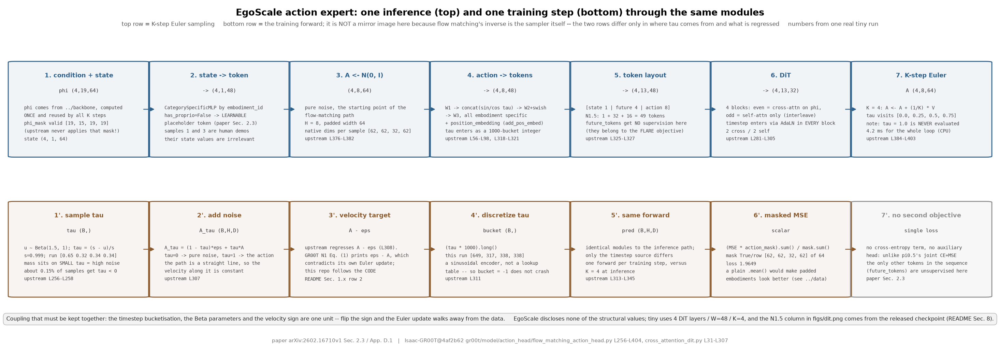
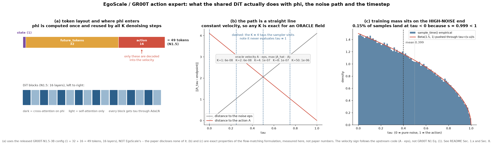

# egoscale · dit: 共享的动作专家与本体专属的两头适配器

**TL;DR.** 条件向量 `φ_t` 有了, 动作 chunk 的监督也有了, 还差把两者接起来的模型: 它必须能同时吃"没有本体感受的人类样本"和"22 / 7 自由度两种机器人", 还要在 20,854 小时数据上训得动 —— 这是**推理与训练两侧共用**的核心, 出自论文 §2.3 与附录 D.1. EgoScale 的做法是照搬 GR00T 的 flow-matching DiT: 一串 `[state(1), future_tokens(32), action(H)]` 的 token 交替做 **cross-attention (条件在 `φ_t` 上)** 与 **self-attention**, 时间步靠 **AdaLN** 注入; 跨本体只换**输入输出两头的 MLP 适配器**, DiT 与 backbone 完全共享 (论文 §2.3: "relative wrist motion prediction, the vision-language backbone, and the DiT action expert are fully shared"). 收益: 新本体只需要一对适配器就能复用人类预训练出来的运动先验, G1 三指手因此拿到 **30% 以上的绝对成功率提升** (论文摘要与 §3.5); 代价: 推理要跑 **K 步**去噪 (GR00T N1 用 `K = 4`, [arXiv:2503.14734](https://arxiv.org/abs/2503.14734) §2.1), 而且 `φ_t` 的 padding 掩码在上游**根本没被应用**(见 §1.x).

**流程图**: 上排是一次推理 —— 从纯噪声动作块走到可执行动作, 每框标 shape 与一次真实 tiny 运行的数值, 并把 `K` 步 Euler 的循环画开; 下排是镜像的训练前向 —— 同一套模块, 但时间步从 Beta 分布采样、目标是速度场、loss 被 `action_mask` 加权.



**第二幅图的论点**: `figs/dit.png` 要让读者看出三件事 —— (a) token 布局与两种注意力的交替方式 (偶数层 cross, 奇数层 self), 以及为什么 `φ_t` 每个 chunk 只算一次; (b) flow matching 的端点性质: `τ = 0` 得纯噪声、`τ = 1` 得真动作, 用 oracle 速度场积分能精确还原; (c) 时间步分布 `Beta(1.5, 1)` 经 `s = 0.999` 变换后**偏向小 `τ`(高噪声端)**, 这是训练时把算力花在难的一端.

本 module 复现 DiT、两头适配器与 flow matching 的目标与采样. 条件向量怎么来的在 [`../backbone`](../backbone/README.md); batch 怎么组织在 [`../data`](../data/README.md); 三阶段 curriculum 在 [`../train`](../train/README.md).

上游: EgoScale 未开源; 本 module 按论文 [arXiv:2602.16710v1](https://arxiv.org/abs/2602.16710v1) §2.3、附录 D.1 实现, 结构对照 [NVIDIA/Isaac-GR00T](https://github.com/NVIDIA/Isaac-GR00T) @ `4af2b622892f7dcb5aae5a3fb70bcb02dc217b96` (`Isaac-GR00T@4af2b62`) 的 `gr00t/model/action_head/flow_matching_action_head.py` (L28-L98 适配器, L166-L256 构造, L270-L347 训练前向, L349-L404 采样) 与 `gr00t/model/action_head/cross_attention_dit.py` (L31-L41 时间步编码, L44-L67 AdaLN, L70-L188 块, L191-L307 DiT). 结构数值取自已发布的 [nvidia/GR00T-N1.5-3B](https://huggingface.co/nvidia/GR00T-N1.5-3B) 的 `config.json` (2026-09-17 访问). PyTorch 重写, 不 import 上游.



## 1. I/O 契约

`model.py` 只有推理路径; 时间步分布、速度目标与 loss 在 `train.py`.

### 1.1 推理: `ActionExpert.sample(phi, phi_mask, state, state_mask, embodiment_id, has_proprio)`

对照上游 `get_action` (L349-L404).

| 名称 | shape / dtype | 取值 | 说明 |
|---|---|---|---|
| 入 `phi` | `(B, S, D_vl)` float32 | | backbone 输出的条件向量; N1.5 的 `D_vl = 2048` (`cross_attention_dim`) |
| 入 `phi_mask` | `(B, S)` bool | | 有效位; **上游从不使用它**, 见 §1.x 第 1 条 |
| 入 `state` | `(B, Ts, max_state_dim)` float32 | 归一化后 | 人类样本为全 0 |
| 入 `state_mask` | `(B, Ts, max_state_dim)` bool | | 人类样本整行 False |
| 入 `embodiment_id` | `(B,)` int64 | `[0, max_num_embodiments)` | 选哪一对适配器 |
| 入 `has_proprio` | `(B,)` bool | | `False` 时 state token 换成可学习占位 token (论文 §2.3) |
| 出 `action` | `(B, H, max_action_dim)` float32 | 归一化空间 | 逆归一化与截维在 [`../data`](../data/README.md) |

### 1.2 内部 token 布局 (上游 L325-L327 / L389)

```
sa_embs = concat( state_features (B, Ts, W),        # Ts = 1
                  future_tokens  (B, 32, W),        # num_target_vision_tokens
                  action_features(B, H,  W) )       # H = 16
                -> (B, Ts + 32 + H, W)              # N1.5: 1 + 32 + 16 = 49, W = 1536
```

DiT 输出取**最后 `H` 个 token** 交给 action decoder (上游 L344-L345 / L400-L401); `future_tokens` 与 state token 的输出被丢弃. `future_tokens` 是 `nn.Embedding(32, W)`, `std = 0.02` 初始化 (L196-L197) —— 上游给它起名 "target vision tokens", 但在这个文件里它**不接任何监督**, 见 §8.

### 1.3 本体专属适配器 (上游 L28-L98)

| 组件 | 形状 | 说明 |
|---|---|---|
| `CategorySpecificLinear` | `W (C, in, out)`, `b (C, out)` | 每个本体一套权重; 前向是 `bmm(x, W[cat_ids]) + b[cat_ids]` (L34-L42). 初始化 `0.02 * randn` |
| `state_encoder` | `CategorySpecificMLP(C, max_state_dim, W, W)` | `max_state_dim → W`, 中间 ReLU (L45-L54) |
| `action_encoder` | `MultiEmbodimentActionEncoder(action_dim, W, C)` | `W1: d→W`, 正弦时间步编码 `W`, 拼成 `2W` 过 `W2` + swish, 再 `W3` (L56-L98) |
| `action_decoder` | `CategorySpecificMLP(C, hidden_size, hidden_size, action_dim)` | `hidden_size → action_dim`; N1.5 的 `hidden_size = 1024` 正是 DiT 的 `output_dim` |

`max_num_embodiments = 32` (L137), 即最多 32 个本体槽位. 注意**参数量随本体数线性增长**: 每个 `CategorySpecificLinear` 都存了 `C` 份权重, 哪怕只用两个本体也一样.

### 1.4 DiT (上游 `cross_attention_dit.py` L191-L307)

| 项 | N1.5 的值 | 出处 |
|---|---|---|
| `num_layers` | 16 | `config.json` `diffusion_model_cfg.num_layers` |
| `num_attention_heads` × `attention_head_dim` | 32 × 48 = 1536 (`inner_dim`) | 同上 |
| `cross_attention_dim` | 2048 (= backbone 宽度) | 同上 |
| `output_dim` | 1024 (= head 的 `hidden_size`) | 同上 |
| `norm_type` | `"ada_norm"` | 同上 |
| `interleave_self_attention` | `true` | 同上 |
| `dropout` / `final_dropout` | 0.2 / `true` | 同上 |
| `positional_embeddings` | `null` (DiT 内不加; head 另有 `add_pos_embed`) | 同上 |

**交替规则** (L281-L295): `idx % 2 == 1` 且 `interleave_self_attention` 为真时, 该块**不接 `encoder_hidden_states`**, 退化成纯自注意力; 其余块是 cross-attention. 所以 16 层里 8 层 cross、8 层 self.

**AdaLN** (L44-L67): `temb → SiLU → Linear(W, 2W) → chunk` 得到 `scale, shift`, 然后 `LayerNorm(x) * (1 + scale) + shift`. 注意上游 `chunk(2, dim=1)` 的顺序是 **`scale` 在前 `shift` 在后** (L64), 与常见实现相反.

**输出头** (L299-L305): 与块内 AdaLN 同源的 `temb` 再算一次 `shift, scale = proj_out_1(SiLU(temb)).chunk(2)` —— 这里顺序是 **`shift` 在前** (L300), 与 L64 相反; 然后 `norm_out(x) * (1 + scale) + shift`, 最后 `proj_out_2` 投到 `output_dim`.

### 1.5 训练: `train.py`

**`sample_time(batch, cfg)`** (上游 L256-L258)

```
u ~ Beta(noise_beta_alpha=1.5, noise_beta_beta=1.0)
tau = (noise_s - u) / noise_s,   noise_s = 0.999
```

**`flow_matching_loss(...)`** (上游 L270-L347)

| 步骤 | 公式 | 上游行号 |
|---|---|---|
| 加噪 | `A_tau = (1 - tau) * eps + tau * A` | L307 |
| 目标 | `velocity = A - eps` | L308 |
| 离散化 | `t_discretized = (tau * num_timestep_buckets).long()`, `num_timestep_buckets = 1000` | L311 |
| loss | `(MSE(pred, velocity) * action_mask).sum() / action_mask.sum()` | L341-L343 |

`pred` 取 DiT 输出经 action decoder 后的**最后 `H` 个 token** (L344-L345).

**采样** (上游 L376-L403): `A_0 ~ N(0, I)`; 对 `t = 0 … K-1`, `tau = t / K`, `A ← A + (1/K) * V(A, tau)`. 因此 `tau` 从 `0` 走到 `(K-1)/K`, **最后一步用的不是 `tau = 1`**.

### 1.x 符号 / 约定差异与冲突记录

| # | 论文 / 上游 | 本仓库 | 采信理由 |
|---|---|---|---|
| 1 | **`φ_t` 的 padding 掩码在上游从未被应用**: `DiT.forward` 虽然签名里有 `encoder_attention_mask`, 但两个调用点都硬写 `encoder_attention_mask=None` (`cross_attention_dit.py` L284, L291); 就算传进去, `BasicTransformerBlock.forward` 里那一行也是**注释掉的** (L167). 而 `FlowmatchingActionHead.forward` 还一本正经地把 `vl_attn_mask` 传了进来 (L335), `get_action` 则根本不传 (L390-L394) | 默认照抄上游 (不应用掩码), 另给一个 `apply_phi_mask` 开关把掩码接上, 默认 `False` | 官方代码 > 论文; 但这条影响数学 (padding 与填黑相机确实参与了 cross-attention), 所以必须显式可见并可切换. 配合 [`../backbone`](../backbone/README.md) §1.x 第 5 条一起读: 整条链路上这个掩码**一次都没生效过** |
| 2 | GR00T N1 论文式 (1) 写回归目标是 `ε − A_t` ([arXiv:2503.14734](https://arxiv.org/abs/2503.14734) §2.1); 上游代码写的是 `velocity = actions - noise` (L308), 即 `A − ε` | 按**上游代码** | 上游自洽: `A_τ = (1−τ)ε + τA` 对 `τ` 求导正是 `A − ε`, 而采样是 `A ← A + dt·V` 做前向 Euler. 论文式 (1) 的符号与它的采样式合不上, 是笔误 |
| 3 | AdaLN 里 `chunk` 的顺序是 `scale, shift` (L64); 输出头里是 `shift, scale` (L300) | 两处都照抄 | 这不是笔误而是两段独立代码; 换顺序会改变数学 |
| 4 | 论文 §2.3 说人类样本"用可学习占位 token 替换 `q_t`", 但没说这个 token 是在 `state_encoder` **之前**(替换输入向量) 还是**之后**(替换输出的 token) | 在 `state_encoder` **之后**替换整个 token | 之前替换的话, 占位向量还要过一个本体专属 MLP, 而人类样本本来就没有对应本体; 之后替换语义更干净. 两种都留了开关, 见 §8 |
| 5 | `num_target_vision_tokens = 32` 的 `future_tokens` 在本文件里不接任何监督 | 照抄, 只作为可学习的额外 token | 上游注释 `return_all_hidden_states=False, # NOTE (YL): not using flare now` (L337) 说明这些 token 是给 FLARE 的未来潜在表征对齐目标用的, 该目标在本文件里没启用. EgoScale 没提 FLARE |
| 6 | `tau = (s - u) / s` 里 `s = 0.999 < 1`, 而 `u ~ Beta(1.5, 1)` 的支撑是 `[0, 1]` | 照抄; 测试把这个边界钉死 | 于是约 `1 - 0.999^1.5 = 0.15%` 的样本会拿到 **`tau < 0`** (下界 `(s-1)/s = -0.001`), 离散化后的桶是 **`-1`**. 上游的时间步编码是正弦函数而不是查表, 所以不会崩; 但它意味着极小一部分训练样本落在路径 `tau < 0` 的一侧, 比纯噪声还远一点. 上游与论文都没有提到这一点, 见 `test_parity.py::test_tau_can_be_slightly_negative` |

## 2. 复现范围

| 有代码 | 只有事实 (背景) |
|---|---|
| DiT 的交替 cross / self 块与 AdaLN 时间步条件 | EgoScale 用的 DiT 层数 / 宽度 (未披露) |
| `[state, future_tokens, action]` token 布局与"取最后 H 个" | `num_target_vision_tokens = 32` 的由来 (FLARE) |
| 本体专属 `CategorySpecificLinear` 三件套 | EgoScale 的本体 → 槽位映射 |
| 人类占位 state token | 占位 token 注入在 encoder 前还是后 |
| flow matching 的加噪、速度目标、Beta 时间步、1000 桶离散化 | EgoScale 的 `K` 与 `H` (未披露) |
| K 步前向 Euler 采样 | 真机上的实际去噪步数 |
| `action_mask` 加权的 loss | — |
| `apply_phi_mask` 开关 (上游默认关) | 上游为什么把那行注释掉 |

## 3. 推理侧

一次推理:

1. backbone 算一次 `φ_t` `(B, S, 2048)` —— 在 `K` 步去噪里**复用**, 这是 cross-attention 相对"把视觉 token 拼进自注意力"的直接收益;
2. `state_encoder(state, embodiment_id)` → `(B, 1, 1536)`; `has_proprio=False` 的样本换成占位 token;
3. `A ← N(0, I)` `(B, H, max_action_dim)`;
4. 循环 `K` 次: `action_encoder(A, τ_bucket, embodiment_id)` → 加 `position_embedding` → 与 state / future token 拼成 `(B, 49, 1536)` → DiT → `action_decoder` → 取最后 `H` 个 → `A ← A + (1/K)·V`;
5. 输出 `(B, H, max_action_dim)`, 交给 [`../data`](../data/README.md) 逆归一化并截维.

延时: GR00T N1 报告 16 步动作块 + 4 步去噪端到端 **63.9 ms** (L40, [arXiv:2503.14734](https://arxiv.org/abs/2503.14734) §2.1), 未拆分到 DiT. EgoScale 未披露任何延时, 见 §8. 本仓库 tiny 配置的逐环节耗时见 `model.py` `main()` 的打印.

## 4. 训练侧

### 4.1 数据组织形式

见 [`../data`](../data/README.md). 本 module 消费的是 `(phi, phi_mask, state, state_mask, action, action_mask, embodiment_id, has_proprio)`.

### 4.2 数据预处理, 逐步

不在本 module. 唯一在这里发生的"预处理"是时间步的采样与离散化 (§1.5).

### 4.3 training objective

单一目标: **被 `action_mask` 加权的 flow matching MSE**. 没有 CE 项, 没有辅助目标 —— 这是 EgoScale 与 π0.5 的一个明显差别 (π0.5 是 CE + MSE 联合, 见 [`../../pi/pi05/train`](../../pi/pi05/train/README.md)).

`Beta(1.5, 1)` 经 `τ = (s − u)/s` 变换后密度**偏向小 `τ`**: 训练样本更多落在高噪声端. 这与 π0 / π0.5 用的是同一个分布 ([arXiv:2410.24164](https://arxiv.org/abs/2410.24164) v1), 上游把它原样搬了过来.

与 [`../../pi/pi0/flow_matching`](../../pi/pi0/flow_matching/README.md) 的差异表:

| 项 | π0 | EgoScale / GR00T |
|---|---|---|
| 时间步分布 | `Beta(1.5, 1)`, `s = 0.999` | 同 |
| 时间步进模型的方式 | sin-cos 嵌入后与 action 拼接过 MLP | 先离散化到 **1000 个桶**, 再走 `Timesteps` + `TimestepEmbedding`, 经 **AdaLN** 注入每一层 |
| 条件注入 | 与 VLM **共享同一个 attention**, 三块 blockwise mask | **cross-attention** 到冻结的 `φ_t`, 与 self-attention 交替 |
| 去噪步数 | 10 步 Euler | `K = 4` (GR00T N1) |
| 动作 horizon | 50 | 16 (GR00T N1) |
| 跨本体 | action 维度 padding | padding **+ 本体专属 MLP 适配器** |
| 前缀 cache | VLM 前缀 KV cache | `φ_t` 整个复用 (cross-attention 的 K/V 可 cache) |

curriculum 与冻结见 [`../train`](../train/README.md).

## 5. 评测

(a) **接口**: 本 module 没有环境交互. 可检查的是**解析性质**: flow matching 的端点、oracle 速度场下的精确积分、mask 的作用、适配器的本体隔离.

(b) **task 列表**: 两个本体 (`r1pro_sharpa` 62 维 / `g1_trifinger` 32 维) × 人类 / 机器人两种 state 分支.

(c) **metric**: oracle 积分误差; 参数量与手算值之差; 本体隔离的梯度检查.

(d) **流程**: 见 `test_parity.py`. 带环境的 episode 循环在 [`../infer/eval.py`](../infer/README.md).

(e) **与论文对齐程度**: 只对齐结构与解析性质, 不复现任何数字.

`test_parity.py` (CPU, 约 20 秒) 检查什么:
- **shape / 参数量**: token 布局是 `Ts + 32 + H`; DiT 输出取最后 `H` 个; `CategorySpecificLinear` 的参数量正好是 `C·(in·out + out)`; 16 层里 8 层带 cross-attention、8 层不带;
- **解析性质**: `τ = 0` 时 `A_τ` 恰是噪声、`τ = 1` 时恰是动作; 用 oracle 速度场 `A − ε` 做 `K` 步 Euler 能精确还原 `A`(线性路径, 步数无关); `action_mask` 全 True 时 loss 等于普通 MSE, 部分 True 时等于只在真实维上的 MSE; 改变一个本体的适配器权重不影响另一个本体的输出 (本体隔离); `has_proprio=False` 时改变 `state` 的数值不改变输出 (占位 token 生效); `apply_phi_mask=False`(上游默认) 时改变 padding 位置的 `φ` **会**改变输出, 打开开关后不再改变;
- **分布检查**: `sample_time` 的经验分位数与 `Beta(1.5,1)` 经同一变换后的**解析分位数**一致 (±0.02), 均值明显小于 0.5 (偏向高噪声端); 离散化后的桶落在 `[-1, 1000)` —— 下界是 `-1` 而不是 `0`, 原因见 §1.x 第 6 条.

```
uv run pytest gear/egoscale/dit -q
uv run python -m gear.egoscale.dit.model
uv run python -m gear.egoscale.dit.train
uv run python gear/egoscale/dit/figs/make_pipeline.py
uv run python gear/egoscale/dit/figs/make_figs.py
```

## 6. cost 信息

| 项目 | 值 | 来源 |
|---|---|---|
| 训练算力 | Stage I: **256 张 GB200**, 100k 步, 全局 batch 8,192 | 论文 §2.4 |
| 训练数据规模 | 见 [`../data`](../data/README.md) | 论文 §2.2 |
| token 数 | 序列 `Ts + num_target_vision_tokens + H` = 1 + 32 + 16 = **49** (N1.5 的值) | `config.json` |
| 模型大小 | EgoScale 未披露. GR00T-N1-2B 共 2.2B, VLM 1.34B → action expert 约 0.86B ([arXiv:2503.14734](https://arxiv.org/abs/2503.14734) §2.1) | 论文 / 推算 |
| | 本仓库 tiny 的逐模块参数量见 `model.py` `main()` | 本仓库 |
| 推理延时 | GR00T N1 端到端 63.9 ms (L40, 16 步块 + 4 步去噪); DiT 单独未拆分 | 论文 §2.1 / 未披露 → §8 |

## 7. reference 映射表

| 本仓库 | 上游 |
|---|---|
| `CategorySpecificLinear` / `CategorySpecificMLP` | `flow_matching_action_head.py` L30-L54 |
| `MultiEmbodimentActionEncoder` / `SinusoidalPositionalEncoding` | 同上 L56-L98; `action_encoder.py` L24-L52 |
| `TimestepEncoder` | `cross_attention_dit.py` L31-L41 |
| `AdaLayerNorm` | 同上 L44-L67 (注意 `chunk` 是 `scale, shift`) |
| `DiTBlock` | 同上 L70-L188 (`BasicTransformerBlock`; L167 的 `encoder_attention_mask` 被注释掉) |
| `DiT` 的交替规则与输出头 | 同上 L281-L305 |
| `ActionExpert.__init__` 的模块表 | `flow_matching_action_head.py` L166-L216 |
| `ActionExpert.build_tokens` | 同上 L313-L327 |
| `ActionExpert.sample` | 同上 L349-L404 |
| `sample_time` | 同上 L256-L258 |
| `flow_matching_loss` | 同上 L270-L347 |
| `n15()` 的每个值 | [nvidia/GR00T-N1.5-3B](https://huggingface.co/nvidia/GR00T-N1.5-3B) `config.json` (2026-09-17 访问) |
| 占位 state token | 论文 §2.3 |
| 本体专属适配器只在两头 | 论文 §2.3 与附录 D.1 "Hand Action Adaptation" |

## 8. gap ledger

| 未披露 / 未复现 | 说明 |
|---|---|
| EgoScale 的 DiT 规模 | 层数、宽度、头数全未披露. `paper()` 为 `None`; `n15()` 的 16 层 / 32×48 / `cross_attention_dim=2048` / `output_dim=1024` / `dropout=0.2` 全部来自 N1.5 的 `config.json`, **不是 EgoScale 的值** |
| `K` (去噪步数) 与 `H` (动作 horizon) | EgoScale 未披露. GR00T N1 用 `K=4`, `H=16` |
| `max_num_embodiments` 与本体映射 | 上游是 32 槽位; EgoScale 用了几个、怎么编号未披露 |
| 占位 token 注入的位置 | 论文 §2.3 没说在 `state_encoder` 前还是后. 本仓库默认在后, `placeholder_before_encoder` 开关可切到前 |
| `φ_t` 掩码 | 上游从不应用 (§1.x 第 1 条). 本仓库默认照抄, `apply_phi_mask=True` 可接上. EgoScale 与 GR00T 论文都没讨论过这件事 |
| `future_tokens` 的用途 | 上游注释指向 FLARE ([FLARE, CoRL 2025](https://openreview.net/forum?id=HXJ6pUSn1L)), 但该目标在 `flow_matching_action_head.py` 里没启用 (`return_all_hidden_states=False`, L337). EgoScale 没提 FLARE |
| N1.5 实际用的 head 类 | 上游 L105 注释说 N1.5 用 `XEmbFlowmatchingPolicyHeadConfig`, 但该类不在此文件. 本仓库按文件内的 `FlowmatchingActionHead` 复现; 两者的差异未知 |
| DiT 的单独延时与参数量 | 未披露; 0.86B 是本仓库从 2.2B − 1.34B 相减推算的 |
| `dropout = 0.2` 在 EgoScale 下是否保留 | 未披露. 这个值不小, 会改变训练动态 |
| GR00T N1 论文式 (1) 的符号 | 与上游代码相反, 见 §1.x 第 2 条 |

## 9. 领域概念表

### domain 概念

**flow matching 的速度场与它的端点**
- shape: `V(A_τ, τ, φ) → (B, H, max_action_dim)`, 与动作同形
- 含义: 模型预测的不是动作本身, 而是"从噪声走向动作"这条直线路径上的**速度**; 路径定义为 `A_τ = (1−τ)ε + τA`, 对 `τ` 求导恒为 `A − ε`, 与 `τ` 无关
- 来源: 训练时 `ε` 是采样的高斯噪声, `A` 是 [`../action`](../action/README.md) 产出并归一化后的真动作
- 为什么需要: 目标沿路径是常向量, 所以理想模型下**任意步数的前向 Euler 都精确**; 实际模型有误差, 步数才有意义. 这也是 `K = 4` 就够用的原因
- 系统联系: 采样循环里 `τ` 只走到 `(K−1)/K`, 最后一步并不在 `τ = 1` 上求值 —— 因为 `τ = 1` 处的输入就是答案本身

**AdaLN 时间步条件**
- shape: `temb (B, W)` → `scale, shift (B, W)` → 逐 token 广播
- 含义: 不把时间步当成一个 token 拼进序列, 而是用它去**调制每一层 LayerNorm 的仿射参数**
- 来源: 连续 `τ` 先离散化到 1000 个桶, 再过正弦嵌入与一个 MLP
- 为什么需要: 时间步是全局标量, 做成 token 会占序列长度且要靠 attention 去分发; AdaLN 让每一层、每个 token 都直接拿到它
- 系统联系: 这是 DiT 与 π0 action expert 的关键结构差异 —— π0 把时间步嵌入拼进 action token, EgoScale/GR00T 用 AdaLN 注入 16 层

**本体专属适配器 (embodiment-conditioned MLP adapters)**
- shape: 每个 `CategorySpecificLinear` 存 `(C, in, out)` 权重, `C = 32`
- 含义: 同一个 DiT, 但输入的 state / noisy action 编码器和输出的 action 解码器**按本体索引取不同的权重**
- 来源: 由 `embodiment_id` 选择; `embodiment_id` 在 [`../data`](../data/README.md) 里随样本给出
- 为什么需要: 各本体的 state 与 action 语义完全不同 (22 关节角 vs 7 关节角), 用同一个线性层去读会互相干扰; 但运动的**结构**是共享的, 所以中间的 DiT 不分本体
- 系统联系: 这正是论文 §3.5 里 G1 能复用人类预训练先验的机制 —— 新本体只训两头, 中间的运动先验原封不动. 代价是参数量按 `C` 线性增长, 用不到的槽位也占显存

### application 概念

**跨本体迁移的最小改动面**
- 含义: 加一个新机器人需要改什么 —— 只有一对适配器 + 一个 `embodiment_id` 槽位, 外加 mid-training 阶段的一点该本体数据
- 来源: 论文 §3.5 与附录 D.1: G1 从来没有"从零训练"过, 只是在 mid-training 里混入 G1 play 数据
- 为什么需要: 机器人数据昂贵, 每换一个本体重训整个模型不可行
- 系统联系: 这条路径能成立的前提是 [`../action`](../action/README.md) 的相对腕部表示对本体不敏感; 如果手臂动作用的是绝对关节角, 适配器就得学一个完全不同的映射, 迁移也就无从谈起
