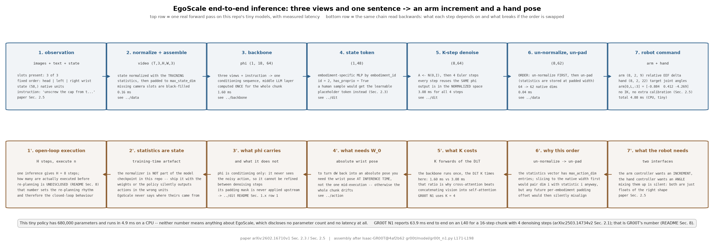
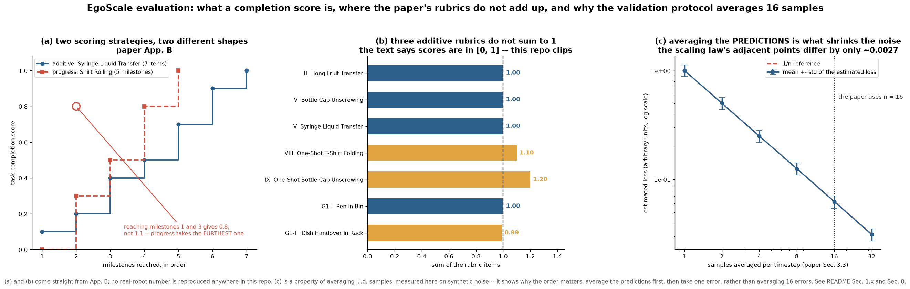

# egoscale · infer: 端到端推理链路与两套完全不同的评测

**TL;DR.** 前面五个 module 各自成立, 但"一次真实的机器人推理"是把它们按固定顺序串起来: 三路图像 + 指令 → `φ_t` → 一次 `K` 步去噪 → 逆归一化 → 按 `action_mask` 截维 → 相对末端位姿命令 + 目标关节角 —— 这是**推理侧**的装配问题, 论文 §2.3、§2.5 各给了一半. 评测则有**两套互不相干**的东西: 离线的**人类验证损失** (2,000 条留出 episode, 每条随机抽 20 个时刻, 每个时刻从策略采 **16 个样本取平均**后与真值算 MSE, 论文 §3.3) 和真机的**任务完成分 rubric** (五个 R1Pro 任务 + 两个 one-shot 任务 + 两个 G1 任务, 每个方法两个随机种子、每个 checkpoint 10 次试验, 论文 §3.1 与附录 B). 前者是那条 scaling law 的因变量, 后者是论文真正想证明的东西; 论文 §3.3 的全部主张就是这两者**同向**. 代价: 真机 rubric 无法在本仓库复现, 本 module 只把接口、任务、打分与聚合写全, 用假环境跑通循环.

**流程图**: 上排是一次真实推理的每一步 —— 从三路图像走到机器人接口, 每框标 shape 与一次真实 tiny 运行的数值与耗时; 下排是**逆序的装配约束** —— 每一步依赖上一步的哪个量, 以及顺序颠倒会错在哪里.



**第二幅图的论点**: `figs/eval.png` 要让读者看出 —— (a) 两类 rubric 的形状完全不同: additive 的分数是各步得分之和, progress-based 的分数是"走到最远的里程碑", 后者**不可加**; (b) 论文附录 B 里有三处 rubric 的分数**加起来不等于 1**, 而正文说完成分在 `[0, 1]` 内 (见 §1.x); (c) 人类验证损失那 16 个样本的平均是必需的: 单样本估计的方差远大于 16 样本平均, 而 scaling law 的相邻数据点只差约 0.0025, 噪声不压下去就分不开.

本 module 装配前五个 module 并提供 `eval.py`. 各部件的机制在各自的 README.

上游: EgoScale 未开源; 评测协议全部来自论文 [arXiv:2602.16710v1](https://arxiv.org/abs/2602.16710v1) §3.1、§3.3、附录 A、附录 B. 推理链路的装配对照 [NVIDIA/Isaac-GR00T](https://github.com/NVIDIA/Isaac-GR00T) @ `4af2b622892f7dcb5aae5a3fb70bcb02dc217b96` 的 `gr00t/model/gr00t_n1.py` `get_action` (L171-L198) 与 `gr00t/model/policy.py`. PyTorch 重写, 不 import 上游.



## 1. I/O 契约

`model.py` 是端到端推理; `eval.py` 是评测循环. 两者都没有新参数 —— 参数全在 [`../backbone`](../backbone/README.md) 与 [`../dit`](../dit/README.md).

### 1.1 `EgoScalePolicy.act(observation)`

| 名称 | shape / dtype | 取值 | 说明 |
|---|---|---|---|
| 入 `observation.images` | `dict[str, (H,W,3) uint8]` | | 只给该本体实际有的相机槽位 |
| 入 `observation.instruction` | `str` | | 任务的自然语言指令, 见 §1.3 |
| 入 `observation.state` | `(D_state,)` float32 或 `None` | 原生单位 | 人类演示为 `None` |
| 入 `observation.embodiment` | `str` | `"r1pro_sharpa"` / `"g1_trifinger"` / … | 选本体表与适配器 |
| 出 `action` | `(H, D_native)` float32 | **原生单位** | 已逆归一化并截回原生维度 |
| 出 `info` | `dict` | `latency_ms`, `phi_shape`, `n_denoise` | 逐环节耗时 |

`act` 的内部顺序**不能变**: 归一化 → 组样本 → backbone → 采样 → **逆归一化 → 截维**. 统计量是按 padding 后的宽度存的, 先截维再逆归一化会错位, 见 [`../data`](../data/README.md) §3.

### 1.2 `EgoScalePolicy.to_robot_command(action, embodiment)`

论文 §2.5 定义的两段接口:

| 段 | 维度 | 含义 |
|---|---|---|
| 手臂 | 每臂 `3 + R` | **相对末端位姿增量** —— `ΔW` 直接就是命令, 不需要 IK |
| 手 | 每手 `n_hand` | **目标关节角** —— Sharpa 22 自由度是关节空间控制; G1 三指手 7 自由度 |

还原绝对腕部位姿要用**推理那一刻**的 `W_0`, 见 [`../action`](../action/README.md) §3.

### 1.3 评测 (一): 人类验证损失 `human_validation_loss`

论文 §3.3: "We evaluate each pretrained model on a held-out human-video validation set consisting of 2,000 egocentric episodes. For evaluation, we randomly sample 20 timesteps per trajectory; at each timestep, we draw 16 samples from the flow-matching policy, average the predicted action chunks, and compute the mean squared error against ground-truth wrist and hand actions."

| 参数 | 值 | 出处 |
|---|---|---|
| 留出 episode 数 | **2,000** | §3.3 |
| 每条轨迹抽的时刻数 | **20** | §3.3 |
| 每个时刻的采样数 | **16**, 对预测的动作 chunk 取**平均** | §3.3 |
| metric | 与真值腕部与手部动作的 **MSE** | §3.3 |
| 归一化空间还是原生空间 | **未披露**, 见 §8 | — |

**16 个样本必须先平均再算误差**, 不是"算 16 个误差再平均" —— 两者不等价 (Jensen), 前者压方差, 后者不压. `test_parity.py::test_averaging_order_matters` 把这一点钉死.

### 1.4 评测 (二): 真机任务 rubric

两种打分策略 (论文附录 B): **additive** (各子技能得分相加) 与 **progress-based** (取达到的最远里程碑). 后者**不可加**.

**R1Pro + Sharpa 手, 五个 post-training 任务** (论文 §3.1 与附录 B):

| # | 任务 | 指令 | 类型 | rubric | 试验数 |
|---|---|---|---|---|---|
| I | Shirt Rolling | "Roll the T-shirt and put it into the basket." | progress | 0.0 无折叠 / 0.3 完成一次折叠 / 0.5 多次折叠或部分卷起 / 0.8 连续卷成紧凑形状 / 1.0 放入篮中 | 10 |
| II | Card Sorting | "Pick up the card and sort it into the correct card holder." | progress | 0.0 未拿起或整摞被带起 / 0.3 抓取差、带起多张 / 0.5 成功拿起单张 / 0.7 放置时明显扰动或插错 / 0.9 正确插入但有轻微扰动 / 1.0 干净地插入正确卡槽 | 10 |
| III | Tong Fruit Transfer | "Use the tong to pick up the fruit and place it into the basket." | additive | +0.4 抓起夹子 / +0.2 用夹子夹起水果 / +0.2 放入篮中 / +0.2 把夹子放回桌面 | 2 种水果 × 5 = 10 |
| IV | Bottle Cap Unscrewing | "Unscrew the cap from the bottle." | additive | +0.1 抓住瓶子 / +0.5 至少三次连续旋转 / +0.2 完全取下瓶盖 / +0.2 把瓶盖放到桌上 | 4 个瓶子 × 4, 见 §1.x 第 1 条 |
| V | Syringe Liquid Transfer | "Pick up the syringe, draw liquid from tube A, inject it into tube B, and throw the syringe into the trash can." | additive | +0.1 拿起注射器 / +0.1 对准 A 管 / +0.2 拉活塞抽液 / +0.1 转向 B 管 / +0.2 推活塞注液 / +0.2 交接或松手 / +0.1 丢入垃圾桶 | 10 |

**one-shot 任务** (论文附录 B, 每个任务只用**一条**机器人演示 post-train):

| # | 任务 | 指令 | 类型 | rubric |
|---|---|---|---|---|
| VIII | One-Shot T-Shirt Folding | "Fold the T-shirt." | additive | +0.4 折好至少一只袖子 / +0.4 折好两只袖子 / +0.3 完成底部折叠; 折得凌乱**扣 0.1** |
| IX | One-Shot Bottle Cap Unscrewing | "Unscrew the cap from the water bottle." | additive | +0.1 抓住瓶子 / +0.2 完成一到两次旋转 / +0.5 至少三次连续旋转 / +0.2 完全取下 / +0.2 放到桌上 |

**G1 + 三指手, 两个跨本体任务** (论文附录 B):

| 任务 | 指令 | 类型 | rubric |
|---|---|---|---|
| Pen in Bin | "Marker canister task." | additive | +0.25 拿起或打开筒 / +0.25 稳定放下筒 / +0.25 拿起记号笔 / +0.25 放入筒中 |
| Dish Handover in Rack | "Put plates on dishrack." | additive | 每个盘子: 0.11 拿起 / 0.11 双手交接 / 0.11 竖直放入架中; 三个盘子相加 |

**二值成功率**: "a trial is considered successful only if the task is completed end-to-end according to the instruction" (附录 B). 与完成分是两个独立的量, 论文图 4 两个都报.

**聚合**: 每个方法训**两个随机种子**, 每个种子的 checkpoint 评 **10 次试验**, 报告两个种子的平均 (论文 §3.1 与 §3.5). 初始场景用**图像叠加**的方式统一: 评测员看着目标初始构型的叠加图摆场景 (§3.1).

### 1.x 符号 / 约定差异与冲突记录

| # | 论文 | 本仓库 | 采信理由 |
|---|---|---|---|
| 1 | 试验数在三处互相矛盾: §3.1 说 "except for **Task III**, where we conduct 4 trials per bottle across four bottle instances, resulting in **16** evaluation trials" (但瓶子是 Task **IV**); 附录 B 的 Task IV 说 "measured over **12** trials in total, with 4 trials conducted for each bottle" (4 个瓶子 × 4 = 16 ≠ 12) | 按 **4 个瓶子 × 4 次 = 16**, 并把三种说法都记进 ledger | 4×4 是唯一自洽的算法; 12 与 "Task III" 都对不上 |
| 2 | 附录 B 的 one-shot Task VIII 的加分项合计 **1.1**, Task IX 合计 **1.2**, G1 的 Dish Handover 合计 **0.99** —— 但正文说完成分 "in [0, 1]" | 实现时按 rubric 原样相加, 再**截断到 [0, 1]**, 并在 `RubricWarning` 里显式标出这三个任务 | 不改论文的分值; 但也不能让分数超过 1. 截断是本仓库的选择, 见 §8 |
| 3 | 任务编号从 I 跳到 V, 然后直接是 **VIII 与 IX**, 中间的 VI、VII 不存在 | 照抄编号 | 大概是写作时删掉了两个任务; 与机制无关, 但编号对不上会让读者以为漏了 |
| 4 | §3.1 说 Task III (Tong) 评 "2 random fruits, lemon and plum, each with 5 evaluation trials"; 图 4 的说明只说 10 次 | 按 2 × 5 = 10 | 两者一致 |
| 5 | 人类验证损失是在**归一化空间**还是原生空间算的, 论文没说 | 接口把空间作为显式参数, 无默认 | 两者数值差一个量级, 不能猜, 见 §8 |

## 2. 复现范围

| 有代码 | 只有事实 (背景) |
|---|---|
| 端到端推理链路的装配与顺序约束 | 真实 checkpoint 与真机 |
| 逐环节延时测量 (tiny 配置, CPU) | 论文的真机延时 (未披露) |
| 人类验证损失的完整协议 (2000 / 20 / 16 / MSE) | 那 2,000 条留出 episode 本身 |
| 九个任务的 rubric、指令、试验数、聚合 | 真机上的任何得分 |
| additive 与 progress 两种打分策略 | 评测员的判定标准 |
| 假环境上跑通的 episode 循环 | 真实环境 |
| 二值成功率与完成分的并行统计 | — |
| 硬件接口的维度约定 | R1Pro / G1 / Sharpa / Manus / Vive / Homie 的硬件细节 |

## 3. 推理侧

链路与逐环节耗时 (tiny 配置, CPU, 见 `model.py` `main()` 的打印):

| # | 环节 | 依赖 |
|---|---|---|
| 1 | 相机槽位组装 + 归一化 | [`../data`](../data/README.md) |
| 2 | backbone 前向 → `φ_t` | [`../backbone`](../backbone/README.md); **每个 chunk 只算一次** |
| 3 | state 编码 (人类样本换占位 token) | [`../dit`](../dit/README.md) |
| 4 | `K` 步 Euler 去噪 | [`../dit`](../dit/README.md); 每步都复用同一个 `φ_t` |
| 5 | 逆归一化 | [`../data`](../data/README.md) |
| 6 | 按 `action_mask` 截维 | [`../data`](../data/README.md) |
| 7 | 拆成手臂增量位姿 + 手部关节角 | [`../action`](../action/README.md), 论文 §2.5 |

**开环执行**: 一次推理出 `H` 步动作, 机器人盲跑若干步再重新推理. EgoScale **未披露**实际执行长度与控制频率, 见 §8. GR00T N1 的参考值是 `H = 16`, 端到端 63.9 ms (L40) ([arXiv:2503.14734](https://arxiv.org/abs/2503.14734) §2.1).

参数量表见 `model.py` `main()`; EgoScale 未披露自己的总参数量, 见 §8.

## 4. 训练侧

本 module 不训练. 它消费 [`../train`](../train/README.md) 产出的四个 checkpoint 之一.

## 5. 评测

(a) **接口**. 两套:

- **离线**: `HumanValidationSet` —— 观测键 `(images, instruction, state=None)`, 输出 `(H, D)` 动作 chunk, 无终止条件, "episode 长度" 就是抽样的 20 个时刻. 真实数据集不下载.
- **真机**: `RobotTask` —— `reset()` 给初始观测, `step(action_chunk)` 执行一个 chunk 并返回新观测与已达成的里程碑集合, `episode` 上限由任务给出. 本仓库提供 `FakeRobotTask`: **与真接口签名完全一致**, 里程碑随机达成, 不模拟任务语义, 只用来跑通循环.

(b) **task 列表**: 见 §1.4 的九个任务.

(c) **metric**: 完成分 (additive 求和 / progress 取最远里程碑, 都截断到 `[0,1]`) 与二值成功率; 按任务在试验上平均, 再在两个种子上平均.

(d) **流程**: `eval.py` 的 `run_suite()` —— 对每个任务, 对每个种子, 对每次试验: `reset` → 循环 (推理一个 chunk → 执行 → 收集里程碑) 直到 episode 上限 → 打分 → 聚合. 用 tiny 配置与假环境跑通, 见 `eval.py` `main()`.

(e) **与论文对齐程度**: rubric 的**分值、指令、试验数、聚合方式**逐项对齐附录 B; **不复现任何得分**. 三处 rubric 求和不等于 1 的地方按 §1.x 第 2 条处理.

`test_parity.py` (CPU, 约 30 秒) 检查什么:
- **数值对齐**: 九个任务的 rubric 分值逐项等于附录 B; Tong 的四项合计 1.0, Syringe 的七项合计 1.0, Pen in Bin 的四项合计 1.0; Task VIII / IX / Dish 分别合计 1.1 / 1.2 / 0.99 (这三条正是 §1.x 第 2 条要钉死的); 验证协议是 2,000 / 20 / 16;
- **解析性质**: additive 打分对里程碑集合是可加的, progress 打分**不可加**且只取最大里程碑; 两种打分都被截断到 `[0,1]`; 二值成功率只在所有里程碑都达成时为 1; 推理链路的往返 (归一化 → 采样 → 逆归一化 → 截维) 输出落在原生维度上; **先平均后算误差 ≠ 先算误差后平均**;
- **分布检查**: 16 样本平均的验证损失方差显著小于单样本 (在同一个随机策略上测), 且比值接近 `1/16` 的量级; 假环境的 episode 循环里每一步都被走到 (reset / 推理 / 执行 / 打分 / 聚合各至少一次).

```
uv run pytest gear/egoscale/infer -q
uv run python -m gear.egoscale.infer.model
uv run python -m gear.egoscale.infer.eval
uv run python gear/egoscale/infer/figs/make_pipeline.py
uv run python gear/egoscale/infer/figs/make_figs.py
```

## 6. cost 信息

| 项目 | 值 | 来源 |
|---|---|---|
| 训练算力 | 见 [`../train`](../train/README.md) | 论文 §2.4 |
| 训练数据规模 | 见 [`../data`](../data/README.md) | 论文 §2.2, §3.1 |
| token 数 | 推理序列: backbone `V·N_img + L`, expert `Ts + 32 + H`; 见各自 README | `config.json` |
| 模型大小 | EgoScale **未披露**. 参考: GR00T-N1-2B 共 2.2B (VLM 1.34B) ([arXiv:2503.14734](https://arxiv.org/abs/2503.14734) §2.1); GR00T-N1.5-3B 的 backbone 是 Qwen3-1.7B + SigLIP2-400M | 未披露 → §8 / 参考值 |
| | 本仓库 tiny 的端到端参数量见 `model.py` `main()` | 本仓库 |
| 推理延时 | EgoScale **未披露**. GR00T N1: 16 步动作块 + 4 步去噪, 端到端 **63.9 ms** (L40) | 未披露 → §8 / 参考值 |
| | 本仓库 tiny 的逐环节耗时见 `model.py` `main()` | 本仓库 |
| 评测成本 | 每个方法 2 个种子 × 每任务 10 次试验 × 9 个任务 = **180 次真机试验**(Bottle 按 16 次则更多); 论文致谢里列了 13 位机器人操作员 | 论文 §3.1, 致谢 |

## 7. reference 映射表

| 本仓库 | 上游 |
|---|---|
| `EgoScalePolicy.act` | 装配对照 `Isaac-GR00T@4af2b62` `gr00t/model/gr00t_n1.py` `get_action` L171-L198; 顺序约束来自论文 §2.3 |
| `EgoScalePolicy.to_robot_command` | 论文 §2.5 ("relative end-effector space" 与 "joint-space control") |
| `human_validation_loss` | 论文 §3.3 |
| `TASKS` 的九个条目 | 论文 §3.1 与附录 B |
| `score_additive` / `score_progress` | 论文附录 B 的两种打分策略 |
| `binary_success` | 论文附录 B 末段 |
| `aggregate` (试验 → 任务 → 种子) | 论文 §3.1, §3.5 |
| `FakeRobotTask` | 本仓库的假环境, 接口签名对齐 `RobotTask` |
| 相机与硬件的维度约定 | 论文 §2.5 与附录 A |

## 8. gap ledger

| 未披露 / 未复现 | 说明 |
|---|---|
| 人类验证损失算在哪个空间 | 归一化空间还是原生空间? 论文未说. 接口把它做成必填参数, 无默认 |
| 验证损失是否对腕部与手部分别加权 | 论文说 "against ground-truth wrist and hand actions", 但没说两段是否等权. 本仓库按逐维等权 |
| 动作 chunk 的执行长度与控制频率 | 论文只说 `H` 步动作块, 没说实际执行几步、以什么频率下发 |
| 推理延时 | 完全未披露 |
| 模型总参数量 | 完全未披露 |
| Bottle 任务的试验数 | §3.1 说 16、附录 B 说 12、算出来是 4×4=16, 三处不一致, 见 §1.x 第 1 条 |
| 三处 rubric 求和 ≠ 1 | Task VIII 合计 1.1, Task IX 合计 1.2, Dish Handover 合计 0.99; 截断到 `[0,1]` 是本仓库的选择 |
| "折得凌乱扣 0.1" 的判据 | 主观项, 论文未给判据 |
| 任务编号缺 VI、VII | 论文的编号跳号 |
| 图像叠加初始化的具体做法 | 论文只说给评测员看目标初始构型的叠加图 |
| 两个随机种子的种子值 | 未披露 |
| 二值成功率的判定人 | 未披露; 与完成分是否同一个评测员打也未说 |
| 留出验证集的构成 | 2,000 条 episode 来自哪个数据源、怎么划分, 未披露 |

## 9. 领域概念表

### domain 概念

**开环执行 chunk 与重规划节奏**
- shape: 一次推理出 `(H, D)`, 实际执行前 `n ≤ H` 步
- 含义: 机器人拿到一块动作后盲跑 `n` 步, 不看新观测, 然后重新推理
- 来源: 由控制器的下发频率与推理延时共同决定
- 为什么需要: 推理延时 (GR00T N1 的参考值是 63.9 ms) 远大于控制周期, 不开环就没法连续控制
- 系统联系: `n` 越大越省算力但越容易偏离; EgoScale 未披露自己的 `n`, 所以本仓库把它做成 `eval.py` 的显式参数

**rubric 部分得分 vs 二值成功率**
- shape: 前者是 `[0,1]` 的标量, 后者是 `{0,1}`
- 含义: 前者度量"走了多远", 后者度量"有没有从头到尾做完"
- 来源: 人类评测员按附录 B 的条目打分
- 为什么需要: 长程灵巧任务的二值成功率会长期是 0, 完全没有梯度可看; 部分得分才能分辨"完全不会"和"差最后一步"
- 系统联系: 论文图 4 两个都报, 而且两者的排序并不总是一致 —— 这也是为什么只看成功率会低估人类预训练的作用

**additive 与 progress-based 的区别**
- 含义: additive 把各子技能得分相加 (子技能之间独立); progress-based 取"达到的最远里程碑"对应的分数 (里程碑有序且不可加)
- 来源: 论文附录 B: 可分解成独立子技能的用 additive, 变形体或阶段耦合紧的用 progress
- 为什么需要: 卷衣服这类任务的中间状态无法独立定义, 硬拆成加分项会出现"折了一半又散开"却拿到分的情况
- 系统联系: 两种打分在 `eval.py` 里是两个函数, 任务表里每个任务显式指定用哪个; 混用会让分数不可比

### application 概念

**16 样本平均的验证协议**
- shape: 每个时刻采 16 个 `(H, D)` 的 chunk, 逐元素平均后与真值算一次 MSE
- 含义: 用采样平均压掉 flow matching 策略本身的随机性
- 来源: 论文 §3.3
- 为什么需要: scaling law 相邻数据点的损失只差约 0.0025, 单样本估计的噪声会淹没这个差
- 系统联系: **顺序不能反** —— 先平均预测再算误差 (压方差), 而不是先算 16 个误差再平均 (不压)

**图像叠加初始化**
- 含义: 评测员按目标初始构型的半透明叠加图摆放物体, 以减少初始条件的差异
- 来源: 论文 §3.1
- 为什么需要: 灵巧任务对初始位姿极敏感, 初始条件不统一的话不同方法的分数不可比
- 系统联系: 这是真机评测里最容易被忽略、又最影响可比性的一环; 本仓库的假环境用固定种子来扮演同一个角色
