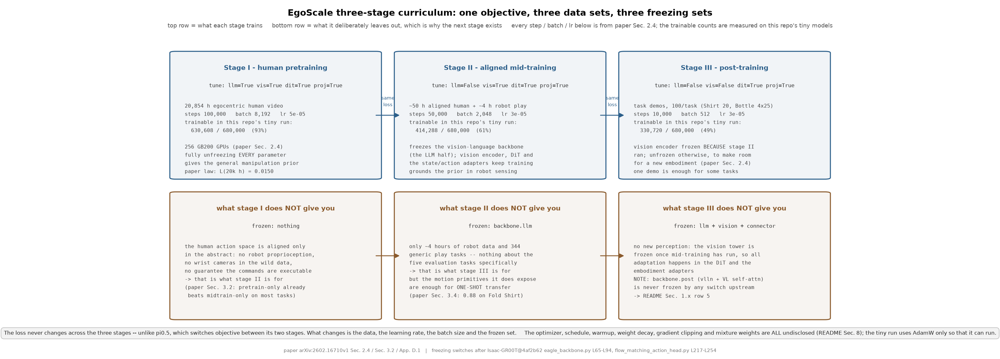
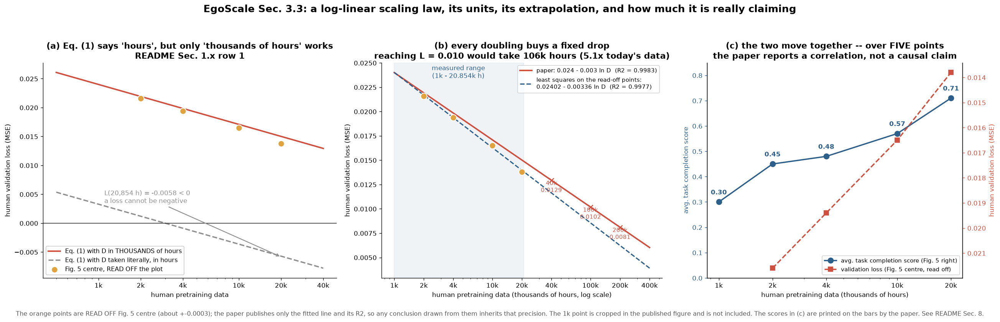

# egoscale · train: 三阶段 curriculum 与那条对数线性的 scaling law

**TL;DR.** 模型有了, 数据有了, 剩下的问题是"怎么把 20,854 小时人类数据和 4 小时机器人数据用在同一个训练过程里, 且顺序不能乱" —— 这是纯**训练侧**的问题, 出自论文 §2.4 与 §3.3. EgoScale 的做法是三阶段: **Stage I** 在 20K 小时人类数据上跑 100k 步, 全局 batch 8,192, 学习率 5e-5, **全参数解冻**, 用 **256 张 GB200**; **Stage II** 在对齐的人机 play 数据上跑 50k 步, batch 2,048, 学习率 3e-5, **冻结视觉语言 backbone**, 只更新视觉编码器、DiT 与 state/action 编解码器; **Stage III** 在任务演示上跑 10k 步, batch 512, 学习率 3e-5, 视觉编码器**有 mid-training 则冻结, 否则解冻**. 收益是可预测: 人类验证损失与数据量呈对数线性 `L = 0.024 − 0.003·ln(D)`, `R² = 0.9983` (§3.3 式 (1)), 而这个离线损失与真机表现强相关 —— 平均任务完成分从 1k 小时的 **0.30** 单调升到 20k 小时的 **0.71**, 区间内未见饱和. 代价是 Stage I 那 100k × 8,192 的算力预算.

**流程图**: 上排是三个阶段依次进行 —— 每框标该阶段的数据、步数、batch、学习率、哪些模块解冻, 以及一次真实 tiny 运行里**实际拿到梯度的参数量**; 下排是每个阶段"不做什么"(被冻结的部分) 与它留下的问题, 也就是下一阶段存在的理由.



**第二幅图的论点**: `figs/scaling.png` 要让读者看出 —— (a) 论文式 (1) 里的 `D` 的单位**不可能是小时**: 代入 20,854 小时会得到负的损失, 只有把 `D` 读成**千小时**才与图 5 中栏的点吻合 (见 §1.x 第 1 条); (b) 对数线性外推的形状: 每翻一倍数据换来固定的损失下降, 因此"再涨 10 倍"能换到多少是可以算出来的; (c) 离线损失与真机任务完成分在这五个数据点上确实同向, 但样本量只有 5, 论文也只报告了相关而非因果.

本 module 复现**冻结表、阶段配置与 scaling law 的拟合/外推**, 并跑通一个 tiny 的三阶段循环. 模型在 [`../backbone`](../backbone/README.md) 与 [`../dit`](../dit/README.md); loss 在 [`../dit/train.py`](../dit/README.md); 数据混合在 [`../data`](../data/README.md); 验证损失协议与真机 rubric 在 [`../infer`](../infer/README.md).

上游: EgoScale 未开源, 训练脚本也没有对应的开源实现 (上游 `gr00t/experiment/trainer.py` 只是 HuggingFace `Trainer` 的薄封装). 本 module 按论文 [arXiv:2602.16710v1](https://arxiv.org/abs/2602.16710v1) §2.4、§3.3、附录 D.1 实现, 冻结开关对照 [NVIDIA/Isaac-GR00T](https://github.com/NVIDIA/Isaac-GR00T) @ `4af2b622892f7dcb5aae5a3fb70bcb02dc217b96` 的 `gr00t/model/backbone/eagle_backbone.py` L65-L94 与 `gr00t/model/action_head/flow_matching_action_head.py` L217-L254. PyTorch 重写, 不 import 上游.



## 1. I/O 契约

主文件 `train.py`. 没有模型参数.

### 1.1 阶段表: `Stage` 与 `STAGES`

| 字段 | 类型 | Stage I | Stage II | Stage III |
|---|---|---|---|---|
| `steps` | `int` | **100,000** | **50,000** | **10,000** |
| `batch_size` | `int` | **8,192** | **2,048** | **512** |
| `lr` | `float` | **5e-5** | **3e-5** | **3e-5** |
| `tune_llm` | `bool` | `True` | `False` | `False` |
| `tune_visual` | `bool` | `True` | `True` | `False` / `True` |
| `tune_dit` | `bool` | `True` | `True` | `True` |
| `tune_projector` | `bool` | `True` | `True` | `True` |
| `data` | `str` | 20K 小时人类 | 对齐人机 play | 任务演示 |

以上每个数字都出自论文 §2.4 的那一段. Stage III 的 `tune_visual` 取决于有没有做过 mid-training: "the vision encoder is frozen if mid-training is used and unfrozen otherwise, to accommodate new embodiments when needed" —— 所以 `STAGES` 里它是一个函数 `stage3(mid_trained: bool)`.

`tune_projector` 对应上游 action head 的 `tune_projector` 开关, 它一起控制 `state_encoder` / `action_encoder` / `action_decoder` / `position_embedding` 四者 (`flow_matching_action_head.py` L217-L237) —— **不能只冻其中一个**.

### 1.2 冻结: `apply_stage(backbone, expert, stage)`

| 名称 | 类型 | 说明 |
|---|---|---|
| 入 `backbone` | `VisionLanguageBackbone` | 见 [`../backbone`](../backbone/README.md) |
| 入 `expert` | `ActionExpert` | 见 [`../dit`](../dit/README.md) |
| 入 `stage` | `Stage` | |
| 出 | `dict[str, int]` | 每个子模块**可训练**的参数量; 这是 `figs/pipeline.png` 上排的数值来源 |

副作用: 设置 `requires_grad`, 并调用两边的 `set_frozen_modules_to_eval_mode()` —— 后者不能省, 原因见 [`../backbone`](../backbone/README.md) §9.

### 1.3 scaling law: `ScalingLaw`

**`ScalingLaw.paper()`** = `L(D) = 0.024 − 0.003·ln(D)`, `D` 的单位是**千小时** (见 §1.x 第 1 条), 论文 §3.3 式 (1), `R² = 0.9983`.

| 方法 | 入 → 出 | 说明 |
|---|---|---|
| `predict(d_khours)` | `array → array` | 按拟合式外推 |
| `fit(d_khours, losses)` | `(array, array) → ScalingLaw` | 在 `ln D` 上做最小二乘, 同时返回 `r2` |
| `hours_for(target_loss)` | `float → float` | 反解: 要把损失压到某个值需要多少数据 |

`FIG5_CENTER` 是从论文图 5 中栏**读图得到**的四个点 (2k/4k/10k/20k 小时), 精度约 ±0.0003, 明确标注为读图值而非论文给出的数字; 1k 那个点在图里被裁掉了, 不收录. 见 §8.

`FIG5_RIGHT` 是论文图 5 右栏**印在柱子上的**平均任务完成分: 1k → 0.30, 2k → 0.45, 4k → 0.48, 10k → 0.57, 20k → 0.71. 这些是论文直接给出的数字.

### 1.4 优化器: `optimizer_config()`

**EgoScale 只披露了学习率和 batch size**, 优化器、weight decay、schedule、warmup 一个都没给. `optimizer_config()` 的这些字段全是 `None`. 另有 `groot_n1_optimizer()` 给出 GR00T N1 表 6 的值 ([arXiv:2503.14734](https://arxiv.org/abs/2503.14734) 表 6: AdamW, `β = (0.95, 0.999)`, `eps = 1e-8`, `weight_decay = 1e-5`, cosine schedule, `warmup_ratio = 0.05`), **明确标注这是 GR00T 的值, 不是 EgoScale 的**.

### 1.x 符号 / 约定差异与冲突记录

| # | 论文 / 上游 | 本仓库 | 采信理由 |
|---|---|---|---|
| 1 | 论文 §3.3 式 (1) 写 `L = 0.024 − 0.003·ln(D)`, 并说 "`D` denotes the number of **hours** of human pretraining data" | `D` 按**千小时**解释 | 代入 `D = 20854` 小时得 `0.024 − 0.003·9.945 = −0.0058`, **损失为负**, 不可能; 代入 `D = 20` (千小时) 得 `0.0150`, 与图 5 中栏 20k 那个点 (读图约 0.0138) 同量级. 逐点对比见 `test_parity.py::test_paper_law_units`. 单位写错是论文的笔误 |
| 2 | 同一式子里斜率写作 `0.003` | 照抄 `0.003`, 但在图里同时画出从读图点最小二乘拟合出来的斜率 | 读图四个点拟合出的斜率约 `0.0034`, 说明论文的 `0.003` 是一位有效数字的四舍五入. 两条线都画出来 |
| 3 | 论文 §2.4 说 Stage II "freezing the vision-language backbone while only updating the **vision encoder** and DiT action expert" | 按附录 D.1: 冻结视觉语言 backbone 的 **LLM 部分**, 更新视觉编码器、DiT 与 state/action 编解码器 | §2.4 那句自相矛盾 (视觉编码器本来就在 backbone 里); 附录 D.1 "only the vision encoder, DiT action expert, and state-action encoder and decoder are updated, while the vision-language backbone remains frozen" 更具体, 且与上游 `tune_llm=False, tune_visual=True` 的实际配置一致 |
| 4 | 论文没说 Stage II / III 的数据混合权重 | `Stage.mixture` 为 `None` | 见 [`../data`](../data/README.md) §8 |
| 5 | 上游的冻结开关**从不涉及** `vlln` 与 `vl_self_attention` (`flow_matching_action_head.py` L217-L238 只冻 `state_encoder` / `action_encoder` / `action_decoder` / `position_embedding` 与 DiT) | 照做: 本仓库的 `backbone.post` 在三个阶段里始终可训练 | 这意味着即使 Stage II / III "冻结了视觉语言 backbone", 紧接在它后面的那几层 VL 自注意力仍然在更新. 论文说的"冻结 backbone"与代码实际冻的东西并不完全重合, 见 `test_parity.py::test_vl_post_process_is_never_frozen` |

## 2. 复现范围

| 有代码 | 只有事实 (背景) |
|---|---|
| 三阶段的步数 / batch / 学习率表 | 256 张 GB200 的具体并行策略与吞吐 |
| 逐阶段的冻结开关与可训练参数量统计 | 训练框架、checkpoint 管理、日志 |
| 三阶段依次跑通的 tiny 循环 | 任何真实的收敛行为 |
| scaling law 的拟合、外推与反解 | 五个预训练 run 的实际损失曲线 (只能读图) |
| 读图得到的图 5 中栏点与论文给出的右栏分数 | 验证集本身 (2,000 条留出 episode) |
| 单位冲突的数值验证 | 为什么 `R² = 0.9983` 这么高 |

## 3. 推理侧

本 module 不参与推理. 它唯一与推理相关的产出是"哪个 checkpoint 该拿去 [`../infer`](../infer/README.md) 评测": 论文 §3.2 比较的四个 checkpoint 分别是 (1) 从零训练, (2) 只做 mid-training, (3) 只做人类预训练, (4) 人类预训练 + mid-training. `CHECKPOINTS` 把这四条路径显式列成阶段序列.

## 4. 训练侧

### 4.1 数据组织形式

见 [`../data`](../data/README.md). 本 module 只决定**每个阶段用哪个混合**.

### 4.2 数据预处理, 逐步

不在本 module.

### 4.3 training objective / curriculum

目标恒为 [`../dit/train.py`](../dit/README.md) 的那一个 masked flow matching MSE —— **三个阶段的 loss 完全一样**, 变的只有数据、学习率、batch 与冻结集合. 这与 π0.5 的两阶段 curriculum 不同, 后者在两阶段之间**换了目标** (先离散 CE 再 flow), 见 [`../../pi/pi05/train`](../../pi/pi05/train/README.md).

**为什么顺序不能换** (论文 §3.2 的消融): 只做 Stage II 的基线在多数任务上不如只做 Stage I 的; 两者都做才最好. 论文的解释是 Stage I 提供"一般的操作结构", Stage II 把这些表征"锚定到可执行的机器人控制上". 本仓库不复现这些数字, 只在 `figs/scaling.png` 里引用.

## 5. 评测

(a) **接口**: 本 module 的可检查对象是**拟合与冻结**, 不是收敛. scaling law 的接口是 `(d_khours, losses) → (a, b, r2)`; 冻结的接口是 `(backbone, expert, stage) → 可训练参数量`.

(b) **task 列表**: 三个阶段 × (mid-trained 与否) 共四种冻结配置; scaling law 的拟合 / 外推 / 反解三种用法.

(c) **metric**: 可训练参数量与手算值是否一致; 拟合的 `R²`; 论文式在两种单位下的预测值与读图点的偏差.

(d) **流程**: `train.py` 的 `main()` 用 tiny 配置把三个阶段各跑两步, 打印每阶段拿到梯度的参数量与 loss. 真机 rubric 与人类验证损失协议在 [`../infer/eval.py`](../infer/README.md).

(e) **与论文对齐程度**: 阶段超参逐值对齐论文 §2.4; scaling law 的**形式**对齐式 (1), 但**数值**只能对到读图精度; 不复现任何训练曲线.

`test_parity.py` (CPU, 约 30 秒) 检查什么:
- **数值对齐**: 三阶段的 `steps / batch_size / lr` 逐值等于论文 §2.4 的 100k/8192/5e-5、50k/2048/3e-5、10k/512/3e-5; `FIG5_RIGHT` 的五个分数等于图 5 右栏印的 0.30/0.45/0.48/0.57/0.71;
- **解析性质**: Stage I 下所有参数可训练; Stage II 下 LLM 的可训练参数为 0 而视觉塔、DiT、三个适配器全为正; Stage III (mid-trained) 下视觉塔也归零; 冻结后 `training` 标志被正确切到 `eval`; `ScalingLaw.fit` 在无噪声的合成点上恢复出原系数且 `R² = 1`; `hours_for(predict(d)) == d`;
- **单位冲突**: 论文式在 `D` 为小时时对 20,854 给出**负**损失, 在 `D` 为千小时时给出正值且与读图点的最大偏差 < 0.0015;
- **端到端**: 三阶段 tiny 循环跑通, 每阶段的梯度只出现在该阶段解冻的模块上.

```
uv run pytest gear/egoscale/train -q
uv run python -m gear.egoscale.train.train
uv run python gear/egoscale/train/figs/make_pipeline.py
uv run python gear/egoscale/train/figs/make_figs.py
```

## 6. cost 信息

| 项目 | 值 | 来源 |
|---|---|---|
| 训练算力 | Stage I: **256 张 GB200**, 100,000 步, 全局 batch **8,192** | 论文 §2.4 |
| | Stage II: 50,000 步, batch **2,048**; Stage III: 10,000 步, batch **512**. 两者的卡型与卡数**未披露** | 论文 §2.4 / 未披露 → §8 |
| | 墙钟时长**未披露** | 未披露 → §8 |
| 训练数据规模 | Stage I 20,854 小时 (30 FPS ⇒ 约 2.25 × 10⁹ 帧, 本仓库推算); Stage II 约 50 h 人类 + 4 h 机器人, 344 个任务; Stage III 每任务 100 条演示 (Shirt Rolling 20 条; Bottle 4 个瓶子各 25 条) | 论文 §2.2, §3.1 |
| | Stage I 的样本数上界: 100,000 步 × 8,192 = **8.19 × 10⁸ 个样本**, 约为总帧数的 0.36 个 epoch (本仓库按披露值推算) | 推算 |
| token 数 | 序列长度见 [`../dit`](../dit/README.md); 总 token 数未披露 | 未披露 → §8 |
| 模型大小 | 见 [`../backbone`](../backbone/README.md) 与 [`../dit`](../dit/README.md); EgoScale 未披露自己的总参数量 | 未披露 → §8 |
| 推理延时 | 不适用 | — |

## 7. reference 映射表

| 本仓库 | 上游 |
|---|---|
| `STAGES` 的每个数字 | 论文 [arXiv:2602.16710v1](https://arxiv.org/abs/2602.16710v1) §2.4 |
| `stage3(mid_trained)` 的分支 | 论文 §2.4 最后一句 |
| `apply_stage` 的 `tune_llm` / `tune_visual` | 上游 `gr00t/model/backbone/eagle_backbone.py` L65-L94 |
| `apply_stage` 的 `tune_projector` / `tune_diffusion_model` | 上游 `gr00t/model/action_head/flow_matching_action_head.py` L217-L254 |
| Stage II 的更新集合 | 论文附录 D.1 "Embodiment-Specific Mid-Training" |
| `ScalingLaw.paper()` | 论文 §3.3 式 (1) |
| `PAPER_R2 = 0.9983` | 论文 §3.3 与图 5 说明 |
| `FIG5_RIGHT` | 论文图 5 右栏柱子上印的数字 |
| `FIG5_CENTER` | 论文图 5 中栏, **读图值**, 见 §8 |
| `groot_n1_optimizer()` | GR00T N1 [arXiv:2503.14734](https://arxiv.org/abs/2503.14734) 表 6 |
| `CHECKPOINTS` 的四条路径 | 论文 §3.2 |
| 验证协议的参数 (2,000 episodes / 20 时刻 / 16 样本) | 论文 §3.3; 代码在 [`../infer/eval.py`](../infer/README.md) |

## 8. gap ledger

| 未披露 / 未复现 | 说明 |
|---|---|
| 优化器与 schedule | EgoScale 只给了 lr 与 batch size. AdamW / β / eps / weight decay / cosine / warmup 全部未披露. `optimizer_config()` 的这些字段是 `None`; `groot_n1_optimizer()` 给的是 GR00T N1 表 6 的值, 不是 EgoScale 的 |
| 梯度裁剪、EMA、混合精度 | 完全未提及 |
| Stage II / III 的卡型与卡数 | 只有 Stage I 说了 256 张 GB200 |
| 墙钟时长与总算力 | 未披露 |
| 各阶段的数据混合权重 | 未披露, 见 [`../data`](../data/README.md) §8 |
| 图 5 中栏的验证损失数值 | 论文只给了拟合式与 `R²`, 没有列表. `FIG5_CENTER` 的四个点是**从图上读的**, 精度约 ±0.0003, 1k 那个点在图里被裁掉所以不收录. 任何依赖这些数的结论都要按读图精度打折 |
| 式 (1) 里 `D` 的单位 | 论文写"小时", 但数值只有按"千小时"才自洽, 见 §1.x 第 1 条 |
| 式 (1) 的斜率精度 | `0.003` 是一位有效数字; 读图点拟合出来约 `0.0034` |
| 五个预训练 run 的训练曲线 | 只能读图, 本仓库不收录 |
| 1k / 2k 出现的"早期过拟合"的具体判据 | 论文只说 "plateau or degrade", 没给 early stopping 规则 |
| "optimal validation loss at convergence" 的定义 | 是曲线最小值还是最后一步? 论文未说明. 本仓库在拟合接口里把它当成调用方给的输入 |
| 三阶段是否共享优化器状态 | 未披露 |

## 9. 领域概念表

### domain 概念

**三阶段 curriculum (pretrain → mid-train → post-train)**
- shape: 不是张量, 是一个 `(数据, 步数, batch, lr, 冻结集合)` 的四元组序列
- 含义: 同一个 loss、同一个模型, 只换数据与可训练集合, 依次跑三遍
- 来源: 由训练脚本决定, 不在数据里
- 为什么需要: 20K 小时人类数据提供多样性但与机器人不对齐; 4 小时机器人数据对齐但太少. 先用前者学结构, 再用后者做锚定, 最后用任务数据特化 —— 论文 §3.2 的消融显示三者不可互换
- 系统联系: 每个阶段的"冻结集合"直接对应 [`../backbone`](../backbone/README.md) 与 [`../dit`](../dit/README.md) 里的模块边界; 冻结表读不懂, 就说明模块切分有问题

**冻结 (freeze) 与 eval 模式的区别**
- 含义: `requires_grad=False` 只是不更新; `module.eval()` 才关掉 dropout 与 batchnorm 的训练行为
- 来源: PyTorch 的两套独立机制
- 为什么需要: N1.5 的 DiT `dropout = 0.2` 不小; 冻结的 backbone 如果还在跑 dropout, 同一张图每次给出的条件都不同
- 系统联系: 上游在 backbone 与 action head 各写了一个 `set_frozen_modules_to_eval_mode`, 因为 HuggingFace Trainer 每步都会调 `model.train()` 把它们切回去

### application 概念

**scaling law 与它的单位**
- shape: `L(D)`, 一元
- 含义: 在对数数据量上线性的验证损失; 斜率决定"翻一倍数据能换多少损失"
- 来源: 五个不同数据量的预训练 run, 各取收敛时的最优验证损失
- 为什么需要: 它把"该不该继续收集数据"变成一个可以外推的问题, 而不是靠感觉
- 系统联系: 这条律的实用价值完全取决于"离线损失与真机表现同向"这个前提; 论文用图 5 右栏的五个点支持了这个前提, 但只有 5 个点, 且是相关而非因果

**"从零训练 / 只 mid-train / 只 pretrain / 两者都做"四个 checkpoint**
- 含义: 论文 §3.2 的消融坐标系
- 来源: 同一套代码, 跳过或保留不同阶段
- 为什么需要: 只有并排比较才能说明"是规模起作用"还是"是对齐起作用"
- 系统联系: 这四条路径在本 module 里是 `CHECKPOINTS` 的四个条目, 每条对应一串阶段; 评测时它们共用 [`../infer/eval.py`](../infer/README.md) 的同一套 rubric
