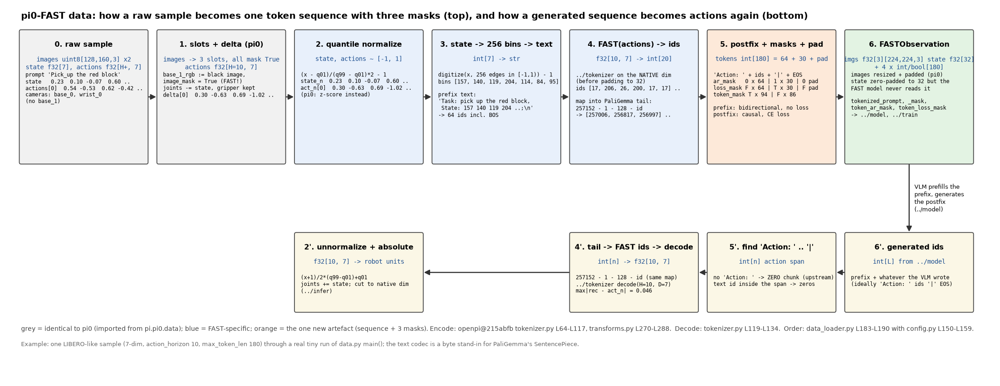
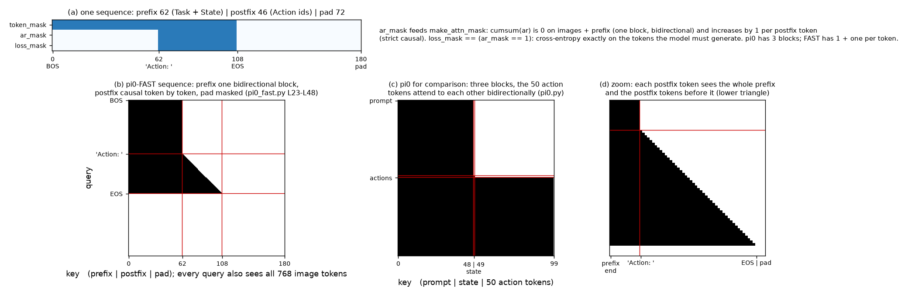

# FAST · data: 把 prompt, state 分箱与 FAST action token 拼成一条序列, 三个 mask, 映射进 PaliGemma 词表尾部

**TL;DR.** π0 给模型三样分开的输入: prompt token, 连续 state 向量, 连续 action chunk; π0-FAST 要让 VLM 用 next-token prediction 输出动作, 就必须把三样东西压成 **一条 token 序列**, 训练时整条喂进去、只在动作段算 CE, 推理时只给前半段让模型续写后半段 (论文 Sec. VI-A, Appendix C; openpi `tokenizer.py` L64-L117). 做法: state 按 256 箱离散化写成文本, 与 prompt 拼成 `Task: …, State: …;\n` 作 prefix (双向 attention, 不算 loss); `../tokenizer` 得到的 FAST id 映射到 PaliGemma 词表末尾 "最少用" 的 2048 个位置, 前后加 `Action: ` 与 `|` + EOS 作 postfix (因果 attention, 算 loss); pad 到 `max_token_len` 250 (微调 180). 代价: 序列比 π0 的 48 个 prompt token 长得多 (LIBERO 例子 125 个), 全部走 2B 底座; 收益是不需要任何新参数, 与训练侧 5 倍提速一起来自 `../tokenizer` 的离散化. 推理逆过程 `extract_actions` 从生成序列里切出动作段, 找不到 `Action: ` 就返回全零 (上游行为). 图像预处理, delta action, chunk 截取, 维度 padding 与 π0 完全相同, 直接 import; 三处 **不同**: 相机槽位改名为 `base_0 / base_1 / wrist_0` 且缺失相机不 mask, 归一化改为 quantile, 连续 state 虽然还在 Observation 里但模型不读它.

**流程图**: 上排是一个样本从 raw 到序列的每一步 (LIBERO 规模: 7 维, 10 步 chunk, `max_token_len` 180), 每步给 shape 与真实 tiny 运行的值; 下排是推理时从生成序列切回动作的镜像. 与 π0 相同的步骤画成灰色.



**第二幅图的论点**: 一条 180 长的序列里, prefix 与 postfix 的 `ar_mask` / `loss_mask` 是怎么分段的, 由此得到的 attention mask 与 π0 的三块 mask 对照: π0 的 "prefix 双向 + suffix 因果块" 在 FAST 里变成 "prefix 双向 + postfix 逐 token 因果".



本 module 复现 π0-FAST 数据侧相对 π0 的增量. 上游: [openpi](https://github.com/Physical-Intelligence/openpi) @ `215abfb217dbac7d5f1273282331b9b1866c0479` (`openpi@215abfb`) 的 `src/openpi/models/tokenizer.py` `FASTTokenizer` (L51-L139), `src/openpi/transforms.py` `TokenizeFASTInputs` / `ExtractFASTActions` (L270-L306), `src/openpi/training/config.py` L139-L160 与 L187, `src/openpi/policies/droid_policy.py` L56-L60, `libero_policy.py` L64-L69; 论文 FAST [arXiv:2501.09747v1](https://arxiv.org/abs/2501.09747v1) Sec. VI-A, Appendix C. PyTorch / NumPy 重写, 不 import 上游; 与 π0 相同的部分 `from pi.pi0.data.data import ...`.

## 1. I/O 契约

### 1.1 `FASTSequenceTokenizer.tokenize(prompt, state, actions)` (`tokenizer.py` L64-L117)

| 名称 | shape / dtype | 取值 | 说明 |
|---|---|---|---|
| 入 `prompt` | str | | 任务指令; 小写、去首尾空白、`_` → 空格 (L67) |
| 入 `state` | float32[d] | ~[−1, 1] | quantile 归一化后的本体状态, **原生维 d**, 尚未 pad |
| 入 `actions` | float32[H, d] 或 None | ~[−1, 1] | 归一化、delta 化的 chunk, 原生维; None = 推理, postfix 为空 |
| 出 `tokens` | int64[max_len] | [0, 257152) | `[BOS] Task: …, State: b_1 … b_d;\n Action: <2048 个尾部 id> \| [EOS]` + 0 填充 |
| 出 `token_mask` | bool[max_len] | | 真实 token 为 True |
| 出 `ar_mask` | int64[max_len] | {0, 1} | prefix 0 (双向), postfix 1 (因果); 交给 `make_attn_mask` |
| 出 `loss_mask` | bool[max_len] | | 只有 postfix 为 True; CE 只在这里算 (→ `../train`) |

`max_len`: 250 (base, `pi0_fast.py` L84), 180 (LIBERO / DROID 微调, `config.py` L711, L839; 注释给的经验规则: 单臂约 180, 双臂约 250). 超长时 **截尾并警告** (L107-L115); 被截掉的是序列末尾, 即 action token 和 EOS, 训练目标就残缺了, 所以上游建议看到警告就调大.

### 1.2 `FASTSequenceTokenizer.extract_actions(tokens, action_horizon, action_dim)` (`tokenizer.py` L119-L134)

| 名称 | shape / dtype | 说明 |
|---|---|---|
| 入 `tokens` | int[L] | 模型生成的 id (含 prefix 也可, 含 pad / EOS 也可) |
| 入 `action_horizon`, `action_dim` | int | 解码 FAST 需要的 H, D; 从模型 config 来 (`transforms.py` L293-L295) |
| 出 | float32[H, D] | 归一化空间的 chunk; 之后 `unnormalize_quantile` → `to_absolute_actions` → 截回原生维 (`../infer`) |

上游流程: 整条序列用 SentencePiece 解码成文本 → 找 `"Action: "` (没有 → 全零, L124-L125) → 取到 `"|"` 为止 → 重新 encode 成 id → `vocab − 1 − 128 − id` → `FASTTokenizer.decode`. 本仓库在 id 层做同样的查找 (见 §3), 结果在上游 "解码再编码" 往返精确时相同.

### 1.3 `discretize_state(state)`, `fast_to_paligemma(ids)` = `paligemma_to_fast`

| 函数 | I/O | 说明 |
|---|---|---|
| `discretize_state` | float[d] → int64[d], 正常在 [0, 255] | `np.digitize(x, linspace(−1, 1, 257)[:-1]) − 1` (L70): 箱 i 覆盖 [−1 + 2i/256, −1 + 2(i+1)/256), 最后一箱开区间, x ≥ 1 落在 255; **x < −1 得到 −1**, 文本里出现 `-1`. quantile 归一化不 clip, 约 1% 的值会这样; 上游没有防护, 本仓库如实复现 (gap ledger) |
| `fast_to_paligemma` | int[n] → int[n] | `257152 − 1 − 128 − t` (L139): FAST id 0 → 257023, 2047 → 254976. 自反 (两次得回自己) |

### 1.4 `build_fast_batch(raw, norm_stats, seq_tokenizer, *, action_horizon, action_dim, delta_mask, train)` → `(FASTObservation, actions)`

| 字段 | shape / dtype | 与 π0 的差别 |
|---|---|---|
| `images[k]`, k ∈ {`base_0_rgb`, `base_1_rgb`, `wrist_0_rgb`} | float32[B, 224, 224, 3] ∈ [−1, 1] | 槽位名不同 (`pi0_fast.py` L107-L111); 缺失相机仍是黑图 |
| `image_masks[k]` | bool[B] | **全 True** (`droid_policy.py` L58-L60, `libero_policy.py` L67-L68) |
| `state` | float32[B, action_dim] | quantile 归一化; **模型不读** (`pi0_fast.py` `embed_inputs` L159-L195 只用图像和 token), 保留是为了接口一致 |
| `tokenized_prompt`, `tokenized_prompt_mask` | int64 / bool[B, max_len] | 整条序列, 不只是 prompt |
| `token_ar_mask`, `token_loss_mask` | int64 / bool[B, max_len] | 新增字段 (`model.py` L102-L107) |
| 返回 `actions` | float32[B, H, action_dim] 或 None | 归一化 + delta + 零填充, 与 token 编码的是同一个东西, 供对齐检查; 模型训练不直接用它 |

### 1.5 `ByteTextCodec`

PaliGemma SentencePiece (257,152 pieces, BOS 2, EOS 1; `tokenizer.py` L56-L58) 的替身: 每个 UTF-8 字节一个 id (+3), 与 `pi.pi0.data.ByteEncoder` 同款, 多了 `add_eos` 与 `decode`. `vocab_size` 仍声明为 257,152, 所以 action id 落在与上游完全相同的位置. 不是 PaliGemma 词表 (gap ledger).

## 2. 复现范围

| 有代码 | 只有事实 (背景) |
|---|---|
| 1.1–1.5 全部; 序列格式, 三个 mask, 词表尾部映射, 截断与零回退 | PaliGemma 词表里 "最少用的 token" 是哪些, 论文没列 (Sec. VI-A 只说 overwrite the least used tokens) |
| FAST 的相机槽位与不 mask 规则 | DROID 训练时的相机与语言标注随机化 (论文 Appendix D, → `../train`) |
| quantile 归一化的接入 | 各机器人的 `norm_stats.json` 数值 |

## 3. 推理侧: 从生成序列切回动作

推理时 `tokenize(prompt, state, None)` 只产生 prefix (62 个 token 的例子里全是 prefix, `ar_mask` 全 0, `loss_mask` 全 False), 模型从 prefix 之后开始生成 (→ `../model`), 生成结果是一串 PaliGemma id, 理想情况是 `Action: ` 的 id, 若干尾部 id, `|`, EOS. `extract_actions`:

1. 在 id 序列里找 `encode("Action: ")` 这段 id; 找不到 → 全零 [H, D] (上游 L124-L125, 静默失败, 机器人会收到 "不动" 的指令).
2. 取其后到 `encode("|")` (或 EOS / 序列末尾) 之间的 id, 去掉 pad 0.
3. `paligemma_to_fast` 映射回 [0, 2048); 若有 id 落在范围外 (模型在动作段里生成了文字) → 全零 (本仓库推断: 上游会在 `FASTTokenizer.decode` 里因为 BPE 解不出而走同一条零回退).
4. `../tokenizer` 的 `decode(H, D)`.

与上游的差别: 上游先把整条序列解码成文本再按字符串切 (L121-L129), 依赖 SentencePiece 对那 2048 个被覆盖的 piece "解码再编码" 不变. 本仓库的字节替身无法解码这些 id, 所以在 id 层查找. 两者等价的条件是上游那个往返精确; 上游没有对此做检查.

延时: 纯 numpy, 微秒级; 真正的推理成本在逐 token 生成 (→ `../model`).

## 4. 训练侧

### 4.1 数据组织形式

与 π0 相同 (LeRobot 格式, 每步一条记录, chunk 由 `delta_timestamps` 取未来 H 步; 见 `pi.pi0.data` README §4.1). 差别只在 H: FAST 论文训练时用 1 秒 chunk (Sec. VI-A), openpi 的 `pi0_fast_libero` / `pi0_fast_droid` 用 `action_horizon=10`, `pi0_fast_full_droid_finetune` 用 16, `Pi0FASTConfig` 默认 32 (gap ledger: 三处不一致).

### 4.2 数据预处理, 逐步 (`data_loader.py` L183-L190 顺序, FAST 的 transform 来自 `config.py` L150-L159)

| 步 | 做什么 | 与 π0 | 上游 |
|---|---|---|---|
| (a) 相机槽位 | `base_0_rgb`, `base_1_rgb`, `wrist_0_rgb`; 缺失 → 黑图, mask **True** | 不同 | `droid_policy.py` L56-L60; `libero_policy.py` L58-L69 |
| (b) delta action | 关节维减当前 state, 夹爪不减 | 同 | `transforms.py` L204-L223 |
| (c) 归一化 | q01 → −1, q99 → +1, 不 clip | 不同 (π0 z-score) | `config.py` L187; `transforms.py` L141-L145 |
| (d) 图像 resize + 填黑 | 224 × 224 | 同 | `image_tools.py` |
| (e) 序列化 | prompt + state 分箱 + FAST(actions) → tokens + 3 masks, **在原生维上** | 新 | `transforms.py` L270-L288; `tokenizer.py` L64-L117 |
| (f) pad 维度 | state / actions 零填充到 `action_dim` | 同 | `transforms.py` L328-L340 |
| (g) 模型内 | uint8 → [−1, 1]; 训练时增广 | 同 | `model.py` `preprocess_observation` |

顺序里 (e) 在 (f) 之前, 所以 FAST 看到的是 7 维而不是 32 维的 chunk, state 文本里也只有 7 个整数. 这与 FAST+ 训练时 "pad 到 32 维" (论文 Appendix A) 不矛盾: 那是训练 tokenizer 的数据, 这里是用它.

### 4.3 序列格式的每个约定 (`tokenizer.py` L67-L96)

| 约定 | 值 | 为什么 (上游注释 / 本仓库推断) |
|---|---|---|
| prompt 清洗 | 小写, strip, `_` → 空格 | L67; LeRobot 任务名常带下划线 |
| state 分箱 | 256 箱, 假设已归一化到 [−1, 1] | L69-L70; 论文 Appendix C: 输入侧用简单分箱就够, 只有输出侧需要 FAST |
| prefix 文本 | `Task: {prompt}, State: {ints};\n` + BOS | L72-L75; `;\n` 标记 prefix 结束 |
| postfix | `Action: ` + ids + `\|` + EOS | L82-L87; `\|` 是动作段结束标记, EOS 让模型学会停 |
| `ar_mask` | prefix 0, postfix 1 | L92-L95; prefix 双向 (像 π0 的 prefix), postfix 逐 token 因果 |
| `loss_mask` | 只 postfix | L96; prompt 与 state 不是预测目标 |
| pad | 0 / False / 0 / False 到 `max_len` | L100-L105 |
| 截断 | 截尾 + warning | L107-L115 |

### 4.4 training objective

不在本 module: 序列上的 next-token CE, 只在 `loss_mask` 为 True 的位置, 见 `../train`.

## 5. 评测

本 module 的验收是 `test_parity.py` (CPU, 约 2 秒): 序列结构 (BOS 开头, `;\n` 结束 prefix, `Action: ` 开始 postfix, `|` + EOS 结尾), 三个 mask 的分段与长度一致, action id 落在 [254976, 257023] 且映射自反, `tokenize → extract_actions` 往返误差 ≤ FAST 量化界, 推理模式 postfix 为空, pad / 截断行为, 相机不 mask, state 分箱边界, 与 `pi.pi0.data` 共用步骤的一致性.

```
uv run pytest pi/fast/data -q
uv run python -m pi.fast.data.data      # 逐步打印一个 batch 的序列, mask, 往返
```

评测数据集接口 (LIBERO / DROID 的观测键、动作维度) 与 episode 循环在 `../infer/eval.py`; 本 module 只保证 `build_fast_batch` 接受那两个接口给出的 raw 字典.

## 6. cost 信息

| 项目 | 值 | 来源 |
|---|---|---|
| 序列长度上限 | 250 (base), 180 (单臂微调) | `pi0_fast.py` L84; `config.py` L711, L839 |
| 一个样本的 token 数 | LIBERO 例子 125 = prefix 62 + postfix 63 (7 维 10 步, 合成动作); 论文 Table I: FAST 每 chunk 单臂约 30, 双臂约 60 个 action token | 本仓库 `main()`; 论文 Sec. VI-B |
| 词表占用 | PaliGemma 尾部 2048 个 id (跳过最后 128 个特殊 token) | `tokenizer.py` L62, L139 |
| 新增参数 | 0 | 论文 Sec. II "does not require modifications of the underlying pre-trained transformer" |
| 预处理延时 | 未披露 (numpy 微秒级) | gap ledger |

## 7. reference 映射表

| 本仓库 | 上游 |
|---|---|
| `ByteTextCodec` | `tokenizer.py` L56-L58 (PaliGemma SentencePiece), L75 `add_bos`, L86 `add_eos`; 替身 |
| `discretize_state`, `state_to_text` | `tokenizer.py` L69-L73; 论文 Appendix C |
| `fast_to_paligemma` / `paligemma_to_fast` | `tokenizer.py` L62, L136-L139; 论文 Sec. VI-A |
| `FASTSequenceTokenizer.tokenize` | `tokenizer.py` L64-L117; `transforms.py` L270-L288 |
| `FASTSequenceTokenizer.extract_actions` | `tokenizer.py` L119-L134; `transforms.py` L291-L306 |
| `FASTObservation` | `model.py` L83-L107; `pi0_fast.py` L101-L125 `inputs_spec` |
| `build_fast_batch` (a) | `droid_policy.py` L56-L60; `libero_policy.py` L58-L69 |
| `build_fast_batch` (c) | `config.py` L187; `transforms.py` L141-L145 |
| `build_fast_batch` (e) | `config.py` L150-L159 |
| 常量 `MAX_TOKEN_LEN`, `ACTION_DIM`, `IMAGE_KEYS` | `pi0_fast.py` L82-L84, L107-L111 |
| 复用的 (b)(d)(f)(g) | `pi.pi0.data.data` 及其 README §7 |

## 8. gap ledger

| 未披露 / 未复现 | 说明 |
|---|---|
| PaliGemma SentencePiece 词表 | 不下载; `ByteTextCodec` 替身, id 空间大小与特殊 id 保持一致, 但 prefix 的 token 数与真实模型不同 (字节数 vs piece 数) |
| `extract_actions` 的文本往返 | 上游 "解码再编码" 依赖 SentencePiece 对被覆盖 piece 的可逆性, 未被上游检查; 本仓库在 id 层查找, 等价条件见 §3 |
| 动作段里出现文字 id 时的行为 | 上游会在 BPE 解码处异常并走零回退; 本仓库在映射后范围检查时走零回退. 同为全零, 路径不同 (本仓库推断) |
| action horizon | 论文 1 秒 chunk; openpi `Pi0FASTConfig` 默认 32, LIBERO / DROID 10, full-DROID 16; 三处不一致, 本仓库把 H 作参数 |
| `max_token_len` 180 的依据 | 只有 `config.py` L702-L710 的注释 "经验规则", 无实验 |
| "最少用的 token" 是哪些 | 论文 Sec. VI-A 只有这句话; openpi 实际做法是固定取尾部 2048 个 (跳过 128 特殊), 未按频次统计 |
| 双臂任务的 `base_1_rgb` | DROID 里是零图; 论文 Appendix C 说双臂任务用 "一个第三人称 + 每臂一个腕部", 与三个槽位怎么对应未披露 |
| state 低于 q01 时的箱号 −1 | `np.digitize` 对 x < −1 返回 0, 减 1 后是 −1, prefix 文本里出现 `-1`; 上游未处理, 训练与推理一致所以无害, 但 state 实际有 257 种 "箱" (本仓库观察) |
| 预处理延时 | 未披露 |

## 9. 机器人概念表

**state 分箱 (proprioception as text)**
- shape: int64[d], d 为原生 state 维 (LIBERO 8, DROID 8), 每个 ∈ [0, 255] (低于 q01 的值给 −1, 见 ledger); 进入序列后是 d 个十进制数字串的 token.
- 物理含义: 归一化后的关节角 / 夹爪开合 / 末端位姿被量化到 2/256 ≈ 0.0078 的格点 (归一化空间).
- 数据来源: 与 π0 相同的本体传感器读数, 经 quantile 归一化后分箱.
- 为什么模型需要: π0-FAST 没有 state 投影层, 底座只吃 token; 论文 Appendix C 说输入侧分箱足够, 因为 state 是条件而不是预测目标, 不存在 "边际信息趋零" 的问题.
- 硬件联系: 分辨率 0.0078 × (q99 − q01) / 2, 对关节角约 0.01 rad 量级, 低于控制器精度但作为条件足够.

**词表覆盖 (vocabulary overwrite)**
- shape: 2048 个 id ∈ [254976, 257023], 是 PaliGemma embedding 表里既有的行.
- 含义: 这些行原本对应某些罕见文字 piece, 训练后它们的 embedding 与输出 logit 被重新解释为 FAST 系数模式.
- 来源: RT-2 / OpenVLA 的做法 (论文 Sec. VI-A "following prior VLAs"); openpi 固定取尾部.
- 为什么: 不加新参数、不改词表大小, 预训练的 lm head 直接复用; 代价是那些文字 piece 失去原义, 但机器人任务不需要它们.
- 系统联系: `../model` 的 logits 头输出 257,152 维, 采样时理论上可能落到非动作 id, `extract_actions` 的零回退就是为此.

**缺失相机不 mask (FAST)**
- shape: `image_masks[k]` bool[B] 全 True; 缺失槽位是 224 × 224 的黑图.
- 含义: 黑图的 256 个 SigLIP token 参与 attention 并占位置 id, 与 π0 (mask False, 不占位置) 相反.
- 来源: openpi 注释 "We don't mask out padding images for FAST models", 没有给理由 (gap: 本仓库推断是 π0-FAST base checkpoint 就是这样训的, 推理必须一致).
- 为什么: mask 约定属于 checkpoint; 改了就是分布偏移.
- 系统联系: 序列总长 = 3 × 256 图像 token + `max_token_len`, 与 π0 的 816 + 48 对照: FAST 是 768 + 250 = 1018 (base) 或 768 + 180 = 948.
