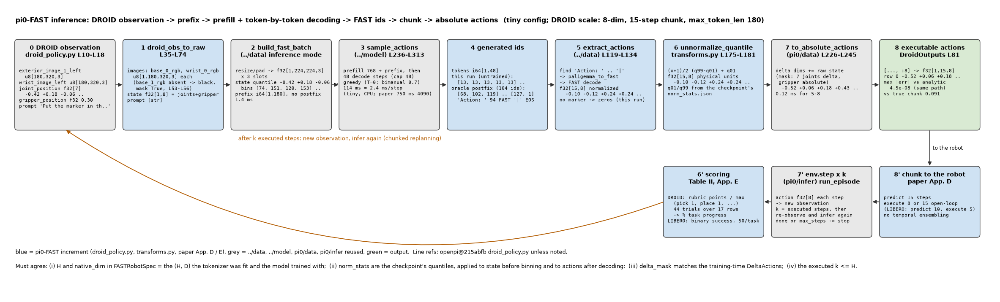
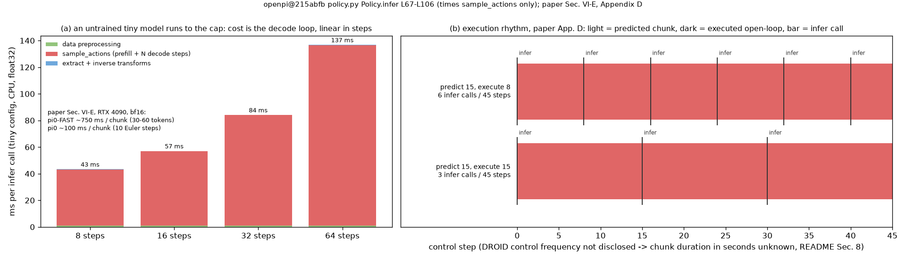

# FAST · infer: 端到端 `infer(raw) → actions`, 解码步数与延时, DROID 接口与 16 任务 rubric, LIBERO 复用

**TL;DR.** 前四个 module 拼起来就是 π0-FAST 的推理: 原始观测 → `../data` 的 prefix 序列 → `../model` 一次 prefill 加 30–60 步逐 token 解码 → `../data` 的 `extract_actions` 切出 FAST id → `../tokenizer` 解码回 [H, D] → 反归一化 (quantile) 与 delta → 绝对动作, 取前 native_dim 维. 这是 **推理侧付代价** 的地方: 论文 Sec. VI-E 给的是 RTX 4090 上约 750 ms / chunk, 对 π0 的 100 ms; 本 module 的 `timing` 把一次调用拆成数据预处理、`sample_actions` (prefill + N 步)、切 token + 逆变换三段并报告实际步数, 数字来自 CPU tiny 运行, 只看结构. 执行节奏 (论文 Appendix D): DROID 策略预测 15 步 chunk, 开环执行 8 步或 15 步再重新推理; 解码用 greedy, 双臂任务温度 0.7 (Appendix C). 评测: LIBERO 四个套件的二值成功率, 与 π0 同一个评测脚本, 只有相机槽位与 "不 mask" 不同 (`libero_policy.py` L58-L69); DROID 零样本评测是论文自己设计的 rubric 套件, Table II 列了 17 行任务共 44 次 trial (正文说 16 个任务, §8), 每次按 "拿对物体 1 分, 放对容器 1 分" 之类的进度 rubric 打分, 报 % task progress. 论文数字不复现, 流程用假环境跑通.

**流程图**: 上排是一次 `infer` 从原始观测到可执行动作的每一步 (tiny 配置, DROID 规模: 8 维, 15 步 chunk, `max_token_len` 180), 每步给 shape、真实 tiny 运行的值与耗时; 下排是机器人侧的镜像: DROID 观测键怎么进 `raw`, 输出怎么截回 8 维, 以及开环执行与重规划的节奏.

**第二幅图的论点**: (a) 一次调用的耗时几乎全在 `sample_actions`, 而且随解码步数线性增长, 数据预处理与逆变换可以忽略; (b) 预测 15 步、执行 8 步或 15 步的两种节奏下, 每个控制周期里推理调用发生的位置, 以及 "执行 8 步" 为什么把重规划频率翻倍而不改变模型.

本 module 复现 π0-FAST 推理与评测流程. 上游: [openpi](https://github.com/Physical-Intelligence/openpi) @ `215abfb217dbac7d5f1273282331b9b1866c0479` (`openpi@215abfb`) 的 `src/openpi/policies/policy.py` (`Policy.infer` L67-L106), `src/openpi/policies/droid_policy.py` (`DroidInputs` L30-L74, `DroidOutputs` L77-L81), `src/openpi/policies/libero_policy.py` (L29-L100), `src/openpi/transforms.py` (`ExtractFASTActions` L291-L306), `src/openpi/training/config.py` (`pi0_fast_droid` L615-L625, `pi0_fast_libero` L699-L720, `pi0_fast_full_droid_finetune` L831-L860), `examples/libero/main.py` (评测循环, 与 π0 相同); 论文 FAST [arXiv:2501.09747v1](https://arxiv.org/abs/2501.09747v1) Sec. VI-B, VI-E, Appendix C, D, E, Table II. 评测循环、`Env` 协议、rubric、`ToyEnv` 全部 `from pi.pi0.infer.eval import ...`; 本 module 只有 FAST 的策略封装、DROID 适配器、rubric 评测的封装.

## 1. I/O 契约

### 1.1 `Pi0FASTPolicy(model, seq_tokenizer, robot, *, max_decoding_steps=256, temperature=0.0).infer(raw, generator=None)` (`policy.py` L67-L106)

| 名称 | shape / dtype | 说明 |
|---|---|---|
| 入 `raw` | `{"images": {slot: uint8[B, h, w, 3]}, "state": f32[B, d], "prompt": [str] * B}` | 与 `../data` `build_fast_batch` 的 raw 相同, 无 `actions`; 槽位 `base_0_rgb`, `base_1_rgb`, `wrist_0_rgb`, 缺的补黑图 |
| 入 `generator` | `torch.Generator` 或 None | 温度 > 0 时的采样源 |
| 出 `actions` | f32[B, H, native_dim] | 绝对动作, 物理单位; H = `robot.action_horizon` |
| 出 `tokens` | int64[B, max_decoding_steps] | `../model` 的原始生成 id (上游不返回; 用于调试与图) |
| 出 `n_steps` | int | 实际解码步数 |
| 出 `timing` | `{stage: ms}` | `data preprocessing`, `sample_actions (prefill + N decode steps)`, `extract + inverse transforms`, `total`; 另有 `ms per decode step` |

上游 `Policy.infer` 只计 `sample_actions` 的时间 (`infer_ms`, L91-L96); 本仓库多计前后两段.

### 1.2 `FASTRobotSpec(norm_stats, delta_mask, native_dim, action_horizon)`

| 字段 | 说明 | 来源 |
|---|---|---|
| `norm_stats` | `{"state": QuantileStats, "actions": QuantileStats}`, q01 / q99 逐维 | `config.py` L187 (FAST 用 quantile); checkpoint 的 `norm_stats.json` |
| `delta_mask` | 哪些维是 delta (关节) 哪些是绝对 (夹爪); DROID / LIBERO 都是 `make_bool_mask(6, -1)` 或 (7, −1) 视配置 | `config.py` L618-L624, L715 |
| `native_dim` | 输出保留的维数: DROID 8, LIBERO 7 | `droid_policy.py` L81; `libero_policy.py` L100 |
| `action_horizon` | 解码 FAST 时的 H: 论文 DROID 15; openpi `pi0_fast_droid` 10, full-DROID 16, LIBERO 10 | 论文 Appendix D; `config.py` L617, L838, L711 |

与 π0 的 `RobotSpec` 差别: 归一化统计是 quantile 不是 mean / std; 多了 `action_horizon`, 因为 FAST 解码必须知道 H (`transforms.py` L293-L295).

### 1.3 `to_executable_actions(tokens, state_norm, robot, seq_tokenizer)` → f32[B, H, native_dim] (`transforms.py` L291-L306; `../data` §3)

逐样本 `extract_actions(tokens[b], H, D)` (找不到 `Action: ` → 全零) → `unnormalize_quantile` → `to_absolute_actions` (delta 维加回 **归一化前** 的 state) → 截到 `native_dim`. 注意顺序: 上游的 `Unnormalize` 在 `ExtractFASTActions` 之后、`AbsoluteActions` 之前 (`config.py` L150-L159 的输出变换倒序).

### 1.4 `droid_obs_to_raw(obs, prompt)` → raw (`droid_policy.py` L35-L74)

| DROID 观测键 | shape | → raw |
|---|---|---|
| `observation/exterior_image_1_left` | uint8[h, w, 3] | `images["base_0_rgb"]` |
| `observation/wrist_image_left` | uint8[h, w, 3] | `images["wrist_0_rgb"]`; `base_1_rgb` 不给, `build_fast_batch` 补黑图, mask True (L53-L56) |
| `observation/joint_position` | f32[7] | `state[:7]` |
| `observation/gripper_position` | f32[1] 或标量 | `state[7]` (标量升为 1 维, L36-L40) |
| `prompt` | str | `prompt` |

输出: 动作 8 维 = 7 关节速度 + 1 绝对夹爪 (论文 Appendix D "joint velocity and absolute gripper position"), `DroidOutputs` 取前 8 维 (L81). 训练时的相机 / 语言随机化在 Appendix D, 推理时不随机.

### 1.5 `libero_obs_to_raw_fast(obs, prompt)` → raw

`pi.pi0.infer.eval.libero_obs_to_raw` 的输出把 `left_wrist_0_rgb` 改名为 `wrist_0_rgb` (`libero_policy.py` 对两种模型用同一套键, 差别在 `image_mask`: FAST 全 True, L67-L68). state 8 维、动作 7 维、180° 旋转与 π0 相同.

### 1.6 `DROID_TASKS`, `evaluate_rubric(policy, env, tasks, *, max_steps, replan_steps)` → dict

`DROID_TASKS`: 论文 Table II 的 17 行 (任务, trial 数), 合计 44. `evaluate_rubric` 对每个任务跑指定次数的 episode, 每个 episode 结束时由环境 (真机: 人) 给 `(points, max_points)`, 分数 = `rubric_score`, 报每任务均值、任务均值 (论文的 % task progress 是所有 trial 的进度均值, §5.2). 复用 `pi.pi0.infer.eval.run_episode` 走 chunk / 重规划.

## 2. 复现范围

| 有代码 | 只有事实 (背景) |
|---|---|
| 1.1–1.6 全部; 三段计时; DROID / LIBERO 适配器; rubric 评测封装; `DROIDToyEnv` | 真机 / 仿真环境本身; DROID 的相机标定 (不用, Appendix D) |
| 复用 π0 的 `run_episode`, `evaluate`, `ToyEnv`, `Env` | 论文的评测分数 (Fig. 7, Fig. 9, Fig. 10); 与 OpenVLA / π0 的对比 |
| | bf16 与 JAX jit 的延时 |

## 3. 推理侧

### 3.1 一次 `infer` 里每个部件各跑几次

| 部件 | 次数 | 说明 |
|---|---|---|
| `build_fast_batch` | 1 | 图像 resize / pad, quantile 归一化, state 分箱写文本, prefix 序列 |
| SigLIP | 3 | 三个槽位各一次, 缺的槽位是黑图也算 (不 mask) |
| Gemma prefill | 1 | 序列 768 + max_len, 右对齐 |
| Gemma decode step | N = 实际生成 token 数 (含 `Action: `, `|`, EOS), 单臂约 30, 双臂约 60 | 每步 1 个 token 过 18 层 |
| `logits_head` | N + 1 | 每步一次 [B, 1, 257152] |
| `extract_actions` + FAST decode | 1 (逐样本) | numpy, 微秒级 |
| 逆变换 | 1 | |

### 3.2 延时表

论文只给总数: π0-FAST ≈ 750 ms / chunk, π0 ≈ 100 ms (RTX 4090, Sec. VI-E), 没有分解. 本仓库 `timing` 的三段在 tiny CPU 上由 `main()` 打印, 只用于看 "sample_actions 占几乎全部, 且随步数线性" 这个结构. 单步成本的来源: 每步一个 query 对 ≤ 1018 + 256 列的 attention 加 18 层 MLP, 与 batch 无关地顺序执行 N 次.

### 3.3 执行节奏 (论文 Appendix D)

DROID: 预测 15 步 chunk, 开环执行 8 步或 15 步再重新观测推理. 论文没有给 DROID 的控制频率, 所以 "750 ms 占一个周期的多少" 算不出来 (§8). LIBERO: openpi 的 `main.py` 每次执行 5 步 (`replan_steps=5`), 与 π0 相同 (`pi.pi0.infer.eval.LIBERO_REPLAN_STEPS`). 与 π0 一样没有 temporal ensembling.

### 3.4 温度

`temperature=0` greedy 是默认; 论文 Appendix C 对双臂任务用 0.7, 原因是训练数据开头有静止 chunk, greedy 会一直选 "不动". `Pi0FASTPolicy` 把它作为构造参数, `generator` 决定可复现性.

## 4. 训练侧

无. `../train`.

## 5. 评测

### 5.1 评测数据集 / 环境接口

**LIBERO** (仿真): 与 π0 完全相同的脚本 `examples/libero/main.py` 与 `Env` 协议, 见 `pi/pi0/infer/README.md` §5.1 的表; π0-FAST 的差别只有 (a) 相机槽位 `base_0_rgb`, `wrist_0_rgb` (`libero_policy.py` L58-L60 的键名相同, 但 FAST 模型的槽位表是 `base_0, base_1, wrist_0`, `build_fast_batch` 按 `IMAGE_KEYS` 取), (b) 缺失槽位不 mask (L67-L68), (c) 输出 7 维不变 (L100). 微调配置 `pi0_fast_libero` (`config.py` L699-L720): 7 维, 10 步 chunk, `max_token_len` 180.

**DROID** (真机, 零样本): `droid_policy.py` 的输入键 (§1.4); 配置 `pi0_fast_droid` (`config.py` L615-L625): 8 维, 10 步 chunk; 论文 Appendix D 用 15 步. 评测场景是三所大学的未见桌面场景、背景、相机角度、物体 (Sec. VI-B, Fig. 14).

`Env` 协议 (`pi.pi0.infer.eval.Env`): `reset(task_id, episode_idx) → (raw 或原始观测, prompt)`, `step(action) → (obs, done, info)`; rubric 评测要求 episode 结束时 `info` 含 `points`, `max_points` (真机: 人打分).

### 5.2 任务与指标

| 指标 | 定义 | 聚合 | 来源 |
|---|---|---|---|
| 二值成功率 (LIBERO) | `done` 为 True 记 1 | 每任务 50 episode 均值 → 套件均值 → 四套件平均 | `main.py` L182-L185 |
| % task progress (DROID, 真机任务) | 每个 trial 的 rubric 得分 / 满分, 例: 拿对物体 1 分, 放对容器 1 分 | 所有 trial 的均值 (论文 Fig. 10 报单个数; 每任务 trial 数不等, 见 Table II) | 论文 Appendix E; Sec. VI-B |
| % success (叠衬衫等) | 二值 | 每任务均值 | 论文 Sec. VI-B |

**DROID 评测套件 (Table II)**: `eval.py` 的 `DROID_TASKS` 逐行收录: 勺子放碗架 4, 胡萝卜放碗 4, 盘子放碗架 2, 擦桌 2, 盘子放桌 2, 清理桌面 2, 关抽屉 4, 订书机放笔记本 2, 订书机放抽屉 4, 擦白板 2, 记号笔放杯 4, 黑海绵放蓝碗 2, 红瓶放黑碗 2, 西瓜放紫碗 2, 西瓜从紫碗移到蓝碗 2, 胶带放紫碗 2, 水瓶放桌左侧 2; 合计 44 (17 行; 正文 "16 tasks", §8). 每个任务的 rubric 满分论文没有逐个列出 (§8).

**LIBERO**: 四套件 spatial / object / goal / 10, 每套 10 任务 (论文 Appendix E: 合并 270k 样本训练一个策略, 40k 步); 任务描述来自套件对象, 本仓库不列.

### 5.3 评测代码流程 (`eval.py`)

1. `Pi0FASTPolicy` 包住 `Pi0FAST` + `FASTSequenceTokenizer` + `FASTRobotSpec`.
2. `run_episode` (π0 的): reset → (LIBERO: 等 10 步空动作) → 循环: chunk 用完就 `infer` 一次取前 `replan_steps` 步 → `env.step` → `done` 或超步数停. FAST 的 `infer` 返回 [B, H, native_dim], H = 10 / 15 / 16 视配置, `replan_steps` ≤ H.
3. 二值: `evaluate` (π0 的) 逐任务 × trial 取均值. rubric: `evaluate_rubric` 用 episode 末尾 `info["points"] / info["max_points"]`.
4. `DROIDToyEnv`: DROID 键名与 shape 的假环境, done 与 points 由脚本规则给, 不是仿真; `main()` 跑 3 个任务 × 2 trial 打印每步.

### 5.4 已披露的数字 (只陈述)

论文 Fig. 7 (LIBERO 四套件、bussing、shirt 上 FAST vs naive 分箱 vs π0), Fig. 9 (单任务 π0-FAST vs π0 vs π0 3x 算力), Fig. 10 (DROID 零样本 % task progress). 本仓库不复现任何一个数.

### 5.5 本仓库的检查

`test_parity.py`: 输出契约 (shape, dtype, native_dim 截取), 已知 token 序列的逆变换等于解析解 (tokenize → infer 路径 → 绝对动作), DROID 适配器 (state 拼接顺序、标量夹爪、槽位、黑图 mask True、8 维输出), Table II 合计 44 / 17 行, 重规划节奏下的 `infer` 调用次数, timing 键与步数, `evaluate_rubric` 的聚合.

## 6. cost 信息

| 项目 | 值 | 来源 |
|---|---|---|
| 每 chunk 延时 | ≈ 750 ms (π0-FAST) vs ≈ 100 ms (π0), RTX 4090 | 论文 Sec. VI-E |
| 解码步数 | 单臂约 30, 双臂约 60; 上限 256 | 论文 Sec. VI-E; `pi0_fast.py` L241 |
| chunk 与执行 | DROID 预测 15 步, 执行 8 或 15; LIBERO 预测 10 执行 5 | 论文 Appendix D; `main.py` L29 |
| 控制频率 (DROID) | 未披露 (论文) | gap ledger |
| 延时分解 | 未披露 | gap ledger |
| 评测规模 | DROID 44 trial / 策略; LIBERO 4 套件 × 10 任务 × 50 trial | Table II; `main.py` L38 |

## 7. reference 映射表

| 本仓库 | 上游 |
|---|---|
| `Pi0FASTPolicy.infer` | `policy.py` L67-L106; `config.py` L150-L159 (变换顺序) |
| `FASTRobotSpec` | `config.py` L187, L615-L625, L699-L720; `transforms.py` L293-L295 |
| `to_executable_actions` | `transforms.py` L291-L306 (`ExtractFASTActions`), L175-L181 (quantile unnormalize), L226-L245 (`AbsoluteActions`) |
| `droid_obs_to_raw`, `DROID_*` 常量 | `droid_policy.py` L10-L18, L35-L74, L77-L81; 论文 Appendix D |
| `libero_obs_to_raw_fast` | `libero_policy.py` L52-L69; `pi.pi0.infer.eval.libero_obs_to_raw` |
| `DROID_TASKS`, `evaluate_rubric` | 论文 Table II, Appendix E, Sec. VI-B |
| `DROIDToyEnv` | 本仓库; 接口同 `pi.pi0.infer.eval.ToyEnv` |
| 复用: `Env`, `EpisodeResult`, `rubric_score`, `run_episode`, `evaluate`, LIBERO 常量 | `pi.pi0.infer.eval` 及其 README §7 |

## 8. gap ledger

| 未披露 / 未复现 | 说明 |
|---|---|
| Table II 行数 | 表有 17 行、44 trial; 正文 (Sec. VI-B, Appendix E) 说 "16 tasks and 44 trials". 本仓库按表收录 17 行 |
| 每个 DROID 任务的 rubric 满分 | 只有 "例如拿对 1 分放对 1 分" 一句; 逐任务的分值未列 |
| DROID 控制频率与 chunk 时长 | 论文没说频率, 所以 15 步 chunk 是多少秒、750 ms 占周期多少算不出 |
| 延时分解 | 只有 750 / 100 ms 总数 |
| chunk 长度 | 论文 15; openpi `pi0_fast_droid` 10, full-DROID 16; 本仓库 `action_horizon` 是 `FASTRobotSpec` 字段 |
| DROID 动作空间 | 论文 Appendix D: joint velocity + 绝对夹爪; openpi `pi0_fast_full_droid_finetune` 选 `JOINT_POSITION` (`config.py` L845). 两者的 `delta_mask` 语义不同, 本仓库把 mask 作为 `FASTRobotSpec` 字段 |
| 执行 8 步还是 15 步 | 论文说两种都用过, 没说各自在哪些实验 |
| `max_decoding_steps` 与超时 | 上游解码到 256 步硬停; 真机上这次调用会耗时数秒, 论文没提是否发生 |
| 温度 0.7 的任务清单 | "bi-manual tasks (T-shirt folding, toast out of toaster, laundry folding)"; DROID / LIBERO greedy |
| DROID 的 `base_1_rgb` | 推理时是黑图 (`droid_policy.py` L55); 训练时也是, 因为 DROID 只给策略一个第三人称视角 (Appendix D) |
| 评测分数 | 不复现 |
| PaliGemma 文本 tokenizer | 与 `../data` 相同的字节替身; prefix token 数与真实模型不同 |

## 9. 机器人概念表

**开环执行 (open-loop chunk) 与重规划**
- shape: 每次推理 [H, D] 的 chunk, 执行前 k 步 (DROID 8 或 15, LIBERO 5), 然后重新观测.
- 含义: k 步之内不看新观测; k 越小反应越快但推理越频繁.
- 来源: 论文 Appendix D; `main.py` L29.
- 为什么: AR 解码 750 ms, 若每步都推理, 机器人多数时间在等; 开环执行把推理成本摊到 k 步上. 执行 8 而不是 15 是用算力换反应速度.
- 系统联系: 推理延时 > 一步的控制周期时, 上一个 chunk 剩余的动作要能盖住推理时间, 否则机器人停顿; 论文没给频率, 无法核算.

**零样本评测 (zero-shot, DROID)**
- shape: 44 个 trial, 三所大学的新场景, 未见物体与相机角度.
- 含义: 不在评测场景上微调, 只靠语言 prompt.
- 来源: 论文 Sec. VI-B, Appendix D, Fig. 14.
- 为什么: DROID 的多样性 (75k episode, 多机构) 加上 FAST 让 AR 策略训得动, 是论文声称的第一个 DROID 零样本泛化策略.
- 系统联系: 相机不标定 (Appendix D), 训练时随机选第三人称视角, 所以任意新视角可用.

**task progress rubric**
- shape: 每个 trial 一个 [0, 1] 的分数 = points / max_points.
- 含义: 部分完成也给分; 与二值成功率相比对早期 checkpoint 更敏感.
- 来源: 论文 Appendix E; π0 论文 Appendix E 同样的做法.
- 为什么: 真机任务多阶段, 二值太粗; 但 rubric 由人打分, 不同论文不可比.
- 系统联系: `rubric_score` 与 `evaluate_rubric`; 真机 `Env.step` 的 `info` 承载人给的分.

**DROID 动作空间 (joint velocity + absolute gripper)**
- shape: 8 维 = 7 关节速度 + 1 夹爪位置; state 8 维 = 7 关节角 + 1 夹爪.
- 含义: 关节速度是相对量, 夹爪是绝对量, 与 `delta_mask` 的 "前 7 维 delta, 最后一维绝对" 对应.
- 来源: 论文 Appendix D; `droid_policy.py` L36-L40, L81; `config.py` L845 (openpi 全量微调配置选 `JOINT_POSITION`, 与论文的 joint velocity 不同, §8).
- 为什么: 速度控制对不同 Franka 的标定差异更鲁棒; 夹爪用绝对位置避免累积.
- 系统联系: `to_absolute_actions` 只对 delta 维加 state; FAST 的 quantile 归一化对速度这种重尾分布比 mean / std 稳.
