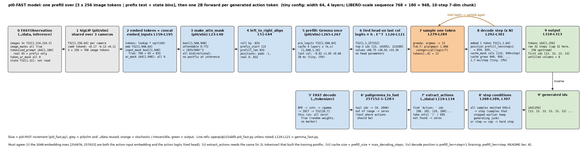
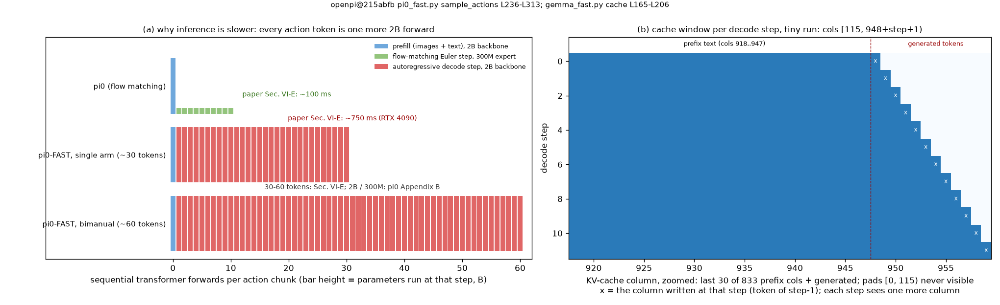

# FAST · model: PaliGemma 不加 action expert, 词嵌入转置当 logits 头, prefix-LM 一次 prefill, 逐 token 自回归解码

**TL;DR.** π0 靠一个 300M 的 action expert 用 flow matching 回归连续动作; π0-FAST 把动作变成了 token (`../tokenizer`, `../data`), 于是 **模型侧什么都不用加**: 就是 PaliGemma 本身, SigLIP 出图像 token, Gemma 2B 走一遍, 输出投影回词表用的是词嵌入矩阵的转置 (tied head, `gemma_fast.py` L120-L121), 参数总数 2,923,335,408, 与 π0 的 VLM 部分逐个相同, 少了 π0 的 expert 与 state / action 投影层 (`pi0_fast.py` L134-L157). 这是 **推理侧付代价** 的 module: 训练侧的 5 倍提速来自离散 CE (论文 Sec. VI-F, → `../train`), 推理侧则从 π0 的 "1 次 prefill + 10 步 Euler 在 300M expert 上" 变成 "1 次 prefill + 30–60 步逐 token 解码, 每步都过 2B 底座", 一个 chunk 约 750 ms 对 π0 的 100 ms (RTX 4090, 论文 Sec. VI-E). 解码用 KV cache: prefix (3 × 256 图像 token + 文本 + state 分箱) 只算一次, 之后每步只送 1 个 token, attention 看 cache 里的全部; 默认 greedy, 双臂任务用 temperature 0.7 (论文 Appendix C); 全 batch 都出 EOS 就停, 上限 256 步 (`pi0_fast.py` L241). 生成的 id 交回 `../data` 的 `extract_actions` 切成动作.

**流程图**: 上排是从 `FASTObservation` 到生成 token 的每一步 (tiny 配置, LIBERO 规模: 7 维 10 步, `max_token_len` 180, 3 个相机, 序列 948), 每步给 shape 与一次真实 tiny 运行的值; 下排是与之镜像的逆过程 (token → 动作) 与两个停止条件.

**第二幅图的论点**: 推理成本的结构. (a) π0 与 π0-FAST 各自要做多少次 "顺序的" transformer 前向, 以及每次前向在多大的模型上: FAST 的 30–60 步全部在 2B 底座上, 这就是 750 ms 的来源; (b) 一次 tiny 解码里每一步的 attention 窗口, 右对齐后 prefix 与已生成 token 在 cache 里连成一段, 每步窗口只多一列.

本 module 复现 π0-FAST 模型侧相对 π0 的增量. 上游: [openpi](https://github.com/Physical-Intelligence/openpi) @ `215abfb217dbac7d5f1273282331b9b1866c0479` (`openpi@215abfb`) 的 `src/openpi/models/pi0_fast.py` (`make_attn_mask` L23-L48, `left_to_right_align` L51-L64, `Pi0FAST.__init__` L134-L157, `embed_inputs` L159-L195, `sample_actions` L236-L313), `src/openpi/models/gemma_fast.py` (`Embedder.decode` L120-L121, 定长 cache L165-L183, `Module.__call__` L302-L418); 论文 FAST [arXiv:2501.09747v1](https://arxiv.org/abs/2501.09747v1) Sec. VI-A, VI-E, Appendix C. PyTorch 重写, 不 import 上游; SigLIP, Gemma 块, RMSNorm, RoPE, attention, `make_attn_mask` 全部 `from pi.pi0.vlm.model import ...`, 本文件只有 tied head, 输入拼接, 右对齐, 解码循环.

## 1. I/O 契约

### 1.1 `Pi0FAST(vit_cfg, gemma_cfg)` (`pi0_fast.py` L134-L157)

| 子模块 | 参数量 (paper 配置) | 来源 |
|---|---|---|
| `img` = `pi.pi0.vlm.SigLIP` So400m/14 | 414,803,696 | `pi0_fast.py` L147-L156; `pi0/vlm` README §6 |
| `llm` = `pi.pi0.vlm.Gemma` 2B, 含 `embedder` | 526,647,296 (词嵌入 257,152 × 2,048) + 1,981,884,416 | `pi0_fast.py` L139-L146; `gemma_fast.py` L109-L113 |
| logits 头 | 0, 复用 `embedder.input_embedding` | `gemma_fast.py` L120-L121 |
| 合计 | 2,923,335,408 | 本仓库 `test_parity.py` 在 meta device 上数 |

没有 action expert, 没有 state / action / time 投影层. `tiny()` 用 `pi0/vlm` 的 tiny SigLIP 与 tiny Gemma (width 64, 4 层), 但词表保持 257,152, 否则 `../data` 给的尾部 id 越界.

### 1.2 `Pi0FAST.embed_inputs(obs)` → `(emb, input_mask, ar_mask)` (`pi0_fast.py` L159-L195)

| 名称 | shape / dtype | 说明 |
|---|---|---|
| 入 `obs` | `FASTObservation` | `../data` 的输出; 只读 `images`, `image_masks`, `tokenized_prompt`, `tokenized_prompt_mask`, `token_ar_mask` (float `state` 不读, L159-L195 没有它) |
| 出 `emb` | float32[B, S, width] | S = 3 × 256 + max_len; 顺序 `base_0_rgb, base_1_rgb, wrist_0_rgb`, 然后整条 token 序列 (`embedder.encode`, 乘 √width) |
| 出 `input_mask` | bool[B, S] | 图像段来自 `image_masks` (FAST 里全 True), token 段来自 `tokenized_prompt_mask` |
| 出 `ar_mask` | int64[B, S] | 图像段 0 (L179), token 段 = `token_ar_mask` (prefix 0, postfix 1) |

与 π0 `embed_prefix` 的差别: 序列里已经含动作 token; `ar_mask` 不再是常量 0, 由数据给出; 图像 mask 全 True.

### 1.3 `Pi0FAST.forward(obs)` → `(pre_logits, input_mask, ar_mask)` (`gemma_fast.py` L344-L413, `return_prelogits=True`)

| 名称 | shape / dtype | 说明 |
|---|---|---|
| 出 `pre_logits` | float32[B, S, width] | `final_norm` 之后、logits 头之前. 整条序列一次前向, mask = `make_attn_mask(input_mask, ar_mask)`, positions = `cumsum(input_mask) − 1` |

有意不返回 logits: [B, 948, 257152] 的 float32 是 1.95 GB (B=2), 上游训练也只对 target 位置做那次矩阵乘 (`pi0_fast.py` L222-L226). 谁需要 logits谁调 1.4. loss 在 `../train`.

### 1.4 `Pi0FAST.logits_head(x)` → logits (`gemma_fast.py` L120-L121)

| 名称 | shape / dtype | 说明 |
|---|---|---|
| 入 `x` | float32[..., width] | 任意位置的 `pre_logits` |
| 出 | float32[..., 257152] | `x @ input_embeddingᵀ`, 没有 bias, 没有单独的权重 |

### 1.5 `left_to_right_align(x, input_mask, attn_mask)` (`pi0_fast.py` L51-L64)

| 名称 | shape / dtype | 说明 |
|---|---|---|
| 入 / 出 `x` | float32[B, S, width] | 逐样本 `roll(−seqlen)`: 真实 token 移到末尾, 前面是 pad |
| 入 / 出 `input_mask` | bool[B, S] | 同样滚动 |
| 入 / 出 `attn_mask` | bool[B, S, S] | 行列一起滚动 |

只用于推理. 目的是让 **最后一列** 对每个样本都是最后一个真实 token (`last_logit = pre_logits[:, −1:]`, L270), 并让每一步新 token 写进 cache 的下标对整个 batch 相同 (`gemma_fast.py` L178 用 `idx[0]`). 因为 `make_attn_mask` 只看 `cumsum` 与 `input_mask`, 滚动不改变任何 attention 关系 (测试 `right_align_is_a_permutation`).

### 1.6 `Pi0FAST.sample_actions(obs, *, max_decoding_steps=256, temperature=0.0, generator=None)` → `(tokens, n_steps)` (`pi0_fast.py` L236-L313)

| 名称 | shape / dtype | 说明 |
|---|---|---|
| 入 `obs` | `FASTObservation` | 推理模式: `tokenize(prompt, state, None)`, token 段全是 prefix |
| 入 `max_decoding_steps` | int, 默认 256 | cache 大小 = prefill_size + 256 (L241, L263) |
| 入 `temperature` | float, 默认 0 | 0 → argmax (L282); > 0 → `categorical(logit / T)` (L281); 论文: greedy, 双臂 0.7 |
| 入 `generator` | `torch.Generator` 或 None | 采样的随机源 (上游 `rng`, L278) |
| 出 `tokens` | int64[B, max_decoding_steps] | 生成的 PaliGemma id, 第 0 列是 prefix 之后的第一个 token; 停止后剩余列为 0 (L271) |
| 出 `n_steps` | int | 实际执行的解码步数 (上游不返回; `../infer` 用来算延时) |

循环 (L273-L307): 从 `last_logit` 采一个 token → 写进 `tokens[:, step]` → 若全 batch 都已出 EOS(1) 则停 (L288-L289) → 否则把这个 token 嵌入、以 position `prefill_len + step + 1` (L293) 和 "看 cache 里 `[prefix_start, prefill_size + step + 1)` 这些列" 的 mask (L294-L298) 前向一步, 得到下一个 `last_logit`. 某个样本出了 EOS 之后仍会继续生成直到全 batch 都出 EOS 或到上限, 那些 token 是垃圾, `extract_actions` 在 `|` 处截断所以无害.

### 1.7 `Pi0FAST.decode_step(token, position, cache, cache_mask)` → `(logits, cache)`

单步: `token` int64[B, 1] → 嵌入 → `Gemma.forward` 带 cache → `logits_head` → float32[B, 1, 257152]. `cache_mask` bool[B, 1, S_cache + 1] 是这一个 query 能看的列. 1.6 的循环体, 单独暴露是为了测试 "逐步 cache 解码 == 整条序列前向" 时能自己指定 position.

## 2. 复现范围

| 有代码 | 只有事实 (背景) |
|---|---|
| 1.1–1.7 全部; tied head; prefix-LM mask 与图像 / token 拼接; 右对齐; prefill + 逐 token 解码; greedy / temperature; EOS 早停 | bf16 权重与 cache (`Pi0FASTConfig.dtype`, L78): 本仓库 float32 |
| 参数量对齐 | JAX 的定长 cache 与 `lax.while_loop` jit (§3, §8); `nn.scan` / remat (`gemma_fast.py` L373-L403) |
| | LoRA 变体 `gemma_2b_lora` (`gemma_fast.py` L53-L72) → `../train` |

## 3. 推理侧: 一次 prefill, 然后逐 token

1. `embed_inputs` → [B, 948, W]. 图像 768 个 token 在前, 之后是 `[BOS] Task: …, State: …;\n` 的 62 个 token (tiny 例子), 其余 pad.
2. `make_attn_mask`: `ar_mask` 全 0 (推理时没有 postfix) → 所有真实 token 两两可见, pad 行列全 False.
3. `left_to_right_align`: 118 个 pad 滚到前面, `prefix_start = 118`, `prefill_len = 830`.
4. prefill: `Gemma.forward(emb, positions, mask)` 一次; positions = `cumsum(input_mask) − 1`, 真实 token 0…829, pad 的 position 无所谓 (被 mask). 得到 `pre_logits` [B, 948, W] 与每层 (k, v) [B, 948, 1, 16]; 最后一列的 `logits_head` 是第一个动作 token 的分布.
5. 循环: 采样 → 记录 → EOS 检查 → 单步前向. 单步的 mask 是 [B, 1, S_cache + 1]: 列 ≥ `prefix_start` 为 True (上游 L294-L298 的两个不等式; 本仓库 cache 是随步增长的, 上界自动满足, 见 §8).
6. 返回 `tokens` [B, 256]; `../data.extract_actions` 找 `Action: ` … `|` 切出 FAST id → `../tokenizer.decode` → [H, D]; 找不到就全零.

**cache 的两种实现.** 上游 (`gemma_fast.py` L165-L183) 在 prefill 时就把 cache 补零到 `prefill_size + 256`, 之后每步 `dynamic_update_slice` 写一列; 这是为了 jit 需要静态 shape. 本仓库复用 `pi.pi0.vlm.attend` 的 "cat 上去" 的增长 cache: 数学相同 (被 mask 的列对 softmax 没有贡献), 内存按需增长, 代价是每步 cat 一次. 测试 `cached_decode_matches_full_forward` 验证增长 cache 的逐步解码与整条序列一次前向给出相同的 `pre_logits` (1e-4).

**position 的一个偏差.** 训练时 (`../train`, `pi0_fast.py` L205-L220) 整条序列 positions = `cumsum(mask) − 1`, 第一个动作 token 的 position 是 `prefill_len`. 推理时上游 L293 给第 `step` 个生成 token 的 position 是 `prefill_len + step + 1`, 比训练多 1. RoPE 只看相对位置, 效果是 "生成段与 prefix 的距离多 1", 生成 token 之间的相对距离不变. 上游没有说明; 本仓库如实复现 (`sample_actions` 用 `+ 1`), 并在 `decode_step` 上留出接口让测试用训练一致的 position 验证等价性. 记入 §8.

**延时.** 论文 Sec. VI-E: 750 ms / chunk 对 π0 100 ms (RTX 4090); 原因是 30–60 步顺序解码 × 2B 底座 对 10 步 Euler × 300M expert. tiny 配置 CPU 的每步耗时由 `main()` 打印, 只用于看结构, 不是论文数字. 论文 Sec. VII 把它列为 "current limitation", 后续 π0.5 / KI 的做法是 FAST 只留在训练目标里, 推理换回 flow-matching expert (`../tokenizer` README TL;DR).

## 4. 训练侧

模型侧只提供 `forward` 的 `pre_logits`; CE 只在 postfix、错一位、按有效 token 数归一, 以及 "只对 target 位置做 logits 矩阵乘" (`pi0_fast.py` L197-L233) 在 `../train`. LoRA 变体 (attn + ffn, rank 16) 也在 `../train`. 训练时不右对齐, 不用 cache.

## 5. 评测

模型层没有可评的数; 端到端接口 `infer(raw) → actions` 与 LIBERO / DROID 的评测循环在 `../infer` (`eval.py`). 本 module 能检查的是自洽性 (§1.7 的等价性测试) 与参数量.

## 6. cost 信息

| 项目 | 值 | 来源 |
|---|---|---|
| 参数 | 2,923,335,408 (SigLIP 414,803,696 + 词嵌入 526,647,296 + Gemma 1,981,884,416); 新增 0 | §1.1 |
| 序列长 (prefill) | 768 + 250 = 1018 (base) / 768 + 180 = 948 (微调); 真实 token 数 = 768 + prefix 长 | `pi0_fast.py` L84; `config.py` L711 |
| 解码步数 | 单臂约 30, 双臂约 60 (每 chunk 的 action token 数 + `Action: `, `|`, EOS); 上限 256 | 论文 Sec. VI-E, Table I; `pi0_fast.py` L241 |
| 每步计算 | 1 个 token 过 2B 底座 18 层, attention 看 ≤ 1018 + 256 列 | `gemma_fast.py` L302-L418 |
| cache | 18 层 × (k, v) × [B, prefill_size + 256, 1, 256], bf16 | `gemma_fast.py` L165-L173, `Pi0FASTConfig.dtype` |
| 延时 | ≈ 750 ms / chunk (π0 ≈ 100 ms), RTX 4090 | 论文 Sec. VI-E |
| 延时的分解 (prefill vs 每步) | 未披露 | gap ledger |
| 采样温度 | 0 (greedy); 双臂任务 0.7 | 论文 Appendix C |

## 7. reference 映射表

| 本仓库 | 上游 |
|---|---|
| `Pi0FAST.__init__`, `tiny()` / `paper()` | `pi0_fast.py` L134-L157; `Pi0FASTConfig` L76-L98 |
| `Pi0FAST.embed_inputs` | `pi0_fast.py` L159-L195 |
| `Pi0FAST.forward` | `gemma_fast.py` L344-L413 (`return_prelogits=True`), `pi0_fast.py` L205-L220 |
| `Pi0FAST.logits_head` | `gemma_fast.py` L120-L121, L415-L416 |
| `left_to_right_align` | `pi0_fast.py` L51-L64 |
| `Pi0FAST.sample_actions` | `pi0_fast.py` L236-L313 |
| `Pi0FAST.decode_step` | `pi0_fast.py` L292-L301; `gemma_fast.py` L175-L183, L199-L206 |
| `MAX_DECODING_STEPS`, `EOS_ID` | `pi0_fast.py` L241, L20 |
| 复用: `SigLIP`, `Gemma`, `make_attn_mask`, `attend`, RoPE, RMSNorm | `pi.pi0.vlm.model` 及其 README §7 |

## 8. gap ledger

| 未披露 / 未复现 | 说明 |
|---|---|
| 解码时 position 多 1 | `pi0_fast.py` L293 `prefill_len + step + 1`, 训练是 `prefill_len + step`; 上游无说明. 本仓库照抄, 测试 `upstream_decode_positions_are_shifted_by_one` 固定这个事实 |
| 定长 cache vs 增长 cache | 上游为 jit 用 `prefill_size + 256` 的定长 cache 与 `idx[0]` 批统一下标; 本仓库用增长 cache, 无需右对齐也能正确, 但为对齐上游仍做右对齐 |
| bf16 | 上游权重、激活、cache 都是 bf16 (`Pi0FASTConfig.dtype`); 本仓库 float32, 不比较数值 |
| 延时分解 | 论文只给 750 ms 总数, 没有 prefill / 每步 / 图像编码的分解, 也没有 batch 1 之外的数 |
| `max_decoding_steps` 256 的依据 | 只在函数默认值里, 无说明; 单臂 30 / 双臂 60 的实际步数远小于它 |
| 温度 0.7 的选择 | 论文 Appendix C 只说 "found helpful" 让双臂策略离开初始位置; 无扫描 |
| EOS 之后的样本 | 上游继续为已出 EOS 的样本生成直到全 batch 停, 生成内容未定义; 依赖 `extract_actions` 截断 |
| 一个样本超过 256 步 | 上游到上限硬停, 不加 EOS; `extract_actions` 找不到 `|` 时取到序列末尾 (`../data` §3) |
| `nn.scan` / remat / LoRA 结构 | 与数学无关; LoRA 的参数量与冻结规则 → `../train` |

## 9. 机器人概念表

**tied logits head (词嵌入当输出层)**
- shape: `input_embedding` [257152, 2048] 既做 `encode` (查表 × √2048) 也做 `decode` (x @ Eᵀ), 输出 [.., 257152].
- 含义: 一个位置的 hidden 与每个词向量的内积就是该词的 logit; 动作 token 的 "输出头" 就是词表尾部那 2048 行.
- 来源: Gemma 的设计 (`gemma_fast.py` L120-L121), PaliGemma 沿用; π0-FAST 没有为动作单独建头 (论文 Sec. II "no modifications").
- 为什么: 不加参数; 预训练的 lm head 直接拿来预测动作 token, 与 "动作是另一种语言" 的立场一致. 代价是 logits 矩阵乘是 seq × 257152 的稠密层, 训练时只对 target 位置算 (L222-L226).
- 系统联系: `../tokenizer` 决定这 2048 行编码什么; `../train` 的 CE 更新这些行的 embedding.

**prefill / decode (KV cache)**
- shape: prefill 一次前向 [B, S, W], 存每层 (k, v) [B, S, K, H]; decode 每步输入 [B, 1, W], attention 的 key 是 cache 的全部列.
- 含义: 自回归生成时前面的 token 不变, 它们的 k / v 也不变, 算一次存起来; 每步新增一列.
- 来源: 标准 LLM 推理; openpi `gemma_fast.py` L165-L206 定长实现.
- 为什么: 没有 cache 每步要重算整个 prefix (1018 列 × 18 层), 30–60 步就是 30–60 倍; 有 cache 每步是 1 个 query 对 ≤ 1274 列.
- 系统联系: 这 30–60 次 "顺序的" 2B 前向就是 750 ms 的来源; π0 的 expert 只做 10 步且每步 300M.

**prefix-LM 三块 mask [images | prompt + state | actions]**
- shape: bool[B, S, S], 由 `ar_mask` 的 cumsum 决定: 图像与 prefix 文本 cumsum 0, 每个动作 token 各加 1.
- 含义: 图像和文本双向可见 (它们是条件), 动作 token 只看前面的 (它们是要预测的).
- 来源: PaliGemma 的 prefix-LM (`make_attn_mask`, big_vision); π0 的三块是 [prefix | state | actions 块内双向], FAST 的 postfix 是逐 token 因果.
- 为什么: 训练时整条序列一次前向, 每个动作位置看到的信息与推理时逐 token 生成一致, teacher forcing 才成立.
- 系统联系: `../data` 产出 `ar_mask`; 训练 (`../train`) 与推理用同一个 `make_attn_mask`.

**greedy vs temperature 采样**
- shape: 每步从 [B, 257152] 的 logits 取一个 id.
- 含义: greedy 取 argmax, 确定性; temperature T 下按 softmax(logit / T) 采样, T 越小越接近 greedy.
- 来源: 论文 Appendix C: 默认 greedy, 双臂任务 T = 0.7, 因为数据里开头有 "悬停在初始位置" 的静止 chunk, greedy 会一直选 "不动".
- 为什么: 这是离散策略特有的旋钮, π0 的对应物是 flow matching 的初始噪声; 采样也可能落到非动作 id, 由 `extract_actions` 的零回退兜底.
- 系统联系: `../infer` 把 T 作为部署参数; 评测时 greedy 的结果可复现, 采样的不可.

**右对齐 (left-to-right align)**
- shape: [B, S] 的序列逐样本 roll, pad 到前面.
- 含义: batch 里各样本 prefix 长度不同, 右对齐后 "最后一列" 与 "下一个 cache 下标" 对全 batch 一致.
- 来源: `pi0_fast.py` L51-L64, L253-L259; 定长 cache 的 `idx[0]` 依赖它.
- 为什么: jit 里不能按样本取不同下标; 右对齐把可变长度问题变成常量下标. positions 仍从真实 token 数起算, RoPE 不受影响.
- 系统联系: 训练不需要 (左对齐 + mask 足够); 只在 `sample_actions` 里做.
