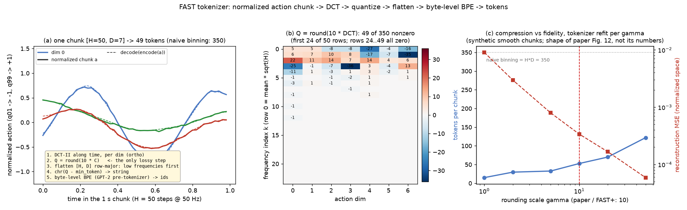

# FAST · tokenizer: quantile 归一化, DCT-II, γ 缩放取整, 低频优先展平, 字节级 BPE

**TL;DR.** FAST 解决的是 **训练侧** 的问题: 想让 VLM 像生成文字一样用 next-token prediction 输出动作, 就得先把连续的 action chunk 离散化; 以前的做法是每维每步分 256 箱, 在高频数据 (20–50 Hz) 上相邻 token 几乎相同, 模型学会 "复制上一个 token" 就能把 loss 压低, 结果是完全学不会灵巧任务 (论文 Sec. IV 的 toy 实验, Fig. 6 的 naive 基线为 0). 做法: 先把 1 秒的 chunk 沿时间轴做 DCT, 系数乘 γ = 10 取整, 稀疏矩阵按低频优先展平, 再用字节级 BPE 把长零串压掉, 一个 chunk 变成 30–60 个高信息量的 token (论文 Sec. V, Algorithm 1). 收益在训练: 与 π0 的 flow matching 相比, 大数据集上 3 倍更少的步数达到同样性能 (Fig. 9), 通才模型总 GPU 时少 5 倍 (Sec. VI-F). 代价在推理: 要逐个解码这 30–60 个 token, 每步跑完整的 2B 底座, 一个 chunk 约 750 ms 对比 π0 的 100 ms (RTX 4090, Sec. VI-E). 所以从 π0.5 起 (arXiv:2504.16054 Fig. 3), FAST token 只在训练时作为底座的监督信号, 推理仍走 flow-matching expert.

**首图的论点**: 一个 50 × 7 = 350 个数的 chunk, DCT 后只剩 49 个非零整数 (b), BPE 压成 49 个 token, 解码曲线与原曲线几乎重合 (a); γ 是唯一的旋钮, 调大它 token 变多、误差变小 (c).

本 module 复现 FAST 动作分词器本身: 把一个连续的 action chunk `[H, D]` 变成一串离散整数 token, 以及反过来. 它没有神经网络, 只有五步可逆 (最后一步有损) 的信号处理. 它是 π0-FAST 相对 π0 的第一个增量: π0 的 flow matching 直接回归连续动作, π0-FAST 让 VLM 像生成文字一样逐个生成这些 token (→ `../data`, `../model`).

上游: tokenizer 源码在 HuggingFace [physical-intelligence/fast](https://huggingface.co/physical-intelligence/fast) 的 `processing_action_tokenizer.py` (`UniversalActionProcessor`, 150 行, Apache-2.0; 2026-09-13 访问, 下文记作 `fast_hf`), 同仓库 `processor_config.json` / `tokenizer.json` 是发布的通用分词器 FAST+ 的权重; openpi@215abfb `src/openpi/models/tokenizer.py` L51-L140 是它在 π0-FAST 里的调用方. 论文 [arXiv:2501.09747v1](https://arxiv.org/abs/2501.09747v1) Sec. V, Algorithm 1, Fig. 4, Appendix A–B. NumPy 重写, 不 import 上游, 不依赖 scipy / tokenizers.



## 1. I/O 契约

### 1.1 `FASTTokenizer.__call__(chunk)` — 编码 (`fast_hf` L43-L58)

| 名称 | shape / dtype | 取值 | 说明 |
|---|---|---|---|
| 入 `chunk` | float32[B, H, D] 或 [H, D] | 约 [−1, 1] | 已经 quantile 归一化的 action chunk. H = 1 秒内的步数 (50 Hz → 50, 20 Hz → 20, 15 Hz → 15), D = 该机器人 action 维数 (FAST+ 训练时统一 pad 到 32) |
| 出 | `list[list[int]]`, 长 B | [0, vocab_size) | 每个 chunk 一串变长 token. FAST+ 上单臂约 30 个 / chunk, 双臂约 60 个 (论文 Table I) |

编码链 (Algorithm 1): `C = DCT_II(chunk, axis=time, ortho)` → `Q = round(γ · C)` → `flatten(Q)` 按 [H, D] 行主序展开 (同一频率的所有维度相邻, 低频在前) → 每个整数减 `min_token` 后 `chr()` 成一个字符 → 字节级 BPE 编码.

### 1.2 `FASTTokenizer.decode(tokens, time_horizon, action_dim)` — 解码 (`fast_hf` L60-L96)

| 名称 | shape / dtype | 说明 |
|---|---|---|
| 入 `tokens` | `list[list[int]]` | 模型生成的 action token (已经从 PaliGemma 词表映射回 [0, vocab_size), 见 `../data`) |
| 入 `time_horizon`, `action_dim` | int | **必须外部给**: token 里不含 shape 信息. 上游用三级回退: 调用参数 → 构造参数 → 上一次 encode 缓存 |
| 出 | float32[B, H, D] | 归一化空间里的 action chunk. 之后交 `unnormalize_quantile` (1.4) 和 `pi.pi0.data.to_absolute_actions` |

解码链: BPE 解码回字符串 → `ord()` 加 `min_token` 回整数 → reshape 到 [H, D] → `/ γ` → 逆 DCT. **上游行为**: 任何一步失败 (BPE 解出非法字节, 整数个数不是 H·D) 就打印错误并返回全零 chunk (`fast_hf` L91-L94); 本仓库同, 由 `on_error="zeros"` 控制, 测试里用 `"raise"`.

### 1.3 `FASTTokenizer.fit(chunks, scale=10, vocab_size=1024)` — 训练 BPE (`fast_hf` L99-L150)

| 名称 | 说明 |
|---|---|
| 入 `chunks` | `list[np.ndarray]`, 每个 [H_i, D], 长度可以不同 |
| 入 `scale` | γ, 默认 10 (论文 Sec. V-B; `fast_hf` L20, L102) |
| 入 `vocab_size` | BPE 词表上限, 含初始字母表; 默认 1024 (论文 Sec. V-B 单数据集设置; `fast_hf` L21, L103). 发布的 FAST+ 是 2048 (`processor_config.json`) |
| 出 | 新的 `FASTTokenizer`: `min_token` = 全部量化系数的最小值 (FAST+ 为 −354), BPE 词表与 merge 表 |

### 1.4 归一化: `QuantileStats`, `normalize_quantile`, `unnormalize_quantile`

FAST 与 π0 不同, 用 1% / 99% 分位数把每维映射到 [−1, 1] (论文 Sec. V-B; openpi `config.py` L187 `use_quantile_norm = model_type != PI0`):

| 方向 | 公式 | 上游 |
|---|---|---|
| 归一化 | `(x − q01) / (q99 − q01 + 1e-6) · 2 − 1` | `transforms.py` L141-L145 |
| 逆 | `(x + 1) / 2 · (q99 − q01 + 1e-6) + q01`; 超出统计量维数的 (pad) 维原样通过 | `transforms.py` L175-L181 |

`QuantileStats(q01, q99)` 各 float[d], 由训练集统计, 与 `pi.pi0.data.NormStats` 平行. 归一化不 clip, 所以 1% 以外的离群值会落在 [−1, 1] 之外, 这正是用分位数而非 min/max 的原因 (论文 Sec. V-B "robust to outlier actions").

### 1.5 底层函数

| 函数 | I/O | 说明 |
|---|---|---|
| `dct_matrix(n)` | → float64[n, n] | 正交 DCT-II 矩阵 C, `C @ x` 等于 `scipy.fft.dct(x, norm="ortho")`; 逆变换是 `C.T @` |
| `dct(x, axis)`, `idct(x, axis)` | 同 shape | 沿任意轴 |
| `quantize(coeff, scale)` | float → int64 | `round(scale · coeff)`, numpy 的 round-half-to-even, 与 `np.around` 一致 |
| `pretokenize(text)` | str → list[str] | GPT-2 正则的等价切分 (见 4.2) |
| `BPE.encode / decode`, `BPE.train` | | 字节级 BPE, 词表格式与 HF `tokenizer.json` 相同, 可以直接加载 FAST+ 的 merge 表 |

## 2. 复现范围

| 有代码 | 只有事实 (背景) |
|---|---|
| 1.1–1.5 的全部步骤, 含 BPE 训练 | FAST+ 的训练混合 (约 1M 个 1 秒 chunk; 论文 Appendix A 表, 见 4.4) |
| 加载发布的 FAST+ 词表 (`tokenizer.json`, 需自行下载到 `.upstream/fast_hf/`) | Table I 压缩比, Table III 泛化数据集, Fig. 8 / Fig. 12 曲线 (见 5) |
| 压缩率 / 重建误差的评测循环 (`eval.py`) | naive 分箱与 FSQ 基线, OpenVLA + FAST 消融 (只陈述结论, 见 4.5) |

## 3. 推理侧: 从 token 回到动作

推理时 tokenizer 只跑 `decode`: 模型输出的 action token 段 (`../data` 负责从 `Action: … |` 里切出来并映射回 [0, vocab_size)) → 本 module `decode` → `unnormalize_quantile` → `pi.pi0.data.to_absolute_actions` → 截回原生维度. 与 π0 的区别只在第一步: π0 的网络直接给出连续的 `[50, 32]`, FAST 从 30–60 个整数重建.

延时: DCT / BPE 本身是微秒级, 可忽略. 真正的代价在模型侧: 每个 token 要跑一次 2B 的自回归步, 论文 Sec. VI-E 给出一整个 chunk 约 750 ms (RTX 4090) 对比 π0 的 100 ms (→ `../model`, `../infer`).

有损点只有一个: `round(γ · C)`. γ = 10 意味着每个 DCT 系数被量化到 0.1 的格点, 重建误差上界为 0.05 / 系数 (归一化空间). 更大的 γ 更精确但 token 更多 (论文 Appendix B, Fig. 12; 本 module `eval.py` 复现这条曲线的形状).

## 4. 训练侧: tokenizer 怎么训

### 4.1 为什么先 DCT (论文 Sec. IV–V 的转述)

高频 chunk 里相邻动作几乎相同, 逐步分箱后 token 序列高度冗余, next-token 的边际信息趋近 0, 模型学会 "复制上一个 token" 就能得到低 loss (论文 Sec. IV 的 toy 实验: 采样率从 25 升到 800, 分箱模型退化成复制第一个动作). DCT 把时间轴上的冗余变成频域的稀疏: 低频几个系数描述整体形状, 高频系数在平滑信号上几乎全是 0, 量化后被 BPE 一次吞掉.

### 4.2 展平顺序与字节级 BPE (`fast_hf` L52-L58, L125-L150)

- **展平**: `Q.flatten()` 对 [H, D] 按行主序展开 = 第 0 个频率的 D 个维度, 然后第 1 个频率的 D 个维度, …. 论文 Sec. V-B 称之为 column-first / 低频优先, 并说明这样自回归时先生成决定整体形状的分量, rollout 更稳.
- **整数 → 字符**: `chr(q − min_token)`. 因此字母表大小 = `max_token − min_token + 1`; FAST+ 的 `min_token = −354`, 词表里实际出现的整数在 [−354, 153].
- **BPE 是字节级的**: 上游用 `tokenizers.ByteLevelBPETokenizer()` 默认配置, `tokenizer.json` 证实 `pre_tokenizer = ByteLevel(use_regex=true)`. 含义: (1) 字符先 UTF-8 编码成字节, 每个字节映到一个可打印 unicode 字符 (GPT-2 的 `bytes_to_unicode`); (2) 字符串先按 GPT-2 正则 `'s|'t|'re|'ve|'m|'ll|'d| ?\p{L}+| ?\p{N}+| ?[^\s\p{L}\p{N}]+|\s+(?!\S)|\s+` 切成 "词", merge 不跨词. 对量化系数来说这条正则完全是副作用 (它把 chr(48..57) "数字" 和 chr(65..90) "字母" 之类按 unicode 类别分段), 但它真实存在, 改变 token 边界, 属于 "不能省". 本仓库用 `unicodedata` 类别等价实现 (`pretokenize`), 不引入 `regex` 包.
- **结果**: FAST+ 词表 2048 = 256 个字节字符 + 1792 条 merge; 前几条 merge 是 0 系数 (chr(354) = 两个字节) 的成倍合并, 最长的一个 token 是 1593 个连续 0. 这就是 BPE 在这里的作用: 把稀疏矩阵里的长零串压成一个 token.
- **BPE 训练参数** (`fast_hf` L134-L145): `vocab_size` (含字母表, 是上限: 当最高频对的频次 < `min_frequency` 时提前停止, `eval.py` 里 γ = 1 只训出 419 项), `min_frequency=2`, `initial_alphabet` = 整个整数范围 (但见 gap ledger), `max_token_length=10000` (等于不限), 无 special token. 本仓库 `BPE.train` 实现标准的 "统计相邻对频次 → 合并最高频对" 循环; 与 HF 的并列频次打破方式不保证一致, 见 gap ledger.

### 4.3 FAST 的两个超参与它们的默认值

| 超参 | 论文 (单数据集) | FAST+ 发布物 | 来源 |
|---|---|---|---|
| γ (scale) | 10 | 10 | 论文 Sec. V-B; `processor_config.json` |
| BPE 词表 | 1024 | 2048 | 同上 |
| `min_token` | 由数据定 | −354 | `processor_config.json` |
| chunk 长度 | 1 秒 | 1 秒 (训练时) | 论文 Sec. V-C; HF README |
| action 维度 | 原生 | pad 到 32 | 论文 Appendix A |

论文说两个超参 "不敏感", 所有单数据集实验都用 γ = 10, 词表 1024.

### 4.4 FAST+ 的训练数据 (背景, 论文 Appendix A)

约 1M 个 1 秒 chunk, 主要来自 π0 的预训练混合, 每个内部数据集给出三种 action 参数化 (关节空间, 末端世界系, 末端相机系), 外加 ALOHA 5.0%, DROID 11.2%, Bridge V2 5.0%, OpenX 3.8%; 全部 pad 到 32 维. 权重最大的是 UR5 single (关节, 10.3%) 与 DROID. 控制频率 5–50 Hz 混合. 训练只需几分钟 (论文 Sec. V-C).

### 4.5 基线与消融 (背景)

- naive 分箱 (RT-2 / OpenVLA 式, 每维每步 256 箱): 在 20 Hz bussing 和 50 Hz 折衣上完全学不出 (Fig. 6).
- FSQ (学习式压缩): 与 FAST 相当或稍差, 且要单独训练网络 (Fig. 6, Fig. 12). openpi 里有 `FSQTokenizer` 但需要 checkpoint, 本仓库不复现.
- 去掉 BPE: 仍好于 naive, 但大量重复 0 token 稀释学习信号并拖慢推理 (Sec. VI-D).
- FAST+ 与逐数据集训练的 FAST 性能相当 (Fig. 6); OpenVLA 换上 FAST+ 后能学 50 Hz 折衣 (Sec. VI-D).

## 5. 评测

tokenizer 的评测不是机器人任务, 是两条曲线 (论文 Appendix B, Fig. 12; Table I):

| 指标 | 定义 | 聚合 |
|---|---|---|
| 压缩率 | 每个 chunk 的 token 数; naive 分箱是 H · D | 对数据集取平均; Table I 报告 naive / FAST 的比值 |
| 重建误差 | `decode(encode(a))` 与 a 的 MSE (归一化空间) | 对数据集取平均 |

`eval.py` 在合成的平滑 chunk 上扫 γ ∈ {1, 2, 5, 10, 20, 50}, 每个 γ 重新 `fit` 并报告两列; 若 `.upstream/fast_hf/tokenizer.json` 存在, 再用 FAST+ 词表评一遍. 论文 Table I 的参考值 (γ = 10, 各自数据集训练): BridgeV2 7 维 5 Hz 20 token (naive 35), DROID 7 维 15 Hz 29 (105), Bussing 7 维 20 Hz 28 (140), Shirt Fold 14 维 50 Hz 53 (700).

```
uv run pytest pi/fast/tokenizer -q          # 对齐检查, CPU 数秒
uv run python -m pi.fast.tokenizer.tokenizer   # 逐步打印一个 chunk 的编码 / 解码
uv run python -m pi.fast.tokenizer.eval        # 压缩率 / 重建误差表
```

对齐到什么程度: DCT 与解析公式逐值一致; 量化 / 展平 / 字符映射与 `fast_hf` 逐行同构; BPE 编码在给定 merge 表下与 HF 的贪心 merge 算法一致 (加载 FAST+ 词表后 round-trip 精确); BPE 训练只保证算法同族, 不保证同一数据训出同一词表. 不复现论文数字.

## 6. cost 信息

| 项目 | 值 | 来源 |
|---|---|---|
| tokenizer 参数 | 无神经网络; FAST+ 词表 2048 项 (`tokenizer.json` 687 KB) | HF 仓库 |
| BPE 训练时间 | "几秒到几分钟" | 论文 Sec. V-C; HF README |
| FAST+ 训练数据 | 约 1M 个 1 秒 chunk | 论文 Sec. V-C, Appendix A |
| 每 chunk token 数 | 单臂约 30, 双臂约 60 | 论文 Table I, Sec. VI-B |
| 编码 / 解码延时 | 未披露 (微秒级信号处理) | gap ledger |
| 对策略推理的影响 | 约 750 ms / chunk (RTX 4090) vs π0 100 ms | 论文 Sec. VI-E |

## 7. reference 映射表

| 本仓库 | 上游 |
|---|---|
| `QuantileStats`, `normalize_quantile`, `unnormalize_quantile` | openpi@215abfb `transforms.py` L141-L145, L175-L181; `config.py` L187; 论文 Sec. V-B |
| `dct_matrix`, `dct`, `idct` | `fast_hf` L5-L6 (`scipy.fft.dct/idct`, `norm="ortho"`), L52, L95; 论文 Sec. V-A, Algorithm 1 |
| `quantize` | `fast_hf` L53 (`np.around(dct_coeff * scale)`); Algorithm 1 |
| `ints_to_text`, `text_to_ints` | `fast_hf` L56 (`chr`, clamp 0), L82 (`ord`), L83 (`reshape(-1, action_dim)`); `min_token` 偏移 |
| `pretokenize`, `bytes_to_unicode` | `tokenizers.ByteLevelBPETokenizer()` 默认 pre-tokenizer; FAST+ `tokenizer.json` `pre_tokenizer` 字段 |
| `BPE.train` | `fast_hf` L134-L149 (`ByteLevelBPETokenizer`, `BpeTrainer` 参数, `train_from_iterator`) |
| `BPE.encode`, `BPE.decode`, `BPE.from_hf_json` | HF `tokenizers` BPE 模型语义; `tokenizer.json` 的 `vocab` / `merges` |
| `FASTTokenizer.__call__` | `fast_hf` L43-L58 |
| `FASTTokenizer.decode` | `fast_hf` L60-L96; 零回退 L91-L94; H / D 三级回退 L67-L68 |
| `FASTTokenizer.fit` | `fast_hf` L99-L150; `min_token` L112-L114; 字母表检查 L116-L123 |
| 展平顺序 | `fast_hf` L56 `elem.flatten()`; 论文 Sec. V-B |

## 8. gap ledger

| 未披露 / 未复现 | 说明 |
|---|---|
| BPE 训练的并列打破 | HF `BpeTrainer` 在频次相同的对之间的顺序未文档化; 本仓库按 (频次, 首次出现顺序). 同一数据训出的词表可能不同, 只保证算法同族 |
| `\p{L}`, `\p{N}`, `\s` 的精确字符集 | Rust regex 的 unicode 表与 Python `unicodedata` 版本可能有细微差异; 量化系数只用到 chr(0..约 1000), 本仓库在此范围内按 unicode 类别实现 |
| FAST+ 的 `max_token` | 只给了 `min_token = −354`; 词表里出现的最大整数是 153, 字母表上界未披露 |
| `initial_alphabet` 与发布物对不上 | `fit()` 把 `chr(0..max−min)` 传给 trainer, 但发布的 `tokenizer.json` 单字符 token 恰好是 256 个字节字符 (2048 = 256 + 1792 条 merge), 没有额外条目. 本仓库 `BPE.train` 默认按发布物用 256 字节字母表; 传入的 `initial_alphabet` 参数保留 |
| 编码 / 解码延时 | 未披露 |
| FAST+ 训练数据的 chunk 具体切法 (步长, 是否重叠) | 未披露 |
| 论文 Fig. 12 的具体数值 | 只有曲线, 未给表; `eval.py` 只复现形状 |
| 数值对齐 | DCT 逐值对齐解析式; BPE 编码在给定词表下精确; 其他只对齐 shape (仓库原则 1) |

## 9. 机器人概念表

**1 秒 action chunk**
- shape: float32[H, D], H = 控制频率 × 1 s (50 Hz 机器人 50 行, 15 Hz DROID 15 行), D = 该机器人 action 维数 (FAST+ 训练时 pad 到 32).
- 物理含义: 未来 1 秒内每个控制周期要发给机器人的目标 (关节角 / 末端位姿 / 夹爪), 归一化后约在 [−1, 1].
- 数据来源: 遥操作示教里以固定频率记录的动作序列, 训练时按窗口切出 (见 `pi.pi0.data.extract_action_chunk`).
- 为什么模型需要: FAST 的整个前提是 chunk 内相邻动作高度相关, 对整段做 DCT 才有压缩; 单步动作没有时间轴, DCT 退化为恒等.
- 硬件联系: H 直接由控制器频率决定, 所以同一个 FAST+ 对 5 Hz 和 50 Hz 的机器人给出不同长度的输入却相近的 token 数 (论文 Sec. VI-B "约 30 token / 臂").

**quantile 归一化**
- shape: 每维两个标量 q01, q99, 由训练集统计.
- 物理含义: 把该维 1%–99% 的取值范围线性映到 [−1, 1]; 单位随之消失, 不同机器人的关节角 (rad) 与夹爪开合 (m 或 0–1) 落到同一尺度.
- 数据来源: 对整个训练集每维取分位数; openpi 存在 `norm_stats.json` 的 `q01` / `q99` 字段.
- 为什么模型需要: DCT 系数的量化格点 0.1 是绝对值, 数据不先归一化, 大量程的维会产生巨大整数、小量程的维全被量化成 0.
- 硬件联系: 分位数而非 min / max, 是因为遥操作数据里偶有传感器毛刺或操作者甩臂, 用 min / max 会把正常范围压得很小.

**DCT 系数 (频域动作)**
- shape: 与 chunk 同为 [H, D], 第 k 行是第 k 个频率分量, 第 0 行 = 该维在 1 秒内的均值 × √H.
- 物理含义: 低频行描述 1 秒内的整体走向, 高频行描述抖动与突变; 平滑的示教动作量化后高频行几乎全 0.
- 为什么模型需要: 让自回归模型先生成 "整体去哪", 再生成 "细节怎么抖", 而不是逐步复制上一步.
- 硬件联系: 高频行对应控制器能否响应, 50 Hz 机器人 chunk 有 50 行频率, 最高频率 25 Hz.
