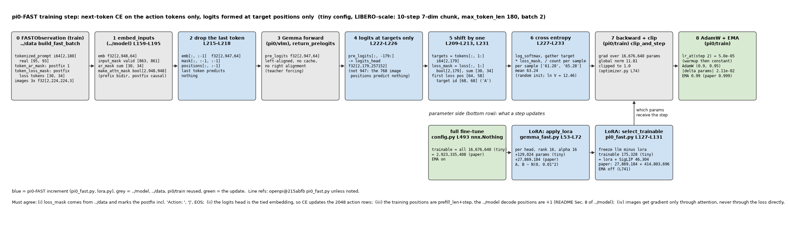
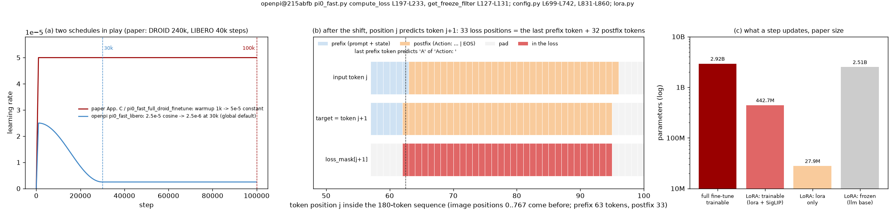

# FAST · train: 仅 postfix 的 next-token CE, 错一位对齐, 只对 target 位置算 logits; 常数 lr; 逐 head 的 LoRA

**TL;DR.** 这是 FAST 收益所在的 module. π0 训练 action expert 用的是 flow matching 的连续回归, π0-FAST 把动作变成 token 后, 训练目标就是 VLM 原生的 next-token cross entropy: 整条 `[images | prompt + state | action tokens]` 一次前向, 输入去掉最后一个 token, target 是序列右移一位, 只在 `loss_mask` 为 True 的动作段算 CE, 每个样本按自己的动作 token 数归一 (`pi0_fast.py` L197-L233). 收益: 同样的策略质量, π0-FAST 比 π0 少 5 倍 GPU 小时 (论文 Sec. VI-F); 单任务对比里 π0 要 3 倍算力才追平 (Fig. 9). 机制不是 "少算了什么", 每步的前向和 π0 的 VLM 部分一样大 (少了 expert 的 300M), 而是离散 CE 给底座的梯度与预训练目标同构, 收敛快 (`../tokenizer` README TL;DR; Knowledge Insulation arXiv:2505.23705 Sec. 5.2, Fig. 6b 的证据: flow-matching 梯度会扰乱底座, 所以后续 π0.5 / KI 即便推理用 flow-matching expert, 也让底座只吃 FAST 的 CE 梯度, 对 expert 做 stop-gradient; expert 仍要训, 但它只有 300M, 且不再拖慢底座). 代价在推理侧 (`../model`). 超参 (论文 Appendix C): warmup 1k 步 → 常数 5e-5, AdamW(0.9, 0.95) 无 weight decay, 梯度裁剪 1, EMA 0.999; LIBERO 40k 步, DROID 240k 步 @ batch 256 ≈ 4 天 8×H100 (Appendix D). openpi 的微调配置与论文有三处不一致 (§4.2, §8). LoRA 变体: attention 与 FFN 的每个矩阵加 rank 16 / alpha 16 的低秩项, 且是 **逐 head** 的 (`gemma_fast.py` L53-L72, `lora.py` L46-L52), 冻结 `llm` 里的非 LoRA 参数, SigLIP 不冻结 (`pi0_fast.py` L127-L131).

**流程图**: 上排是一个 batch 从 `FASTObservation` 到一次参数更新的每一步 (tiny 配置, LIBERO 规模: 7 维 10 步, `max_token_len` 180), 每步给 shape 与一次真实 tiny 运行的值; 下排是参数侧: 全参数微调与 LoRA 微调各自更新什么.

**第二幅图的论点**: (a) 论文的 "warmup → 常数" schedule 与 openpi LIBERO 配置的 cosine schedule 不是一回事; (b) 错一位之后, 哪些输入位置产生梯度: 只有 "预测下一个动作 token" 的那些位置, 图像、prompt、state 都不算 loss, 但它们的表示通过 attention 拿到梯度; (c) 全参数 2.92B 对 LoRA 的 27.9M + SigLIP 414.8M 可训练参数.

本 module 复现 π0-FAST 训练侧相对 π0 的增量. 上游: [openpi](https://github.com/Physical-Intelligence/openpi) @ `215abfb217dbac7d5f1273282331b9b1866c0479` (`openpi@215abfb`) 的 `src/openpi/models/pi0_fast.py` (`compute_loss` L197-L233, `get_freeze_filter` L127-L131), `src/openpi/models/gemma_fast.py` (`gemma_2b_lora` L53-L72), `src/openpi/models/lora.py` (L11-L30 配置与缩放, L43-L65 Einsum LoRA, L96-L121 FeedForward LoRA), `src/openpi/training/config.py` (`pi0_fast_libero` L699-L720, `pi0_fast_libero_low_mem_finetune` L721-L742, `pi0_fast_full_droid_finetune` L831-L860), `src/openpi/training/optimizer.py` L15-L31, L65-L85; 论文 FAST [arXiv:2501.09747v1](https://arxiv.org/abs/2501.09747v1) Sec. VI-D, VI-F, Appendix C, D. PyTorch 重写, 不 import 上游; 优化器、schedule、裁剪、EMA 全部 `from pi.pi0.train.train import ...`, 本文件只有 loss、LoRA、冻结规则、一步训练.

## 1. I/O 契约

### 1.1 `target_logits(model, obs)` → `(logits, targets, loss_mask)` (`pi0_fast.py` L205-L226)

| 名称 | shape / dtype | 说明 |
|---|---|---|
| 入 `model` | `Pi0FAST` (`../model`) | 训练模式, 不右对齐, 不用 cache |
| 入 `obs` | `FASTObservation` | `build_fast_batch(train=True)`; token 段含 postfix |
| 出 `logits` | float32[B, L−1, 257152] | L = `max_token_len`; 只对最后 L−1 个位置做 logits 矩阵乘 (L222-L226), 它们正是预测 token 段 (右移后) 的位置 |
| 出 `targets` | int64[B, L−1] | `tokenized_prompt[:, 1:]` (L210-L213) |
| 出 `loss_mask` | bool[B, L−1] | `token_loss_mask[:, 1:]` (L231) |

输入是 `emb[:, :-1]` 配 `attn_mask[:, :-1, :-1]` (L216-L218): 最后一个 token 不需要预测任何东西. 图像段 768 个位置的 pre_logits 算了但不做矩阵乘, 因为它们的 "下一个 token" 是图像或 prefix 的开头, 不在 loss 里. 与 `../model` 的推理路径的一致性: 训练在 postfix 位置 i 得到的 logits, 等于推理时用训练一致的 position 逐 token 解码到 i 得到的 logits (测试 `teacher_forcing_matches_full_forward`).

### 1.2 `cross_entropy(logits, targets, loss_mask)` → float32[B] (`pi0_fast.py` L227-L233)

| 名称 | 说明 |
|---|---|
| 公式 | `−Σ_t mask_t · log_softmax(logits_t)[target_t] / max(Σ_t mask_t, 1)`, 逐样本 |
| 归一 | 按 **每个样本自己** 的有效 token 数; batch 上再取 mean (`train_script.py` 的 `loss.mean()`) . 动作 token 多的样本每个 token 权重小 |
| 空 postfix | 分母 clip 到 1, loss 为 0 (推理模式的 obs 不会进训练) |

### 1.3 `apply_lora(model, rank=16, alpha=16.0)`, `LoRAAttnProj`, `LoRAGeGLU` (`lora.py`, `gemma_fast.py` L53-L72)

| 矩阵 (每层) | 基础 shape | LoRA A | LoRA B | 参数 |
|---|---|---|---|---|
| `q_einsum` | [N=8, D=2048, H=256] | [8, 2048, 16] | [8, 16, 256] | 294,912 |
| `kv_einsum` | [2, K=1, 2048, 256] | [2, 1, 2048, 16] | [2, 1, 16, 256] | 73,728 |
| `attn_vec_einsum` | [8, 256, 2048] | [8, 256, 16] | [8, 16, 2048] | 294,912 |
| `gating_einsum` | [2, 2048, 16384] | [2, 2048, 16] | [2, 16, 16384] | 589,824 |
| `linear` | [16384, 2048] | [16384, 16] | [16, 2048] | 294,912 |
| 合计 | | | | 1,548,288 / 层, × 18 = 27,869,184 |

`lora.py` L23-L24, L46-L52: LoRA 加在权重的 **最后两个轴** 上, 前面的轴 (head 数 N, kv 的 2 与 K, gating 的 2) 是 batch 轴; 所以 attention 的 LoRA 是逐 head 的 rank 16, 不是整个 [2048, 2048] 投影的 rank 16. 输出 `base + (x A) B · alpha / rank` (L30, L63), alpha = rank → 缩放 1. **A 和 B 都用 N(0, 0.01²) 初始化** (L20), 不是常见的 B 零初始化, 所以加上 LoRA 的一刻输出就已经变了 (幅度 ~1e-4 量级). 本仓库 `apply_lora` 把 `pi.pi0.vlm` 的 `ExpertAttnProj` / `GeGLU` 原地换成带 LoRA 的子类, 基础权重不动.

### 1.4 `select_trainable(model, mode)` → list[Parameter] (`pi0_fast.py` L127-L131; `config.py` L493)

| mode | 可训练 | 冻结 | 来源 |
|---|---|---|---|
| `"full"` | 全部 2,923,335,408 | 无 (`nnx.Nothing`) | `pi0_fast_libero`, `pi0_fast_full_droid_finetune` |
| `"lora"` | `llm` 里名字含 `lora` 的 27,869,184 + `img` (SigLIP) 414,803,696 | `llm` 里其余全部, 含 embedding 表 | `get_freeze_filter`: `All(PathRegex(".*llm.*"), Not(PathRegex(".*lora.*")))`; 正则只盯 `llm`, SigLIP 落在外面 |

### 1.5 `paper_config()`, `libero_config()` → `pi.pi0.train.TrainConfig`

| 字段 | `paper_config` (= `pi0_fast_full_droid_finetune`) | `libero_config` (= `pi0_fast_libero`) | 论文 Appendix C |
|---|---|---|---|
| warmup | 1,000 (L849) | 1,000 (optimizer.py L19) | 1k |
| lr | 5e-5 常数: cosine 的 peak = end = 5e-5, decay_steps 1M (L848-L853) | 2.5e-5 cosine → 2.5e-6 @ 30k (L19-L22) | 常数 5e-5 |
| AdamW | (0.9, 0.95), eps 1e-8, wd 1e-10 (optimizer.py L69-L73) | 同 | (0.9, 0.95), **无 wd** |
| clip | 1.0 (L74) | 1.0 | 1 |
| EMA | 0.99 (config.py L490) | 0.99; LoRA 配置 None (L741) | **0.999** |
| batch / steps | 256 / 100k (L854-L855) | 32 / 30k (L506, L511, L719) | DROID 256 / 240k; LIBERO 40k |

三处不一致 (wd, EMA, 步数) 都进 §8; 本仓库的 `paper_config` 用 openpi 的值, 字段注释标出论文值.

### 1.6 `train_step(model, obs, params, optimizer, ema, cfg, step)` → dict, `evaluate_loss(model, batches)`

`train_step`: `target_logits` → `cross_entropy` → `.mean()` → `backward` → `pi.pi0.train.clip_and_step` (设 lr, 裁剪, AdamW) → `EMA.update`. 返回 loss, grad_norm, lr, 有效 token 数. `evaluate_loss`: 无梯度的同一 loss, 本仓库补充 (openpi 无 validation loop).

## 2. 复现范围

| 有代码 | 只有事实 (背景) |
|---|---|
| 1.1–1.6 全部; 逐 head LoRA 与冻结规则; 常数 schedule 用 `pi.pi0.train.lr_at` 表达 | bf16 训练精度 (`config.py` L486), FSDP, checkpoint, 冻结参数转 bf16 |
| 训练 / 推理 logits 一致性测试 | DROID 的数据筛选 (去掉全零动作的 idle 步, Appendix D), 相机 / 语言标注随机化 |
| | 预训练 (π0-FAST base) 的数据混合与算力: 论文只说 "与 π0 相同的混合" |

## 3. 推理侧

无. 训练用 EMA 权重做推理 (`train_script.py`); LoRA 微调关 EMA, 推理用 LoRA 合并前的 base + 低秩项.

## 4. 训练侧

### 4.1 一步训练 (`pi0_fast.py` L197-L233, `train_script.py`)

1. `embed_inputs(obs)` → `emb` [B, 948, W], `input_mask`, `ar_mask`; `make_attn_mask` → [B, 948, 948].
2. 去掉最后一列: `emb[:, :-1]`, `mask[:, :-1, :-1]`; Gemma 一次前向 → `pre_logits` [B, 947, W].
3. 只取最后 L−1 = 179 个位置做 `logits_head` → [B, 179, 257152]; target = `tokenized_prompt[:, 1:]`.
4. `log_softmax`, 取 target 的 log-prob, 乘 `loss_mask[:, 1:]`, 逐样本除以有效数, batch mean.
5. backward, 全局范数裁剪到 1, AdamW, EMA.

tiny 例子 (`main()`): 一个样本 125 个真实 token = 62 prefix + 63 postfix, 只有 63 个位置进 loss; 初始 loss ≈ ln 257152 ≈ 12.46 附近 (随机权重).

### 4.2 论文与 openpi 的差异

论文 Appendix C 描述的是 π0-FAST **预训练 / 论文实验** 的设置; openpi 公开的是从 `pi0_fast_base` checkpoint 出发的 **微调** 配置. `pi0_fast_full_droid_finetune` 的 schedule (warmup 1k → 常数 5e-5) 与论文一致, 其余 (wd 1e-10 vs 无, EMA 0.99 vs 0.999, 100k vs 240k 步) 不同; `pi0_fast_libero` 干脆用 openpi 全局默认的 cosine schedule. 哪个更接近论文的 LIBERO 实验 (40k 步) 无法判断.

### 4.3 LoRA 微调 (`pi0_fast_libero_low_mem_finetune`)

同 1.3 / 1.4; 另外 EMA 关闭 (L740-L741), 步数 30k. 论文没有 LoRA 实验, 这是 openpi 提供的低显存选项.

## 5. 评测

训练侧没有新的评测; 论文 Fig. 9 / Sec. VI-F 的 "GPU 小时" 与 "3 倍算力" 是训练曲线上的对比, 本仓库不复现数字. 评测接口在 `../infer`.

## 6. cost 信息

| 项目 | 值 | 来源 |
|---|---|---|
| 一步前向 | 序列 947 (768 图像 + 179) 过 2B; logits 矩阵乘 179 × 2048 × 257152 (不是 947 ×) | `pi0_fast.py` L216-L226 |
| 可训练参数 | 全参数 2,923,335,408; LoRA 27,869,184 + SigLIP 414,803,696 | §1.3, §1.4 |
| DROID 训练 | 240k 步 @ 256, ≈ 4 天 8×H100 (3 epoch, 21M 样本) | 论文 Appendix D; openpi 100k 步 "≈ 2 天" (`config.py` L854) |
| LIBERO 训练 | 40k 步 (≈ 40 epoch, 270k 样本) | 论文 Appendix E; openpi 30k |
| 相对 π0 | 5 倍更少 GPU 小时; 单任务 π0 需 3 倍算力追平 | 论文 Sec. VI-F, Fig. 9 |
| batch 256 的 token 数 | 256 × 947 ≈ 242k 个位置 / 步, 其中 loss 位置 ≈ 256 × 30–60 | 本仓库计算; 论文 Table I |
| 预训练算力 | 未披露 | gap ledger |

## 7. reference 映射表

| 本仓库 | 上游 |
|---|---|
| `target_logits` | `pi0_fast.py` L205-L226 |
| `cross_entropy` | `pi0_fast.py` L227-L233 |
| `LoRAAttnProj`, `LoRAGeGLU` | `lora.py` L33-L85 (Einsum), L88-L150 (FeedForward); `gemma_fast.py` L137-L163 (哪些 einsum 带 LoRA) |
| `apply_lora`, `LORA_RANK`, `LORA_ALPHA` | `gemma_fast.py` L53-L72; `lora.py` L11-L30 |
| `select_trainable` | `pi0_fast.py` L127-L131; `config.py` L493 |
| `paper_config` | `config.py` L831-L860; `optimizer.py` L65-L85 |
| `libero_config` | `config.py` L699-L720; `optimizer.py` L15-L31 |
| `train_step`, `evaluate_loss` | `train_script.py` (与 `pi.pi0.train` 相同的 train_step 结构) |
| 复用: `TrainConfig`, `lr_at`, `make_optimizer`, `clip_and_step`, `EMA`, `kernel_param_norm` | `pi.pi0.train.train` 及其 README §7 |

## 8. gap ledger

| 未披露 / 未复现 | 说明 |
|---|---|
| weight decay | 论文 "without weight decay"; openpi AdamW 默认 1e-10 (注释说 0 会 OOM). 本仓库沿用 openpi |
| EMA 0.999 vs 0.99 | 论文 0.999; openpi 默认 0.99 且 FAST 配置未覆盖. 本仓库沿用 openpi, 注释标论文值 |
| 步数 | 论文 DROID 240k / LIBERO 40k; openpi 100k / 30k (微调 base checkpoint). 两者起点不同 (从头 vs 从 base), 不可比 |
| LIBERO 的 schedule | openpi `pi0_fast_libero` 用 cosine 2.5e-5 → 2.5e-6; 论文说常数 5e-5. 不知论文 LIBERO 实验用哪个 |
| 预训练 | π0-FAST base 的数据混合、算力、步数: 论文 Sec. VI-B 只说与 π0 相同的混合, 无数字 |
| "5 倍 GPU 小时" 的度量 | Sec. VI-F 只有这一句, 没有绝对数, 没有两者各自的 batch / 步数 |
| Fig. 9 的 "3x compute" | 只说 π0 用了 3 倍算力; 是步数还是 batch 未说 |
| LoRA 初始化 | 上游 A, B 都 N(0, 0.01²), 与 LoRA 论文的 B 零初始化不同; 无说明. 本仓库照抄 |
| bf16 训练, 冻结参数转 bf16, FSDP, checkpoint | 系统工程 |
| validation loop | openpi 无; `evaluate_loss` 是本仓库补充 |
| DROID 数据筛选 | Appendix D "去掉全零动作的 idle 步" 只有一句; 阈值未说 |

## 9. 机器人概念表

**next-token CE 作为动作损失 (与 flow matching 对照)**
- shape: logits [B, T, 257152], target int[B, T], mask bool[B, T]; 输出标量.
- 含义: 每个动作 token 一个 257152 类的分类; π0 是每个 chunk 一个 [H, D] 的连续回归.
- 来源: `pi0_fast.py` L227-L233; 论文 Sec. VI-A.
- 为什么: 和 VLM 预训练目标同构, 底座梯度 "熟悉"; KI 的实验 (Fig. 6b) 显示连续回归的梯度会损害底座. 这是 5 倍训练提速的来源, 与前向大小无关.
- 系统联系: 分类头是 tied embedding (`../model` §9); 目标 token 由 `../tokenizer` 与 `../data` 决定, 所以 codebook 一旦变, checkpoint 作废.

**错一位 (shift by one) 与 loss 位置**
- shape: 输入 `emb[:, :-1]`, target `tokens[:, 1:]`, mask `loss_mask[:, 1:]`.
- 含义: 位置 i 的输出预测 token i+1. 最后一个 prefix 位置预测第一个 postfix token (`Action: ` 的开头), `|` 的位置预测 EOS; EOS 自己的输出没有 target, 被 `[:, :-1]` 与 pad 的 mask 去掉.
- 来源: `pi0_fast.py` L209-L220.
- 为什么: 自回归的定义; 训练时用真实前缀 (teacher forcing), 推理时用自己生成的前缀, `../model` 的 cache 解码在训练一致的 position 下给出相同 logits.
- 系统联系: `../data` 的 `loss_mask` 只标 postfix, 所以 `Action: ` 标记本身也是要预测的 (它在 postfix 里).

**逐 head 的 LoRA**
- shape: 对 [N, D, H] 的权重, A [N, D, r], B [N, r, H]; 每个 head 一个独立的 rank-r 增量.
- 含义: 总增量的秩是 N · r = 128, 但被限制成 head 内的块对角结构; 参数 N (D + H) r.
- 来源: `lora.py` L23-L24 (`axes=(-2, -1)`), L46-L52.
- 为什么: 直接沿用 einsum 权重的最后两轴, 实现最省事; 与 "对合并后的 [D, N·H] 矩阵做 rank 16" 的参数量不同 (那样是 (D + N·H) r = 65,536 而不是 294,912).
- 系统联系: 参数量 27.9M 是 2.92B 的 0.95%; 冻结的 2.9B 转 bf16 省显存 (`train_script.py`), 这才是 "low_mem" 的来源.

**per-sample 归一 (与 per-token 归一对照)**
- shape: [B] 的 loss, 每个 = 该样本的和 / 该样本的 token 数; 再 mean.
- 含义: 每个 **chunk** 权重相等, 不是每个 token 权重相等; 60 token 的双臂 chunk 与 30 token 的单臂 chunk 对梯度贡献一样.
- 来源: `pi0_fast.py` L233 `/ clip(sum(loss_mask), 1)`.
- 为什么: 与 π0 的 "每个 chunk 一个 MSE 均值" 对齐; 混合数据里 token 多的机器人不会主导.
- 系统联系: `../data` 的 `max_token_len` 截尾会砍掉动作 token, 分母也随之变小, 所以截断的样本在 loss 里不会被稀释, 但目标残缺.
