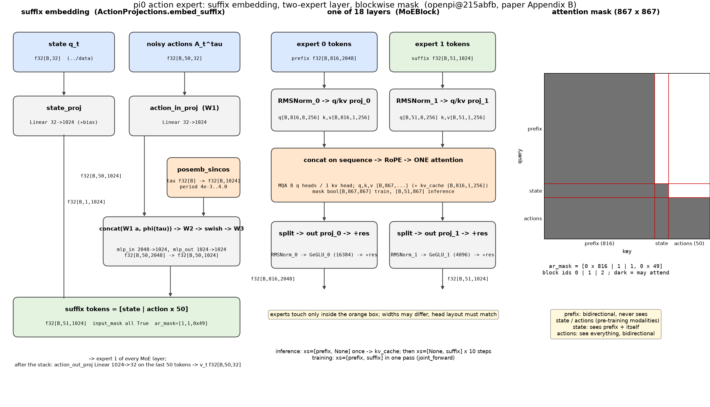

# π0 · action_expert: Gemma 300M expert, 与 VLM 共享 attention 的双 expert 机制

本 module 复现 π0 里 "第二套权重": 机器人状态 q_t 和 50 个带噪 action 怎么变成 token (suffix), 这些 token 怎么和 `../vlm` 的 prefix 在同一个 transformer 里做 attention 但走各自的权重, 以及 attention mask 的三块结构. 时间步采样、loss、Euler 积分放在 `../flow_matching`; 本 module 只负责 "给定 (state, noisy_actions, timestep) 和 prefix, 算出 suffix 的隐状态并解码成速度场".

上游: [openpi](https://github.com/Physical-Intelligence/openpi) @ `215abfb217dbac7d5f1273282331b9b1866c0479` (`openpi@215abfb`) 的 `src/openpi/models/pi0.py`, `gemma.py`, `pi0_config.py`, `tokenizer.py`; 论文 π0 [arXiv:2410.24164v1](https://arxiv.org/abs/2410.24164v1) Sec. III, Appendix B, Appendix D. PyTorch 重写, 不 import openpi; 复用 `../vlm/model.py` 的 `RMSNorm`, `ExpertAttnProj`, `attend`, `apply_rope`, `GeGLU`, `make_attn_mask`, `GemmaBlock`.



## 1. I/O 契约

**`ActionProjections(cfg).embed_suffix(state, noisy_actions, timestep)`** (`pi0.py` L140-L186; 这个类只是入口 / 出口的五个线性层, expert 本身在 `MoEGemma` 里, 见第 1.6 节)

| 名称 | shape / dtype | 取值 | 说明 |
|---|---|---|---|
| 入 `state` | float32[B, 32] | z-score 后, 零填充 | `../data` 输出的本体状态 q_t |
| 入 `noisy_actions` | float32[B, 50, 32] | 任意 | 带噪 action chunk A_t^τ (训练: 插值; 推理: 当前积分点) |
| 入 `timestep` | float32[B] | [0, 1] | flow-matching 时间步 τ, 每个样本一个标量 |
| 出 `tokens` | float32[B, 51, 1024] | 任意 | 1 个 state token + 50 个 action token, 已在 action expert 宽度 |
| 出 `input_mask` | bool[B, 51] | 全 True | suffix 没有 padding |
| 出 `ar_mask` | bool[51] | `[1, 1, 0 × 49]` | state 开一个块, 第一个 action 再开一个块, 其余 action 同块 |

**`ActionProjections(cfg).decode(suffix_out)`**: float32[B, 51, 1024] → float32[B, 50, 32]. 只取最后 50 个 token 过 `action_out_proj` (`pi0.py` L212), 得到速度场 v_θ; state token 的输出被丢弃.

**`MoEGemma(cfgs)(xs, positions, mask, kv_cache=None)`** (`gemma.py` L340-L411): 双 expert 的 Gemma 主干.

| 名称 | shape / dtype | 说明 |
|---|---|---|
| 入 `xs` | list[2] of float32[B, T_i, w_i] 或 None | 每个 expert 一份 token; None 表示该 expert 这次不跑 (推理时 prefix 已缓存, 只跑 expert 1) |
| 入 `positions` | int64[B, ΣT_i] | 所有在场 token 按 expert 顺序拼接后的 RoPE 位置 |
| 入 `mask` | bool[B, ΣT_i, S] | S = cache 长度 + ΣT_i |
| 入 `kv_cache` | list[depth] of (k, v), 各 float32[B, S_cache, 1, 256] | `../vlm` prefix 前向留下的 cache |
| 出 | list[2] of float32[B, T_i, w_i] 或 None | 各 expert 过自己的 `final_norm` 后的隐状态 |
| 出 `kv_cache` | list[depth] of (k, v), 各 float32[B, S, 1, 256] | 本次所有在场 token 的 k / v (含续接的 cache) |

两个 expert 的宽度可以不同 (2048 vs 1024), 但 `num_heads`, `num_kv_heads`, `head_dim` 必须相同 (`gemma.py` L165-L168), 因为 q / k / v 在 head 维上要拼到一起做同一个 attention.

**两条组合路径** (本 module 提供, `../flow_matching` 直接调用):

- `joint_forward(llm, prefix_emb, prefix_mask, prefix_ar, suffix_emb, suffix_mask, suffix_ar)` → `(prefix_out, suffix_out)`: 训练用, prefix 和 suffix 一次前向 (`pi0.py` L202-L211). 完整序列 867 = 816 + 51, mask bool[B, 867, 867], `positions = cumsum(input_mask) − 1`.
- `suffix_forward(llm, kv_cache, prefix_mask, suffix_emb, suffix_mask, suffix_ar)` → `suffix_out`: 推理用, prefix 已缓存, 只算 51 个 suffix token (`pi0.py` L239-L269). mask bool[B, 51, 867]: 左半 816 列 = `prefix_mask` 广播 (suffix 能看所有有效 prefix), 右半 51 列 = `make_attn_mask(suffix_mask, suffix_ar)`; `positions = sum(prefix_mask) + cumsum(suffix_mask) − 1`.

两条路径对 suffix 给出完全相同的输出, `test_parity.py` 有断言.

常量: action expert = Gemma 300M {width 1024, depth 18, mlp 4096, heads 8, kv heads 1, head_dim 256}, 无词表嵌入 (`gemma.py` L69-L78); `action_dim 32`, `action_horizon 50` (`pi0_config.py` L25-L26); 时间步嵌入 `posemb_sincos(τ, 1024, min_period 4e-3, max_period 4.0)` (`pi0.py` L161).

### 1.1 三块 attention mask

把 `../vlm` 的 `prefix_ar` (816 个 False) 和本 module 的 `suffix_ar` (`[1, 1, 0 × 49]`) 拼起来, `make_attn_mask` 给出论文 Appendix B 的三块结构:

```
块 0: [img × 768, prompt × 48]   块内双向, 看不到块 1 / 块 2
块 1: [state]                     看块 0 + 自己, 看不到块 2
块 2: [action × 50]               看全部, 块内双向
```

论文给的三条理由 (Appendix B "Attention mask"): 块 0 是 PaliGemma 预训练时见过的模态, 不让它看新输入, 以减小与预训练的分布偏移; state 单独成块是因为它在去噪的每一步都不变, 不看 action 就可以和 prefix 一起缓存 k / v; action 块看全部, 块内双向 (Sec. III "The action expert uses a full bidirectional attention mask, so that all action tokens attend to each other").

注意 openpi 实际的推理路径 (`pi0.py` L233-L237) 只缓存了 816 个 prefix token, state token 每步和 action 一起重算 (`embed_suffix` 每步都被调用, L241). 论文说 state "可以" 被缓存, 代码没有做; 本仓库按代码. 这一条进 gap ledger.

### 1.2 为什么 state 给 action expert 而不是给 VLM

论文 Appendix B "Action expert": 图像和指令是 PaliGemma 预训练见过的输入, 路由到 VLM 权重; state 和 noisy action 是预训练没见过的输入, 路由到从零初始化的 action expert. 所以 `../vlm` 的 prefix 里没有 state, `../data` 输出的 `state` 字段在这里才被消费.

π0.5 (同一份 openpi 代码的 `pi05=True` 分支) 改了这一点: state 被离散成 256 个 bin, 以文本形式写进 prompt (`tokenizer.py` L24-L29: `"Task: {prompt}, State: {bins};\nAction: "`), 走 VLM; suffix 只剩 50 个 action token (`pi0.py` L151-L157 只在 `not pi05` 时加 state token; `pi0_config.py` L28-L33). 本 module 只复现 π0 的连续 state token.

### 1.3 时间步的注入方式: MLP 拼接, 不是 adaRMSNorm

π0 每个 action token 的嵌入是 (论文 Appendix B "Incorporating the flow matching timestep")

```
W3 · swish(W2 · concat(W1 · a_t'^τ, φ(τ)))
```

W1 ∈ R^{w×d} 是 `action_in_proj`, φ 是 `posemb_sincos`, W2 ∈ R^{w×2w} 是 `action_time_mlp_in`, W3 ∈ R^{w×w} 是 `action_time_mlp_out` (`pi0.py` L159-L177). τ 只在入口和 action 拼接一次, 之后 18 层里没有任何 τ 依赖的调制. 论文 Appendix C 对比 π0-small 时明确说 π0-small 用 DiT 的 AdaLN-Zero 注入 τ, 而 π0 主模型不用.

π0.5 改为 adaRMSNorm: τ 经 `time_mlp_in → swish → time_mlp_out → swish` 得到条件向量, 每层的 `RMSNorm` 用它产生 (scale, shift, gate), 残差按 gate 加权 (`gemma.py` L127-L131, L453-L459; `pi0.py` L93-L95, L162-L169). 本 module 不实现 adaRMSNorm.

`posemb_sincos` (`pi0.py` L47-L63): `period_i = min_period · (max_period / min_period)^{i / (w/2 − 1)}`, 输出 `[sin(2π τ / period), cos(2π τ / period)]` 拼接, 长 w. 周期从 0.004 到 4.0 对数均匀, 让 τ ∈ [0, 1] 内既有快变分量也有慢变分量.

### 1.4 与 `../vlm` 的关系: 并排的两条通道, 不是上下叠的两层

分三个层面说.

**权重层面 (论文 Appendix B "Action expert" 原话的直译)**: π0 的语言模型不是 "Gemma 2B 加一个外挂", 而是一个 18 层的 transformer, 每一层里放了两套互相独立的权重. expert 0 是 Gemma 2B (宽 2048, MLP 16384), 从 PaliGemma checkpoint 加载; expert 1 是 Gemma 300M (宽 1024, MLP 4096), 从零初始化. 每个 token 只走其中一套: 图像和指令 token 走 expert 0, state 和 action token 走 expert 1. RMSNorm, q / k / v 投影, 输出投影, GeGLU 全是各自的. 两套权重唯一碰头的地方是 attention 的 softmax: expert 0 投出的 816 个 k / v 和 expert 1 投出的 51 个 k / v 拼在同一个序列里, expert 1 的 query 去看 expert 0 的 key (第 4.2 节). 所以 vlm 不是 "底座在下, expert 在上" 的堆叠, 而是并排走过同一个深度、只在 attention 里互看. 这也是为什么 head 数和 head_dim 必须一样而宽度可以不一样.

**代码层面 (本仓库的组织方式, 上游没有这个区分)**: `../vlm/model.py` 的 `Gemma` 是单 expert 的教学版, 目的是先把 RMSNorm, MQA, RoPE, GeGLU, mask, KV cache 这些零件讲清楚. 本 module 的 `MoEGemma` 把每层换成 `MoEBlock`, 里面 `experts[0]` 和 `experts[1]` 各是一个 `GemmaBlock` (借它的四个子模块当容器, 不用它的 forward). `test_parity.py` 有一条断言: 把 `Gemma` 的权重拷进 `MoEGemma.experts[0]`, 只喂 expert 0 的 token, 输出逐元素相等. 也就是说 `vlm.Gemma` 是 `MoEGemma` 在 "expert 1 缺席" 时的特例. 到 `../infer` 组装完整 π0 时, 真正被用的 transformer 是 `MoEGemma`; `../vlm` 留下的是 `SigLIP` (图像编码器), `Embedder` (词表) 和 `embed_prefix` (拼 prefix), `vlm.Gemma` 本身不出现在最终模型里, 它的权重由 `MoEGemma.experts[0]` 承接. 这与 openpi 的结构一致: `pi0.py` L73-L80 只建一个 `_gemma.Module(configs=[paligemma_config, action_expert_config])`, 没有单独的 Gemma 2B 对象.

**系统层面 (一次推理里各自跑几次, `pi0.py` L216-L279, 论文 Appendix D)**:

1. `SigLIP` 编码三张图, `embed_prefix` 拼出 816 个 token.
2. `MoEGemma` 以 `xs = [prefix, None]` 跑一遍: 只有 expert 0 在场, 存下 18 层的 k / v. 这一步就是 `../vlm` 的全部工作, 每个 chunk 只做一次; 论文 Table I 里是 14 + 32 = 46 ms.
3. 10 步去噪, 每步 `embed_suffix` 出 51 个 token, `MoEGemma` 以 `xs = [None, suffix]` 跑: 只有 expert 1 在场, query 51 个, key 是 cache 的 816 个加本步的 51 个. 这是本 module 的工作; 10 步合计 27 ms.
4. 最后 50 个 token 过 `action_out_proj` 得到速度场, Euler 更新 (→ `../flow_matching`).

训练时没有 cache, `xs = [prefix, suffix]` 一次前向 867 个 token, 两个 expert 同时在场, 梯度同时流回两套权重 (openpi 默认不冻结 Gemma 2B, → `../train`).

一句话: `../vlm` 提供 "看和读" 的那套权重和它产生的 k / v, 本 module 提供 "动" 的那套权重; 两者是同一个 transformer 里并排的两条通道, 只通过 attention 单向地让 action 看观测.

### 1.5 这里的 "expert" 不是 LLM 的 MoE

论文只说 "two sets of weights (also known as experts [45])", [45] 引的是 Shazeer 2017 的 sparsely-gated MoE, 借的是术语不是机制. 与 Mixtral / DeepSeek 那类 MoE 的三点区别 (本仓库总结):

| | LLM 的 MoE | π0 的双 expert |
|---|---|---|
| 路由 | 每层一个可学习的 gating 网络, 逐 token 算 softmax 选 top-k, 数据依赖, 需要负载均衡 loss | 没有任何 gating 参数. 按模态硬编码: 图像 / 指令 token 永远走 expert 0, state / action token 永远走 expert 1, 18 层全部一样. 代码里就是 `xs = [prefix, suffix]` 的 list 下标 |
| MoE 化的范围 | 只把 FFN 换成多个 expert, attention 的 q / k / v 投影所有 token 共享 | 整层都分开: RMSNorm, q / k / v 投影, 输出投影, FFN 全部两套; 共享的只有 softmax 那一步的计算 (第 4.2 节) |
| 动机 | 固定算力下扩参数量, 每个 token 只激活一小部分 | 让预训练的 VLM 权重和从零训练的动作权重不互相污染, 同时让 action 通过 attention 读观测; 顺带可以把 expert 1 做窄以加快 10 步去噪 |

更贴切的类比是 "modality-specific parameters" (如 Transfusion): 同一个序列, 不同模态用不同参数, 只靠 attention 混合. openpi 的 `Module(configs=[...])` 也是按 "每个 expert 一份 config" 组织, 没有 router 字段 (`gemma.py` L340-L343). 本仓库沿用 openpi 的叫法把类命名为 `MoEBlock` / `MoEGemma`, 读的时候按 "mixture of modality-specific weights" 理解.

### 1.6 `ActionProjections` 不是 action expert, 它只在入口和出口各出现一次

论文 Appendix B 把两件事分开列: "(1) additional input and output projections for the robotics-specific tokens" 和 "(3) a second, smaller set of weights for the action expert". 本 module 的两个类分别对应这两件事:

| 类 | 内容 | 出现位置 | 参数量 (paper) |
|---|---|---|---|
| `ActionProjections` | `state_proj`, `action_in_proj`, `action_time_mlp_in`, `action_time_mlp_out` (入口); `action_out_proj` (出口) | 第 0 层之前用一次 (`embed_suffix`), 第 17 层之后用一次 (`decode`) | 3,248,160 |
| `MoEGemma.layers[i].experts[1]`, i = 0..17 | Gemma 300M 每层的 RMSNorm, q / k / v, 输出投影, GeGLU | **每一层都有**, suffix 的 51 个 token 走 18 次 | 311,464,960 |

在 openpi 里这五个投影层挂在 `Pi0` 对象上而不在 `llm` 里 (`pi0.py` L92-L100), expert 的权重在 `llm` 的每一层里 (`gemma.py` L284-L333 的 `_1` 后缀参数). 一次前向的数据流:

```
state, noisy_actions, τ
  → ActionProjections.embed_suffix     (四个入口投影, 一次)              f32[B,51,1024]
  → MoEGemma layer 0   experts[1]      ┐
  → MoEGemma layer 1   experts[1]      │ 18 层, 每层各一份 expert 1 权重, 每层都 attend 到 prefix 的 k/v
  → ...                                │
  → MoEGemma layer 17  experts[1]      ┘
  → final_norms[1]                                                       f32[B,51,1024]
  → ActionProjections.decode           (action_out_proj, 一次)           f32[B,50,32]
```

## 2. 复现范围

| 有代码 | 只有事实 (背景) |
|---|---|
| state / action / timestep 的嵌入 (五个线性层 + swish MLP + sincos) | π0.5 的 adaRMSNorm 与离散 state (第 1.2, 1.3 节) |
| 双 expert 的 Gemma block: 各自 norm / 投影 / MLP, 共享一次 attention | LoRA 变体 `gemma_300m_lora` (`gemma.py` L98-L108, rank 32) |
| suffix 的 `ar_mask` 与三块 mask | bfloat16 / 分片 |
| 训练式 joint forward 与推理式带 cache 的 suffix forward | 时间步采样, loss, Euler 积分 (→ `../flow_matching`) |
| 速度场解码 `action_out_proj` | 权重加载 |
| `tiny` 配置整条前向 | |

## 3. 推理侧

一次动作 chunk 的推理里 (`pi0.py` L216-L279, 论文 Appendix D):

1. `../vlm` 跑一次 prefix, 得到 18 层 `(k, v)` 各 [B, 816, 1, 256] 的 cache. 此时 `MoEGemma` 的调用是 `xs = [prefix_emb, None]`: 只有 expert 0 在场.
2. 10 步去噪, 每步: `embed_suffix(state, x_t, t)` → 51 个 token; `suffix_forward` 用 `xs = [None, suffix]` 只跑 expert 1 的投影和 MLP, attention 的 k / v 是 cache 的 816 个 + 本步 51 个; `decode` 取后 50 个 token 得到 v_t.
3. 本 module 不含 Euler 更新 `x_t + dt · v_t` (→ `../flow_matching`).

每步 attention 的计算量: query 51 个, key 867 个; 18 层 expert 1 的投影和 MLP 只作用于 51 个 token. 论文 Table I (RTX 4090, 三张图): "x10 action forward pass (flow)" 共 27 ms, 即每步约 2.7 ms; 对比 prefix 一次 32 ms. 这就是把 expert 缩到 1024 宽的理由 (Appendix B: "To speed up inference (which requires multiple forward passes of the action expert), we downsize the action expert").

参数量 (本仓库按 openpi 配置解析计算, `test_parity.py` 断言精确值):

| 部件 | 参数量 | 对照 |
|---|---|---|
| Gemma 300M expert (18 层 + final_norm, 无嵌入) | 311,464,960 | `gemma.py` L70 注释 "311M params"; 论文 "∼300M" |
| 每层: q 2,097,152 + kv 524,288 + out 2,097,152 + 2 norm 2,048 + GeGLU 12,582,912 | 17,303,552 | |
| 五个投影层 (含 bias) | 3,248,160 | `state_proj` 33,792; `action_in_proj` 33,792; `action_time_mlp_in` 2,098,176; `action_time_mlp_out` 1,049,600; `action_out_proj` 32,800 |
| 合计本 module 新增 | 314,713,120 | |
| 合计 π0 = VLM 2,923,335,408 + 本 module | 3,238,048,528 | 论文 "total of 3.3 billion parameters" |

## 4. 训练侧

### 4.1 训练时怎么用

- 一次前向同时喂 prefix 和 suffix (`joint_forward`), 序列长 867, 一张 [B, 867, 867] 的 mask; 输出只用 suffix 的后 50 个 token (`pi0.py` L202-L214).
- action expert 的 18 层与五个投影层全部从零初始化 (论文 Sec. III "300M parameters for the action expert (which is initialized from scratch)"); openpi 里 expert 1 的参数名带 `_1` 后缀, 所以 PaliGemma checkpoint 里没有同名项, 加载时保持随机 (`gemma.py` L443-L451 `_name`).
- 初始化: openpi 的 `nnx.Linear` 默认 lecun_normal 权重 + 零 bias; einsum 投影 lecun_normal; RMSNorm scale 零初始化 (输出 `x · (1 + 0)`). 本仓库同.
- 输入: `state` 是 `../data` 归一化后的 32 维; `noisy_actions` 由 `../flow_matching` 按 `x_t = t · noise + (1 − t) · actions` 生成; `timestep` 是 Beta(1.5, 1) · 0.999 + 0.001 (`pi0.py` L197). 这里只接收, 不采样.
- 是否冻结 VLM: openpi 默认不冻结, 整个 3.2B 一起训; 只有 LoRA 变体冻结主干 (`pi0_config.py` L88-L117). 细节 → `../train`.

### 4.2 双 expert 的 block 是怎么共享 attention 的

一层 (`gemma.py` L284-L333) 的执行顺序, 两个 expert 的 token 各 T_0, T_1 个:

1. 各 expert 用自己的 `pre_attention_norm_i` 和 `q/kv_einsum_i` 把自己的 token 投成 q_i [B, T_i, 8, 256], k_i, v_i [B, T_i, 1, 256] (`gemma.py` L172-L199). 宽度不同的 expert 在这一步被投到相同的 head 维.
2. 沿序列维拼接: q [B, T_0 + T_1, 8, 256], k, v 同 (L201). 加 RoPE, q 乘 head_dim^{-1/2} (L203-L206). 若有 cache, k / v 前面接上 cache (L211-L214).
3. 一次 attention, mask 决定谁看谁 (L216-L231).
4. 按 T_0, T_1 切回, 各 expert 用自己的 `attn_vec_einsum_i` 投回自己的宽度 (L233-L247), 残差相加.
5. 各 expert 用自己的 `pre_ffw_norm_i` 和 `mlp_i` (GeGLU), 残差相加 (L314-L330).

除了第 2-3 步, 两个 expert 没有任何参数或激活交换. 这就是论文说的 "the weights interact only through the transformer's self-attention layers". 所以宽度和 MLP 可以不同, 但 head 配置必须一致.

## 5. 评测

`test_parity.py` (CPU, 约 3 秒). 论文规模在 `meta` 设备上只数参数:

- Gemma 300M expert 与五个投影层的参数量与第 3 节解析值精确相等; 两 expert 的 head 配置一致性断言;
- `embed_suffix` 的 shape 与 `ar_mask` 恰为 `[1, 1, 0 × 49]`; 拼接后 867 长的 mask 满足三块结构 (prefix 行看不到 suffix 列, state 行看 prefix + 自己, action 行全看);
- `posemb_sincos` 在 τ = 0 时 sin 全 0, cos 全 1; 不同 τ 给出不同的 action token;
- 语义检查 1: `MoEGemma` 只跑 expert 0 时与 `../vlm` 的单 expert `Gemma` 输出逐元素相等 (拷贝同一套权重), 说明双 expert 结构是单 expert 的严格推广;
- 语义检查 2: `joint_forward` 和 "prefix 缓存 + `suffix_forward`" 对 suffix 输出相等 (含一个被 mask 的相机), 说明推理路径的 mask 与位置编号和训练路径一致.

```
uv run pytest pi/pi0/action_expert -q
```

看一次前向怎么走 (tiny 配置, 逐步打印 shape):

```
uv run python -m pi.pi0.action_expert.model
```

## 6. cost 信息

| 项目 | 值 | 来源 |
|---|---|---|
| action expert 参数量 | 311,464,960 (18 层) + 3,248,160 (投影) | 本仓库解析计算; `gemma.py` L70 "311M"; 论文 "∼300M" |
| π0 总参数量 | 3,238,048,528 | 本仓库解析计算; 论文 "3.3 billion" |
| suffix 长度 | 51 = 1 + 50 | `pi0.py` L152-L182 |
| 全序列长度 | 867 = 816 + 51 | `pi0_config.py` L25-L26, L39 |
| 10 步 action forward 延时 | 27 ms (RTX 4090, 三张图) | π0 Table I |
| 端到端推理 | 73 ms 板上, 86 ms 离板 (含 13 ms 网络) | π0 Table I |
| 执行长度 | 50 Hz 机器人执行 25 步 (0.5 s) 再推理; 20 Hz UR5e / Franka 执行 16 步 (0.8 s) | π0 Appendix D |
| action expert 训练 GPU 时间 | 未披露 | gap ledger |

## 7. reference 映射表

| 本仓库 | 上游 |
|---|---|
| `GEMMA_300M` (从 `../vlm` 引入) | `openpi@215abfb src/openpi/models/gemma.py` L69-L78 |
| `tiny_expert` | `gemma.py` L60-L68 "dummy" 变体缩窄 |
| `posemb_sincos` | `pi0.py` L47-L63 |
| `ActionProjections.__init__` 五个线性层 (挂在 `Pi0` 上, 不在 `llm` 里) | `pi0.py` L92, L97-L100 |
| `ActionProjections.embed_suffix` | `pi0.py` L140-L186 (`not pi05` 分支) |
| `ActionProjections.decode` | `pi0.py` L212, L269 |
| `MoEBlock` | `gemma.py` L284-L333 (`Block`), attention 部分 L158-L249 (`Attention`) |
| `MoEGemma` | `gemma.py` L340-L411 (`Module`), `final_norms` L382, `_name` L443-L451 |
| `joint_forward` | `pi0.py` L202-L211 (`compute_loss` 的前向部分) |
| `suffix_forward` | `pi0.py` L239-L269 (`sample_actions.step`) |
| head 配置一致性断言 | `gemma.py` L165-L168 |
| 论文 | π0 Sec. III (attention, 输出), Appendix B (投影, 时间步 MLP, mask, expert 尺寸), Appendix C (π0-small 用 AdaLN-Zero), Appendix D 与 Table I (推理) |

## 8. gap ledger

| 未披露 / 未复现 | 说明 |
|---|---|
| state token 的 KV 缓存 | 论文说 state 单独成块是为了能缓存; openpi 只缓存 816 个 prefix token, state 每步重算. 本仓库按 openpi |
| 论文 Appendix B "num heads=18" | 应为 8 (`gemma.py` L76, L84); 18 是 depth |
| 论文 "18-dim" 与代码 32 维 | 论文 Sec. V 说 state / action 最大 18 维; 发布代码填充到 32 (`pi0_config.py` L25). 按 32 |
| adaRMSNorm, 离散 state (π0.5) | 只陈述, 不实现 |
| LoRA 变体 | 只陈述; `../train` 会记录冻结 / LoRA 配置 |
| dropout | openpi `Block.dropout` 默认 0 且未在 config 里改动, 未实现 |
| 初始化的精确分布 | openpi `nnx.Linear` 默认 lecun_normal; 论文未提. 本仓库 `nn.Linear` 用 PyTorch 默认 (kaiming_uniform), 属于可省的数值细节, 不影响 shape / 参数量 |
| action expert 训练 GPU 时间 | 未披露 |
| 数值对齐 | 只对齐参数量与 shape (仓库原则 1) |

## 9. 机器人概念表

本 module 引入的新概念只有 "把 state 和 action 当 token" 这一层, 其余机器人概念见 `../data` README 第 9 节.

**state token**
- shape: 1 个 float32[1024] token, 由 float32[32] 的 q_t 经 `state_proj` 得到.
- 物理含义: 当前关节角 / 夹爪开度的一个整体嵌入; 所有 32 维压进一个 token, 不是每维一个 token.
- 采集: 同 `../data` 的 proprioceptive state.
- 为什么需要: action 块要知道 "从哪里出发"; delta action 相对它定义. 它单独成块是为了在去噪的每一步保持不变 (见第 1.1 节).
- 硬件联系: 来自电机编码器, 每次推理只读一次.

**action token**
- shape: 50 个 float32[1024] token, 第 i 个来自 chunk 里第 i 步的 float32[32] 带噪动作和 τ.
- 物理含义: 一个 token 对应未来一个控制周期 (50 Hz 下 20 ms) 的动作; 50 个 token 覆盖 1 秒.
- 采集: 训练时由真实 chunk 加噪; 推理时从纯噪声出发逐步去噪.
- 为什么需要: 每步一个 token 让 attention 直接建模步与步之间的依赖 (块内双向); 输出端每个 token 独立解码出自己那一步的速度.
- 硬件联系: 去噪完成后, 前 25 (或 16) 个 token 对应的动作被送到控制器执行.

**flow-matching 时间步 τ (非机器人概念, 但 LLM 读者可能陌生)**
- shape: float32[B] 标量, τ ∈ [0, 1]. 与机器人时间步 t 无关: t 是控制周期的序号, τ 是去噪进度.
- 为什么需要: 同一套权重要在 10 个去噪步上都工作, 必须知道当前噪声水平; π0 用 sincos 嵌入 + MLP 拼进每个 action token (第 1.3 节).
