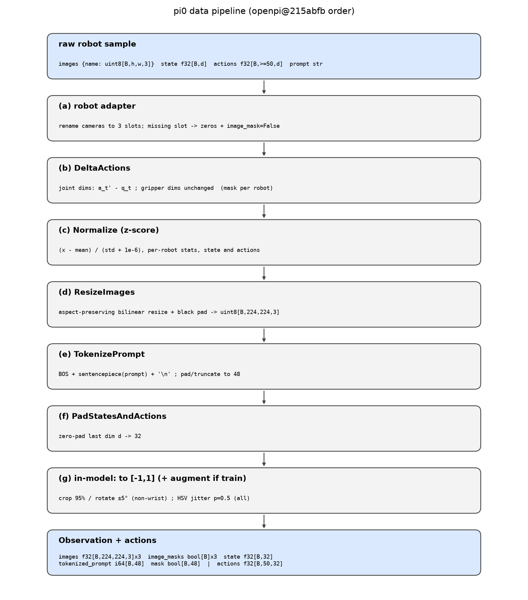

# π0 · data: 从机器人原始样本到模型输入

本 module 复现 π0 的数据组织与预处理: 一条机器人样本 (若干相机图像, 本体状态, 一段未来动作, 一句指令) 如何变成模型吃的 `Observation` 和训练目标 `actions`.

上游: [openpi](https://github.com/Physical-Intelligence/openpi) @ `215abfb217dbac7d5f1273282331b9b1866c0479` (下文记为 `openpi@215abfb`), 论文 [arXiv:2410.24164v1](https://arxiv.org/abs/2410.24164v1). 本仓库用 PyTorch / NumPy 重写, 不 import openpi.



## 1. I/O 契约

入口 `build_batch(raw, norm_stats, tokenizer, delta_mask=..., train=...)`.

**输入 `raw`** (机器人 adapter 已把相机改名成三个固定槽位):

| 名称 | shape / dtype | 取值 | 物理含义 |
|---|---|---|---|
| `images[k]`, k ∈ {`base_0_rgb`, `left_wrist_0_rgb`, `right_wrist_0_rgb`} 的子集 | uint8[B, h, w, 3] | 0..255 | 该控制步的 RGB 相机帧, 任意分辨率 |
| `state` | float32[B, d], d ≤ 32 | 原始单位 (弧度 / 米 / 夹爪开度) | 本体状态 q_t: 关节角 + 夹爪 (+ 底盘) |
| `actions` (仅训练) | float32[B, ≥50, d] | 原始单位 | 从 t 开始的未来动作序列, 绝对值 |
| `prompt` | list[str], 长 B | 自然语言 | 任务指令 ℓ_t |
| `norm_stats` | {`state`, `actions`: `NormStats(mean, std)`}, 每项 float[d] | | 该机器人训练集的逐维统计 |
| `delta_mask` | tuple[bool] 或 None | | 哪些维度转成 delta (关节 True, 夹爪 False) |

**输出 `Observation`** (与 `openpi@215abfb src/openpi/models/model.py` L83-L100 一致) 和 `actions`:

| 名称 | shape / dtype | 取值 | 说明 |
|---|---|---|---|
| `images[k]`, 三个槽位齐全 | float32[B, 224, 224, 3] | [-1, 1] | 等比缩放 + 黑边填充; 缺失相机为全 -1 |
| `image_masks[k]` | bool[B] | | False 表示该槽位是填充, 模型 attention 会忽略它 |
| `state` | float32[B, 32] | z-score 后 | 零填充到 32 维 |
| `tokenized_prompt` | int64[B, 48] | 词表 id | BOS + 指令 + `\n`, 右侧补 0 |
| `tokenized_prompt_mask` | bool[B, 48] | | True 为真实 token |
| `actions` | float32[B, 50, 32] 或 None | z-score 后 | 关节维是 delta, 夹爪维是绝对值; 零填充到 32 维 |

常量: `ACTION_DIM=32`, `ACTION_HORIZON=50`, `MAX_TOKEN_LEN=48`, `IMAGE_RESOLUTION=(224,224)` (`openpi@215abfb src/openpi/models/pi0_config.py` L25, L26, L39; `model.py` L39-L47).

## 2. 复现范围

| 有代码 | 只有事实 (背景) |
|---|---|
| (a)–(g) 全部预处理步骤, 见图 | π 预训练混合数据本身 (10k 小时, 不公开) |
| action chunk 的截取规则 | OXE / Bridge / DROID 的采集方式 |
| PaliGemma tokenizer 的调用格式 (真实词表需下载, 见 gap ledger) | 各机器人平台的硬件与相机布置 (论文 Sec. V-C) |
| 训练时图像增广 (精确到 augmax 0.4.1 的语义) | |

## 3. 推理侧

推理时走同一条流水线, 区别只有三点: 没有 `actions`; `train=False` 不做增广; 模型输出后要走逆变换 `unnormalize` → `to_absolute_actions` → 截回该机器人的原生维度 (`openpi@215abfb src/openpi/policies/libero_policy.py` L87-L100 只取前 7 维).

延时: 本 module 的开销未在论文中单独披露 (论文 Table I 的 73 ms 从 image encoder 起算), 进 gap ledger.

## 4. 训练侧

### 4.1 数据组织形式

- 一条训练样本 = 一个时间步 t 的元组 (o_t, A_t), A_t = [a_t, …, a_{t+49}] (论文 Sec. III: "we use H = 50 for our tasks").
- openpi 用 LeRobot 数据集读取, `delta_timestamps = [k / fps for k in range(50)]` 拿到未来 50 步 (`openpi@215abfb src/openpi/training/data_loader.py` L143-L145). 越过 episode 末尾的下标被 LeRobot 钳到最后一帧, 于是 chunk 尾部重复最后一个动作; openpi 没有对这些重复步做 loss mask. `extract_action_chunk` 复现这一钳位行为.
- 预训练混合: π 自有数据 903M 时间步 (单臂 106M, 双臂 797M), 7 种机器人构型, 68 个任务; 开源数据 (OXE Magic Soup 子集, Bridge v2, DROID) 占混合的 9.1% (论文 Sec. V-A). 各 (任务, 机器人) 组合按样本数 n 的 0.43 次方加权, 压低过量的组合 (论文 Sec. V-A).

### 4.2 数据预处理, 逐步

顺序来自 `openpi@215abfb src/openpi/training/data_loader.py` L183-L190: repack → 机器人 adapter → DeltaActions → Normalize → 模型变换 (Resize, Tokenize, Pad) → 模型内 (转 [-1,1], 增广).

| 步 | 做什么 | 精确规则 | 来源 |
|---|---|---|---|
| (a) 相机槽位 | 把机器人相机映射到 `base_0_rgb / left_wrist_0_rgb / right_wrist_0_rgb`; 缺的槽位放全零图, `image_mask=False` | ALOHA: `cam_high→base`, 两个腕部相机→两个 wrist 槽位 | `openpi@215abfb src/openpi/policies/aloha_policy.py` L50-L70; 论文 Sec. V-A "we also mask out the missing image slots" |
| (b) delta action | 关节维: a_{t'} − q_t (整段 chunk 都减当前状态, 不是减前一个动作); 夹爪维保持绝对值 | mask 由 `make_bool_mask` 生成, ALOHA 为 (6, −1, 6, −1); DROID 为 (7, −1) | `transforms.py` L204-L223, L433-L450; `training/config.py` L264, L405 |
| (c) 归一化 | state 与 actions 逐维 z-score: (x − mean)/(std + 1e-6). 统计量按数据集算, 随 checkpoint 一起发布为 `norm_stats.json` | π0 用 z-score; π0.5 与 π0-FAST 才用 1%/99% 分位数 | `transforms.py` L137-L139; `training/config.py` L187 |
| (d) 图像缩放 | 长边缩到 224, 双线性, 短边两侧对称填黑 (uint8 填 0, float 填 −1). 不裁剪, 不拉伸 | 640×480 → 内容 224×168, 上下各 28 行黑边 | `shared/image_tools.py` L13-L54 |
| (e) 指令分词 | 清洗: strip, `_`→空格, `\n`→空格. 编码: BOS + sentencepiece(指令) + 单独编码的 `\n` (作为 "开始回答" 标记). 补 0 或截断到 48 | 词表 PaliGemma `paligemma_tokenizer.model`, BOS id 2 | `models/tokenizer.py` L14-L48 |
| (f) 维度填充 | state 与 actions 末维零填充到 32 | 论文的混合里最大机器人是 18 维, 发布版用 32 | `transforms.py` L328-L337; 论文 Sec. V-A |
| (g) 模型内 | uint8 → float /255·2−1. 训练时增广: 非腕部相机 RandomCrop 95% → 缩回 → 旋转 ±5°; 所有相机 ColorJitter(brightness 0.3, contrast 0.4, saturation 0.5) | 增广库是 augmax 0.4.1, 语义见下 | `models/model.py` L118, L169-L188; openpi `uv.lock` L203-L204 |

augmax 0.4.1 (`khdlr/augmax@7095ead`) 的实际语义, 和 torchvision 不同, 本仓库按它实现:

- RandomCrop: 裁剪中心在图内均匀采样; Rotate: 角度 U(−5°, 5°), 必定应用, 双线性, 黑色常数填充 (`geometric.py` L419, L269).
- ColorJitter 在 HSV 空间逐像素做, 整张图以 p=0.5 的概率应用 (augmax 默认, openpi 未覆盖). 顺序 brightness → contrast → hue → saturation, 每项幅度 a ~ U(−strength, strength). brightness: V·(1+a) (a<0) 或 V·(1−a)+a; contrast: 以 tan((a+1)π/4) 为斜率的分段线性 S 曲线; hue: 加 a 后取模 (`colorspace.py` L220-L282, `functional/colorspace.py` L11-L37).
- hue 的 strength 默认 0.1, openpi 没传这个参数, 所以色相**会被**抖动.
- saturation 分支的结果没有赋值 (`F.adjust_brightness(saturation, amount)` 一行), 因此 saturation=0.5 实际是空操作. 本仓库保留这个空操作以忠于上游, 并记入 gap ledger.

### 4.3 training objective / curriculum

不在本 module (见 `flow_matching` 与 `train`). 与数据相关的部分: 预训练用上面的混合; post-training 用任务专属数据 5 到 100+ 小时 (论文 Sec. V-A).

## 5. 评测

本 module 的验收是 `test_parity.py` (CPU, 约 1 秒): 常量与 openpi 一致; 输出 shape / dtype / 取值范围符合第 1 节契约; delta 与归一化可逆; 缩放保持长宽比且填黑; chunk 末尾钳位; HSV 往返.

```
uv run pytest pi/pi0/data -q
```

不做数值级对齐 (仓库原则 1).

## 6. cost 信息

| 项目 | 值 | 来源 |
|---|---|---|
| π 自有预训练数据 | 10,000+ 小时; 903M 时间步 (106M 单臂 + 797M 双臂) | 论文 Sec. I, Sec. V-A |
| 机器人构型 / 任务数 | 7 / 68 | 论文 Sec. V-A |
| 开源数据占比 | 9.1% (OXE 子集, Bridge v2, DROID) | 论文 Sec. V-A |
| 开源数据控制频率 | 2–10 Hz; π 数据最高 50 Hz | 论文 Sec. V-A, Sec. I |
| post-training 单任务数据量 | 5 小时 到 100+ 小时 | 论文 Sec. V-A |
| 数据混合权重 | n^0.43 (n = 该任务-机器人组合的样本数) | 论文 Sec. V-A |
| 预训练 GPU 时间 / 步数 / batch | 未披露 | gap ledger |

## 7. reference 映射表

| 本仓库 | 上游 |
|---|---|
| `ACTION_DIM, ACTION_HORIZON, MAX_TOKEN_LEN` | `openpi@215abfb src/openpi/models/pi0_config.py` L25, L26, L39 |
| `IMAGE_KEYS, IMAGE_RESOLUTION` | `src/openpi/models/model.py` L39-L47 |
| `Observation` | `src/openpi/models/model.py` L83-L100 |
| `resize_with_pad` | `src/openpi/shared/image_tools.py` L13-L54 (JAX), L57-L126 (torch) |
| `uint8_to_model_range` | `src/openpi/models/model.py` L118 |
| `augment` 及 `_random_crop_resize / _random_rotate / _color_jitter` | `src/openpi/models/model.py` L169-L188; `khdlr/augmax@7095ead src/augmax/geometric.py` L419 (RandomCrop), L269 (Rotate), `colorspace.py` L220-L282 (ColorJitter), `functional/colorspace.py` L11-L37 |
| `pad_to_dim` | `src/openpi/transforms.py` L423-L430 |
| `make_bool_mask` | `src/openpi/transforms.py` L433-L450 |
| `to_delta_actions / to_absolute_actions` | `src/openpi/transforms.py` L204-L245 |
| `NormStats, normalize, unnormalize` | `src/openpi/shared/normalize.py` L10-L15; `src/openpi/transforms.py` L137-L139, L168-L171 |
| `extract_action_chunk` | `src/openpi/training/data_loader.py` L143-L145 |
| `PromptTokenizer` | `src/openpi/models/tokenizer.py` L14-L48 |
| `build_batch` 的顺序 | `src/openpi/training/data_loader.py` L183-L190; `src/openpi/training/config.py` L115-L125 (ModelTransformFactory, PI0 分支) |
| 相机槽位与缺失 mask | `src/openpi/policies/aloha_policy.py` L50-L70; `libero_policy.py` L52-L68 |
| 论文对应 | Sec. III (H=50, 观测定义), Sec. V-A (混合, 加权, 零填充, 图像 mask), Appendix B |

## 8. gap ledger

| 未披露 / 未复现 | 说明 |
|---|---|
| 真实 PaliGemma 词表 | 需下载 `gs://big_vision/paligemma_tokenizer.model` 并安装 sentencepiece. 本仓库 `ByteEncoder` 只是 tiny 配置的占位, 词表不同, 不能用于加载官方权重 |
| 各机器人的 `norm_stats` 数值 | 随 openpi checkpoint 发布, 不在论文里; 本仓库测试用零均值单位方差 |
| 预训练 GPU 时间 / 步数 / batch size | 论文 v1 未披露 |
| 本 module 的推理延时 | 论文 Table I 从 image encoder 起算, 不含预处理 |
| augmax saturation 空操作 | 上游行为如此 (bug); 论文意图应是抖动饱和度. 本仓库忠于上游 |
| chunk 末尾重复动作是否该 mask | openpi 不 mask; 论文未讨论 |
| 论文 18 维 vs 发布版 32 维 | 论文混合最大 18 维, openpi 与发布 checkpoint 为 32 维; 本仓库取 32 |

## 9. 机器人概念表

每个概念: shape / 物理含义 / 怎么采集 / 为什么需要 / 与硬件的联系.

**本体状态 (proprioceptive state, q_t)**
- shape: float32[d], ALOHA d=14 (两臂各 6 关节角 + 1 夹爪), UR5e d=7, 论文最大 18 (双臂 + 双夹爪 + 移动底盘 + 升降躯干); 填充到 32.
- 物理含义: 关节角 (弧度), 夹爪开度 (归一化位置或角度), 底盘速度. 例: ALOHA 第 0 维是左臂腰关节角.
- 采集: 机械臂电机编码器按控制频率 (ALOHA 50 Hz, UR5e 20 Hz) 上报, 与相机帧对齐后一起存.
- 为什么需要: 图像看不清关节精确位置和夹爪开合; delta action 也以它为基准. 去掉它, 模型只能从像素猜姿态.
- 硬件联系: 直接来自电机编码器 / 驱动器, 是动作执行器的"当前读数".

**动作 chunk (action chunk, A_t)**
- shape: float32[50, d]. 一次前向预测 50 个未来动作, 50 Hz 机器人对应 1 秒.
- 物理含义: 每行是一个目标关节位置 (或 delta) + 夹爪指令.
- 采集: 遥操作时记录的领导臂 / 手柄指令序列, 按时间步切片.
- 为什么需要: 单步预测在高频控制下抖动且推理跟不上; 一段 chunk 开环执行 (论文执行 25 或 16 步后再推理).
- 硬件联系: chunk 长度和执行步数由控制频率与推理延时共同决定.

**delta action vs absolute action**
- shape 同上. delta 维 = a_{t'} − q_t, 整段 chunk 都减当前 q_t.
- 物理含义: 相对当前姿态的位移, 而不是绝对目标.
- 采集: 由绝对动作和状态离线换算.
- 为什么需要: 不同机器人、不同初始姿态下动作分布更集中, 归一化更稳; 夹爪保持绝对值是因为"开/合"本身就是绝对语义.
- 硬件联系: 执行前必须加回 q_t 还原为绝对指令发给控制器.

**归一化统计量 (norm stats)**
- shape: mean, std 各 float[d], 按数据集统计.
- 物理含义: 把不同单位、不同量程的维度拉到同一尺度.
- 采集: 遍历训练集离线计算, 随 checkpoint 发布.
- 为什么需要: flow matching 的噪声是标准正态, 动作必须在同一量级.
- 硬件联系: 换机器人或改夹爪量程就要重新统计, 否则输出会超限.

**夹爪 (gripper)**
- shape: 每臂 1 维.
- 物理含义: 开度. 不同平台定义不同 (ALOHA 线性位置, π 内部为角度, `aloha_policy.py` 里做了换算).
- 采集: 夹爪电机编码器.
- 为什么需要: 抓取成败几乎只由它决定.
- 硬件联系: 它是最容易因平台差异出错的一维.

**相机槽位与 image mask**
- shape: 三个 float32[224,224,3] + 三个 bool.
- 物理含义: 一个第三视角 (base) 和最多两个腕部视角.
- 采集: RGB 相机按控制频率取帧.
- 为什么需要: 模型的输入位置是固定的, 少相机的机器人用 mask 让 attention 跳过填充槽.
- 硬件联系: 腕部相机随手臂运动, 视角贴近抓取点; base 相机看全局.

**控制频率**
- 标量, ALOHA 50 Hz, UR5e / Franka 20 Hz, 开源数据 2–10 Hz.
- 为什么需要: 决定 chunk 覆盖的物理时间和 `delta_timestamps` 的步长.
- 硬件联系: 由控制器和电机决定.

**跨本体填充 (padding)**
- 把不同维度的 state / action 零填充到 32, 让一个模型同时训练多种机器人.
- 硬件联系: 输出时只取前 d 维, 多余维度丢弃.
