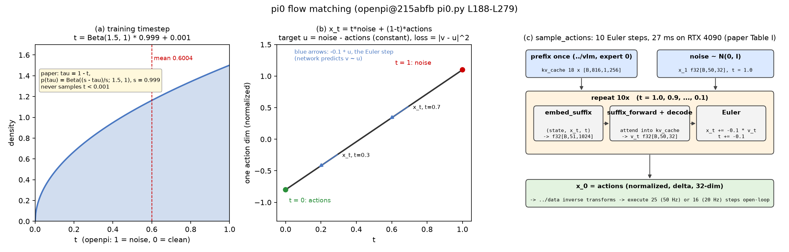

# π0 · flow_matching: 时间步采样, 线性插值与目标速度, MSE loss, 10 步 Euler 采样

本 module 复现 π0 的 flow-matching 训练目标和采样过程: 训练时怎么把干净的 action chunk 加噪、让网络预测什么、loss 怎么算; 推理时怎么从纯噪声出发用 10 步 Euler 积分得到动作. 网络本身 (双 expert transformer, suffix 嵌入, 速度场解码) 在 `../action_expert`; 本 module 只是围绕它的 "外壳".

上游: [openpi](https://github.com/Physical-Intelligence/openpi) @ `215abfb217dbac7d5f1273282331b9b1866c0479` (`openpi@215abfb`) 的 `src/openpi/models/pi0.py` `compute_loss` (L188-L214) 与 `sample_actions` (L216-L279); 论文 π0 [arXiv:2410.24164v1](https://arxiv.org/abs/2410.24164v1) Sec. III, Appendix B "Sampling the flow matching timestep", Fig. 14, Appendix D. PyTorch 重写, 不 import openpi.

按仓库约定, `model.py` 只有推理 (Euler 采样), `train.py` 放时间步采样、插值、loss 和训练式 joint forward.



## 1. I/O 契约

### 1.1 推理: `model.py`

**`make_velocity_fn(llm, proj, kv_cache, prefix_mask, state)`** → 一个函数 `v(x_t, t)`: float32[B, 50, 32] × float32[B] → float32[B, 50, 32]. 把 `../action_expert` 的 `embed_suffix → suffix_forward → decode` 打包成 "给定当前带噪动作和时间步, 返回速度场". prefix 的 KV cache 和 state 在闭包里固定, 10 步内不变.

**`sample_actions(velocity_fn, noise, num_steps=10)`** (`pi0.py` L216-L279)

| 名称 | shape / dtype | 取值 | 说明 |
|---|---|---|---|
| 入 `velocity_fn` | 函数 | | 上面那个; 测试里可换成任意 oracle |
| 入 `noise` | float32[B, 50, 32] | N(0, I) | 起点 x_1; openpi 允许外部传入以便复现 (L223, L230-L231) |
| 入 `num_steps` | int | 10 | 论文与 openpi 默认 10 (L222; 论文 Sec. III "10 integration steps") |
| 出 | float32[B, 50, 32] | 归一化空间 | 去噪后的 action chunk x_0; 之后交给 `../data` 的逆变换 (unnormalize, delta → 绝对, 截回原生维度) |

积分: `dt = −1 / num_steps`, 从 t = 1.0 开始, `x ← x + dt · v(x, t)`, `t ← t + dt`, 循环条件 `t ≥ −dt / 2` (浮点鲁棒, L273-L276), 共 `num_steps` 次. 时间步网格 1.0, 0.9, …, 0.1.

### 1.2 训练: `train.py`

**`sample_timestep(B, generator=None)`** → float32[B] ∈ [0.001, 1.0]: `Beta(1.5, 1) · 0.999 + 0.001` (`pi0.py` L197).

**`interpolate(actions, noise, t)`** → `(x_t, u_t)` (`pi0.py` L198-L200):

| 名称 | shape / dtype | 说明 |
|---|---|---|
| 入 `actions` | float32[B, 50, 32] | `../data` 输出的归一化、delta 化、零填充到 32 维的真实 chunk |
| 入 `noise` | float32[B, 50, 32] | ε ~ N(0, I) |
| 入 `t` | float32[B] | 每个样本一个 |
| 出 `x_t` | float32[B, 50, 32] | `t · noise + (1 − t) · actions` |
| 出 `u_t` | float32[B, 50, 32] | `noise − actions`, 与 t 无关 |

**`make_train_velocity_fn(llm, proj, prefix_emb, prefix_mask, prefix_ar, state)`** → `v(x_t, t)`: 与推理版接口相同, 但内部走训练式 joint forward (`joint_forward`, `pi0.py` L202-L211): prefix 和 suffix 一次前向 867 个 token, 无 cache.

**`compute_loss(velocity_fn, actions, noise, t)`** → float32[B, 50] (`pi0.py` L212-L214): `mean_d (v(x_t, t) − u_t)²`, 对 32 个 action 维取平均, 保留 batch 和 horizon 维; 训练 loop 再对这两维取平均 (`../train`).

### 1.3 符号约定: openpi 的 t 与论文的 τ 相反

openpi 用扩散文献的约定: t = 1 是纯噪声, t = 0 是干净动作, 推理从 t = 1 积分到 0, `dt = −0.1` (`pi0.py` L226-L228 注释: "yes, this is the opposite of the pi0 paper, and I'm sorry"). 论文正文 τ = 0 是噪声, τ = 1 是动作, 从 0 积分到 1, δ = +0.1. 换算 τ = 1 − t, 两边逐条对应:

| 论文 (τ) | openpi / 本仓库 (t = 1 − τ) |
|---|---|
| A^τ = τ A + (1 − τ) ε | x_t = t · ε + (1 − t) · A |
| 目标 u = A − ε | u = ε − A |
| A^{τ+δ} = A^τ + δ v, δ = 0.1 | x_{t+dt} = x_t + dt · v, dt = −0.1 |
| p(τ) = Beta((s − τ) / s; 1.5, 1), s = 0.999 | t = b · 0.999 + 0.001, b ~ Beta(1.5, 1) |

最后一行的等价性: 论文的式子是 (s − τ) / s ~ Beta(1.5, 1), 即 τ = s (1 − b); 代入 t = 1 − τ = 1 − s + s b = 0.001 + 0.999 b. 精确一致. 本仓库全部按 openpi 的 t.

## 2. 复现范围

| 有代码 | 只有事实 (背景) |
|---|---|
| Beta 时间步采样, 线性插值, 目标速度, MSE | 为什么选 Beta 而不是均匀 / logit-normal (第 4.2 节) |
| 10 步 Euler 采样, 前缀 cache 复用 | 训练 loop, 优化器, 冻结 (→ `../train`) |
| 训练式 joint forward 与推理式 cache 路径的速度场一致性检查 | 归一化逆变换与执行 (→ `../data`, `../infer`) |

## 3. 推理侧

一次 `sample_actions` (`pi0.py` L216-L279, 论文 Appendix D):

1. `../vlm` 跑一次 prefix, 得 KV cache (不在本 module).
2. `noise ~ N(0, I)`, shape [B, 50, 32], t = 1.0.
3. 循环 10 次: `embed_suffix(state, x_t, t)` → 51 token → `suffix_forward` (attend 到 cache) → `decode` → v; `x_t ← x_t − 0.1 · v`; `t ← t − 0.1`.
4. 返回 x_0.

延时: 论文 Table I "x10 action forward pass (flow)" 27 ms (RTX 4090, 三张图), 即每步约 2.7 ms; 端到端 73 ms. 论文 Appendix D 还说明 s = 0.999 的截断允许最多 1000 步 (δ > 1 − s), 但实验用 10.

执行: 得到 50 步 chunk 后开环执行, 50 Hz 机器人执行 25 步 (0.5 s) 再推理, 20 Hz UR5e / Franka 执行 16 步 (0.8 s); 论文试过 temporal ensembling, 有害, 未采用 (Appendix D).

## 4. 训练侧

### 4.1 一步训练的前向 (`pi0.py` L188-L214)

1. `../data` 给出 `Observation` 和 `actions` [B, 50, 32].
2. `noise ~ N(0, I)`, `t = sample_timestep(B)`.
3. `x_t, u_t = interpolate(actions, noise, t)`.
4. `embed_prefix` (`../vlm`) 与 `embed_suffix(state, x_t, t)` (`../action_expert`), 拼成 867 token, `joint_forward` 一次前向, 两个 expert 都在场, 无 cache.
5. `decode` 后 50 个 token 得 v, `loss = mean_d (v − u_t)²`, shape [B, 50].

三点值得注意:
- loss 对 32 个维度全算, 包括零填充的维度 (`pi0.py` L214 对最后一维取 mean, 没有 mask). 填充维的目标是 u = noise − 0 = noise, 网络要学会在这些维输出噪声本身. 本仓库同.
- chunk 尾部越过 episode 末尾的重复动作也没有 loss mask (见 `../data` README 4.1).
- 每个样本只采一个 t, 整个 chunk 的 50 步共用 (`time[..., None, None]`, L198).

### 4.2 为什么时间步偏向噪声大的一侧 (论文 Appendix B 原话的转述)

原始 flow matching 用均匀 τ; SD3 (Esser et al.) 用 logit-normal 强调中间时间步, 理由是噪声很小时网络只需学恒等映射、噪声很大时只需学数据均值, 都简单. π0 作者认为动作预测不同: 给定观测预测 "平均动作" E[A_t | o_t] 本身就很难, 因为观测对动作分布的约束远比文本对图像分布的约束强. 所以把采样往噪声大的一侧偏 (Beta(1.5, 1) 在 t = 1 处密度最大, 均值 0.6), 并且完全不采 t < 0.001 (论文的 τ > s), 理由是只要积分步长大于 1 − s 就用不到那一段.

## 5. 评测

`test_parity.py` (CPU, 约 3 秒):

- `sample_timestep` 落在 [0.001, 1.0], 大样本均值接近 0.6 · 0.999 + 0.001 = 0.6004, 且大于 0.5 (偏向噪声侧);
- `interpolate` 端点: t = 0 得 actions, t = 1 得 noise, u 与 t 无关;
- Euler 用 oracle 速度 `u = noise − actions` 从 noise 出发 10 步精确回到 actions (线性路径下 Euler 无误差), 且恰好调用 10 次, 时间网格 1.0 … 0.1;
- 用 tiny 模型: `sample_actions` 输出 shape, `compute_loss` shape [B, 50], oracle 速度下 loss 为 0;
- 训练式 `make_train_velocity_fn` 与推理式 `make_velocity_fn` 在相同 (x_t, t) 下给出相同速度 (与 `../action_expert` 的 cache 一致性是同一件事, 在本 module 的接口上再确认一次).

```
uv run pytest pi/pi0/flow_matching -q
uv run python -m pi.pi0.flow_matching.model     # 10 步 Euler, 逐步打印 t, |v|, x_t 的变化
uv run python -m pi.pi0.flow_matching.train     # 一步训练前向, 打印 t, x_t, u_t, loss
```

## 6. cost 信息

| 项目 | 值 | 来源 |
|---|---|---|
| 去噪步数 | 10 | π0 Sec. III; `pi0.py` L222 |
| 10 步延时 | 27 ms, RTX 4090, 三张图 | π0 Table I |
| 端到端 | 73 ms 板上, 86 ms 离板 | π0 Table I |
| 时间步分布 | Beta(1.5, 1), 截断 s = 0.999 | π0 Appendix B; `pi0.py` L197 |
| 执行长度 | 25 步 @ 50 Hz, 16 步 @ 20 Hz | π0 Appendix D |
| 训练 GPU 时间 | 未披露 | gap ledger |

## 7. reference 映射表

| 本仓库 | 上游 |
|---|---|
| `sample_timestep` | `pi0.py` L197; 论文 Appendix B, Fig. 14 |
| `interpolate` | `pi0.py` L198-L200; 论文 Sec. III (τ 约定相反, 见 1.3) |
| `joint_forward` | `pi0.py` L202-L211 |
| `make_train_velocity_fn`, `compute_loss` | `pi0.py` L188-L214 |
| `make_velocity_fn` | `pi0.py` L239-L269 (`step` 内部) |
| `sample_actions` | `pi0.py` L216-L279; 论文 Sec. III Euler 公式, Appendix D |
| 符号约定 | `pi0.py` L226-L227 注释 |

## 8. gap ledger

| 未披露 / 未复现 | 说明 |
|---|---|
| loss 的 batch 内聚合与加权 | `compute_loss` 返回 [B, 50]; 对 batch / horizon 的 mean 与数据混合权重在训练 loop (→ `../train`) |
| 填充维度与越界步的 loss mask | openpi 没有, 本仓库同; 记录在 4.1 |
| 采样器 | 只有 Euler; openpi 没有其他积分器 |
| 推理时的 noise 种子 | openpi 由 rng 给出, 可外部传入; 本仓库由调用方传 `noise` |
| 训练 GPU 时间 | 未披露 |
| 数值对齐 | 只对齐 shape 与解析性质 (仓库原则 1) |

## 9. 机器人概念表

**开环执行 chunk (open-loop chunk execution)**
- shape: 从 x_0 [50, 32] 里取前 25 (或 16) 行, 逆变换后逐步发给控制器.
- 物理含义: 推理一次, 机器人按预测盲跑 0.5 s (或 0.8 s), 期间不看新的观测.
- 为什么这样: 推理 73 ms 远慢于 20 ms 控制周期, 只能批量给动作; 论文试过把相邻两次推理的 chunk 加权平均 (temporal ensembling), 反而变差.
- 硬件联系: 执行步数由控制频率与推理延时共同定; 50 Hz 用 25 步, 20 Hz 用 16 步.

**噪声与归一化空间**
- x_1 = ε ~ N(0, I) 与 actions 在同一个 z-score 空间, 这是 `../data` 归一化的意义; 若某维 std 极小, 归一化后 actions 量级可能远超噪声, 属数据侧问题.
