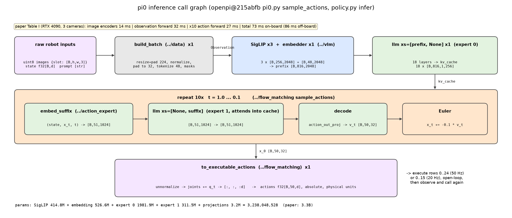

# π0 · infer: 端到端推理链路, 参数量表, 各环节延时表

本 module 把前四个 module 组装成一个可调用的 policy: 原始相机帧 + 原始本体状态 + 一句指令 → 该机器人原生维度的 50 步动作. 没有新的数学; 新的东西是 "谁在什么时候被调用一次", 以及整套模型的参数量和延时账.

上游: [openpi](https://github.com/Physical-Intelligence/openpi) @ `215abfb217dbac7d5f1273282331b9b1866c0479` (`openpi@215abfb`) 的 `src/openpi/models/pi0.py` (`Pi0.__init__` L66-L103, `sample_actions` L216-L279), `src/openpi/policies/policy.py` (`Policy.infer` L67-L106), `src/openpi/policies/policy_config.py` (`create_trained_policy` L18-L95), `src/openpi/policies/libero_policy.py`; 论文 π0 [arXiv:2410.24164v1](https://arxiv.org/abs/2410.24164v1) Sec. III, Sec. V, Appendix D 与 Table I, Appendix E. PyTorch 重写, 不 import openpi.



## 1. I/O 契约

**`Pi0(vit_cfg, experts, action_dim=32, action_horizon=50)`**: 一个 `nn.Module`, 持有 π0 的全部权重. 子模块与 openpi 的参数树对应 (`pi0.py` L69-L100):

| 本仓库 | openpi | 内容 |
|---|---|---|
| `img` | `PaliGemma.img` | SigLIP So400m/14 (`../vlm`) |
| `embedder` | `PaliGemma.llm.embedder` | 词表 257152 × 2048 (`../vlm`) |
| `llm` | `PaliGemma.llm.layers / final_norms` | 18 层双 expert Gemma (`../action_expert` 的 `MoEGemma`) |
| `proj` | `Pi0.state_proj / action_in_proj / action_time_mlp_in / action_time_mlp_out / action_out_proj` | 五个投影层 (`../action_expert` 的 `ActionProjections`) |

**`Pi0.embed_prefix(observation)`** → `(prefix_emb f32[B, 816, 2048], prefix_mask bool[B, 816], prefix_ar bool[816])`; **`Pi0.prefix_cache(observation)`** → `(kv_cache, prefix_mask)`: prefix 跑一次 expert 0.

**`Pi0.sample_actions(observation, noise, num_steps=10)`** (`pi0.py` L216-L279)

| 名称 | shape / dtype | 说明 |
|---|---|---|
| 入 `observation` | `../data` 的 `Observation` | 三张 [B, 224, 224, 3] ∈ [−1, 1] 图, 三个 bool[B] mask, state f32[B, 32] (归一化), prompt int64[B, 48] + mask |
| 入 `noise` | f32[B, 50, 32] | N(0, I); 由调用方传入以便复现 |
| 出 | f32[B, 50, 32] | 归一化、delta、填充的动作 chunk |

**`Pi0Policy(model, tokenizer, norm_stats, delta_mask, native_dim).infer(raw, noise)`** (`policy.py` L67-L106)

| 名称 | shape / dtype | 说明 |
|---|---|---|
| 入 `raw["images"][k]` | uint8[B, h, w, 3] | `IMAGE_KEYS` 的子集, 任意分辨率 |
| 入 `raw["state"]` | f32[B, d] | 原始单位, d = 该机器人原生维度 |
| 入 `raw["prompt"]` | list[str] | 指令 |
| 出 `actions` | f32[B, 50, d] | 原生维度、物理单位、绝对目标; 每行一个控制步 |
| 出 `timing` | dict[str, ms] | 各环节耗时 (本机测量, 只供对照结构, 不可与论文比) |

`infer` 内部顺序 (`policy_config.py` L77-L88 的输入 / 输出 transform 链):

```
raw ─ build_batch (../data, train=False) ─→ Observation
    ─ Pi0.prefix_cache      (SigLIP × 3 + embed + expert 0 一次)   ─→ kv_cache
    ─ sample_actions        (10 × [embed_suffix → suffix_forward → decode → Euler])   ─→ x_0
    ─ to_executable_actions (../flow_matching: unnormalize → to_absolute → 截维)       ─→ actions
```

## 2. 复现范围

| 有代码 | 只有事实 (背景) |
|---|---|
| `Pi0` 的组装与 `sample_actions` | checkpoint 下载与 JAX → PyTorch 权重映射 (gap ledger) |
| `Pi0Policy.infer` 的全链路 | 各机器人平台的 adapter (相机改名, 夹爪换算, `libero_policy.py`, `aloha_policy.py`) |
| 评测循环 (`eval.py`: 环境接口, 重规划, 打分, 聚合), LIBERO 观测转换 | LIBERO 仿真器与任务文件本身; 论文的真机评测数字 |
| paper 配置的参数量表 (meta 设备) | 部署形态 (websocket server / client, 离板推理) |
| tiny 配置的逐环节计时 | |

## 3. 推理侧

### 3.1 一次 `infer` 里每个部件各跑几次

| 部件 | 次数 | 输入 → 输出 | 所属 module |
|---|---|---|---|
| `build_batch` | 1 | raw → `Observation` | data |
| SigLIP | 3 (每个相机槽位一次, 含填充槽) | [B, 224, 224, 3] → [B, 256, 2048] | vlm |
| `embedder` | 1 | int64[B, 48] → [B, 48, 2048] | vlm |
| `llm`, xs = [prefix, None] | 1 | [B, 816, 2048] → 18 层 kv cache [B, 816, 1, 256] | action_expert |
| `proj.embed_suffix` | 10 | (state, x_t, t) → [B, 51, 1024] | action_expert |
| `llm`, xs = [None, suffix] | 10 | [B, 51, 1024] + cache → [B, 51, 1024] | action_expert |
| `proj.decode` + Euler | 10 | → v_t [B, 50, 32], x_t ← x_t − 0.1 v_t | flow_matching |
| `to_executable_actions` | 1 | [B, 50, 32] → [B, 50, d] | flow_matching |

### 3.2 参数量表 (paper 配置, 本仓库在 meta 设备上精确计数, `test_parity.py` 断言)

| 部件 | 参数量 | 备注 |
|---|---|---|
| SigLIP So400m/14 含 head | 414,803,696 | `../vlm` |
| 词表嵌入 257152 × 2048 | 526,647,296 | `../vlm` |
| Gemma 2B 18 层 + final_norm (expert 0) | 1,981,884,416 | Gemma 论文 Table 2 精确相等 |
| Gemma 300M 18 层 + final_norm (expert 1) | 311,464,960 | `gemma.py` L70 "311M" |
| 五个投影层 | 3,248,160 | `../action_expert` |
| **合计** | **3,238,048,528** | 论文 "3.3 billion" |

推理时每个 token 实际经过的参数: prefix token 走 expert 0 (约 2.5B 含嵌入), suffix token 走 expert 1 (约 0.31B); 没有 token 同时走两套.

### 3.3 延时表

论文 Table I (NVIDIA RTX 4090, 三张图, bfloat16, JAX):

| 环节 | 论文 | 本仓库对应 |
|---|---|---|
| image encoders | 14 ms | SigLIP × 3 |
| observation forward pass | 32 ms | `embedder` + `llm` [prefix, None] |
| ×10 action forward pass (flow) | 27 ms | 10 × (`embed_suffix` + `llm` [None, suffix] + `decode`) |
| network latency (if off-board) | 13 ms | 不在本仓库 |
| total on-board | 73 ms | |
| total off-board | 86 ms | |

`Pi0Policy.infer` 返回同样切分的 `timing` (本机 CPU, tiny 配置, float32), 只用来看各环节的相对结构, 数值与论文没有可比性; `main()` 会打印. 论文 Table I 不含数据预处理与逆变换的时间, 本仓库的 `timing` 多出这两项.

### 3.4 执行节奏

得到 50 步 chunk 后开环执行前 25 步 (50 Hz 机器人, 0.5 s) 或 16 步 (20 Hz UR5e / Franka, 0.8 s), 然后重新观测、推理 (论文 Appendix D). 不做 temporal ensembling. 这意味着推理延时 73 ms 占用了 0.5 s 周期的 15%, 期间机器人仍在执行上一个 chunk 的剩余动作, 所以延时不直接造成停顿.

## 4. 训练侧

本 module 没有训练代码. 训练时 `Pi0` 的同一套权重用 `../flow_matching/train.py` 的 `compute_loss` (joint forward, 无 cache); 优化器、schedule、冻结、数据混合在 `../train`.

## 5. 评测

不复现论文数字, 但评测的接口、任务、指标和代码流程在 `eval.py` 里写全, 用 `ToyEnv` 假环境跑通. π0 论文的评测全部在真机上做 (Sec. V), 没有公开 benchmark 分数; openpi 唯一公开的评测代码是 LIBERO 仿真 (`examples/libero/main.py`), 下面两套都写.

### 5.1 评测数据集 / 环境接口

**LIBERO** (仿真, openpi 微调配置 `pi0_libero`, `config.py` L653-L676; 评测脚本 `examples/libero/main.py`):

| 项目 | 内容 | 上游 |
|---|---|---|
| 任务套件 | `libero_spatial` 10 任务, `libero_object` 10, `libero_goal` 10, `libero_10` 10, `libero_90` 90 | `main.py` L34-L35 |
| 每任务 episode 数 | 50, 每个 episode 用套件自带的一个固定初始状态 (`get_task_init_states`) | L38, L82, L97 |
| episode 上限 | spatial 220, object 280, goal 300, libero_10 520, libero_90 400 步 (按最长示教定) | L60-L71 |
| 观测键 | `agentview_image`, `robot0_eye_in_hand_image` (256 × 256 渲染, 都旋转 180° 以匹配训练数据), `robot0_eef_pos` [3], `robot0_eef_quat` [4] → 轴角 [3], `robot0_gripper_qpos` [2] | L18, L113-L139 |
| 送入策略 | 两张图 → `base_0_rgb`, `left_wrist_0_rgb` (右腕槽位填零并 mask), state 8 维, prompt = 任务的自然语言描述 | `libero_policy.py` L30-L84 |
| 动作 | 7 维: 6 个末端 delta + 1 夹爪; 策略输出 50 步取前 7 维 | `libero_policy.py` L94-L100 |
| 重规划 | 每次推理执行前 5 步再重新观测 (`replan_steps=5`), 与真机的 25 / 16 不同 | L29, L127-L148 |
| 起始等待 | 前 10 步发空动作 `[0]*6 + [-1]` 等物体落稳 | L17, L37, L106-L111 |
| 成功判定 | 环境 `done`: BDDL 目标谓词满足 | L153-L157 |

`eval.py` 里的 `Env` protocol 就是这张表的最小抽象: `reset(task_id, episode_idx) → (raw, prompt)`, `step(action) → (raw, done, info)`; `libero_obs_to_raw` 把 LIBERO 的观测字典转成 `../data` 的 `raw` (含 180° 旋转与四元数 → 轴角). LIBERO 本身 (仿真器, BDDL 文件, 初始状态) 不 vendor.

**真机 (论文)**: 观测 = 机器人相机 + 本体状态 + 指令, 与 `../data` 的 `raw` 相同; 环境是真实世界, 没有 `done`, 由人按 rubric 打分.

### 5.2 任务与指标

**指标定义**:

| 指标 | 定义 | 聚合 | 来源 |
|---|---|---|---|
| 二值成功率 (LIBERO) | episode 内 `done` 为 True 记 1, 否则 0 | 每任务 50 个 episode 取均值; 套件内各任务取均值; 表格报套件均值与四套件平均 | `main.py` L182-L185; `examples/libero/README.md` 结果表 |
| 归一化得分 (论文真机) | 完全成功 1.0; 部分成功按 rubric 给分 = 得到的分 / 满分 | 每任务每方法 10 个 episode 取均值 | π0 Sec. V-A, Appendix E |

**论文的任务与 rubric** (Appendix E; `eval.py` 的 `rubric_score(points, max_points)`):

| 实验 | 任务 | 满分与计分 |
|---|---|---|
| A. 预训练直接评测 | 叠衬衫 | 成功 / 失败 (袖子折入 + 对折一次); 4 小 + 1 中号, 各 2 次, 上限 15000 步 ≈ 5 分钟 |
| | bussing easy / hard | 7 / 12 件物品, 每件放对 1 分 |
| | 装杂货 | 7 件, 每件入袋 1 分 |
| | 取吐司 | 4 分: 每片吐司取出 1 分、放盘 1 分 |
| B. 语言跟随 | bussing, 摆桌, 装杂货 | 按正确重定位每个物体、是否服从指令计分; 每 episode 12 / 7 / 7 件物品, 约 30 / 20 / 14 条指令 |
| C. 微调新任务 | 叠碗 | 3 分: 两次叠放各 1 分 + 整洁 1 分 |
| | 叠毛巾 | 3 分: 两次对折各 1 分 + 整洁 1 分 |
| | 微波炉放保鲜盒 | 4 分: 开门, 拿盒, 放入, 关门 |
| | 换纸巾 | 4 分: 抓旧卷, 取下, 抓新卷, 放上 |
| | 抽屉放物 | 5 分: 开抽屉, 3 件物品各 1 分, 关抽屉 |
| D. 多阶段长任务 | 叠衣 (固定 / 移动) | 每件 4 分: 取出, 铺平, 折叠, 放角落或叠上; 5 件衣物各 2 次, 上限 15000 步 |
| | 桌面 bussing | 12 分, 同 hard |
| | 装箱 | 5 分: 拿起, 对折, 右盖, 左盖, 摆正 |
| | 装蛋 | 7 分: 6 个蛋各 1 分 + 关盖 |
| | 装食物 | 5 分: 拿起餐盘, 3 样食物各 1 分, 关盒 |
| | 卸烘干机 | 5 分: 接近, 放篮, 开门, 装衣, 关门 |

**LIBERO 的任务**: 每个套件 10 个 (libero_90 为 90 个) 自然语言任务, 例如 spatial 套件是同一套物体在不同空间关系下的摆放; 任务描述由套件对象的 `task.language` 给出 (`main.py` L191), 本仓库不列全 (gap ledger).

### 5.3 评测代码流程 (`eval.py`, 对应 `main.py` L48-L186)

```
evaluate(policy, env, num_tasks, num_trials, max_steps)
  for task_id:
    for episode_idx:                                   run_episode
      obs, prompt = env.reset(task_id, episode_idx)    # LIBERO: reset + set_init_state(initial_states[episode_idx])
      前 num_steps_wait 步发 dummy action               # LIBERO: 10 步等物体落稳
      plan = deque()
      while t < max_steps and not done:
        if plan 为空:                                   # 上一个 chunk 执行完
          raw = libero_obs_to_raw(obs, prompt)          # 旋转 180°, 四元数 → 轴角, 拼 8 维 state
          chunk = policy.infer(raw)["actions"][0]       # [50, 7]; 内部: build_batch → prefix → 10 步 Euler → 逆变换
          plan.extend(chunk[:replan_steps])             # 只留 5 步
        obs, done, _ = env.step(plan.popleft())
      score = 1.0 if done else 0.0                      # 或 rubric_score(points, max_points)
    per_task[task_id] = mean(score)
  mean_over_tasks, mean_over_episodes
```

与真机的区别只有两处: `replan_steps` 5 vs 25 / 16 (Appendix D), 以及 `done` 由仿真给出 vs 人按 rubric 给分.

### 5.4 已披露的数字 (只陈述)

| 模型 | Spatial | Object | Goal | LIBERO-10 | 平均 | 来源 |
|---|---|---|---|---|---|---|
| π0.5 微调 30k 步 (`pi05_libero`) | 98.8 | 98.2 | 98.0 | 92.4 | 96.85 | `examples/libero/README.md` |
| π0 (本仓库复现的模型) | 未披露 | | | | | π0 论文 v1 无 LIBERO 数字; openpi README 只给 π0.5 |

论文 Fig. 7 / 9 / 11 / 12 的真机得分以图给出, 无表格数值, 不转录.

### 5.5 本仓库的检查

`test_parity.py` (CPU, 约 6 秒):

- paper 配置在 meta 设备上的总参数量 3,238,048,528 与 3.2 节分项;
- tiny 配置 `Pi0.sample_actions` 与手工串联 `../vlm` / `../action_expert` / `../flow_matching` 的结果逐元素相等;
- `Pi0Policy.infer` 端到端 shape: 7 维单腕相机与 14 维双腕相机两台假想机器人;
- 传入相同 `noise` 时输出确定; 夹爪维不加 state, 关节维加 state;
- 评测循环: 推理调用次数 = ⌈步数 / replan_steps⌉, 上限步数生效, 成功计分与两种聚合正确, `libero_obs_to_raw` 的 shape 与 180° 旋转, `quat2axisangle` 的恒等四元数给零向量.

```
uv run pytest pi/pi0/infer -q
uv run python -m pi.pi0.infer.model      # tiny 配置端到端一次, 打印每环节 shape 与耗时
uv run python -m pi.pi0.infer.eval       # 假环境上 2 任务 x 3 episode 的评测循环
```

## 6. cost 信息

| 项目 | 值 | 来源 |
|---|---|---|
| 总参数量 | 3,238,048,528 | 本仓库解析; 论文 "3.3B" |
| 推理端到端 | 73 ms 板上 / 86 ms 离板, RTX 4090 | π0 Table I |
| 推理频率 | 每 0.5 s (50 Hz 机器人) 或 0.8 s (20 Hz) 一次 | π0 Appendix D |
| 部署精度 | bfloat16 (`pi0_config.py` L20; `policy_config.py` L60-L63 以 bf16 加载) | openpi |
| 发布 checkpoint | `gs://openpi-assets/checkpoints/pi0_base/params` 与各机器人微调版 | `config.py` L673 等 |
| 推理硬件要求 | 论文只给 4090; openpi README 未在本仓库 pin | gap ledger |

## 7. reference 映射表

| 本仓库 | 上游 |
|---|---|
| `Pi0.__init__` 子模块 | `pi0.py` L66-L103 |
| `Pi0.embed_prefix` | `pi0.py` L106-L137 (与 `../vlm` 相同) |
| `Pi0.prefix_cache` | `pi0.py` L233-L237 |
| `Pi0.sample_actions` | `pi0.py` L216-L279 |
| `Pi0Policy.infer` 输入链 | `policy.py` L67-L72; `policy_config.py` L77-L83 (repack → prompt 注入 → robot inputs → Normalize → model transforms) |
| `Pi0Policy.infer` 输出链 | `policy.py` L92-L106; `policy_config.py` L84-L88 |
| 计时 | `policy.py` L91-L106 (`policy_timing.infer_ms` 只计模型) |
| 机器人 adapter | `libero_policy.py` L30-L100, `aloha_policy.py` |
| `eval.py` 常量, `libero_obs_to_raw`, `quat2axisangle` | `examples/libero/main.py` L17-L18, L28-L38, L60-L71, L113-L141, L199-L214 |
| `run_episode`, `evaluate` | `examples/libero/main.py` L75-L186; 论文 Sec. V-A, Appendix D |
| `rubric_score` | 论文 Appendix E |
| 论文 | Sec. III (模型), Sec. V (评测), Appendix D + Table I (推理), Appendix E (rubric) |

## 8. gap ledger

| 未披露 / 未复现 | 说明 |
|---|---|
| 权重加载 | 不下载 checkpoint, 不做 JAX → PyTorch 映射; 属性名已按 openpi 命名 |
| bfloat16 部署 | 本仓库 float32 |
| 编译 / JIT | openpi JAX 版 `nnx_utils.module_jit`, PyTorch 版 `torch.compile` (`pi0_config.py` L35); 本仓库无 |
| 服务化 | openpi 的 websocket policy server / client 不复现 |
| 机器人 adapter | 相机改名、夹爪换算是每台机器人一份的代码, 本仓库只在 `../data` 讲了槽位规则 |
| 4090 之外的延时 | 未披露 |
| 公开 benchmark 分数 | 论文 v1 未报 LIBERO; openpi 只报 π0.5 的 LIBERO 分数 |
| LIBERO 任务全文 | 由 LIBERO 包的 `task.language` 给出, 本仓库不 vendor; LIBERO 论文 arXiv:2306.03310 未 pin 版本 |
| 真机评测 | 无法复现; rubric 已转录 |
| 数值对齐 | 只对齐参数量与 shape |

## 9. 机器人概念表

本 module 没有新的机器人概念. 组装层面与硬件的联系有两条: `Pi0Policy` 构造时绑定一台机器人的 `norm_stats`, `delta_mask`, `native_dim` (换机器人要换这三样, 模型权重可以不换, 见 `../data` README 第 9 节); `infer` 的调用节奏由控制频率和执行步数决定 (第 3.4 节).
