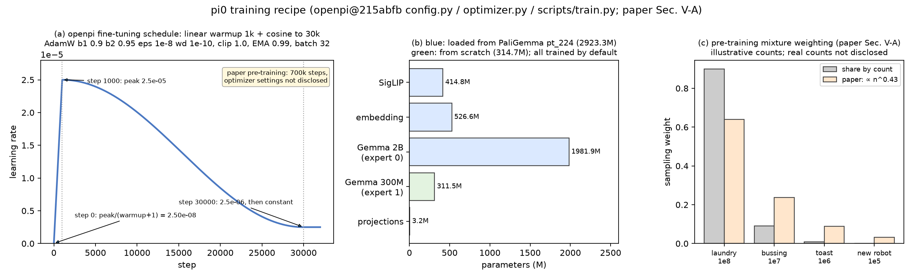

# π0 · train: 优化器与 schedule, 冻结 / LoRA, 预训练 → post-training 两阶段, cost 表

本 module 复现 π0 训练 loop 的全部数学: 学习率 schedule, AdamW 的每个超参, 梯度裁剪, EMA, 哪些参数从 PaliGemma 加载、哪些从零训练、哪些冻结, 以及数据混合的加权公式. loss 本身在 `../flow_matching/train.py`, 模型在 `../infer`. 分片、bf16、checkpoint 管理、wandb 是可省的系统工程, 不复现.

上游: [openpi](https://github.com/Physical-Intelligence/openpi) @ `215abfb217dbac7d5f1273282331b9b1866c0479` (`openpi@215abfb`) 的 `src/openpi/training/config.py` (`TrainConfig` L465-L556, 各配置 L560-L960), `src/openpi/training/optimizer.py`, `src/openpi/training/weight_loaders.py`, `scripts/train.py` (`init_train_state` L85-L133, `train_step` L137-L191), `src/openpi/models/lora.py`; 论文 π0 [arXiv:2410.24164v1](https://arxiv.org/abs/2410.24164v1) Sec. V-A (数据混合与加权, post-training), Sec. VI-A (训练步数). PyTorch 重写, 不 import openpi.

**重要区分**: 论文的预训练 (10k 小时混合数据, 700k 步) 的优化器超参**没有披露**; openpi 公开的 `TrainConfig` 默认值是**微调 (post-training) 用的**, 例如 `pi0_libero` 从 `pi0_base` checkpoint 起训 30k 步. 本 module 的数值全部来自 openpi 微调配置, 预训练的进 gap ledger.



## 1. I/O 契约

**`TrainConfig`** (数值 = `openpi@215abfb config.py` L465-L556 与 `optimizer.py` 的默认值):

| 字段 | 值 | 上游 |
|---|---|---|
| `warmup_steps` | 1,000 | `optimizer.py` L19 |
| `peak_lr` | 2.5e-5 | L20 |
| `decay_steps` | 30,000 (含 warmup 的总长) | L21 |
| `decay_lr` | 2.5e-6 | L22 |
| `b1`, `b2`, `eps` | 0.9, 0.95, 1e-8 | L69-L71 |
| `weight_decay` | 1e-10, 施加到全部可训练参数 (不区分 bias / norm; `weight_decay_mask=None`, `train.py` L88); 注释说设 0 会 OOM | L72-L73 |
| `clip_gradient_norm` | 1.0, 全局范数 | L74, L85 |
| `ema_decay` | 0.99 (LoRA 微调关闭) | `config.py` L489, L697 |
| `batch_size` | 32 (全局) | L505 |
| `num_train_steps` | 30,000 | L510 |
| 精度 | 可训练参数 float32, 冻结参数转 bfloat16; PyTorch 版训练精度默认 bfloat16 | `train.py` L104; `config.py` L485 |

**`lr_at(step, cfg)`** → float: optax `warmup_cosine_decay_schedule` 的复现. `step = 0` 时 `peak / (warmup + 1)`, 线性升到 `step = warmup` 的 `peak`, 之后余弦降到 `step = decay_steps` 的 `decay_lr`, 再之后恒为 `decay_lr` (`optimizer.py` L24-L31).

**`split_params(model)`** → `{"from_paligemma": [...], "from_scratch": [...]}`: 哪些参数由 PaliGemma checkpoint 覆盖 (`img`, `embedder`, `llm.layers[*].experts[0]`, `llm.final_norms[0]`), 哪些保持随机初始化 (`experts[1]`, `final_norms[1]`, `proj`) (`weight_loaders.py` L58-L73 `_merge_params(missing_regex=".*")`: 同名覆盖, 其余保留).

**`make_optimizer(params, cfg)`** → `torch.optim.AdamW` (无 lr, 每步由 `lr_at` 设); **`clip_and_step(model_params, optimizer, cfg, step)`** → grad_norm.

**`EMA(params, decay)`**: `ema ← decay · ema + (1 − decay) · param`, 覆盖全部参数含冻结的 (`train.py` L169-L175); 推理用 EMA 权重 (openpi checkpoint 保存 `ema_params`).

**`train_step(pi0, batch, optimizer, ema, cfg, step)`** → `{"loss", "grad_norm", "param_norm", "lr"}` (`train.py` L137-L191): loss = `compute_loss(...)` 的全均值 (对 batch 和 50 步取 mean, L150-L151); `param_norm` 只统计二维以上的 kernel, 排除 bias / scale / pos_embedding / input_embedding (L177-L185).

**`mixture_weights(counts)`** → 每个 (任务, 机器人) 组合的采样权重 ∝ n^0.43, 归一化 (论文 Sec. V-A). openpi 的公开代码只训单数据集, 没有实现这个加权; 本仓库按论文公式给出.

**`select_trainable(pi0, freeze)`**: `freeze="nothing"` 是 openpi 默认 (全参数微调, `config.py` L492 `nnx.Nothing`); LoRA 变体的冻结规则见第 4.3 节 (LoRA 层本身未实现).

## 2. 复现范围

| 有代码 | 只有事实 (背景) |
|---|---|
| warmup + cosine schedule, AdamW 超参, 全局范数裁剪, EMA | 预训练的优化器超参、算力、时长 (未披露) |
| 参数分组: 加载 vs 从零 | PaliGemma checkpoint 的实际读取与 JAX → PyTorch 映射 |
| 训练 step 与三个指标 | LoRA 层 (`lora.py`), 冻结参数转 bf16, FSDP, checkpoint / 恢复, wandb |
| 数据混合权重 n^0.43 | 混合数据本身 (10k 小时, 不公开) |
| `tiny` 配置几步训练 | 预训练 → post-training 的 curriculum 细节 (第 4.4 节) |

## 3. 推理侧

训练后用 EMA 权重推理 (openpi checkpoint 同时保存 `params` 与 `ema_params`, 推理加载后者). 其余见 `../infer`.

## 4. 训练侧

### 4.1 一步训练 (`train.py` L137-L191)

1. `../data` 的 `build_batch(train=True)` 给出 `Observation` 与 `actions` [32, 50, 32], 训练时做图像增广.
2. `../flow_matching/train.py`: 采 t, noise, 算 `x_t`, joint forward, `compute_loss` → [32, 50]; 取全均值得标量 loss.
3. 只对可训练参数求梯度 (`trainable_filter`, L157-L160).
4. 全局范数裁剪到 1.0 → AdamW 更新 (`optimizer.py` L85).
5. EMA 更新全部参数 (L169-L175).
6. 记录 loss, grad_norm (裁剪前), param_norm (kernel).

### 4.2 参数从哪里来

| 组 | 参数量 | 来源 |
|---|---|---|
| `img` (SigLIP), `embedder`, `experts[0]` + `final_norms[0]` (Gemma 2B) | 2,923,335,408 | 预训练: PaliGemma `pt_224.npz` (`PaliGemmaWeightLoader`, `weight_loaders.py` L58-L73); 微调: 上一阶段 checkpoint (`CheckpointWeightLoader`, L38-L54) |
| `experts[1]` + `final_norms[1]` (Gemma 300M), `proj` | 314,713,120 | 预训练: 随机初始化 (论文 Sec. III "initialized from scratch"); 微调: 上一阶段 checkpoint |

openpi 的做法是先按 config 随机初始化整棵参数树, 再用加载的权重覆盖同名项, 其余保留 (`_merge_params`). 名字对不上就是 "从零", 这就是 expert 1 的参数名带 `_1` 后缀的原因 (`gemma.py` L443-L451).

### 4.3 冻结与 LoRA (只陈述)

- 默认全参数微调, 不冻结任何东西 (`freeze_filter = nnx.Nothing`).
- LoRA 变体 (`pi0_libero_low_mem_finetune`, `config.py` L679-L698): `gemma_2b_lora` 对 attention 与 FFN 的每个 einsum 加 rank 16, alpha 16 的 LoRA; `gemma_300m_lora` 用 rank 32, alpha 32 (`gemma.py` L88-L108). 缩放 alpha / rank = 1.0; A, B 都用 N(0, 0.01²) 初始化, 不是常见的 B 零初始化 (`lora.py` L18-L20, L30). 冻结规则 (`pi0_config.py` L88-L117): 冻结 `llm` 里所有非 LoRA 参数; SigLIP 与五个投影层不冻结; EMA 关闭. 冻结参数转 bfloat16 省显存 (`train.py` L104).
- 本仓库不实现 LoRA 层 (改变参数树, 不改变微调的数学; 属 gap ledger).

### 4.4 预训练 → post-training (论文 Sec. V-A, VI-A)

| 阶段 | 数据 | 步数 | 优化器 |
|---|---|---|---|
| 预训练 | π 自有 903M 时间步 (单臂 106M, 双臂 797M, 7 种构型, 68 任务) + 开源 OXE / Bridge v2 / DROID 占 9.1%; 合计 "超过 10,000 小时"; 各 (任务, 机器人) 组合按 n^0.43 加权 | 700k 步 (compute-parity 消融版 160k 步) | 未披露 |
| post-training | 单任务数据, 最简单 5 小时, 最复杂 100 小时以上 | openpi 微调配置 30k 步 | 本 README 第 1 节的 openpi 默认值 |

论文没有说预训练和 post-training 之间是否改 schedule、是否重置优化器; openpi 的微调是从 checkpoint 起新开一个 30k 步的 warmup + cosine.

### 4.5 openpi 里其他配置的偏离 (供对照, 不是 π0 的值)

`pi05_libero` (`config.py` L742-L762): batch 256, warmup 10k, peak 5e-5, `decay_lr = peak` (即 warmup 后恒定), EMA 0.999. DROID 微调 (`config.py` L848-L855): 100k 步, batch 256, 注释 "takes ~2 days on 8x H100s".

## 5. 评测

训练侧的评测就是 loss 曲线: openpi 没有 validation loop, 只记录训练 loss / grad_norm / param_norm (`train.py` L186-L190). 按仓库要求写出五项:

| 项目 | 内容 |
|---|---|
| (a) 数据接口 | 与训练相同的 `(Observation, actions)` batch, 由 `../data` 的 `build_batch(train=False)` 从留出的 episode 生成 (不增广) |
| (b) 任务 | 留出集上的 flow-matching loss; 真正的任务成功率见 `../infer/eval.py` |
| (c) 指标 | `mean_{batch, step, dim} (v − u)²`, 与训练 loss 同一定义; 为消除 t 的随机性, `evaluate_loss` 对每个 batch 用固定 seed 采 t 与 noise |
| (d) 代码 | `train.py` 的 `evaluate_loss(pi0, batches, seed)`; `main()` 在几步训练前后各算一次 |
| (e) 对齐 | openpi 无此 loop, 属本仓库补充; 数值不可比 |

`test_parity.py` (CPU, 约 8 秒): schedule 的四个锚点 (step 0, warmup, 中点, 末端) 与 optax 公式一致; AdamW 超参; 裁剪后梯度范数 ≤ 1; EMA 公式; 参数分组的精确计数; 一步训练后可训练参数变化、冻结参数不变、EMA 按公式移动; `mixture_weights` 的幂律.

```
uv run pytest pi/pi0/train -q
uv run python -m pi.pi0.train.train     # tiny 配置跑 6 步, 打印 lr / loss / grad_norm / EMA 漂移
```

## 6. cost 信息

| 项目 | 值 | 来源 |
|---|---|---|
| 预训练数据 | > 10,000 小时; 903M 自有时间步 + 9.1% 开源 | π0 Sec. I, V-A |
| 预训练步数 | 700k (主模型), 160k (compute-parity) | π0 Sec. VI-A |
| 预训练 batch / GPU / 时长 | 未披露 | gap ledger |
| post-training 数据 | 每任务 5 到 100+ 小时 | π0 Sec. V-A |
| openpi 微调 | 30k 步, batch 32, 全参数 | `config.py` L505, L510, L676 |
| openpi 微调算力参考 | DROID 配置 100k 步 batch 256 约 2 天 8×H100 (π0-FAST, 非 π0) | `config.py` L854 |
| 可训练参数 | 3,238,048,528 (全参数); LoRA 变体未计 | `../infer` |

## 7. reference 映射表

| 本仓库 | 上游 |
|---|---|
| `TrainConfig` 默认值 | `config.py` L465-L556; `optimizer.py` L15-L31, L65-L85 |
| `lr_at` | `optimizer.py` L24-L31 (optax `warmup_cosine_decay_schedule`) |
| `make_optimizer`, `clip_and_step` | `optimizer.py` L81-L85; `train.py` L88, L160-L162 |
| `EMA` | `train.py` L112-L113, L169-L175 |
| `split_params` | `weight_loaders.py` L38-L54, L58-L73, L76-L104; `gemma.py` L443-L451 |
| `select_trainable` | `config.py` L492, L549-L552; `pi0_config.py` L88-L117 |
| `train_step` 与指标 | `train.py` L137-L191 |
| `mixture_weights` | 论文 Sec. V-A "n^0.43" |
| 论文 | Sec. III (从零初始化的 expert), Sec. V-A, Sec. VI-A (700k / 160k) |

## 8. gap ledger

| 未披露 / 未复现 | 说明 |
|---|---|
| 预训练的 lr / batch / 优化器 / 算力 / 时长 | 论文未披露; openpi 只有微调配置 |
| 混合数据与 n^0.43 的实现 | openpi 公开代码无; 本仓库按论文公式实现权重, 采样器不实现 |
| LoRA 层 | 只陈述 rank / alpha / 初始化 / 冻结规则 |
| 冻结参数转 bf16, FSDP, 编译 | 系统工程 |
| checkpoint 保存 / 恢复, wandb | 系统工程 |
| 预训练 → post-training 的 schedule 衔接 | 论文未说 |
| validation loop | openpi 无; 本仓库的 `evaluate_loss` 是补充 |
| 数值对齐 | 只对齐公式与参数计数 |

## 9. 机器人概念表

本 module 引入的机器人相关概念只有数据混合的加权:

**(任务, 机器人) 组合的采样权重**
- shape: 每个组合一个标量, 由该组合的样本数 n 决定, 权重 ∝ n^0.43.
- 物理含义: 数据集里叠衣服这类长任务样本极多, 直接按样本数采样会让模型偏向它们; 0.43 次幂把大组合压下去, 小组合抬起来, 但不到均匀.
- 为什么需要: 7 种机器人、68 个任务的数据量差几个量级, 不加权则少数机器人学不到.
- 硬件联系: 一台新机器人接入时数据少, 加权让它在混合里仍有可见的份额.
