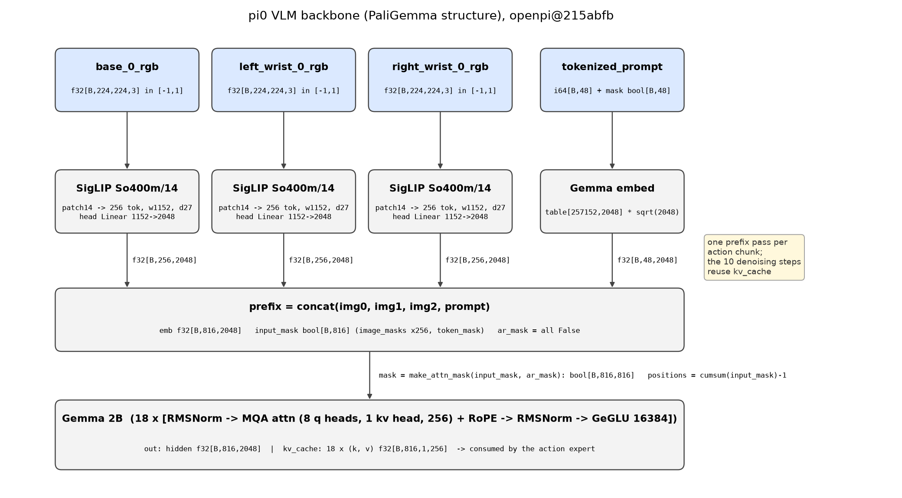

# π0 · vlm: SigLIP + Gemma 2B, 也就是 PaliGemma 的结构

本 module 复现 π0 的 VLM backbone: 三张图经 SigLIP So400m/14 变成 3×256 个 token, 与指令 token 拼成 "prefix", 过一遍 Gemma 2B, 得到隐状态和 KV cache. π0 不用 Gemma 生成文字, 只用它的隐状态和 KV cache 给 action expert 看 (见 `../action_expert`).

上游: [openpi](https://github.com/Physical-Intelligence/openpi) @ `215abfb217dbac7d5f1273282331b9b1866c0479` (`openpi@215abfb`) 的 `src/openpi/models/siglip.py`, `gemma.py`, `pi0.py`; 论文 π0 [arXiv:2410.24164v1](https://arxiv.org/abs/2410.24164v1) Appendix B, PaliGemma [arXiv:2407.07726v2](https://arxiv.org/abs/2407.07726v2), Gemma [arXiv:2403.08295v4](https://arxiv.org/abs/2403.08295v4). PyTorch 重写, 不 import openpi.



## 1. I/O 契约

**`SigLIP(cfg)(images)`**

| 名称 | shape / dtype | 取值 | 说明 |
|---|---|---|---|
| 入 `images` | float32[B, 224, 224, 3] | [−1, 1] | `../data` 的输出, channels-last |
| 出 | float32[B, 256, 2048] | 任意 | 16×16 个 patch token, 已由 ViT head 投影到 Gemma 宽度. 无 pooling, 无 CLS |

**`Gemma(cfg).embed(tokens)`**: int64[B, 48] → float32[B, 48, 2048], 查表后乘 √2048.

**`Gemma(cfg)(x, positions, mask, kv_cache=None)`**

| 名称 | shape / dtype | 说明 |
|---|---|---|
| 入 `x` | float32[B, T, 2048] | 本次要算的 token 的嵌入 |
| 入 `positions` | int64[B, T] | RoPE 位置, 由 `cumsum(input_mask) − 1` 给出, 填充 token 不占位 |
| 入 `mask` | bool[B, T, S] | query i 能否看 key j; S = cache 长度 + T |
| 入 `kv_cache` | list[depth] of (k, v), 各 float32[B, S_cache, 1, 256] | 上一次前向留下的 key / value |
| 出 hidden | float32[B, T, 2048] | 过 final RMSNorm 后的隐状态 |
| 出 kv_cache | list[depth] of (k, v), 各 float32[B, S, 1, 256] | 供后续 token (action expert) attend |

**`PaliGemma(vit_cfg, gemma_cfg)(images, image_masks, tokens, token_mask)`**: 输入即 `../data` 的 `Observation` 的四个字段 (不含 state), 输出 hidden float32[B, 816, 2048] 和 KV cache; 816 = 3×256 + 48. `embed_prefix` 另外返回 `input_mask` bool[B, 816] 与 `ar_mask` bool[816] (全 False: prefix 内全双向).

常量: SigLIP So400m/14 = {width 1152, depth 27, mlp 4304, heads 16, patch 14} (`openpi@215abfb siglip.py` L308-L370); Gemma 2B = {width 2048, depth 18, mlp 16384, heads 8, kv heads 1, head_dim 256, vocab 257152} (`gemma.py` L41, L79-L87).

## 2. 复现范围

| 有代码 | 只有事实 (背景) |
|---|---|
| SigLIP ViT 前向 (patch conv, 学习式位置嵌入, 27 层 pre-LN block, head 投影) | SigLIP 的对比预训练 (sigmoid loss, WebLI) |
| Gemma 2B 前向 (RMSNorm, GQA/MQA attention, RoPE, GeGLU, √width 嵌入缩放) | Gemma 2B 的预训练 (3T token, TPUv5e) |
| prefix 的拼接、attention mask、位置编号、KV cache | PaliGemma 三阶段预训练 recipe (见第 4.3 节) |
| `tiny` 配置整条前向 | checkpoint 的下载与权重映射 |

## 3. 推理侧

一次动作 chunk 的推理里, 本 module 只跑一次 (`pi0.py` L233-L237): 编码三张图, prefix 前向, 存下 18 层的 (k, v). 之后 10 步去噪只跑 action expert, 每步 attend 到这份 cache (见 `../flow_matching`, `../infer`).

延时 (论文 Table I, RTX 4090, 三张图): image encoders 14 ms, observation forward pass 32 ms. 两项合计 46 ms, 占端到端 73 ms 的大头; 这就是 KV cache 存在的理由.

参数量 (本仓库按 openpi 配置解析计算, `test_parity.py` 断言):

| 部件 | 参数量 | 对照 |
|---|---|---|
| SigLIP So400m/14 含 head | 414,803,696 | PaliGemma 论文称 "SigLIP: 400M Vision Model" |
| Gemma 2B 非嵌入 | 1,981,884,416 | Gemma 论文 Table 2, 精确相等 |
| Gemma 词表嵌入 | 526,647,296 = 257152 × 2048 | Gemma 论文为 524,550,144 (词表 256128); PaliGemma 多出 1024 个 `<loc>` + 128 个 `<seg>` token |
| 合计 VLM | 2,923,335,408 | PaliGemma "3B" |
| action expert (Gemma 300M, 无嵌入) | 311M | `gemma.py` L70 注释 "311M params" |

## 4. 训练侧

### 4.1 π0 训练时 backbone 怎么用

- 初始化: `PaliGemma.img` 与 `PaliGemma.llm` 从官方 PaliGemma 224px 预训练 checkpoint 加载 (`gs://vertex-model-garden-paligemma-us/paligemma/pt_224.npz`, `openpi@215abfb weight_loaders.py` L58-L73); 同名权重覆盖, action expert 权重不在 checkpoint 里, 保持随机初始化.
- 全部参与训练, 不冻结 (LoRA 变体除外, `pi0_config.py` L88-L117). 论文 Appendix B: "The images and language prompt are routed to the larger VLM backbone, which we initialize from PaliGemma."
- ViT 的 `train=False` 恒定 (`pi0.py` L114): SigLIP 里没有 dropout 起作用, 训练和推理前向一致.

### 4.2 数据预处理

全部在 `../data`. 本 module 只要求图像已是 [−1, 1] 的 224×224, 指令已是 48 个 token id.

### 4.3 背景事实: PaliGemma 的预训练 recipe (只陈述, 不复现)

| 项目 | 值 | 来源 |
|---|---|---|
| 图像编码器 | SigLIP "shape optimized" ViT-So400m, sigmoid 对比损失预训练 | PaliGemma Sec. 3.1 |
| 语言模型 | Gemma-2B v1.0 原始预训练 checkpoint | PaliGemma Sec. 3.1 |
| 连接方式 | 一个零初始化的线性层把 SigLIP token 投影到 Gemma 宽度; 试过 MLP 无明显收益 | PaliGemma Sec. 3.1 |
| 序列格式 | `[image tokens..., BOS, prefix tokens..., SEP, suffix tokens..., EOS, PAD...]`; 图像与 prefix 全双向, suffix 自回归 (prefix-LM) | PaliGemma Sec. 3.1, Fig. 2 |
| Stage 0 | 单模态预训练, 直接用公开 checkpoint | PaliGemma Sec. 3.2.1 |
| Stage 1 | 多模态预训练, 224 px, N_img = 256, N_txt = 128, 10 亿样本, 不冻结任何部分, 约 350B token | PaliGemma Sec. 3.2.2, Sec. 3.4 |
| Stage 2 | 分辨率提升到 448 / 896 (π0 用的是 224 checkpoint, 未经此阶段) | PaliGemma Sec. 3.2.3 |
| 算力 | TPUv5e-256, Stage 1 略少于 3 天, 每个 Stage 2 15 小时; MFU 55% | PaliGemma Sec. 3.4 |
| 精度 | 参数与优化器状态 float32; 推理 bfloat16 验证无损 | PaliGemma Sec. 3.4 |
| Gemma 2B 预训练 | 3T token, TPUv5e | Gemma Sec. 3, Sec. 4 |

## 5. 评测

`test_parity.py` (CPU, 约 2 秒). 论文规模的模型在 `meta` 设备上构建, 只数参数不分配内存:

- Gemma 2B 非嵌入参数量与 Gemma 论文精确相等; SigLIP 与 300M expert 参数量与解析值 / openpi 注释一致;
- 输出 shape 与第 1 节契约一致, 256 token 网格, KV cache 形状与续算;
- 语义检查: RMSNorm 零初始化输出单位 RMS; RoPE 位置 0 为恒等; `make_attn_mask` 的块结构; 被 mask 的 token 不影响有效 token 的输出 (等价于把它们删掉), 这一条同时验证了 mask 与位置编号的配合.

```
uv run pytest pi/pi0/vlm -q
```

## 6. cost 信息

| 项目 | 值 | 来源 |
|---|---|---|
| VLM 参数量 | 约 2.92B (SigLIP 415M + Gemma 2.51B) | 本仓库解析计算; PaliGemma "3B" |
| 每张图 token 数 | 256 (224 / 14 = 16, 16²) | PaliGemma Sec. 3.1 |
| prefix 长度 | 816 = 3 × 256 + 48 | `pi0_config.py` L39; `model.py` L39-L47 |
| 推理延时 | image encoders 14 ms + observation forward 32 ms, RTX 4090 | π0 Table I |
| PaliGemma 预训练算力 | TPUv5e-256 × ~3 天 (Stage 1) | PaliGemma Sec. 3.4 |
| π0 训练 backbone 的 GPU 时间 | 未披露 | gap ledger |

## 7. reference 映射表

| 本仓库 | 上游 |
|---|---|
| `ViTConfig`, `SIGLIP_SO400M_14` | `openpi@215abfb src/openpi/models/siglip.py` L293-L370 (`decode_variant`), `pi0.py` L81-L87 (`num_classes=width, variant="So400m/14", pool_type="none"`) |
| `SigLIP.embedding / pos_embedding` | `siglip.py` L216-L229 |
| `ViTBlock` | `siglip.py` L53-L108 |
| `SigLIP.encoder_norm / head` | `siglip.py` L161, L284-L288 |
| `GemmaConfig`, `GEMMA_2B`, `GEMMA_300M` | `gemma.py` L41, L58-L109 |
| `RMSNorm` | `gemma.py` L113-L125 |
| `Embedder` | `gemma.py` L135-L154 |
| `ExpertAttnProj`, `attend` | `gemma.py` L158-L249 (单 expert 情形) |
| `apply_rope` | `gemma.py` L424-L440 |
| `GeGLU` | `gemma.py` L253-L280 |
| `GemmaBlock` | `gemma.py` L284-L333 |
| `Gemma` | `gemma.py` L340-L411 |
| `make_attn_mask` | `pi0.py` L19-L45 |
| `PaliGemma.embed_prefix` | `pi0.py` L106-L137 |
| `PaliGemma.forward` 与位置编号 | `pi0.py` L208, L233-L237 |
| checkpoint 来源 | `weight_loaders.py` L58-L73 |
| 论文 | π0 Appendix B; PaliGemma Sec. 3; Gemma Sec. 2, Table 1-2 |

## 8. gap ledger

| 未披露 / 未复现 | 说明 |
|---|---|
| 权重加载 | 不下载 `pt_224.npz`, 不做 JAX→PyTorch 参数映射; 属性名已按 openpi 命名以便日后映射 |
| So400m/14 的精确维度出处 | ViT-shape 论文 (arXiv:2305.13035) 只在图中给出; 本仓库以 openpi 的 variant 表为准 |
| π0 论文 Appendix B 写 Gemma 2B "num heads=18" | 与 Gemma 论文和 openpi 的 8 不符, 按 8 |
| SigLIP 的 dropout / stochastic depth | openpi 恒为 0 且 `train=False`, 未实现 |
| bfloat16 | openpi 默认 `dtype=bfloat16` 做矩阵乘, softmax 与 RMSNorm 统计在 float32; 本仓库全 float32, 精度策略属于可省的系统工程 |
| Gemma 的 `decode` (tied logits) | π0 不生成文字, 未实现 |
| 数值对齐 | 只对齐参数量与 shape (仓库原则 1) |

## 9. 机器人概念表

本 module 没有新的机器人特有概念; 与硬件的联系只有一条: 每张相机图固定占 256 个 token, 三个槽位固定占 768 个, 缺失相机的 256 个 token 由 `image_masks` 屏蔽 (见 `../data` README 第 9 节). 相机越多, prefix 越长, 第 3 节的 46 ms 大致按图数线性增长.
