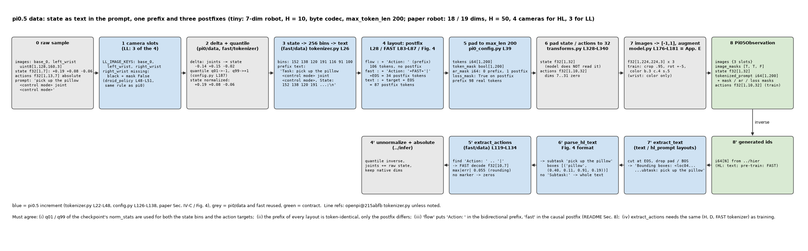
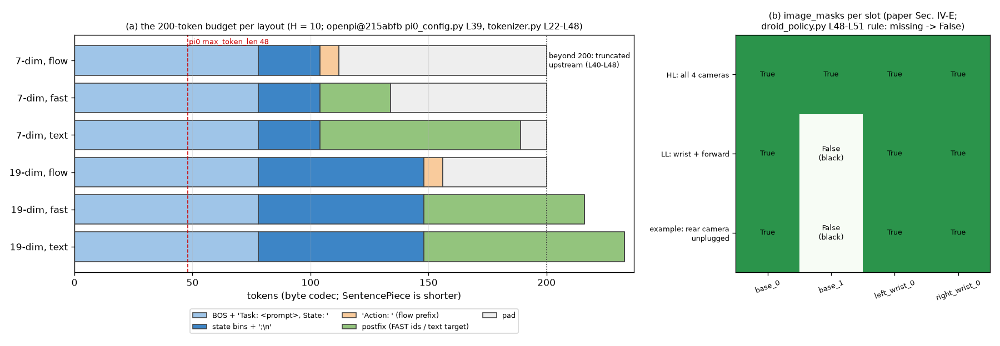

# π0.5 · data: state 分箱进 prompt, 一条序列的三种 postfix (FAST 动作 / 文本目标 / 空), 高层与低层的相机槽位

**TL;DR.** π0 把 proprioceptive state 作为 action expert 的一个连续 token (`state_proj`), π0-FAST 把它分 256 箱写进文本; π0.5 沿用 FAST 的做法但把它变成 **整个模型唯一的 state 入口**: `Task: <prompt>, State: <256 箱整数>;\nAction: ` (`openpi@215abfb tokenizer.py` L22-L29), action expert 不再有 state token (论文 Sec. IV-A "The robot proprioceptive state is discretized and input to the model as text tokens"). 这是 **训练侧的增量**: 一条序列可以在 prefix 之后接三种 postfix 之一, 分别服务三种训练样本: FAST 动作 token (预训练 280k 步全靠它, 论文 Sec. IV-C, IV-D), 文本目标 (subtask / bbox / caption, 论文 Sec. IV-C "HL", "WD"), 或什么都不接 (post-training 后的 flow-only 微调与推理, 上游 `config.py` L126-L138). 代价是 prompt 上限从 48 涨到 200 (`pi0_config.py` L39: 19 维 state 的分箱文本占 60 个字符左右), 收益是文本、检测、动作三类数据共用一个输入格式, 这正是论文 Sec. V-C / Fig. 10-11 里 WD / HL 数据能进同一个模型的前提. 其余全部复用: 图像 resize / 增广 / delta / padding 与 π0 一字不差 (论文 Appendix E 的增广参数 = `model.py` L176-L181), quantile 归一化与 256 分箱来自 FAST (`config.py` L187; 论文 Sec. IV-C "1% and 99% quantile").

**流程图**: 上排是一个 tiny 样本 (7 维 LIBERO 型机器人, H = 10, 3 个相机) 从 raw 到 `Pi05Observation` 的每一步, 三种 layout 并排; 下排是镜像的逆过程 (生成 id → 文本 / 动作) 与上游的失败行为. 数值来自一次真实 tiny 运行.



**第二幅图的论点**: 一条 200 token 的序列里各段占多少 (prefix 文本 / state 分箱 / FAST 动作 / 文本目标), 以及 19 维 state 的分箱文本为何把 `max_token_len` 从 48 逼到 200; 右侧是 HL (4 相机) 与 LL (3 相机) 两套槽位在同一个 `image_masks` 契约下的样子.



本 module 复现 π0.5 数据侧相对 π0 与 FAST 的增量. 上游: [openpi](https://github.com/Physical-Intelligence/openpi) @ `215abfb217dbac7d5f1273282331b9b1866c0479` (`openpi@215abfb`) 的 `src/openpi/models/tokenizer.py` (`PaligemmaTokenizer.tokenize` L22-L48), `src/openpi/models/pi0_config.py` (L28-L41: `pi05`, `max_token_len`, `discrete_state_input`), `src/openpi/training/config.py` (L126-L138 PI05 transform 链, L187 quantile, L745 `discrete_state_input=False`, L866-L870 32 维 / H 16), `src/openpi/transforms.py` (`TokenizePrompt` L247-L266), `src/openpi/policies/droid_policy.py` (L47-L52 PI05 的相机 mask); 论文 π0.5 [arXiv:2504.16054v1](https://arxiv.org/abs/2504.16054v1) Sec. IV-A, IV-C, IV-D, IV-E, Fig. 4, Appendix E; Hi Robot [arXiv:2502.19417v2](https://arxiv.org/abs/2502.19417v2) Sec. 4.3, Appendix A. NumPy / PyTorch 重写, 不 import 上游; 图像、delta、padding、增广 `from pi.pi0.data.data import ...`, 分箱、词表尾部映射、FAST 编码 `from pi.fast.data.data import ...`, quantile `from pi.fast.tokenizer.tokenizer import ...`.

## 1. I/O 契约

### 1.1 `state_prefix_text(prompt, state)` → str (`tokenizer.py` L23-L28)

| 名称 | shape / dtype | 说明 |
|---|---|---|
| 入 `prompt` | str | 任务文本; 清洗: `strip`, `_` → 空格, `\n` → 空格 (L23). 注意 FAST 的 tokenizer 还 `lower()` (L67), π0.5 的不 |
| 入 `state` | float[d] 或 None | quantile 归一化后的 state (~[−1, 1]); `pi.fast.data.discretize_state` 分 256 箱 (L26) |
| 出 | str | `"Task: {prompt}, State: {b_1 b_2 … b_d};\n"`; `state=None` 时退回 π0 格式 `prompt + "\n"` (L30-L33, `pi05_libero` 就这样, `config.py` L745) |

### 1.2 `with_control_mode(prompt, mode)` → str (论文 Sec. IV-C)

| 名称 | 说明 |
|---|---|
| 入 `mode` | `"joint"` 或 `"end effector"` |
| 出 | `"{prompt} <control mode> {mode} <control mode>"`. 论文原文: "we add '<control mode> joint/end effector <control mode>' to the text prompt"; 加在 prompt 的哪个位置未披露, 本仓库放在末尾 (→ §8) |

### 1.3 `hl_target_text(subtask, boxes=None)` / `parse_hl_text(text)` (论文 Fig. 4, Sec. IV-C "HL")

| 名称 | 说明 |
|---|---|
| 入 `subtask` | str, 如 `"move to closet"` |
| 入 `boxes` | list of `(label, (y0, x0, y1, x1))`, 坐标是 [0, 1) 的归一化值, 或 None |
| 出 | `"Bounding boxes: <loc0405><loc0011><loc0911><loc0197>closet\nSubtask: move to closet"`; 无框时只有 `"Subtask: …"` |
| `parse_hl_text` | 逆: 生成的文本 → `(subtask, boxes)`; 没有 `Subtask:` 时 subtask 是整段文本 |

`<locXXXX>` 是 PaliGemma 的 1024 个位置 token, XXXX = `int(coord * 1024)`, 四个一组, 顺序 y_min x_min y_max x_max (PaliGemma 论文约定). 论文说 bbox 在 subtask **之前** 预测 (Sec. IV-C "predict them before predicting the subtask"), Fig. 4 给了两行的样子; 两行之间的分隔与 `Subtask:` 的标点是从图上抄的 (→ §8).

### 1.4 `Pi05SequenceTokenizer(text, fast, max_len=200).tokenize(prompt, state, *, layout, actions=None, target_text=None)` → `(tokens, token_mask, ar_mask, loss_mask)` (`tokenizer.py` L22-L48; FAST 的 L64-L117)

| 名称 | shape / dtype | 说明 |
|---|---|---|
| 入 `layout` | `"flow"` / `"fast"` / `"text"` / `"hl_prompt"` | 见下表 |
| 入 `actions` | float[H, d] 归一化 delta 动作 (native dim) | 只有 `"fast"` 用 |
| 入 `target_text` | str | 只有 `"text"` 用 |
| 出 `tokens` | int64[max_len] | 右侧 0 填充; 超长截尾并警告 (L38-L48) |
| 出 `token_mask` | bool[max_len] | True = 真实 token |
| 出 `ar_mask` | int64[max_len] | 0 = prefix (双向), 1 = postfix (因果) |
| 出 `loss_mask` | bool[max_len] | True = 算 CE 的位置 |

| layout | prefix (ar 0, loss False) | postfix (ar 1, loss True) | 用途 | 来源 |
|---|---|---|---|---|
| `"flow"` | `[BOS] Task: p, State: s;\nAction: ` | 空 | flow-only 微调与 LL 推理 (post-training 之后的上游格式) | `tokenizer.py` L28-L29 |
| `"fast"` | `[BOS] Task: p, State: s;\n` | `Action: <FAST id 映射到词表尾部> | [EOS]` | 预训练 (α = 0) 与 post-training 联合目标的离散部分 | FAST `tokenizer.py` L74-L87; 论文 Sec. IV-C |
| `"text"` | `[BOS] Task: p, State: s;\n` | `<target_text> [EOS]` | HL subtask / bbox 目标; WD 的 caption / VQA (背景) | 论文 Sec. IV-C, Fig. 4; 格式 → §8 |
| `"hl_prompt"` | `[BOS] Task: p, State: s;\n` | 空 | HL 推理: 模型接着生成 postfix | 论文 Sec. IV-B |

注意 `"flow"` 与 `"fast"` 在 token 上只差 `Action: ` 是 prefix 还是 postfix 的开头: 上游 flow-only 推理把它放进双向 prefix (L28), FAST 训练把它放进因果 postfix (FAST L84). 联合训练时哪种是对的论文没说 (→ §8).

### 1.5 `Pi05SequenceTokenizer.extract_text(tokens)` → str

生成的 id (含 pad / EOS) → 到 EOS 为止解码成文本. 与 `pi.fast.data.FASTSequenceTokenizer.extract_actions` 对称: 这个切文本, 那个切动作 (`"fast"` layout 下直接复用后者).

### 1.6 `build_pi05_batch(raw, norm_stats, seq, *, layout, image_keys, action_horizon, action_dim=32, delta_mask, train, target_text=None, generator=None)` → `(Pi05Observation, actions)` (`config.py` L126-L138 + `data_loader.py` L183-L190)

| 名称 | shape / dtype | 说明 |
|---|---|---|
| 入 `raw["images"]` | `{slot: uint8[B, h, w, 3]}` | `image_keys` 的任意子集; 缺的槽位 → 黑图 + mask False (`droid_policy.py` L48-L51: PI0 与 PI05 同一条规则, 与 FAST 的 "不 mask" 不同) |
| 入 `raw["state"]` | float32[B, d] | 物理单位, d ≤ 32 |
| 入 `raw["actions"]` | float32[B, ≥H, d] | 绝对动作, 训练时给 |
| 入 `raw["prompt"]` | list[str] | 高层或低层 prompt |
| 入 `norm_stats` | `{"state": QuantileStats, "actions": QuantileStats}` | q01 → −1, q99 → +1 (`config.py` L187, 论文 Sec. IV-C) |
| 入 `image_keys` | tuple[str] | 上游 3 槽 `("base_0_rgb", "left_wrist_0_rgb", "right_wrist_0_rgb")`; 本仓库为移动操作臂定义 `MOBILE_IMAGE_KEYS` 4 槽与 `LL_IMAGE_KEYS` 3 槽 (§1.7) |
| 出 `obs.images` | `{slot: float32[B, 224, 224, 3]}` in [−1, 1] | 顺序 = `image_keys`; 训练时增广 (与 π0 相同, Appendix E) |
| 出 `obs.image_masks` | `{slot: bool[B]}` | 缺相机 False |
| 出 `obs.state` | float32[B, 32] | 归一化 + 0 填充. **模型不读它** (π0.5 没有 `state_proj`, `pi0.py` L151-L157); 留在 Observation 里供逆变换与 parity |
| 出 `obs.tokenized_prompt` 等四个 | int64 / bool / int64 / bool [B, 200] | §1.4 |
| 出 `actions` | float32[B, H, 32] 或 None | 归一化 delta 0 填充; `"fast"` 时它就是 FAST token 编码的那条 chunk |

### 1.7 相机槽位 (论文 Sec. IV-E)

| 常量 | 值 | 来源 |
|---|---|---|
| `IMAGE_KEYS` | `("base_0_rgb", "left_wrist_0_rgb", "right_wrist_0_rgb")` | 上游 (`model.py` L39-L43); openpi 的 π0.5 checkpoint 只有这 3 槽 |
| `MOBILE_IMAGE_KEYS` | `("base_0_rgb", "base_1_rgb", "left_wrist_0_rgb", "right_wrist_0_rgb")` | 论文的移动操作臂: 前、后、左右腕 4 个相机; **槽位名是本仓库起的**, 上游未披露 (→ §8) |
| `HL_IMAGE_KEYS` | = `MOBILE_IMAGE_KEYS` | "We use all four cameras for high-level inference" |
| `LL_IMAGE_KEYS` | `("base_0_rgb", "left_wrist_0_rgb", "right_wrist_0_rgb")` | "the wrist and forward cameras for the low-level inference process": 后相机槽位 mask False |

### 1.8 符号 / 约定差异

| 主题 | 论文 | 上游 / 本仓库 |
|---|---|---|
| action horizon | Appendix E "action horizon of 50, i.e., H = 49" | `pi0_config.py` L26 `action_horizon = 50`, 50 个动作 token; 本仓库 50 (→ §8) |
| 动作维度 | Sec. IV-C "fixed number to accommodate the largest action space", Sec. IV-E 18 或 19 | `config.py` L868, L902 `action_dim=32`; 本仓库 32 |
| prompt 清洗 | 无 | π0.5 不 `lower()`, FAST `lower()` |
| state 缺省 | 总有 state | `pi05_libero` 用 `discrete_state_input=False`: 没有任何 state 输入 |

## 2. 复现范围

| 有代码 | 只有事实 (背景) |
|---|---|
| §1.1–1.7 全部: 序列的三种 postfix, control-mode 标签, HL 目标文本, 4 / 3 相机槽位, quantile 归一化, batch 组装 | 数据混合的构成: MM 约 400 h / 约 100 个家庭 (Sec. IV-C), ME, CE (含 OXE), HL 人工标注 (subtask + bbox), WD (CapsFusion, COCO, Cambrian-7M, PixMo, VQAv2, 室内 bbox), VI 语言遥操作 (Sec. IV-D); 各部分权重未披露 |
| 逆变换 (`extract_text`, FAST `extract_actions`) | Hi Robot 的合成标注: 用大 VLM p_gen 给 (观测, skill 标签 ℓ̂_t, 之前的 ℓ̂_0..t−1, 任务描述 P) 反推用户 prompt ℓ_t 与机器人回复 u_t, 场景分类 (negative task / situated correction / specific constraint) 与回复分类 (confirmation / clarification / error handling) (Hi Robot Sec. 4.3, App. A); skill 段 1-3 s, 另有启发式抽取的运动原语 ("move the right arm to the left") |
| | WD 样本的 prompt 格式 (caption / VQA / 检测各自的 prompt 文本) 未披露 |

## 3. 推理侧

低层推理只用 `"flow"` layout: `Task: <subtask>, State: <bins>;\nAction: ` 全部是 prefix, 模型不生成 token, 直接接 action expert (→ `../hier`, `../infer`). 高层推理用 `"hl_prompt"`: 同样的前缀但没有 `Action: `, 模型接着生成 `Subtask: …` (→ `../hier`). 相机: 高层 4 槽全 True, 低层后相机 False (§1.7). 上游 openpi 的 π0.5 checkpoint 只做低层 (`config.py` L126-L138), 高层格式来自论文.

## 4. 训练侧

### 4.1 数据组织形式

五类样本共用 `Pi05Observation`, 差别只在 layout 与相机:

| 样本 | layout | 相机 | 出处 |
|---|---|---|---|
| 机器人动作 (MM / ME / CE), 预训练 | `"fast"` | 低层 3 槽 (移动臂) 或上游 3 槽 | Sec. IV-C |
| 机器人动作, post-training | `"fast"` + 同一条样本的连续 `actions` 给 expert | 同上 | Sec. IV-D, Eq. 1 |
| HL: 高层 prompt → subtask (+ bbox) | `"text"` | 高层 4 槽 | Sec. IV-C "HL" |
| WD: caption / VQA / 检测 | `"text"` (prompt 格式未披露) | 1 张图 | Sec. IV-C "WD" |
| VI: 语言遥操作 | `"text"`, 目标是人给的 subtask | 高层 4 槽 | Sec. IV-D |

### 4.2 数据预处理, 逐步 (`build_pi05_batch`)

| 步 | 做什么 | 上游 |
|---|---|---|
| (a) | 缺的相机槽位 → 黑图 + mask False | `droid_policy.py` L48-L51 |
| (b) | `to_delta_actions`: 关节维减当前 state, 夹爪维不变 | `transforms.py` L204-L223 (同 π0) |
| (c) | quantile 归一化 state 与 actions: q01 → −1, q99 → +1, 不裁剪 | `transforms.py` L141-L145; `config.py` L187; 论文 Sec. IV-C |
| (d) | 图像 resize + 黑边到 224 | 同 π0 |
| (e) | 序列: §1.4 的 layout | `tokenizer.py` L22-L48; FAST L64-L117 |
| (f) | state / actions 0 填充到 32 | `transforms.py` L328-L340; `config.py` L868 |
| (g) | uint8 → [−1, 1]; 训练时增广 (RandomCrop 0.95, Resize, Rotate ±5°, ColorJitter b 0.3 c 0.4 s 0.5; 腕相机只做 color) | `model.py` L176-L181 = 论文 Appendix E |

### 4.3 training objective / curriculum

在 `../train`: Eq. 1 的 CE (文本 + FAST token, 用本 module 的 `loss_mask`) + α · flow MSE (用 `actions`). 预训练 280k 步只有 `"fast"` / `"text"` 样本 (α = 0); post-training 80k 步加 expert, α = 10, 数据换成 MM + ME (成功、长度阈值以下) + WD + ME 的 HL + VI (Sec. IV-D).

## 5. 评测

本 module 没有评测; 端到端评测在 `../infer/eval.py`. `test_parity.py` (CPU, 约 10 s) 检查:
- 三种 layout 的 prefix 完全一致, 只有 postfix 不同; `"flow"` 的 token = `"fast"` 的 prefix + `Action: ` 标记.
- `"fast"` layout 的 postfix 用 FAST 的 `extract_actions` 能还原 actions (误差在 FAST 取整界内); `"text"` 的 postfix 用 `extract_text` 还原 target_text.
- `state=None` 退回 π0 格式 (`prompt + "\n"`, 没有 `Task:`).
- 缺相机 → 黑图 + mask False (与 FAST 相反); 4 槽与 3 槽的 `LL_IMAGE_KEYS` 是 `HL_IMAGE_KEYS` 的子集.
- `hl_target_text` / `parse_hl_text` 互逆; `<locXXXX>` 的取整.
- 19 维 state 的分箱文本长度与 `max_token_len` 200 的余量.

```
uv run pytest pi/pi05/data -q
uv run python -m pi.pi05.data.data      # 三种 layout 的一次 batch, 逐步 shape
uv run python pi/pi05/data/figs/make_pipeline.py
uv run python pi/pi05/data/figs/make_figs.py
```

## 6. cost 信息

| 项目 | 值 | 来源 |
|---|---|---|
| 训练数据规模 (MM) | 约 400 小时, 约 100 个家庭, 两种移动操作臂 | 论文 Sec. IV-C, Sec. VI |
| 训练数据规模 (ME / CE / HL / WD / VI) | 小时数未披露; 预训练 97.6% 的样本不是 MM; VI 占 HL-MM 样本约 11% | Sec. I, Sec. V-E; → §8 |
| WD 数据集 | CapsFusion, COCO, Cambrian-7M, PixMo, VQAv2 + 室内 bbox 数据 | Sec. IV-C |
| Hi Robot 训练数据 | 人工标注 D_labeled + 合成 D_syn; 规模未披露 | Hi Robot Sec. 4.3; → §8 |
| 序列长度 | 200 token (π0: 48; FAST: 250 / 180) | `pi0_config.py` L39 |
| 训练算力 / 模型大小 / 延时 | → `../train`, `../expert`, `../infer` | |

## 7. reference 映射表

| 本仓库 | 上游 |
|---|---|
| `state_prefix_text` | `tokenizer.py` L23-L28 (pi05 分支), L30-L33 (pi0 分支); 论文 Sec. IV-A |
| `with_control_mode` | 论文 Sec. IV-C |
| `hl_target_text`, `parse_hl_text`, `loc_token` | 论文 Sec. IV-C "HL", Fig. 4; PaliGemma 的 `<locXXXX>` 约定 |
| `Pi05SequenceTokenizer.tokenize` | `tokenizer.py` L22-L48; FAST `tokenizer.py` L64-L117 (postfix, 通过 `pi.fast.data`); `transforms.py` L247-L266 |
| `Pi05SequenceTokenizer.extract_text` | 本仓库 (上游没有文本生成的解码路径) |
| `Pi05Observation` | `model.py` L83-L107 (Observation) + FAST 的 `token_ar_mask` / `token_loss_mask` |
| `build_pi05_batch` | `config.py` L126-L138 (PI05 transform 链), L187 (quantile); `data_loader.py` L183-L190; `droid_policy.py` L47-L52 |
| `IMAGE_KEYS`, `MOBILE_IMAGE_KEYS`, `HL_IMAGE_KEYS`, `LL_IMAGE_KEYS` | `model.py` L39-L43; 论文 Sec. IV-E |
| `MAX_TOKEN_LEN`, `ACTION_DIM`, `ACTION_HORIZON` | `pi0_config.py` L25-L26, L39; `config.py` L868 |

## 8. gap ledger

| 未披露 / 未复现 | 说明 |
|---|---|
| control-mode 标签的位置 | 论文只给了字符串 `<control mode> joint/end effector <control mode>` "add to the text prompt"; 本仓库加在 prompt 末尾, 空格分隔 |
| HL 目标文本的精确格式 | `Bounding boxes: <loc…>label` 与 `Subtask: …` 从 Fig. 4 抄; 换行与标点是推断; 有多个框时框之间的分隔未披露, 本仓库用空格 |
| WD 样本的 prompt / 目标格式 | 未披露; 无代码, 只在 §4.1 列出 |
| 无 state 样本 (WD, Hi Robot HL) 的前缀 | π0.5 未披露; 本仓库 `state=None` 走上游 pi0 分支 (`prompt + "\n"`), 与 `pi05_libero` 一致 |
| `Action: ` 在联合训练里是 prefix 还是 postfix | 上游 flow-only 推理放 prefix (L28), FAST 训练放 postfix (FAST L84); 联合训练时的选择论文没说. 本仓库: `"fast"` layout 放 postfix, `"flow"` layout 放 prefix, 两者的 prefix 部分逐 token 相同 |
| 移动操作臂 4 相机的槽位名 | 上游只有 3 槽; `base_1_rgb` 是本仓库为后相机起的名 |
| H = 50 还是 49 | Appendix E "action horizon of 50, i.e., H = 49" 自相矛盾 (H 是论文里 chunk 的步数记号); 上游 50; 本仓库 50 |
| 18 / 19 维 state 的确切排列 | 两臂 2 × (6 关节 + 1 夹爪) + 底盘 (2D 线速度 + 1D 角速度) + 升降 1-2 = 18 / 19; 顺序未披露 → `../infer` 的 spec 里按此顺序排, 标为推断 |
| 各数据源的混合权重 | 只有 "97.6% 非 MM" 与 "VI 约 11% 的 HL-MM"; 无代码 |
| `max_token_len` 200 的依据 | 上游常量; 论文未提 |
| tiny 文本编码 | `pi.fast.data.ByteTextCodec` 逐字节 (仅为跑通), 不是 PaliGemma SentencePiece; 声明词表仍 257,152 |

## 9. 领域概念表

### domain 概念

**离散 state 作为文本 (discretized proprioception in the prompt)**
- shape: 文本里 d 个整数, d = 机器人 native dim (移动臂 18 / 19); token 化后约 2-3 token / 维 (byte 编码下 3-4 字符 / 维).
- 含义: 每个整数是该维 quantile 归一化值落在 [−1, 1] 的 256 等分箱里的下标; 分辨率 2/256.
- 来源: 机器人的关节 / 夹爪 / 底盘速度 / 升降读数, 训练集上算 q01 / q99 后归一化.
- 为什么需要: 让 state 与文本共用一个入口, 预训练时整个模型是一个标准 VLM (Sec. IV-B "pre-train our model as a standard VLM transformer"); 代价是精度 2/256 与 prompt 长度.
- 系统联系: `norm_stats.json` 的 q01 / q99 与 checkpoint 绑定; 换机器人换统计量不换代码.

**control mode 标签**
- shape: prompt 里的一段固定文本.
- 含义: 告诉模型这条样本的动作是关节目标还是末端位姿目标.
- 来源: 数据集自带 (每个采集平台的控制接口).
- 为什么需要: 混合数据里两种动作空间都有 (Sec. IV-C "predict target joint and end-effector poses"), 同一个模型靠文本区分.
- 系统联系: 部署时要与底层控制器接收的目标类型一致.

**高层 / 低层相机集合**
- shape: HL 4 张 224×224, LL 3 张.
- 含义: 高层看全景 (含后相机) 决定 subtask, 低层看前方与双腕做操作.
- 来源: 移动臂的 4 个相机 (Sec. IV-E).
- 为什么需要: 相机槽位固定, 缺的槽位 mask False, 两级推理各用一套 mask.
- 系统联系: `image_masks` 进 attention 的 valid mask 与 position 计数 (π0 `data` README).

### application 概念

**subtask 标注 (HL 样本)**
- shape: 一段文本目标, 可选前置 bbox.
- 含义: 当前观测下应该执行的短期语言命令, 如 "pick up the pillow".
- 来源: 对多 subtask 的 MM / ME / CE 数据人工标注 (Sec. IV-C); Hi Robot 里另有 VLM 合成的用户 prompt 与回复.
- 为什么需要: 训练同一个模型做高层策略 π(ℓ̂ | o, ℓ); Fig. 13 的 implicit HL 表明即使不在推理时用, 训练里有它也涨分.
- 系统联系: 推理时 subtask 文本直接成为低层 prompt.

**语言遥操作 (VI)**
- shape: 与 HL 样本相同的 (观测, 高层 prompt) → subtask.
- 含义: 专家用语言实时指挥已训练的低层策略完成任务, 记下每一步给的命令.
- 来源: post-training 阶段单独采集 (Sec. IV-D).
- 为什么需要: 给高层策略 "好的 subtask 序列" 的示范; 去掉它 (no VI) 显著变差 (Fig. 13).
- 系统联系: 采集时低层策略已经在跑, 所以 VI 数据的分布与部署时一致.
