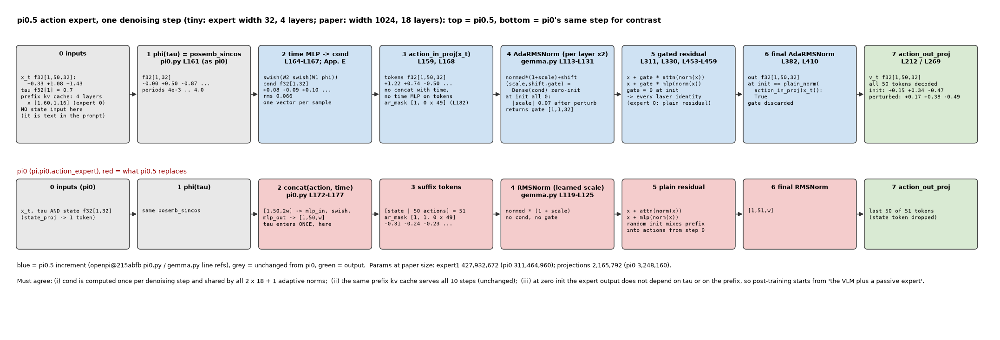
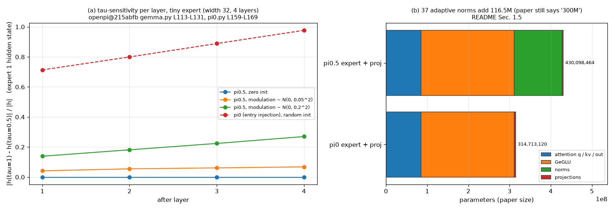

# π0.5 · expert: adaRMSNorm 注入 timestep 的 action expert, 没有 state token

**TL;DR.** π0 的 action expert 只在入口处见到 timestep 一次: `φ(τ)` 与 noisy action 拼接过一个 MLP 变成 50 个 token, 之后 18 层里没有任何地方再看 τ (`pi0.py` L172-L177). π0.5 改成 **每一层都看**: τ 单独过 `swish(W₂ swish(W₁ φ(τ)))` 得一个 [B, 1024] 的条件向量, expert 的每一层在两个 RMSNorm 处 (attention 前、MLP 前) 和最后的 final norm 处, 用一个零初始化的 Dense(1024 → 3072) 从条件向量算出 (scale, shift, gate): `norm(x) · (1 + scale) + shift` 进子层, 子层输出乘 gate 再加回残差 (论文 Appendix E; `gemma.py` L113-L131, L303-L311, L453-L459). 这是 DiT 的 adaLN-Zero 搬到 RMSNorm 上. 同时 state 不再是 expert 的第一个 token (`pi0.py` L151-L157: `if not self.pi05`), 它已经在 `../data` 里进了 prompt; suffix 从 51 个 token 变成 50 个. 收益是论文没有单独消融的 (Appendix E 只陈述做法, → §8); 代价是参数: expert 从 311,464,960 涨到 427,932,672 (每个 norm 多 3,148,800), 论文仍称它 "300M". 零初始化有一个可测的推论: 初始化时 gate = 0, 每一层的残差分支都关着, **expert 是恒等映射**, 输出 = final norm(action_in_proj(x_t)), 与 prefix 无关 (测试 `zero_init_expert_is_identity`); 这与 π0 随机初始化的 expert 一开始就把 prefix 信息混进来不同 (→ `../train` 的 post-training 从零初始化 expert 开始).

**流程图**: 上排是一次去噪步里 expert 的输入到速度场的每一步 (tiny 配置: expert 宽 32, 4 层), 每步给 shape 与一次真实 tiny 运行的数值; 下排是与 π0 expert 的逐点对照 (哪一步换掉了什么).



**第二幅图的论点**: (a) 零初始化下 (scale, shift, gate) 全 0 ⇒ 每层是恒等; 把 modulation 权重随机扰动后, 输出对 τ 的敏感度 (‖v(τ₁) − v(τ₂)‖) 随层数如何变化, 与 π0 的入口注入对比; (b) 参数量: π0 expert 311M vs π0.5 expert 428M 的构成.



本 module 复现 π0.5 action expert 相对 π0 的增量. 上游: [openpi](https://github.com/Physical-Intelligence/openpi) @ `215abfb217dbac7d5f1273282331b9b1866c0479` (`openpi@215abfb`) 的 `src/openpi/models/gemma.py` (`RMSNorm.__call__` L113-L131, `Block.__call__` L293-L331, `_gated_residual` L453-L459, `Module.__call__` L392-L411 的 `adarms_cond`, `Module.init` L413-L421), `src/openpi/models/pi0.py` (`__init__` L93-L100, `embed_suffix` L140-L186, `compute_loss` L209-L211, `sample_actions` L261-L267), `src/openpi/models/pi0_config.py` L28-L31; 论文 π0.5 [arXiv:2504.16054v1](https://arxiv.org/abs/2504.16054v1) Appendix E. PyTorch 重写, 不 import 上游; `MoEBlock` / `MoEGemma` / `posemb_sincos` / attention `from pi.pi0.action_expert.model, pi.pi0.vlm.model import ...`.

## 1. I/O 契约

### 1.1 `AdaRMSNorm(dim, cond_dim)` (`gemma.py` L113-L131)

| 名称 | shape / dtype | 说明 |
|---|---|---|
| 入 `x` | float32[B, T, dim] | 该 expert 的 token |
| 入 `cond` | float32[B, cond_dim] | 时间条件向量 (§1.2), 整个 suffix 共用一个 |
| 出 `y` | float32[B, T, dim] | `x / sqrt(mean(x²) + 1e-6) · (1 + scale) + shift` (L117-L118, L130), 统计量在 float32 |
| 出 `gate` | float32[B, 1, dim] | 给残差用 |
| 参数 | `modulation`: Linear(cond_dim → 3·dim), 权重与 bias 零初始化 (L128 `kernel_init=zeros`) | **没有** 普通 RMSNorm 的 `scale` 参数 (L119-L125 只在 `cond is None` 时创建) |

`(scale, shift, gate) = split(modulation(cond), 3)` (L129). 零初始化 ⇒ 初始 y = 归一化的 x, gate = 0.

### 1.2 `Pi05ActionProjections(cfg, action_dim=32, action_horizon=50)` (`pi0.py` L92-L100)

| 层 | shape | 说明 |
|---|---|---|
| `action_in_proj` | Linear(32 → w) | L92, 与 π0 相同; 输出直接就是 expert token (L168), 不再与时间拼接 |
| `time_mlp_in` | Linear(w → w) | L94; W₁ |
| `time_mlp_out` | Linear(w → w) | L95; W₂ |
| `action_out_proj` | Linear(w → 32) | L100, 与 π0 相同 |
| 没有 | `state_proj`, `action_time_mlp_in/out` | L96-L99 只在 `not pi05` 时创建 |

**`embed_suffix(noisy_actions, timestep)`** → `(tokens, input_mask, ar_mask, cond)` (`pi0.py` L140-L186)

| 名称 | shape / dtype | 说明 |
|---|---|---|
| 入 `noisy_actions` | float32[B, 50, 32] | x_t |
| 入 `timestep` | float32[B] | openpi 约定 1 = 噪声 |
| 出 `tokens` | float32[B, 50, w] | `action_in_proj(x_t)` (L159, L168); **50** 个, 没有 state token |
| 出 `input_mask` | bool[B, 50] | 全 True (L180) |
| 出 `ar_mask` | bool[50] | `[True] + [False] × 49` (L182): 第一个动作 token 开一个新块, prefix 看不到动作 |
| 出 `cond` | float32[B, w] | `swish(time_mlp_out(swish(time_mlp_in(φ(τ)))))` (L161-L167), φ = `posemb_sincos(τ, w, 4e-3, 4.0)` |

与 π0 的差别一眼看得出: π0 返回 51 个 token 与 `ar_mask = [1, 1, 0 × 49]`, 没有 cond.

### 1.3 `AdaMoEGemma(cfgs, cond_dim)` (`gemma.py` L340-L411 + adarms)

| 名称 | shape / dtype | 说明 |
|---|---|---|
| 入 `xs` | `[x₀ 或 None, x₁ 或 None]` | expert 0 (VLM) 与 expert 1 (action expert) 的 token, 同 `pi.pi0.action_expert.MoEGemma` |
| 入 `positions`, `mask`, `kv_cache` | 同 π0 | |
| 入 `cond` | float32[B, cond_dim] 或 None | 只给 expert 1 (`adarms_cond=[None, cond]`, `pi0.py` L210, L266) |
| 出 | `[h₀, h₁]`, kv_cache | h₁ 过的 final norm 也是 adaptive 的 (L410 把 `adarms_cond[i]` 传给 `final_norms[i]`), gate 丢弃 |

层内 (`AdaMoEBlock.forward`, L293-L331): expert 1 的 `pre_attention_norm` 与 `pre_ffw_norm` 是 `AdaRMSNorm`, 各返回一个 gate; attention 之后 `x = x + gate_attn · attn_out`, MLP 之后 `x = x + gate_ffw · mlp_out` (L311, L330, `_gated_residual` L453-L459). expert 0 完全不变 (普通 RMSNorm, gate None → 普通残差). `cond=None` 时 expert 1 也退化成普通残差 (用于 π0 权重的对照, 测试).

### 1.4 `suffix_forward(llm, kv_cache, prefix_mask, suffix_emb, suffix_mask, suffix_ar, cond)`

与 `pi.pi0.action_expert.suffix_forward` 相同的 mask / positions 构造 (`pi0.py` L244-L259), 多传一个 `cond`. 输出 float32[B, 50, w]; `Pi05ActionProjections.decode` 取全部 50 个 (π0 取最后 50 个丢掉 state 那个, L212 的 `[:, -H:]` 对两者都成立).

### 1.5 参数量 (paper 配置, `test_parity.py` 在 meta device 上数)

| 项目 | 值 | 说明 |
|---|---|---|
| 每个 `AdaRMSNorm` | 3,148,800 | 1024 × 3072 + 3072; 替换掉的普通 norm 有 1,024 |
| expert 1 每层 | 17,300,352 + 6,295,552 = 23,595,904 | π0 每层 (q 2,097,152 + kv 524,288 + out 2,097,152 + GeGLU 12,582,912 + 2 norm 2,048) + 两个 norm 各多 3,147,776 |
| expert 1 18 层 + final norm | 427,932,672 | π0: 311,464,960 |
| 投影层 | 2,165,792 | `action_in_proj` 33,792 + `time_mlp_in` 1,049,600 + `time_mlp_out` 1,049,600 + `action_out_proj` 32,800; π0 五层 3,248,160 |
| π0.5 合计 | 3,353,433,872 | VLM 2,923,335,408 + 上两行; π0 3,238,048,528; 差 115,385,344 |

### 1.6 符号 / 约定差异

| 主题 | 论文 | 上游 / 本仓库 |
|---|---|---|
| 时间 MLP | Appendix E `swish(W₂ · swish(W₁ · φ(τ)))`, W ∈ ℝ^{w×w} | `time_mlp_in/out` 是带 bias 的 Linear (nnx.Linear 默认 `use_bias=True`) |
| adaptive RMSNorm 的形式 | "applies adaptive RMSNorm to inject the timestep information to each layer" | 具体是 (scale, shift, gate) 三元组、零初始化、gate 乘残差: 只有代码有 |
| expert 大小 | "300M parameters" | 含 modulation 后 428M; 论文的数字是不含 adaRMS 的 Gemma 300M 骨架 |
| τ 方向 | τ = 0 噪声 | openpi t = 1 噪声 (π0 `flow_matching` README §1.3) |

## 2. 复现范围

| 有代码 | 只有事实 (背景) |
|---|---|
| §1.1-1.4 全部; 零初始化; 参数量 | bf16 (`Pi0Config.dtype`), `nn.scan` / remat, sharding |
| 与 π0 expert 的逐点对照 (`main()`, 图) | adaRMSNorm 的消融: 论文没做 (→ §8) |

## 3. 推理侧

一次 chunk: prefix 一次 (expert 0, 与 π0 相同, `pi0.py` L233-L237), 然后 10 步 Euler, 每步 `embed_suffix(x_t, t)` → `suffix_forward(..., cond)` → `decode` (L239-L271). 每步 expert 1 多做: 一次时间 MLP (2 个 w×w 矩阵乘), 每层 2 个 Dense(w → 3w) (batch 级, 与序列长度无关), 每层两次逐元素 gate. 相对 attention / MLP 的 [B, 50, w] 计算, 这些是 O(B · w²) 的小项. 延时: 论文未披露 π0.5 的推理延时; Hi Robot 用 π0 做低层, RTX 4090 上 10 步动作预测 27 ms (→ `../infer`).

## 4. 训练侧

在 `../train`: joint forward `llm([prefix, suffix], positions, mask, cond=[None, cond])` (`pi0.py` L209-L211), loss 与 π0 相同的 flow-matching MSE, 只是 v_t 取全部 50 个输出. post-training 从零初始化的 expert 开始 (论文 Sec. IV-D "initialized with random weights"): 此时 modulation 全 0, 只有 q / kv / out / GeGLU / `action_in_proj` 等是随机的; 第一步梯度只到 modulation 的 gate 分量之外的地方吗? 不: gate = 0 使残差分支的输出对 loss 无贡献, 但 gate 本身对 loss 有梯度 (∂/∂gate = 子层输出 · 上游梯度), 所以 modulation 先动, 之后残差分支才开始学 (测试 `first_step_gradients`).

## 5. 评测

本 module 没有评测. `test_parity.py` (CPU, 约 20 s):
- paper 配置参数量 = §1.5 的每一个数 (meta device).
- `AdaRMSNorm` 零初始化: 输出 = 普通 RMSNorm 去掉 scale; gate = 0.
- 零初始化的 expert 是恒等: `suffix_forward` 的输出 = `final_norm(action_in_proj(x_t))`, 与 prefix、τ 无关; 扰动 modulation 后不再恒等.
- `cond=None` 时 `AdaMoEGemma` 的 expert 0 与 `pi.pi0.action_expert.MoEGemma` 逐位相同 (同一份权重).
- `embed_suffix`: 50 个 token, `ar_mask = [1, 0 × 49]`, cond 的形状; 不同 τ 给不同 cond.
- 第一步梯度: modulation 有梯度, 且 gate 分量非零.

```
uv run pytest pi/pi05/expert -q
uv run python -m pi.pi05.expert.model     # 一次去噪步, 逐步 shape, 与 π0 对照
uv run python pi/pi05/expert/figs/make_pipeline.py
uv run python pi/pi05/expert/figs/make_figs.py
```

## 6. cost 信息

| 项目 | 值 | 来源 |
|---|---|---|
| expert 参数量 | 427,932,672 (+ 投影 2,165,792) | 本仓库解析 / meta device; 论文 "300M" 不含 adaRMS |
| π0.5 总参数量 | 3,353,433,872 | 同上; 论文未给总数 |
| 推理延时 | 未披露 (π0.5); Hi Robot 的 π0 低层 4090 上 27 ms / 10 步 | Hi Robot App. B.3; → §8 |
| 训练算力 | → `../train` | |

## 7. reference 映射表

| 本仓库 | 上游 |
|---|---|
| `AdaRMSNorm` | `gemma.py` L113-L131 (`cond is not None` 分支); 论文 Appendix E |
| `time_cond` / `Pi05ActionProjections.embed_suffix` | `pi0.py` L159-L169 (时间 MLP), L179-L186 (token / mask); Appendix E 的 `swish(W₂ swish(W₁ φ(τ)))` |
| `Pi05ActionProjections.__init__` | `pi0.py` L92-L95, L100 |
| `Pi05ActionProjections.decode` | `pi0.py` L212, L269 |
| `AdaMoEBlock.forward` | `gemma.py` L293-L331 (norm 返回 gate, `_gated_residual` L453-L459) |
| `AdaMoEGemma` | `gemma.py` L340-L411; L382 `final_norms`, L410 final norm 带 cond; `Module.init` L413-L421 (`use_adarms=[False, True]`, `pi0.py` L80) |
| `suffix_forward` | `pi0.py` L239-L269 |
| `PI05_EXPERTS`, `tiny_experts` | `pi0_config.py` L21-L22 (同 π0 的 gemma_2b / gemma_300m) |

## 8. gap ledger

| 未披露 / 未复现 | 说明 |
|---|---|
| adaRMSNorm 相对 π0 入口注入的收益 | 论文没有消融; 本仓库只给机制与参数量 |
| 为什么去掉 state token | 论文 Sec. IV-A 只说 state 作为文本输入; 没有对比 |
| 时间 MLP 的 bias | 论文写成无 bias 的矩阵; 上游 `nnx.Linear` 默认有 bias; 采信上游 |
| modulation 的 bias 初始化 | L128 只写 `kernel_init=zeros`; flax `nn.Dense` 的 bias 默认零初始化; 本仓库两者都零 |
| π0.5 推理延时 | 未披露 |
| "300M" | 论文数字不含 modulation (428M 含); 记录, 不改 |
| tiny 配置 | expert 宽 32, 4 层, 与 `pi.pi0.action_expert.tiny_expert` 相同, 仅为跑通 |

## 9. 领域概念表

### domain 概念

**adaptive RMSNorm (adaLN-Zero 的 RMSNorm 版)**
- shape: 条件向量 [B, w] → 每个 norm 处 (scale, shift, gate) 各 [B, 1, w].
- 含义: 用外部条件 (这里是去噪时刻 τ) 调制每层的归一化输出与残差幅度.
- 来源: DiT (Peebles & Xie 2023) 的 adaLN-Zero; PaliGemma / Gemma 用 RMSNorm, 所以调制的是 RMSNorm.
- 为什么需要: flow matching 的速度场是 τ 的函数; 入口注入一次后深层要自己把 τ 传下去, 逐层注入更直接. 零初始化让加了 expert 的模型在 post-training 开始时行为不变.
- 系统联系: 只影响 action expert (expert 1); VLM 那一侧 (expert 0) 的 RMSNorm 不变, 所以 PaliGemma 权重照常加载.

**gated residual**
- shape: gate [B, 1, w] 乘在子层输出 [B, T, w] 上.
- 含义: 每层、每个通道由 τ 决定 "这层的 attention / MLP 贡献多少".
- 来源: 同上.
- 为什么需要: gate = 0 时该层是恒等, 训练可以从 "expert 不干扰 VLM" 的状态平滑起步.
- 系统联系: 与 `../train` 的 post-training 起点直接相关.
