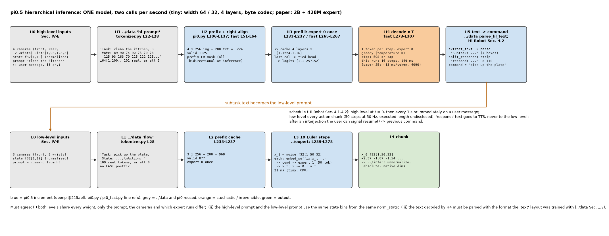
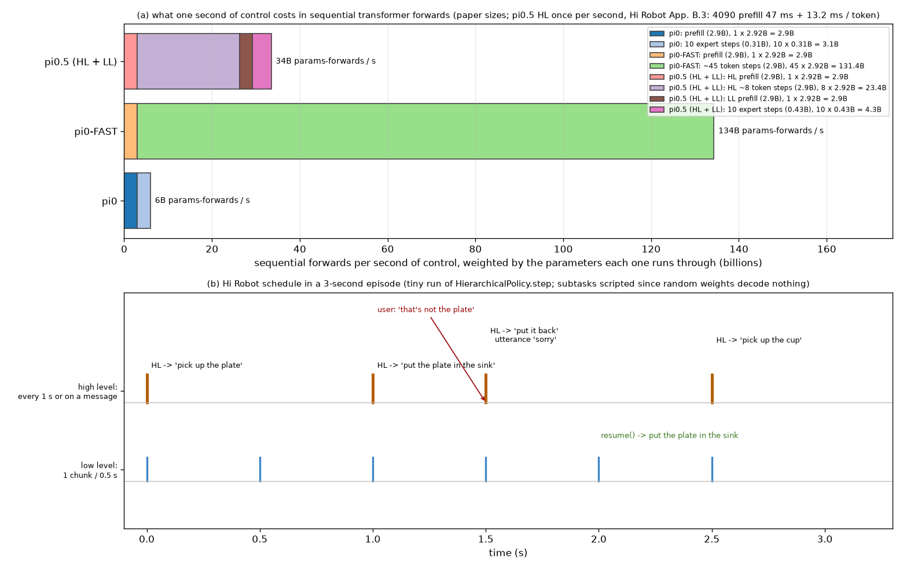

# π0.5 · hier: 一个模型两级推理, 先自回归解码 subtask 文本, 再以它为 prompt 做 flow matching

**TL;DR.** π0 / π0-FAST 是 "扁平" 策略: 一句 prompt 直接到动作. π0.5 把推理拆成两级 (论文 Sec. IV-A 的分解 π(a, ℓ̂ | o, ℓ) = π(a | o, ℓ̂) · π(ℓ̂ | o, ℓ)): **高层** 用全部 4 个相机 + 高层 prompt ("clean the kitchen") 逐 token 解码一句 subtask ("pick up the pillow"), **低层** 用腕 + 前相机 + 这句 subtask + state 分箱走 10 步 flow matching 出 50 步 action chunk (Sec. IV-B "standard autoregressive decoding for text tokens ℓ̂ followed by 10 denoising steps, conditioned on text tokens"; Sec. IV-E 相机). 两级用 **同一份权重**: 高层是 `../fast/model` 那种 prefix-LM 解码 (tied head, 右对齐, KV cache), 低层是 `../expert` 的 adaRMSNorm expert, 差别只在 prompt 与相机. 这条机制来自 Hi Robot (arXiv:2502.19417v2), 那里是两个模型 (高层 PaliGemma 微调出文本, 低层 π0), 并给出了调度规则: 高层每 1 s 或用户插话时重跑, 高层输出里的口头回复 (`respond: …`) 剥掉后再给低层, 插话完成后可切回原命令 (Hi Robot Sec. 4.1-4.2, Fig. 6). 收益 (论文 Fig. 13, mock home 四任务): 完整两级 > implicit HL (训练里有 HL 数据但推理不用) > human HL > no HL > GPT-4 HL; 意外的是 implicit HL 已经拿到大部分收益, 说明数据比推理结构更重要. 代价: 每次高层推理是一段文本的自回归解码, Hi Robot 在 RTX 4090 上 prefill 47 ms + 每 token 13.2 ms (H100: 17.3 + 5.7 ms, App. B.3); π0.5 自己的延时未披露 (→ §8). 因为高层每秒才跑一次, 这笔开销摊到 50 Hz 的控制上可以忽略.

**流程图**: 上排是高层 (4 相机 + 高层 prompt → prefill → 逐 token → `Subtask: …` → 剥离 `respond:`), 下排是低层 (3 相机 + subtask + state → prefill → 10 步 Euler → chunk), 中间是 Hi Robot 的调度. tiny 配置, 数值来自一次真实运行.



**第二幅图的论点**: (a) 一次高层 + 低层的顺序前向次数与每次前向的模型大小 (2B 底座 × (1 + T_subtask) + 300M expert × 10), 对比 π0 与 π0-FAST; (b) 一个 episode 的时间线: 高层每 1 s 一次, 低层每 chunk 一次, 用户插话触发的额外高层.



本 module 复现两级推理与调度. 上游: [openpi](https://github.com/Physical-Intelligence/openpi) @ `215abfb217dbac7d5f1273282331b9b1866c0479` (`openpi@215abfb`) 只有低层 (`pi0.py` `sample_actions` L216-L279 带 `adarms_cond`, `embed_prefix` L106-L137); 高层解码复用 `pi0_fast.py` L236-L313 的循环 (`../fast/model`). 论文 π0.5 [arXiv:2504.16054v1](https://arxiv.org/abs/2504.16054v1) Sec. IV-A, IV-B, IV-E, V-E, Fig. 3, Fig. 13, Fig. 17; Hi Robot [arXiv:2502.19417v2](https://arxiv.org/abs/2502.19417v2) Sec. 4.1, 4.2, 4.4, Fig. 2, Fig. 6, Appendix B.3. PyTorch 重写, 不 import 上游; SigLIP / embedder / `make_attn_mask` / 右对齐 / Euler 采样器 从 `pi.pi0`, `pi.fast` import, expert 从 `../expert`.

## 1. I/O 契约

### 1.1 `Pi05(vit_cfg, experts, action_dim=32, action_horizon=50)` (`pi0.py` L66-L103 with `pi05=True`)

| 子模块 | 说明 | 参数量 (paper) |
|---|---|---|
| `img` = `pi.pi0.vlm.SigLIP` | 每个相机槽位共享 | 414,803,696 |
| `embedder` | 词表 257,152 × 2048; 也是 logits 头 (tied, `gemma_fast.py` L120-L121) | 526,647,296 |
| `llm` = `../expert` `AdaMoEGemma` | expert 0 = Gemma 2B, expert 1 = 带 adaRMSNorm 的 300M | 1,981,884,416 + 427,932,672 |
| `proj` = `../expert` `Pi05ActionProjections` | | 2,165,792 |
| 合计 | | 3,353,433,872 |

### 1.2 `Pi05.embed_prefix(obs)` → `(emb, input_mask, ar_mask)` (`pi0.py` L106-L137)

| 名称 | shape / dtype | 说明 |
|---|---|---|
| 入 `obs` | `Pi05Observation` | 图像键 = `obs.images` 的键 (高层 4 槽或低层 3 槽, 顺序 = 键序); 读 `tokenized_prompt`, `tokenized_prompt_mask`, `token_ar_mask`; 不读 `state` |
| 出 `emb` | float32[B, n_img × 256 + 200, 2048] | |
| 出 `input_mask` | bool[B, S] | 图像段来自 `image_masks`, 文本段来自 `tokenized_prompt_mask` |
| 出 `ar_mask` | int64[B, S] | 图像 0; 文本段 = `token_ar_mask` (推理时全 0: prefix 双向) |

### 1.3 `Pi05.sample_text(obs, *, max_new_tokens=64, temperature=0.0, generator=None)` → `(tokens, n_steps)` (高层; `pi0_fast.py` L236-L313 的循环在 expert 0 上)

| 名称 | shape / dtype | 说明 |
|---|---|---|
| 入 `obs` | `Pi05Observation`, layout `"hl_prompt"` | prefix = 4 相机 + `Task: <高层 prompt>, State: …;\n` |
| 入 `max_new_tokens` | int | subtask 文本很短; 论文未给上限 (→ §8), 本仓库默认 64 (tiny 用 24) |
| 入 `temperature` | float | 0 = greedy; 论文未说高层用什么采样 (→ §8) |
| 出 `tokens` | int64[B, max_new_tokens] | 生成的 id, 停止后为 0 |
| 出 `n_steps` | int | 解码步数 |

循环与 `../fast/model` 逐行相同 (右对齐 → prefill → 逐 token 带 cache → 全 batch EOS 停), 只是 `llm` 是双 expert 的, 每步调 `llm([x, None], …)`. 文本由 `../data` 的 `extract_text` 与 `parse_hl_text` 取出.

### 1.4 `Pi05.sample_actions(obs, noise, num_steps=10)` → x_0 (低层; `pi0.py` L216-L279)

| 名称 | shape / dtype | 说明 |
|---|---|---|
| 入 `obs` | `Pi05Observation`, layout `"flow"` | prefix = 3 相机 + `Task: <subtask>, State: …;\nAction: ` |
| 入 `noise` | float32[B, 50, 32] | x_1 |
| 出 | float32[B, 50, 32] | 归一化 delta 动作; 逆变换在 `../infer` |

prefix 一次 (expert 0) → 10 步: `proj.embed_suffix(x_t, t)` → `suffix_forward(llm, cache, …, cond)` → `proj.decode`; Euler 由 `pi.pi0.flow_matching.model.sample_actions` 做.

### 1.5 `split_response(text)` → `(command, utterance)` (Hi Robot Sec. 4.2, Fig. 6)

| 入 / 出 | 说明 |
|---|---|
| 入 `text` | 高层解码出的 subtask 文本 (已 `parse_hl_text`) |
| 出 `command` | 去掉口头回复后给低层的命令; 若整段都是回复则为 `""` (调用方保留上一条命令) |
| 出 `utterance` | `respond:` 之后的文本, 或 None; 系统用 TTS 播给用户 |

Hi Robot 只说 "u_t 可以包含在 ℓ̂_t 里, 传给低层前去掉"; `respond:` 这个标记是 Fig. 6 里高层输出的写法 (`respond: Done! All trash has been cleared…`, `respond: Sorry!`), 精确格式未披露 (→ §8).

### 1.6 `HierarchicalPolicy(model, seq, *, hl_period_s=1.0, hl_keys, ll_keys, num_steps=10, max_new_tokens)`

**`step(raw_hl, raw_ll, t_now, user_message=None)`** → dict

| 名称 | 说明 |
|---|---|
| 入 `raw_hl` | `{"images": {4 槽}, "state", "prompt": [高层 prompt]}` |
| 入 `raw_ll` | `{"images": {3 槽}, "state"}` (prompt 由本函数填成 subtask) |
| 入 `t_now` | 秒; 与上次高层的间隔 ≥ `hl_period_s` 就重跑 (Hi Robot Sec. 4.1 "one second has elapsed") |
| 入 `user_message` | str 或 None; 非 None 立即重跑高层 (Sec. 4.2), 文本追加进高层 prompt (格式未披露, → §8) |
| 出 `subtask` | 当前给低层的命令 |
| 出 `utterance` | 本步产生的口头回复或 None |
| 出 `hl_ran` | 本步是否跑了高层 |
| 出 `actions` | float32[1, 50, 32] 归一化 chunk |
| 出 `timing` | `{"high-level (prefill + T tokens)", "low-level (prefill + 10 steps)"}` ms |

**`resume()`**: 用户宣布插话已完成, 切回插话前的命令 (Sec. 4.2 "the user can signal to the robot that it may switch back to the previous command").

### 1.7 符号 / 约定差异

| 主题 | π0.5 论文 | Hi Robot | 本仓库 |
|---|---|---|---|
| 高低层的模型 | 同一个 | 两个 (高层 PaliGemma 微调, 低层 π0) | 同一个 `Pi05` |
| 高层输入 | 4 相机 + 高层 prompt + (state 在 prompt 里) | 相机 + prompt, 无 state | 4 相机 + `"hl_prompt"` layout (state 在 prompt 里) |
| 高层频率 | "runs at a lower frequency than low-level" (Sec. II); 数值未披露 | 1 s 或用户插话 | 默认 1 s |
| 低层 prompt | subtask ℓ̂ | subtask ℓ̂, 去掉口头回复 | 同 Hi Robot |

## 2. 复现范围

| 有代码 | 只有事实 (背景) |
|---|---|
| §1.1-1.6: 模型组装, 高层解码, 低层采样, 回复剥离, 调度, 切回 | Hi Robot 的语音链路 (Whisper large-v2 转写, Cartesia TTS, App. B.1); 1-2 张 RTX 4090 (App. B.2) |
| 两级顺序前向次数的计数 (图) | 高层替代基线: implicit HL / no HL / GPT-4 (用任务描述 + 常用标签列表提示) / human HL (Sec. V-E, Fig. 13, Fig. 17); Hi Robot 的 GPT-4o 高层 (App. C.5 的 system prompt) |
| | "完成检测" 式的智能调度 (Hi Robot Sec. 4.1 提到但没做) |

## 3. 推理侧: 一个 episode 里发生什么

1. t = 0 或每 1 s 或用户插话: 高层. `build_pi05_batch(raw_hl, layout="hl_prompt", image_keys=HL_IMAGE_KEYS)` → `sample_text` → `extract_text` → `parse_hl_text` → `split_response`. 顺序前向: 1 次 prefill (4 × 256 + ~100 token, 2B) + T 次单 token (2B), T ≈ subtask 的 token 数.
2. 每个 chunk: 低层. `build_pi05_batch(raw_ll | prompt=subtask, layout="flow", image_keys=LL_IMAGE_KEYS)` → `sample_actions`. 顺序前向: 1 次 prefill (3 × 256 + ~110 token, 2B) + 10 次 expert (50 token, 428M).
3. 执行 chunk 的前 k 步 (k 未披露, → `../infer`), 回到 2; 期间高层按 1 计时.

延时 (Hi Robot App. B.3, RTX 4090): 低层 图像编码 14 ms + 观测前向 32 ms + 10 步 27 ms = 73 ms (板载), 86 ms (离板 + WiFi); 高层 单步 prefill 47 ms + decode 13.2 ms / token (H100: 17.3 + 5.7). 一句 8 token 的 subtask 约 47 + 8 × 13.2 ≈ 153 ms, 每秒一次.

## 4. 训练侧

高层与低层是同一个模型的两种样本 (`../data` §4.1: `"text"` 与 `"fast"` / flow), 联合目标在 `../train`. Hi Robot 的高层单独训练 (CE, D_syn ∪ D_labeled, AdamW 1e-5, → `../train`).

## 5. 评测

端到端评测 (mock home rubric, 语言跟随, Hi Robot 的 IA / TP) 在 `../infer/eval.py`, 那里的 episode 循环调用本 module 的 `HierarchicalPolicy.step`. `test_parity.py` (CPU, 约 30 s):
- paper 参数量 3,353,433,872 (meta device); tiny 前向各阶段 shape.
- 高层: `sample_text` 逐步 cache 解码 == 整条序列 teacher-forcing 前向的 argmax (同一权重); greedy 可复现; EOS 早停.
- 低层: `sample_actions` 与手写 10 步 Euler 一致; 高层跑过之后低层的 prefix 只含 3 个相机且后相机 mask False.
- `split_response`: 三种情况 (纯命令 / 命令 + 回复 / 纯回复).
- 调度: t < 1 s 不重跑, ≥ 1 s 重跑, 用户消息立即重跑, `resume` 切回.

```
uv run pytest pi/pi05/hier -q
uv run python -m pi.pi05.hier.model      # 一次高层 + 一次低层, 逐步 shape 与前向计数
uv run python pi/pi05/hier/figs/make_pipeline.py
uv run python pi/pi05/hier/figs/make_figs.py
```

## 6. cost 信息

| 项目 | 值 | 来源 |
|---|---|---|
| 高层单步延时 | RTX 4090: prefill 47 ms + decode 13.2 ms / token; H100: 17.3 + 5.7 ms | Hi Robot App. B.3 (Hi Robot 的高层模型, 与 π0.5 同底座) |
| 低层每 chunk | RTX 4090: 73 ms 板载 / 86 ms 离板 (π0) | Hi Robot App. B.3 |
| π0.5 本身的延时 | 未披露 | → §8 |
| 高层频率 | Hi Robot 1 s; π0.5 未披露 | → §8 |
| 推理硬件 | Hi Robot: 1-2 × RTX 4090 | Hi Robot App. B.2 |
| 模型大小 | 3,353,433,872 | `../expert` §1.5 |

## 7. reference 映射表

| 本仓库 | 上游 |
|---|---|
| `Pi05.__init__` | `pi0.py` L66-L103 (`pi05=True` 分支 L93-L95); `gemma_fast.py` L120-L121 (tied head) |
| `Pi05.embed_prefix` | `pi0.py` L106-L137 |
| `Pi05.prefix_cache` | `pi0.py` L233-L237 |
| `Pi05.sample_actions`, `make_velocity_fn` | `pi0.py` L216-L279 (`adarms_cond=[None, cond]` L266); 论文 Sec. IV-B "10 denoising steps" |
| `Pi05.sample_text`, `Pi05.decode_step` | `pi0_fast.py` L236-L313 (通过 `pi.fast.model` 的同一循环); 论文 Sec. IV-B "standard autoregressive decoding" |
| `split_response` | Hi Robot Sec. 4.2, Fig. 6 |
| `HierarchicalPolicy.step` / `resume` | Hi Robot Sec. 4.1 (1 s 规则), 4.2 (插话, 切回); 论文 Sec. IV-A 的分解, IV-E 的相机 |
| `tiny_pi05` | `pi.pi0.action_expert.tiny_experts` + `pi.pi0.vlm.tiny_vit`, 词表 257,152 |

## 8. gap ledger

| 未披露 / 未复现 | 说明 |
|---|---|
| π0.5 高层的重跑频率 | "lower frequency" 无数值; 采用 Hi Robot 的 1 s |
| 高层解码的采样 (greedy / 温度) 与长度上限 | 未披露; 本仓库 greedy, 上限 64 |
| 口头回复的标记 | Hi Robot Fig. 6 显示 `respond: …`; 是否总在这个位置、能否与命令同现未披露 |
| 用户插话如何进高层 prompt | Hi Robot 只说高层 "processes open-ended instructions and user interactions"; 本仓库把消息追加在高层 prompt 后 |
| 插话完成后的切回信号 | Hi Robot 说用户可以发信号; 信号的形式未披露; 本仓库 `resume()` |
| π0.5 的推理延时与硬件 | 未披露; 表里是 Hi Robot 的 |
| 高层是否也看 state | π0.5 的 prompt 格式带 state 分箱 (上游 L26-L28 对所有 prompt 都加); 高层是否用同一格式未披露; 本仓库同一格式 |
| 低层执行长度 k | 未披露 → `../infer` |
| 高层解码位置 +1 | 与 `../fast/model` 相同的上游行为, 见那里的 §8 |

## 9. 领域概念表

### application 概念

**两级 (hierarchical) 推理**
- shape: 高层文本 (几个 token) → 低层 chunk [50, 32].
- 含义: 高层把长任务分解成当前该做的一步, 低层执行这一步; 类似 chain-of-thought 但两级频率不同 (Sec. II).
- 来源: Hi Robot 的 System 1 / System 2 类比; π0.5 把两个模型合成一个.
- 为什么需要: 低层策略只学过原子命令; 长任务、复杂 prompt、用户纠正都要先翻译成原子命令 (Hi Robot Sec. 4.1).
- 系统联系: 高层输出是纯文本, 可以由人 (human HL 基线)、API 模型 (GPT-4 基线) 或本模型给出; 低层接口不变.

**用户插话 (interjection) 与口头回复**
- shape: 一段文本进高层 prompt; 一段文本出来给 TTS.
- 含义: 任务中途的纠正 ("that's not trash")、约束 ("I'm allergic to pickles")、新目标; 机器人用一句话确认或澄清.
- 来源: Hi Robot 的语音链路 (Whisper 转写, Cartesia TTS); 训练数据里是合成的 (`../data` §2).
- 为什么需要: 让高层能在 episode 中途改变低层的命令, 而不是重启任务.
- 系统联系: 插话立即触发一次高层推理; 回复不进低层.
