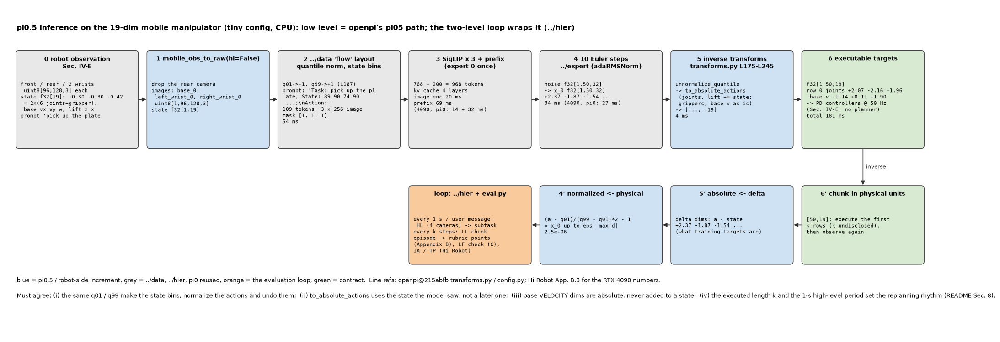
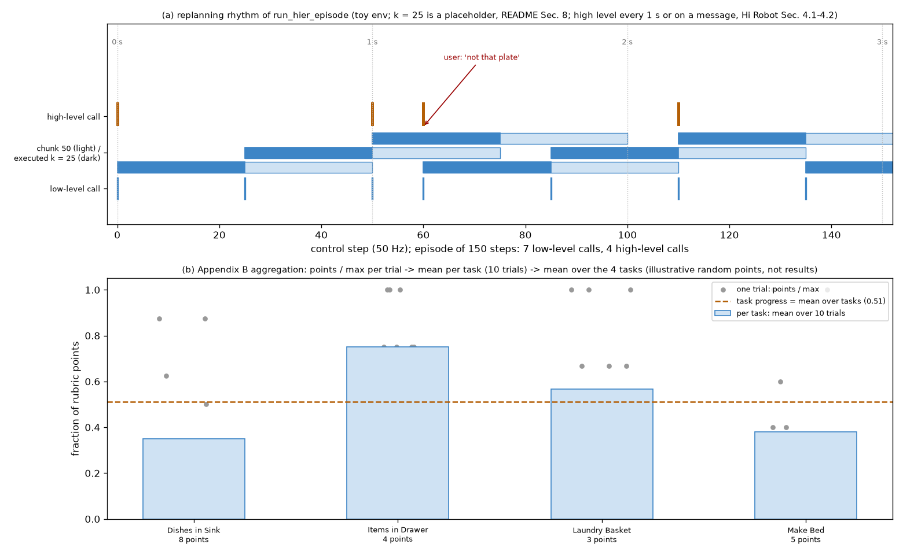

# π0.5 · infer: 端到端推理 (低层 flow-only 与两级), 移动操作臂的 spec, mock-home rubric / 语言跟随 / Hi Robot 指标的评测

**TL;DR.** 本 module 把 `../hier` 包成机器人能用的两条入口: `Pi05Policy.infer(raw)` 是上游 openpi 开源的那条 (只有低层, prompt 直接进模型, `config.py` L126-L138 的 PI05 链: `Task: …, State: …;\nAction: ` → 10 步 flow → quantile 逆变换 → 绝对目标), `Pi05HierPolicy.step(...)` 是论文部署的那条 (高层 subtask → 低层). 新的一律是机器人侧: 移动操作臂 18 / 19 维的 state / action 排列 (两臂 2 × (6 关节 + 1 夹爪) + 底盘 3 + 升降 1-2, 论文 Sec. IV-E), 50 Hz 的目标位姿 + 底盘速度直接给 PD 控制器 (Sec. IV-E "no additional trajectory planning or collision detection"), 4 相机的 HL 观测与 3 相机的 LL 观测. 评测按论文 Appendix B 的四任务 rubric (Dishes in Sink 8 分, Items in Drawer 4 分, Laundry Basket 3 分, Make Bed 5 分; 每策略每任务 10 次; 3 个 mock 房间 + 3 个真实家庭), Appendix C 的语言跟随 (2 场景 × 5 物体, language following rate 与 success rate, 随机猜 20%), 与 Hi Robot 的 Instruction Accuracy / Task Progress (每任务每方法 20 次). 代价与 π0 相同量级: 低层每 chunk 一次 prefill + 10 步 expert (Hi Robot 在 4090 上 73 ms), 高层每秒一次文本解码 (47 ms + 13.2 ms / token); π0.5 自己没披露延时 (→ §8). 论文的数字不复现 (仓库规则); 流程用假环境跑通.

**流程图**: 上排是一次 `Pi05Policy.infer` 从 raw 到可执行动作的每一步 (tiny 配置, 19 维移动臂, 3 相机), 下排是逆变换与两级的 episode 循环. 数值来自一次真实 tiny 运行.



**第二幅图的论点**: (a) 一个 episode 里高层 / 低层 / 执行的节奏 (50 步 chunk, 执行长度未披露, 高层每 1 s); (b) 四个 rubric 任务的分值结构与聚合方式 (每任务 10 次 × 12 个地点, 报告的是总分百分比).



本 module 复现 π0.5 推理链路与评测流程. 上游: [openpi](https://github.com/Physical-Intelligence/openpi) @ `215abfb217dbac7d5f1273282331b9b1866c0479` (`openpi@215abfb`) 的 `src/openpi/policies/policy.py` (`Policy.infer` L67-L106), `src/openpi/training/config.py` (L126-L138 PI05 transform 链, L187 quantile, L630-L642 `pi05_droid` H = 15, L865-L894 `pi05_full_droid_finetune` H = 16 / 32 维), `src/openpi/policies/droid_policy.py` (L47-L52 PI05 走 PI0 的相机 mask), `src/openpi/transforms.py` (quantile Unnormalize L175-L181, AbsoluteActions L226-L245); 论文 π0.5 [arXiv:2504.16054v1](https://arxiv.org/abs/2504.16054v1) Sec. IV-E, V-A, V-B, V-E, Appendix B, C; Hi Robot [arXiv:2502.19417v2](https://arxiv.org/abs/2502.19417v2) Sec. 5.2, Appendix B.3, B.4. PyTorch / NumPy 重写, 不 import 上游; `Env` / `EpisodeResult` / `rubric_score` 与 `RubricResult` 从 `pi.pi0.infer.eval`, `pi.fast.infer.eval` import.

## 1. I/O 契约

### 1.1 `Pi05RobotSpec` (`../data` README §9; `pi.fast.infer.FASTRobotSpec` 加两个字段)

| 字段 | 说明 |
|---|---|
| `norm_stats` | `{"state": QuantileStats, "actions": QuantileStats}`, 该机器人训练集的 q01 / q99 (`config.py` L187) |
| `delta_mask` | 哪些维是 delta (关节) 哪些是绝对 (夹爪); 底盘速度与升降怎么算未披露 (→ §8) |
| `native_dim` | 输出保留的维数: 移动臂 18 或 19; DROID 8; LIBERO 7 |
| `action_horizon` | 50 (移动臂, `pi0_config.py` L26); openpi 微调: DROID 15 / 16, LIBERO 10 |
| `control_hz` | 50 (论文 Sec. IV-E); 只用于把 chunk 换算成秒 |
| `discrete_state` | True; `pi05_libero` False (`config.py` L745) |

`MOBILE_MANIPULATOR_18 / _19`: 本仓库按 Sec. IV-E 的文字排出的顺序 (左臂 6 关节 + 夹爪, 右臂 6 关节 + 夹爪, 底盘 vx vy ω, 升降 1 或 2), **顺序未披露** (→ §8).

### 1.2 `Pi05Policy(model, seq, robot, *, num_steps=10, image_keys=LL_IMAGE_KEYS).infer(raw, noise=None)` → dict (`policy.py` L67-L106)

| 名称 | shape / dtype | 说明 |
|---|---|---|
| 入 `raw["images"]` | `{slot: uint8[B, h, w, 3]}` | `image_keys` 的子集; 缺的 mask False |
| 入 `raw["state"]` | float32[B, d] | 物理单位 |
| 入 `raw["prompt"]` | list[str] | 低层命令 (subtask 或直接的任务 prompt) |
| 出 `actions` | float32[B, H, native_dim] | 绝对目标 (关节 / 夹爪 / 底盘速度 / 升降), 物理单位 |
| 出 `x_0` | float32[B, H, 32] | 归一化 chunk (parity 用) |
| 出 `timing` | `{stage: ms}` | `data preprocessing`, `image encoders`, `observation forward pass`, `x10 action forward pass (flow)`, `inverse transforms`, `total` |

逆变换顺序 (`config.py` L129-L138 的 outputs 是空的, 只有 `DataConfig` 级的 Unnormalize → AbsoluteActions → 机器人 Outputs): `unnormalize_quantile(x_0)` → `to_absolute_actions(q_t, ·, delta_mask)` (关节 += 推理时的 state) → `[..., :native_dim]`.

### 1.3 `Pi05HierPolicy(model, seq, robot, ...)` → `step(raw_hl, raw_ll, t_now, user_message=None)`

`../hier` 的 `HierarchicalPolicy` 加上 `robot`: 进入前 quantile 归一化 state (两级 prompt 里的分箱用同一份统计量), 出来后做 §1.2 的逆变换. 返回 `../hier` 的 dict 加 `actions_exec` float32[1, H, native_dim].

### 1.4 `mobile_obs_to_raw(obs, prompt, *, hl)` → raw

| 入 | 说明 |
|---|---|
| `obs` | `{"front": uint8[h, w, 3], "rear": …, "left_wrist": …, "right_wrist": …, "state": float32[18 或 19]}` (本仓库的假接口, 上游没有移动臂的 policy 文件, → §8) |
| `hl` | True → 4 槽 (`HL_IMAGE_KEYS`), False → 3 槽 (`LL_IMAGE_KEYS`, 去掉 rear) |

### 1.5 `eval.py`

| API | 说明 |
|---|---|
| `MOCK_HOME_TASKS` | Appendix B 的 4 任务: 名称, 高层 prompt, 满分, 每分的判据文字 |
| `LANGUAGE_FOLLOWING` | Appendix C 的 2 场景 × 5 物体 (+ OOD 5 物体) |
| `HIROBOT_TASKS` | Hi Robot Sec. 5.1 的 3 个任务域与每方法 20 次 |
| `run_hier_episode(policy, env, task, episode_idx, *, max_steps, execute_steps, hl_period_s, control_hz, user_messages=None)` → `HierEpisode` | 两级循环: 每 `execute_steps` 步一次低层, 每 `hl_period_s` 或用户消息一次高层; 记录每次高层输出 |
| `evaluate_mock_home(policy, env, *, trials_per_task=10, ...)` | rubric 百分比: 每 trial `points / max_points`, 按任务平均, 再按任务平均 (Fig. 7b, Fig. 10 的 "task progress") |
| `evaluate_language_following(policy, env, ...)` | 每 trial 两个二值: 选对物体 (LF rate), 放对位置 (success rate); 按场景平均 (Fig. 9, 11, 15) |
| `instruction_accuracy(judgements)`, `task_progress(placed, total)` | Hi Robot Sec. 5.2 的两个指标 |
| `MockHomeToyEnv` | 假环境: 4 相机噪声图, 19 维 state, rubric 由脚本规则给分, 支持 `rubric()`, `language_check()`, 插话脚本 |

### 1.6 符号 / 约定差异

| 主题 | 论文 | 上游 / 本仓库 |
|---|---|---|
| 执行长度 | 未披露 (chunk 50 步 = 1 s @ 50 Hz) | π0 论文 25 步; 本仓库 `execute_steps` 参数, 默认 25 (占位, → §8) |
| 底盘动作 | "target base velocities" | delta_mask 里按绝对处理 (速度不是位置增量); 推断 (→ §8) |
| 评测环境 | 真实 mock home / 真实家庭 | 假环境, 不产生可解读的分数 |

## 2. 复现范围

| 有代码 | 只有事实 (背景) |
|---|---|
| §1.1-1.5 全部 | 机器人硬件: 两种移动操作臂, 4 相机, 2 × 6 DoF 臂 + 平行夹爪, 全向底盘, 1-2 DoF 升降 (Sec. IV-E); Hi Robot 的 UR5e (7 维) / 双臂 ARX (14 维) / Mobile ARX (14 维 state, 16 维 action) (Hi Robot App. B.4) |
| 两级 episode 循环, 三套指标的聚合 | 评测协议细节: 12 个地点 (3 真实厨房 + 3 真实卧室 + 3 mock 厨房 + 3 mock 卧室), 每策略 40 次标准评测, 交错执行, 取消的 episode 剔除, 双侧 t 检验 (Appendix B); 语言跟随的目标物体放得比干扰物远 (Appendix C) |
| | 论文结果: 真实家庭 Fig. 7b; 地点数 scaling Fig. 8-9; 消融 Fig. 10-11, 16; 与 π0 / π0-FAST+Flow 对比 Fig. 12, 15; 高层基线 Fig. 13, 17. Hi Robot Fig. 5, 7 |

## 3. 推理侧

一次低层 `infer`: 数据预处理 (resize / quantile / 分箱 / 序列) → SigLIP × 3 相机 → prefix 前向 (expert 0) → 10 × expert 1 → 逆变换. 每个 chunk 50 步 @ 50 Hz = 1 s 的动作; 执行前 k 步后重新观测. 两级: `step` 每次都做低层, 按 1 s / 插话做高层. 延时见 §6.

## 4. 训练侧

无. 权重来自 `../train`.

## 5. 评测

(a) **接口**: 论文没有仿真 benchmark; 真实机器人的观测是 4 张 RGB + 18 / 19 维 state, 动作是同维目标, 50 Hz; episode 长度 2-5 分钟 (Sec. V-A), 上限未披露 (→ §8). 假环境 `MockHomeToyEnv` 用同样的键与维度.
(b) **task**: Dishes in Sink (4 个餐具, 每个拿起 +1 放入 +1, 8 分), Items in Drawer (拿起 / 开抽屉 / 放入 / 关抽屉, 4 分), Laundry in Basket (导航并拿起 / 放到篮子 / 完全在篮子里, 3 分), Make the Bed (铺平毯子 / 枕头 1 / 枕头 2 / 毯子很平 / 枕头很整齐, 5 分) (Appendix B). 语言跟随: 抽屉场景 (tongs, wooden serving spoon, can opener, scissors, small yellow mustard), 水槽场景 (cup, bowl, plate, plastic spoon, cutting board), OOD (funnel, pill bottle, grill lighter, lighter, safety goggles) (Appendix C). Hi Robot: table bussing, sandwich making, grocery shopping.
(c) **metric**: rubric 百分比 = 得分 / 满分, 每任务 10 次平均, 再对任务平均; LF rate = 选对物体的比例, success rate = 放对位置的比例, 按场景平均; IA = 每 trial 里高层预测被评审判为符合意图的比例 (扁平基线由评审按行为判), TP = 放对位置的物体比例; Hi Robot 每任务每方法 20 次.
(d) **流程** `eval.py`: `run_hier_episode` 的两级循环 → `env.rubric()` / `env.language_check()` → 聚合. tiny + 假环境跑通.
(e) **对齐程度**: 任务、分值、试次数、聚合方式与论文一致; 环境、物体、评审全部是假的.

`test_parity.py` (CPU, 约 40 s):
- `infer` 输出契约; 零 chunk 的逆变换 = 当前 state (delta 维) / 0 (绝对维); 与 `../hier` 的 `sample_actions` 一致.
- 18 / 19 维 spec 的维度计数; `mobile_obs_to_raw` 的 HL / LL 槽位.
- rubric 常量: 4 任务满分 8 / 4 / 3 / 5; 语言跟随 2 × 5 (+5 OOD); 聚合的算术 (每任务平均再平均).
- 两级循环: 高层次数 = ceil(T / (hl_period × hz)) + 插话数; 低层次数 = ceil(T / execute_steps).
- IA / TP 的定义.

```
uv run pytest pi/pi05/infer -q
uv run python -m pi.pi05.infer.model     # 一次 infer 的逐步 shape 与延时表
uv run python -m pi.pi05.infer.eval      # 假环境上跑 mock-home 与语言跟随各几次
uv run python pi/pi05/infer/figs/make_pipeline.py
uv run python pi/pi05/infer/figs/make_figs.py
```

## 6. cost 信息

| 项目 | 值 | 来源 |
|---|---|---|
| 低层延时 (π0 底座, RTX 4090) | 图像编码 14 ms + 观测前向 32 ms + 10 步 27 ms = 73 ms 板载, 86 ms 离板 + WiFi | Hi Robot App. B.3 |
| 高层延时 | 4090: prefill 47 + 13.2 ms / token; H100: 17.3 + 5.7 | Hi Robot App. B.3 |
| π0.5 延时与硬件 | 未披露 | → §8 |
| 控制频率 / chunk | 50 Hz, 50 步 | 论文 Sec. IV-E, Appendix E |
| 执行长度 | 未披露 | → §8 |
| 评测规模 | 4 任务 × 10 次 × 12 地点 (每策略 40 次标准评测); 语言跟随 2 场景; Hi Robot 3 任务 × 20 次 | Appendix B, C; Hi Robot Sec. 5.2 |
| 模型大小 | 3,353,433,872 | `../expert` |

## 7. reference 映射表

| 本仓库 | 上游 |
|---|---|
| `Pi05RobotSpec`, `MOBILE_MANIPULATOR_18 / _19` | 论文 Sec. IV-E; `config.py` L187 (quantile), L26 (H 50) |
| `Pi05Policy.infer` | `policy.py` L67-L106; `config.py` L126-L138; 计时分段同 `pi.pi0.infer` |
| `to_executable_actions` | `transforms.py` L175-L181 (quantile Unnormalize), L226-L245 (AbsoluteActions); `pi.fast.infer.to_executable_actions` 的顺序 |
| `Pi05HierPolicy` | `../hier` + 本文件的归一化 / 逆变换 |
| `mobile_obs_to_raw` | 论文 Sec. IV-E (4 相机, HL 全部 / LL 腕 + 前) |
| `MOCK_HOME_TASKS`, `evaluate_mock_home` | 论文 Appendix B, Sec. V-A, Fig. 7b |
| `LANGUAGE_FOLLOWING`, `evaluate_language_following` | 论文 Appendix C, Sec. V-B, Fig. 9 |
| `HIROBOT_TASKS`, `instruction_accuracy`, `task_progress` | Hi Robot Sec. 5.1, 5.2 |
| `run_hier_episode` | Hi Robot Sec. 4.1-4.2; `pi.pi0.infer.eval.run_episode` 的结构 |
| `MockHomeToyEnv` | 本仓库 (假环境) |

## 8. gap ledger

| 未披露 / 未复现 | 说明 |
|---|---|
| 执行长度 k | 未披露; `execute_steps` 默认 25 是 π0 论文的值, 仅为跑通 |
| 18 / 19 维的排列 | 按 Sec. IV-E 文字排, 顺序推断 |
| 底盘速度与升降的 delta / 绝对处理 | 未披露; 本仓库底盘速度按绝对, 升降按 delta (推断) |
| π0.5 的推理延时与硬件 | 未披露; 表里是 Hi Robot 的 |
| episode 步数上限 | 未披露 (2-5 分钟); 假环境用参数 |
| 真实评测环境 | 不可复现; 假环境只走流程 |
| 移动臂的 policy 适配文件 | 上游没有 (openpi 只有 DROID / LIBERO / ALOHA); `mobile_obs_to_raw` 是本仓库的假接口 |
| 语言跟随的 trial 数 | 未披露 |
| Hi Robot 的评审规则 | "human evaluator blind to the method"; 假环境用脚本规则 |
| openpi `pi05_droid` 的 H = 15 与 `pi05_full_droid_finetune` 的 H = 16 | 上游两个数; 与论文的 50 无关 (DROID 是 15 Hz 平台) |

## 9. 领域概念表

### domain 概念

**移动操作臂的 state / action 空间 (18 / 19 维)**
- shape: float32[18] 或 [19].
- 含义: 两臂各 6 个关节角 + 1 个夹爪 (14), 底盘线速度 2D + 角速度 1D (3), 升降 1D 或 2D (1-2). 关节 / 夹爪 / 升降是位置目标, 底盘是速度目标.
- 来源: 机器人的关节编码器、夹爪读数、底盘里程计、升降位置.
- 为什么需要: 模型的输出直接是这些目标, 由 PD 控制器跟踪 (Sec. IV-E).
- 系统联系: 逆变换要知道哪几维是 delta; 底盘速度不能当位置增量.

**任务进度 rubric**
- shape: 每 trial 一个整数得分与满分.
- 含义: 多阶段任务按完成的步骤给部分分 (放进一半餐具 ≈ 50%).
- 来源: 人工评审按 Appendix B 的判据打分.
- 为什么需要: 2-5 分钟的任务用二值成功率信息量太少.
- 系统联系: 聚合方式 (先任务内平均) 决定了 Fig. 7-13 的数字含义.

### application 概念

**Instruction Accuracy / Task Progress (Hi Robot)**
- shape: 每 trial 两个比例.
- 含义: IA = 高层给出的命令有多少条符合用户意图与当前观测; TP = 物体最终摆对的比例.
- 来源: 盲评审.
- 为什么需要: 把 "理解错了" 与 "做不到" 分开; 扁平策略的 IA 由评审从行为推断.
- 系统联系: IA 只看高层输出, 与 `../hier` 的 `hl_ran` 记录对应.
