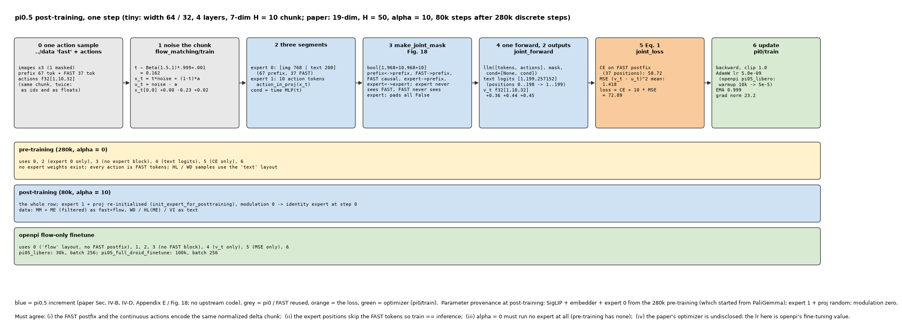
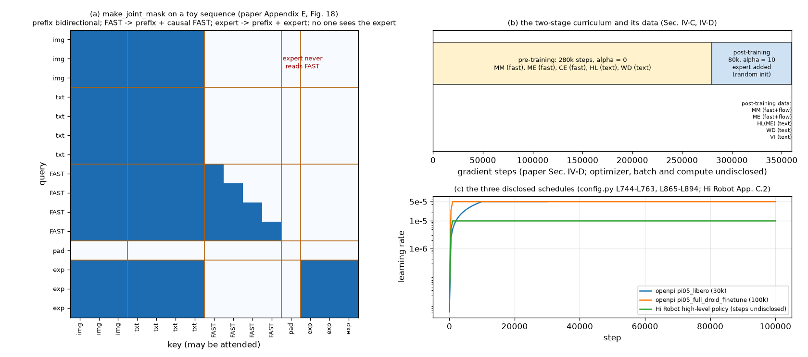

# π0.5 · train: 文本 + FAST token 的 CE 与 α · flow-matching MSE 的联合目标, Fig. 18 的三块 mask, 280k → 80k 两阶段, 数据混合, Hi Robot 高层的超参

**TL;DR.** 这是 π0.5 **训练侧** 的核心增量 (论文 Sec. IV-B, IV-C, IV-D): 一条样本同时进两个 "动作出口", loss = H(文本 + FAST 动作 token 的 CE) + α · ‖ω − a − f_θ^a(a^{τ,ω}, o, ℓ)‖² (Eq. 1). 预训练 280k 步 α = 0, 模型就是一个标准 VLM (没有 expert, 所有动作都是 FAST token, FAST 论文说这比 flow 训练快得多); post-training 80k 步 α = 10, 加进随机初始化的 adaRMSNorm expert, 让推理时能走 10 步 flow 而不用几十步自回归. 两条出口靠 attention mask 隔开 (Appendix E, Fig. 18): prefix 双向, FAST 动作 token 看 prefix 并在自己内部因果, expert 的连续动作 token 看 prefix 与彼此但 **不看 FAST token**, FAST token 也不看 expert; 信息只从 VLM 流向 expert. 收益: Fig. 12, π0.5 在 mock home 上显著优于 π0 与 "π0-FAST+Flow" (同样的联合配方但只用动作数据), 且 π0 训到 300k 步也追不上, 印证 FAST token 训练比纯 diffusion 更省算力; Fig. 15, 离散 token 训练带来更强的语言跟随. 代价: 论文 **没有披露** 优化器、学习率、batch、算力 (→ §8); 本仓库的 `paper` 配置只有步数与 α, 其余占位; 可运行的数字来自 openpi 的 `pi05_*` 微调配置 (`config.py` L744-L763, L865-L894) 与 Hi Robot 高层策略的 App. C.2 (AdamW β = (0.9, 0.95), 无 wd, clip 1, EMA 0.999, warmup 1k → 常数 1e-5, batch 512, 8 × H100 约 2 小时).

**流程图**: 上排是 post-training 一步: 一条 `"fast"` layout 的样本 + 连续动作 → 三段序列 → Fig. 18 mask → 一次前向两个出口 → 两项 loss → 一次更新 (tiny 配置, 真实数值); 下排是预训练 (α = 0) 与 flow-only 微调 (openpi) 各自用了这条流水线的哪一段, 以及参数的来源 (PaliGemma / 预训练 / 随机).



**第二幅图的论点**: (a) Fig. 18 的 mask 本身 (tiny 序列, 三块的可见关系); (b) 两阶段 curriculum 的时间线与每阶段的数据构成, 以及 openpi / Hi Robot 的三条 schedule.



本 module 复现 π0.5 训练侧相对 π0 与 FAST 的增量. 上游: [openpi](https://github.com/Physical-Intelligence/openpi) @ `215abfb217dbac7d5f1273282331b9b1866c0479` (`openpi@215abfb`) 只有 flow-only 的 `compute_loss` (`pi0.py` L188-L214, `adarms_cond`) 与微调配置 (`config.py` L744-L763 `pi05_libero`, L799-L827 `pi05_aloha_pen_uncap`, L865-L894 `pi05_full_droid_finetune`, L895-L918 `pi05_droid_finetune`; `optimizer.py`); 联合目标、mask、curriculum 只有论文. 论文 π0.5 [arXiv:2504.16054v1](https://arxiv.org/abs/2504.16054v1) Sec. IV-B (Eq. 1), IV-C, IV-D, V-C, V-D, Appendix E, Fig. 18; Hi Robot [arXiv:2502.19417v2](https://arxiv.org/abs/2502.19417v2) Sec. 4.3, Appendix C.2, C.3. PyTorch 重写, 不 import 上游; 优化器 / schedule / EMA / clip `from pi.pi0.train.train`, CE `from pi.fast.train.train`, 时间步与插值 `from pi.pi0.flow_matching.train`.

## 1. I/O 契约

### 1.1 `make_joint_mask(prefix_mask, fast_mask, n_expert)` → bool[B, P + F + E, P + F + E] (论文 Appendix E, Fig. 18)

| 名称 | shape / dtype | 说明 |
|---|---|---|
| 入 `prefix_mask` | bool[B, P] | 图像 + 文本 prefix 的有效位 (`ar_mask == 0` 的 token) |
| 入 `fast_mask` | bool[B, F] | FAST 动作 token (postfix, `ar_mask == 1`) 的有效位 |
| 入 `n_expert` | int | expert 的连续动作 token 数 (50) |
| 出 | bool[B, N, N] | 行 = query, 列 = key |

| query \ key | prefix | FAST | expert |
|---|---|---|---|
| prefix | 双向 | ✗ | ✗ |
| FAST | ✓ | 因果 (≤ 自己) | ✗ |
| expert | ✓ | ✗ | 双向 |

无效 (pad) 的行列全 False. `pi.pi0.vlm.make_attn_mask` 的 cumsum 规则表达不了 "expert 跳过 FAST", 所以显式构造. 在本仓库的序列里 P + F 就是 `Pi05Observation` 的 `[images | tokenized_prompt]`, F 由 `token_ar_mask` 标出.

### 1.2 `joint_forward(model, obs, x_t, t)` → `(text_logits, targets, text_loss_mask, v_t)`

| 名称 | shape / dtype | 说明 |
|---|---|---|
| 入 `obs` | `Pi05Observation`, layout `"fast"` 或 `"text"` | postfix 是 FAST token 或文本目标 |
| 入 `x_t` | float32[B, 50, 32] | 加噪动作 (无动作的样本传全 0, 其 MSE 被 `alpha_mask` 屏蔽) |
| 入 `t` | float32[B] | 时间步 |
| 出 `text_logits` | float32[B, L−1, 257152] | 只对 token 序列的最后 L−1 个位置做 tied head (`pi.fast.train.target_logits` 的做法); 位置 i 预测 token i+1 |
| 出 `targets`, `text_loss_mask` | int64 / bool [B, L−1] | shift 后的 token 与 postfix mask |
| 出 `v_t` | float32[B, 50, 32] | expert 的速度场 (`proj.decode`) |

一次前向: `llm([prefix + FAST 段 (expert 0), expert 段 (expert 1)], positions, make_joint_mask(...), cond)`. positions: expert 0 段 = `cumsum(valid) − 1`; expert 段 = 有效 **非 FAST** token 数 + 序号, 与推理时 (没有 FAST token) 的位置一致 (推断, → §8).

### 1.3 `joint_loss(model, obs, actions, *, alpha, t, noise, has_actions=None)` → dict (Eq. 1)

| 名称 | 说明 |
|---|---|
| 入 `actions` | float32[B, 50, 32] 归一化 delta 动作 (与 FAST token 编码的是同一条 chunk) |
| 入 `alpha` | 0.0 (预训练) 或 10.0 (post-training) (Sec. IV-B, IV-D) |
| 入 `t`, `noise` | `pi.pi0.flow_matching.train.sample_timestep` (Beta(1.5, 1), s = 0.999, Appendix E) 与标准正态 |
| 入 `has_actions` | bool[B]; False 的样本 (HL / WD) 只算 CE |
| 出 `loss` | 标量 = `ce.mean() + alpha * mse[has_actions].mean()` |
| 出 `ce` | float32[B], `pi.fast.train.cross_entropy` 逐样本按有效 token 归一 |
| 出 `mse` | float32[B], 对 50 × 32 求均值 (π0 的 `compute_loss` 对维求均值, 训练 loop 再对 batch / horizon 求均值) |

α = 0 时不跑 expert (预训练没有 expert 权重, Sec. IV-B "then add additional action expert weights ... in a post-training stage").

### 1.4 `init_expert_for_posttraining(model, seed)` (Sec. IV-D "initialized with random weights at the beginning of post-training")

重新初始化 expert 1 (`llm.layers[i].experts[1]`, `final_norms[1]`) 与 `proj`; adaRMSNorm 的 modulation 仍是零 (`../expert` §1.1), 所以 post-training 第一步 expert 是恒等映射. VLM 侧 (expert 0, SigLIP, embedder) 保持预训练权重.

### 1.5 配置

| 函数 | 值 | 来源 |
|---|---|---|
| `pretrain_config()` | `Pi05TrainConfig(stage="pretrain", alpha=0.0, num_train_steps=280_000, optimizer=None)` | Sec. IV-D "280k gradient steps"; 优化器未披露 |
| `posttrain_config()` | `stage="posttrain", alpha=10.0, num_train_steps=80_000, optimizer=None` | Sec. IV-D "α = 10.0 for 80k additional steps" |
| `scaling_config()` | 40k 步的 post-training (地点数 scaling 实验) | Sec. V-B |
| `openpi_libero_config()` | `TrainConfig(warmup_steps=10_000, peak_lr=5e-5, decay_steps=1_000_000, decay_lr=5e-5, clip 1.0, ema_decay=0.999, batch_size=256, num_train_steps=30_000)`, α 不适用 (flow-only), `discrete_state_input=False`, H 10 | `config.py` L744-L763 |
| `openpi_droid_config()` | `warmup_steps=1_000, peak_lr=5e-5` 常数, `batch_size=256, num_train_steps=100_000`, EMA 默认 0.99, H 16, 32 维 | `config.py` L865-L894 |
| `openpi_droid_small_config()` | 20k 步, batch 32, 从 `pi05_droid` 权重 | `config.py` L895-L918 |
| `openpi_aloha_config()` | 20k 步, batch 64, 从 `pi05_base` | `config.py` L799-L827 |
| `hirobot_hl_config()` | AdamW (0.9, 0.95), wd 0, clip 1, EMA 0.999, warmup 1k → 常数 1e-5, batch 512; 全模型解冻 | Hi Robot App. C.1, C.2 |

`TrainConfig` 是 `pi.pi0.train.TrainConfig`; `Pi05TrainConfig` 在它之外记 `stage`, `alpha`, `optimizer` (None = 未披露).

### 1.6 `train_step(model, batch, params, optimizer, ema, cfg, step)` → dict

`batch = (obs, actions, has_actions)`; 抽 t / noise → `joint_loss` → backward → `pi.pi0.train.clip_and_step` → EMA. 返回 `loss`, `ce`, `mse`, `grad_norm`, `lr`.

### 1.7 数据混合 (只陈述; `MIXTURE` 常量)

| 阶段 | 数据源 | layout | 说明 |
|---|---|---|---|
| 预训练 | MM, ME, CE (含 OXE) | `"fast"` | 所有动作数据都是 FAST token (Sec. IV-C) |
| 预训练 | HL | `"text"` | subtask (+ bbox) 目标 |
| 预训练 | WD | `"text"` | caption / VQA / 检测 |
| post-training | MM, ME (成功、长度阈值以下) | `"fast"` + 连续动作 | 去掉 CE (Sec. IV-D) |
| post-training | WD, ME 对应的 HL, VI | `"text"` | VI 是语言遥操作示范 |
| Hi Robot 高层 | D_syn ∪ D_labeled | 文本 | 单独的模型, CE |
| Hi Robot 低层 | D_labeled ∪ D_demo | π0 flow | 单独的模型 |

权重未披露; 只知道预训练 97.6% 的样本非 MM, VI 约占 HL-MM 的 11% (→ §8).

## 2. 复现范围

| 有代码 | 只有事实 (背景) |
|---|---|
| §1.1-1.6: mask, 联合前向, Eq. 1, expert 重初始化, 配置, 一步训练 | 消融与对比的数字 (Fig. 8-13, 15-17); "π0-FAST+Flow" 基线的定义 (联合配方, 只用动作数据) |
| 数据混合的 layout 表 | 数据混合的权重与规模; 训练算力; 用 VLM 合成 Hi Robot 标注 |
| | 分布式训练、bf16、checkpoint 管理 |

## 3. 推理侧

无. 推理在 `../hier`, `../infer`.

## 4. 训练侧

### 4.1 数据组织形式

见 §1.7 与 `../data` §4.1. 每条 batch 元素: `Pi05Observation` + `actions` (可为零) + `has_actions`.

### 4.2 数据预处理, 逐步

`../data` §4.2, 训练模式 (`train=True`: 增广).

### 4.3 training objective / curriculum

1. **预训练** 280k 步, α = 0: 序列 = [images | prefix 文本 | postfix (FAST 或文本)], 只有 expert 0, loss = CE (postfix). 这与 `../fast/train` 的目标相同 (`target_logits` + `cross_entropy`), 只是样本多了 `"text"` layout.
2. **post-training** 80k 步, α = 10: 加 expert 1 与投影 (随机初始化, modulation 零), 每条动作样本额外走 expert 段, loss = CE + 10 · MSE. Fig. 18 mask. 时间步 Beta(1.5, 1) · 0.999 + 0.001 (Appendix E, 与 π0 相同).
3. **flow-only 微调** (openpi `pi05_*`): 只有 `"flow"` layout, 只有 MSE (`pi0.py` L188-L214 带 `adarms_cond`), 这是上游开源的路径; 本仓库 `alpha_only_flow=True` 走这条.

## 5. 评测

训练侧验证只有 `evaluate_loss` (固定 seed 的 held-out 联合 loss). `test_parity.py` (CPU, 约 60 s):
- `make_joint_mask`: 表格里的 9 个关系逐一断言; pad 行列全 False; 无 FAST token 时退化为 π0 的 `make_attn_mask([prefix | expert])`.
- CE 部分与 `pi.fast.train.target_logits` + `cross_entropy` 相同 (同一份权重, α = 0, 无 expert 段).
- MSE 部分: 无 FAST token 的 `"flow"` 样本上, `joint_forward` 的 v_t == `../hier` 推理路径 (prefix cache + `suffix_forward`) 的 v_t; expert 不看 FAST token (改 FAST token 不改 v_t).
- oracle: 把 `x_t` 设成插值、把网络的输出换成 u_t 时 MSE 为 0 (解析); α = 0 时 loss == CE.
- `init_expert_for_posttraining` 只动 expert 1 与 proj, 且之后 expert 是恒等 (`../expert`).
- 配置: openpi libero schedule 在 warmup 后恒为 5e-5; Hi Robot 的 1e-5 常数; paper 配置的占位为 None.

```
uv run pytest pi/pi05/train -q
uv run python -m pi.pi05.train.train     # 一步 post-training: mask, 两个出口, 两项 loss, 更新
uv run python pi/pi05/train/figs/make_pipeline.py
uv run python pi/pi05/train/figs/make_figs.py
```

## 6. cost 信息

| 项目 | 值 | 来源 |
|---|---|---|
| 训练步数 | 预训练 280k + post-training 80k; scaling 实验 40k; π0 基线最多 300k | Sec. IV-D, V-B, V-D |
| 训练算力 (卡型 × 卡数 × 时长) | 未披露 | → §8 |
| batch / 优化器 / lr | 未披露 (π0.5); openpi 微调: batch 256, AdamW, 5e-5; Hi Robot 高层: batch 512, AdamW 1e-5 | `config.py`; Hi Robot App. C.2 |
| Hi Robot 高层训练 | 约 2 小时, 8 × H100 | Hi Robot App. C.3 |
| 数据规模 | MM 约 400 h / 约 100 家; 其余未披露; 预训练 97.6% 非 MM | Sec. I, IV-C |
| 参数量 | 预训练 2,923,335,408 (VLM); post-training 3,353,433,872 | `../expert` |
| token 数 | 未披露 | → §8 |

## 7. reference 映射表

| 本仓库 | 上游 |
|---|---|
| `make_joint_mask` | 论文 Appendix E, Fig. 18 |
| `joint_forward` | 论文 Sec. IV-A (f 的两类输出), IV-B; `pi0.py` L202-L211 (joint pass) + `pi0_fast.py` L205-L233 (target logits, 经 `pi.fast.train`) |
| `joint_loss` | 论文 Eq. 1; `pi0.py` L195-L214 (MSE, 经 `pi.pi0.flow_matching.train`); `pi0_fast.py` L227-L233 (CE) |
| `init_expert_for_posttraining` | 论文 Sec. IV-D |
| `pretrain_config`, `posttrain_config`, `scaling_config` | 论文 Sec. IV-D, V-B |
| `openpi_*_config` | `config.py` L744-L763, L799-L827, L865-L918; `optimizer.py` L15-L31, L65-L85 |
| `hirobot_hl_config` | Hi Robot App. C.1-C.3 |
| `select_trainable` | Hi Robot App. C.1 ("unfreeze the full model"); openpi 默认不冻结 (`config.py` L492) |
| `train_step`, `evaluate_loss` | `scripts/train.py` L137-L191 (经 `pi.pi0.train`) |
| `MIXTURE` | 论文 Sec. IV-C, IV-D, Fig. 4; Hi Robot Sec. 4.3 |

## 8. gap ledger

| 未披露 / 未复现 | 说明 |
|---|---|
| π0.5 的优化器、lr schedule、batch、weight decay、EMA | 全部未披露; `pretrain_config` / `posttrain_config` 的 `optimizer=None`; tiny 跑通用 openpi 的 libero 值 (仅为跑通) |
| 训练算力与时长 | 未披露 |
| 数据混合权重 | 未披露 |
| expert 段的 position id | 论文未说; 本仓库让 expert 位置跳过 FAST token, 与推理一致 (推断) |
| `Action: ` 标记归 prefix 还是 postfix | 见 `../data` §8; 联合训练用 FAST 的 postfix 约定 |
| FAST token 是否看 expert | Fig. 18 说不看 ("avoid information leakage between the two representations"); 实现按此 |
| 预训练是否已含 expert 权重 | Sec. IV-B 说 post-training 时 "add"; Sec. IV-D 说 "initialized with random weights"; 实现: 预训练不建 expert, post-training 重初始化 |
| post-training 数据的 "长度阈值" | 未披露 |
| Hi Robot 高层训练步数 | 未披露 (只有 2 小时 / 8 × H100) |
| Hi Robot 低层 (π0) 的训练超参 | "similar training pipeline", 未给数 |
| `pi05_full_droid_finetune` 的 EMA | 未显式给, 取 `TrainConfig` 默认 0.99 (`config.py` L489) |
| 论文 vs openpi | 论文 H = 50 / 32 维 / 联合目标; openpi 微调 H 10-16 / flow-only; 记录, 微调配置采信 openpi |

## 9. 领域概念表

### domain 概念

**联合离散 / 连续动作目标**
- shape: 同一条 chunk 出现两次: 作为 FAST token (CE) 与作为连续张量 (MSE).
- 含义: 让一个模型既能 next-token 预测动作 (训练快、语言能力强), 又能 flow 采样动作 (推理快、连续精细).
- 来源: 论文 Sec. IV-B, 组合 FAST 与 π0 的两条路线.
- 为什么需要: FAST 训练比 diffusion 省算力 (Fig. 12), flow 推理比自回归省时间 (FAST 论文 Sec. VI-E).
- 系统联系: attention mask 隔开两条出口; 部署只用 flow 出口.

**两阶段 curriculum (预训练 → post-training)**
- shape: 280k 步 + 80k 步.
- 含义: 先在最广的混合上学成 VLM (含动作 token), 再针对目标平台加 expert 并换数据.
- 来源: Sec. IV-D.
- 为什么需要: 广度来自第一阶段 (97.6% 非目标平台数据), 部署能力来自第二阶段 (VI, 成功 episode 筛选).
- 系统联系: post-training 的起点是恒等 expert, 见 `../expert`.
