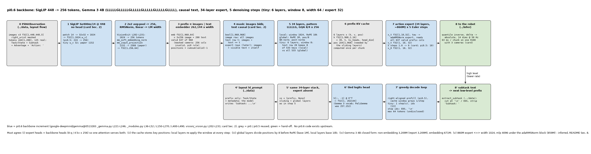
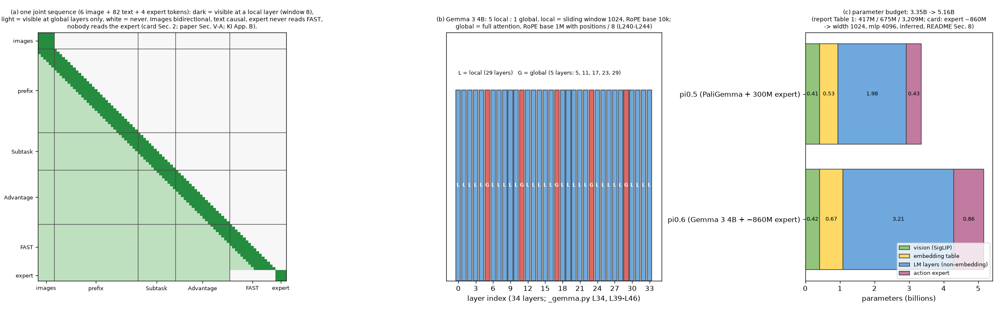

# π0.6 · backbone: Gemma 3 4B 最小实现, 448 图像到 256 token, 图像双向 / 文本因果的 mask, 34 层 expert, 5 步 flow

**TL;DR.** π0.5 的底座是 PaliGemma (SigLIP So400m/14 @ 224 + Gemma 2B, 18 层, MQA), expert 是 18 层 300M; π0.6 把底座换成 **SigLIP 400M @ 448 + Gemma 3 4B** (34 层, GQA 8 q / 4 kv × 256, QK-norm, 每 6 层 5 层 sliding-window 1024 + 1 层全局, RoPE 10k / 1M, attn 与 FFN 都有 post-norm, 262,144 词表), expert 改成 **与底座同深度 (34 层) 的约 860M** (模型卡 §2; 论文 Sec. V-A). 这是 **推理与训练两侧都变** 的结构增量: 参数从 3.35B 到约 5.16B (本 README §6), 图像 patch 数从 256 到 1024 (再 avg-pool 到 256, Gemma 3 的做法), attention 规则从 "prefix 全双向" 改成 "图像间双向、文本间因果、action token 间双向" (模型卡 §2). 代价是算力; 收益是模型卡 Fig. 2-4: 不做任务微调 (out-of-the-box) 就能折叠衣物, 20% 完整组装纸盒, 所有静态 / 移动任务的速度都更快. 推理还从 10 步 Euler 减到 **5 步**, H100 上 3 相机 **63 ms / chunk** (模型卡 §2). 上游 **没有** π0.6 代码; Gemma 3 的结构取自 google-deepmind/gemma @ `0513283`, 双 expert 布局与 adaRMSNorm 来自 π0 / π0.5.

**流程图**: 上排是一次低层推理 (observation → SigLIP 448 → pool → prefix → mask → 34 层 → KV cache → expert 5 步 → x_0), 下排是子任务解码的镜像路径. tiny 配置 6 层 (一个完整的 LLLLLG), window 8, 宽 64 / expert 32; 数值来自一次真实运行.



**第二幅图的论点**: (a) 一条 joint 序列在 local 层 (深绿, 只有 window 内) 与 global 层 (浅绿) 各能看到什么: 图像双向, 文本因果, expert 读不到 FAST, 没人读 expert; (b) 34 层的 L / G 排布与每层的 RoPE 基频 / window; (c) π0.5 → π0.6 各部件的参数预算, 以及从 "约 860M" 反推的 expert 宽度 1024.



本 module 复现 π0.6 结构侧相对 π0.5 的增量, 并装配 `Pi06` 模型 (prefix cache, 5 步 flow, 子任务解码). 上游: [google-deepmind/gemma](https://github.com/google-deepmind/gemma) @ `0513283af5afffa27390b6ede2facc35d0f16e08` (`gemma@0513283`): `gemma/gm/nn/_gemma.py` `Gemma3_4B` L221-L246, `GEMMA3_ATTENTION_PATTERN` L39-L46, `_NUM_LAYERS_GEMMA3_4B` L34, `Gemma3_1B` L169-L193; `gemma/gm/nn/_modules.py` `create_sliding_mask` L36-L52, `Attention` L150-L270 (qk-norm L160-L161 / L192-L194, RoPE 与 query 缩放 L196-L204, sliding mask L258-L267), `Block` L400-L490; `gemma/gm/nn/_layers.py` `RMSNorm`; `gemma/gm/math/_positional_embeddings.py` `apply_rope` L23-L75; `gemma/gm/nn/vision/_vision.py` `VisionExit` L202-L231, `SigLiPFromPatches` L234-L284; `Embedder.encode_vision` (`_modules.py`). 报告 Gemma 3 [arXiv:2503.19786v1](https://arxiv.org/abs/2503.19786v1) Sec. 2, Table 1. 模型卡 π0.6 (2025-11-17) §2. 论文 π0.6* [arXiv:2511.14759v2](https://arxiv.org/abs/2511.14759v2) Sec. V-A. PyTorch 重写, 不 import 上游; attention 核 / GeGLU / SigLIP / Embedder 来自 `pi.pi0.vlm`, adaRMSNorm 与投影来自 `pi.pi05.expert`, 右对齐解码来自 `pi.fast.model`.

## 1. I/O 契约

### 1.1 配置 `Gemma3Config(GemmaConfig)` (`_gemma.py` L221-L246)

| 字段 | 4B | 1B | 来源 |
|---|---|---|---|
| width / depth / mlp_dim | 2560 / 34 / 10,240 | 1152 / 26 / 6,912 | L227-L228, L34; L175-L176, L33 |
| num_heads / num_kv_heads / head_dim | 8 / 4 / 256 | 4 / 1 / 256 | L229-L231; L177-L179 |
| vocab_size | 262,144 | 262,144 | L226 (报告 Table 1 "256k") |
| sliding_window | 1024 | 512 | L240; L188 |
| local_per_global | 5 (LLLLLG) | 5 | L39-L46 |
| local / global RoPE base | 10k / 1M | 10k / 1M | L242-L243 |
| global_rope_scale | 8 | 1 (未设, 本仓库沿用 8 → §8) | L244 |
| use_qk_norm / post_norms | True / True | True / True | L232-L234 |

`is_global(layer)` = `layer % 6 == 5` (`_config.make_attention_layers_types`: pattern 重复到 depth, 尾部截断; 4B 的 global 层是 5, 11, 17, 23, 29). `expert_config(width, mlp_dim)`: 同 depth / heads 的 expert; `PI06_EXPERT = None` (宽度未披露 → §8). `SIGLIP_400M_448`: So400m/14, image_size 448, `out_dim = width` (投影不在 ViT head 里).

### 1.2 attention (`_modules.py` L150-L270)

**`Gemma3AttnProj(cfg).qkv(x)`** → q [B, T, 8, 256], k / v [B, T, 4, 256], 各自过 `RMSNorm(head_dim)` (L160-L161, L192-L194).

**`rope_positions(positions, cfg, layer)`** → (float positions, base): global 层 positions / 8, base 1M; local 层 positions, base 10k (`apply_rope` L64-L66 `sinusoid /= scale_factor`). query 再乘 head_dim^−1/2 (`_gemma.py` L238).

**`sliding_mask(pos_q, pos_k, window)`** → bool[B, T, S]: `pos_q − w < pos_k < pos_q + w` (L36-L52, 双向).

**`attend(q, k, v, pos_q, pos_k, mask, window, kv_cache)`** → (enc [B, T, N, H], cache (k, v, pos)). 与 `pi.pi0.vlm.attend` 的差别: cache 多存 key 位置, local 层在 mask 上再 & sliding mask (L258-L267).

### 1.3 层与栈

**`Gemma3Block(cfg, cond_dim=None)`**: pre_attention_norm → attn → post_attention_norm → +x; pre_ffw_norm → GeGLU → post_ffw_norm → +x (`Block.__call__` L455-L490). `cond_dim` 给定时两个 pre-norm 是 `AdaRMSNorm` (expert).

**`Gemma3MoEBlock(cfgs, layer, cond_dim).forward(xs, positions, mask, kv_cache=None, cond=None, insulate=False)`**: π0 的双 expert 布局 (`experts[0]` 底座, `experts[1]` expert, 只在 attention 相遇); `insulate=True` 是 `../train` 用的 KI 开关 (expert 行读 `sg(K_b)`, `sg(V_b)`, KI Eq. 5-6), 本文件不设它.

**`Gemma3Stack(cfgs, cond_dim=None).forward(...)`** → ([h0, h1], cache 列表). 第 i 层的 window = None (global) 或 `sliding_window`.

### 1.4 视觉 `VisionEmbed(vit_cfg, lm_width, num_tokens=256)(images)` (`_vision.py` L202-L284)

| 名称 | shape / dtype | 说明 |
|---|---|---|
| 入 | f32[B, 448, 448, 3] ∈ [−1, 1] | `../data` 的 `resize_with_pad` 输出 |
| SigLIP (无 head) | f32[B, 1024, 1152] | patch 14 → 32 × 32; pi0 的 zero-init head 去掉 |
| avg-pool 2 × 2 | f32[B, 256, 1152] | `VisionExit` L226-L231: 4096 → 256 在 896 时是 4 × 4; 448 时 2 × 2 (推断 → §8) |
| RMSNorm + Linear | f32[B, 256, 2560] | `mm_soft_embedding_norm`, `mm_input_projection` (无 bias) |

### 1.5 mask `make_pi06_mask(n_img, token_mask, n_expert=0, expert_visible=None)` → bool[B, S + E, S + E] (模型卡 §2)

| 行 | 可见列 |
|---|---|
| 图像 | 全部有效图像列 (双向; 不看文本, 不看 expert) |
| 文本 i | 全部图像 + 有效文本 j ≤ i (因果) |
| expert | 图像 + `expert_visible` 的文本列 (`../data`: 不含 FAST) + 全部 expert 列 (双向) |
| 无效行 | 空 |

`Gemma3VLM.prefix_mask(obs, n_img, n_expert, expert_visible)` 再把被 mask 相机的 256 列 / 行去掉 (π0 规则).

### 1.6 模型

**`Gemma3VLM(vit_cfg, experts=(GEMMA3_4B,), cond_dim=None)`**: `vision` + `embedder` (262,144 × width, tied head) + `llm`. `embed_prefix(obs)` → (emb [B, n_img·256 + 200, W], valid [B, S], n_img); `forward_prefix(obs)` → (h, cache, valid, n_img), positions = cumsum(valid) − 1. `../value` 在此之上加 201 类 head.

**`Pi06(vit_cfg, experts, action_dim=32, action_horizon=50)`** (`Gemma3VLM` + `Pi05ActionProjections`):

| 方法 | 入 | 出 | 说明 |
|---|---|---|---|
| `prefix_cache(obs)` | layout `"flow"` | (cache, valid) | expert 0 一次 |
| `make_velocity_fn(cache, valid)` | | v(x_t [B, H, 32], t [B]) → [B, H, 32] | expert 1 读全部有效 prefix 列 (推理时没有 FAST); 位置接在有效 prefix 之后 |
| `sample_actions(obs, noise, num_steps=5)` | | x_0 [B, H, 32] | 5 步 Euler (模型卡 §2), `pi.pi0.flow_matching` 的采样器 |
| `sample_text(obs, max_new_tokens=64, stop_ids=(EOS,), temperature=0)` | layout `"hl_prompt"` | (tokens [B, N], steps) | π0.5 的右对齐 prefill + 逐 token cache; `../infer` 传 `stop_ids=(EOS, '\n')` |

### 1.7 符号 / 约定差异

| 上游 | 本仓库 | 说明 |
|---|---|---|
| gemma `RMSNorm`: `x * rsqrt(mean(x²) + 1e-6) * (1 + scale)` | `pi.pi0.vlm.RMSNorm` 同式 | openpi 的 Gemma 也是这个式子 |
| gemma cache 是定长 + `end_index` | 增长式 (k, v, pos) 拼接 | 与 π0 的增长式 cache 一致 (`pi.fast.model` README 证明等价) |
| gemma `apply_rope(..., scale_factor)` 在 sinusoid 上除 | 传入 positions / scale | 数学相同 |
| Gemma 3 图像 token 经 `<start_of_image>` 占位符插进文本序列 | 图像 token 直接排在文本前 (π0 布局) | π0.6 的排法未披露 (→ §8) |

## 2. 复现范围

| 有代码 | 只有事实 (背景) |
|---|---|
| Gemma 3 块 / 栈 (GQA, QK-norm, L/G 交错, sliding window, 双 RoPE 基频与缩放, post-norm), 视觉路径, mask, 双 expert, Pi06 的 cache / 采样 / 解码, 参数量闭式 | Gemma 3 的预训练 / 蒸馏 / 后训练 recipe, 128k 上下文的 RoPE 外推 (报告 Sec. 2, 5); Pan & Scan (推理期裁剪, π0.6 未提); π0.6 预训练数据 (模型卡 §3: π0.5 配方 + 更多平台); 模型卡 Fig. 2-4 的对比数字 |

## 3. 推理侧

一次低层 chunk: 3 相机 → 3 × 256 图像 token + 200 文本 token = 968 列 (masked 相机的 256 列无效) → 34 层 expert 0 一次, 得 cache → expert 1 走 5 步 Euler, 每步 50 个 action token 读 cache → x_0. 子任务解码 (频率更低, Sec. V-A): layout `"hl_prompt"` → 右对齐 prefill → 逐 token greedy 到 `\n` / EOS → `extract_subtask`. 延时: 模型卡 §2 "With 5 denoising steps and 3 camera inputs, π0.6 takes 63 ms to produce an action chunk on a single H100 GPU"; 各环节拆分未披露 (`../infer`).

## 4. 训练侧

本 module 无训练代码. 结构上与训练相关的三点: (i) `insulate` 开关 (KI Eq. 5-6) 在 `Gemma3MoEBlock.forward`; (ii) 训练时 expert 行的可见列由 `../data` 的 `expert_visible` 给出 (不含 FAST); (iii) expert 的 adaRMSNorm 零初始化 ⇒ 初始时 expert 是恒等映射 (test_parity), 与 π0.5 相同.

## 5. 评测

无评测; 端到端在 `../infer/eval.py`. `test_parity.py` (CPU, 约 2 s) 检查:
- Gemma 3 4B 非 embedding 参数 = 闭式 = 3,209,010,688 (报告 3,209M); embedding 262,144 × 2560 = 671,088,640 (+ 投影 2,949,120 ≈ 报告 675M); SigLIP @ 448 在 417M 的 1% 内.
- 860M expert 的唯一候选 (宽度 64 的倍数, mlp = 4 × 宽) 是 (1024, 4096), 闭式 = meta device 计数.
- global 层为 5, 11, 17, 23, 29; global 层 positions / 8, base 1M; sliding mask 与穷举一致; QK-norm 初始化即生效.
- mask 规则: 图像双向且不看文本, 文本因果, padding 行空, expert 只看 `expert_visible`, 没人看 expert.
- KV cache: 在 window 内切开的两段 cache 前向 = 一次完整前向 (有效行).
- expert 初始恒等; `insulate` 开关不改前向数值; 采样器恰好 5 次 velocity 调用 (t = 1.0, 0.8, …, 0.2); 解码在 stop id 停.

```
uv run pytest pi/pi06/backbone -q
uv run python -m pi.pi06.backbone.model     # 参数量, 一次 prefix 前向, mask / window 检查, 5 步采样, 解码
uv run python pi/pi06/backbone/figs/make_pipeline.py
uv run python pi/pi06/backbone/figs/make_figs.py
```

## 6. cost 信息

| 项目 | 值 | 来源 |
|---|---|---|
| 底座 (Gemma 3 4B) | 非 embedding 3,209M + embedding 671M + 视觉 417M (+ 投影 3M) | 报告 Table 1; 本仓库闭式 |
| action expert | "about 860M" → 宽 1024 / mlp 4096 / 34 层的 adaRMSNorm 块 = 859M | 模型卡 §2; 宽度推断 → §8 |
| π0.6 合计 | 约 5.16B (π0.5: 3.35B) | 本仓库 |
| 图像 | 4 × 448×448, 每张 256 token (pool 后) | 模型卡 §2; pool 推断 → §8 |
| 推理延时 | 5 步, 3 相机, 63 ms / chunk, 1 × H100 | 模型卡 §2 |
| 训练算力 | 未披露 → `../train` ledger | |

## 7. reference 映射表

| 本仓库 | 上游 / 论文 |
|---|---|
| `Gemma3Config`, `GEMMA3_4B`, `GEMMA3_1B` | `_gemma.py` L221-L246, L169-L193, L33-L34; 报告 Sec. 2 |
| `Gemma3Config.is_global` | `_gemma.py` L39-L46; `_config.py` `make_attention_layers_types` |
| `SIGLIP_400M_448`, `SigLIPNoHead`, `VisionEmbed` | `_vision.py` L202-L231, L234-L284; `_modules.py` `Embedder.encode_vision`; 模型卡 §2 (448) |
| `Gemma3AttnProj` | `_modules.py` L150-L161 (投影 + qk-norm), L192-L194 |
| `rope_positions` | `_modules.py` L196-L204; `_positional_embeddings.py` L23-L75; `_gemma.py` L242-L244 |
| `sliding_mask`, `attend` | `_modules.py` L36-L52, L216-L267 |
| `Gemma3Block` | `_modules.py` L400-L490 |
| `Gemma3MoEBlock`, `Gemma3Stack` | openpi `gemma.py` L158-L249 / L340-L411 的双 expert 布局 (`pi.pi0.action_expert`); adaRMSNorm `pi.pi05.expert`; KI Eq. 5-6 (`insulate`) |
| `make_pi06_mask` | 模型卡 §2 (图像双向 / 文本因果 / 动作双向); 论文 Sec. V-A; KI App. B |
| `Gemma3VLM`, `Pi06` | openpi `pi0.py` L66-L137 (装配), L216-L279 (采样); `pi0_fast.py` L236-L313 (解码); 模型卡 §2 (5 步) |
| `expert_config`, `expert_param_count`, `expert_width_candidates`, `backbone_param_count` | 模型卡 §2 ("same number of layers", "about 860M"); 报告 Table 1 |

## 8. gap ledger

| 未披露 / 未复现 | 说明 |
|---|---|
| expert 宽度 / mlp / 是否 adaRMSNorm / post-norm / qk-norm | 只有 "same number of layers" 与 "about 860M". 本仓库: expert 块 = Gemma 3 块 + π0.5 的 adaRMSNorm; 在这个假设下 860M 唯一对应宽 1024 / mlp 4096 (`expert_width_candidates`). `PI06_EXPERT = None`, 用到 paper 规模时显式传 `expert_config(1024, 4096)` 并注明推断 |
| 448 图像的 token 数 | Gemma 3 在 896 下 4096 → 256 (4 × 4 pool); π0.6 用 448, 是否仍 pool 到 256 未披露. 本仓库 2 × 2 pool → 256 |
| 图像与文本的排布 | Gemma 3 用 `<start_of_image>` 占位符把 256 个 soft token 插进文本; π0.6 未说. 本仓库沿用 π0 的 "图像在前, 文本在后" |
| 图像行是否读文本 | 模型卡只说图像间双向、文本间因果; 本仓库图像行不读文本 |
| Gemma 3 1B 的 `global_rope_scale` | `_gemma.py` L169-L193 未设 (默认 1); `GEMMA3_1B` 沿用 dataclass 默认 8, `../value` 的价值函数底座配置见其 ledger |
| 位置 id | 图像 + 文本连续计数 (π0 规则); Gemma 3 自己的多图位置规则未查证 |
| 解码停止规则与上限 | 子任务在 `\n` / EOS 停 (本仓库), 上限 64 |
| 采样器的时间网格 | 5 步 Euler 用 π0 的等距网格 (1.0 → 0, dt = 0.2); π0.6 是否等距未披露 |
| FAST id → Gemma 3 词表的映射 | 沿用 π0.5 的 "PaliGemma 词表尾部" (`pi.fast.data.fast_to_paligemma`), 这些 id 在 262,144 内有效但不是 Gemma 3 的尾部; 真实映射未披露 |
| Pan & Scan | Gemma 3 的推理期裁剪; π0.6 未提, 不实现 |
| tiny 配置 | 6 层 / window 8 / 宽 64 只为跑通, 不是论文值 |

## 9. 领域概念表

### domain 概念

**sliding-window (local) attention 与 global 层的交错**
- shape: 每层一个 bool 开关; local 层 attention 只在 |pos_q − pos_k| < 1024 内.
- 含义: 29 层只看邻近 1024 token, 5 层看全部; KV cache 内存主要由 global 层决定 (报告 Fig. 5-6).
- 来源: Gemma 3 为 128k 上下文设计 (报告 Sec. 2).
- 为什么需要: 对 π0.6 的 ~1000 token prefix 而言 window 1024 几乎覆盖全序列, 但 mask 结构必须照写 (原则 3: attention mask 不能省); 换 4 相机 (1224 token) 时 local 层就真的截断了.
- 系统联系: `attend` 的 cache 存 key 位置; 解码 / 5 步 flow 的每一步都重新应用 window.

**QK-norm**
- shape: q, k 各一个 RMSNorm(256), 每层每 expert 一份.
- 含义: 把 query / key 归一到单位 RMS 再做点积, 替代 Gemma 2 的 logit soft-cap (报告 Sec. 2).
- 来源: Gemma 3 结构.
- 为什么需要: 训练稳定性; 对复现而言它改变数学, 不能省.
- 系统联系: expert 有自己的 q / k norm, 但与底座共用 attention.

**GQA 8 q / 4 kv**
- shape: q [B, T, 8, 256], k / v [B, T, 4, 256]; 每个 kv 头服务 2 个 q 头.
- 含义: π0 的 Gemma 2B 是 MQA (1 个 kv 头); Gemma 3 4B 用 4 个.
- 来源: `_gemma.py` L229-L231.
- 为什么需要: expert 必须同样是 8 / 4 × 256 才能与底座在同一个 attention 里相遇 (π0 `gemma.py` L165-L168 的约束).
- 系统联系: cache 大小 = S × 4 × 256 × 2 每层.

### application 概念

**图像 token 的 avg-pool**
- shape: [B, 1024, 1152] → [B, 256, 1152].
- 含义: 把 32 × 32 的 patch 网格 2 × 2 平均成 16 × 16, 保持 256 个 soft token / 图像.
- 来源: Gemma 3 `VisionExit` (896 时 4 × 4).
- 为什么需要: 序列长度不随分辨率涨 (3 相机仍 768 图像 token); 分辨率的收益进到每个 token 的内容里.
- 系统联系: 448 输入由 `../data` 的 `resize_with_pad` 保证; 若 π0.6 不 pool, prefix 会是 3 × 1024 + 200 (→ §8).
