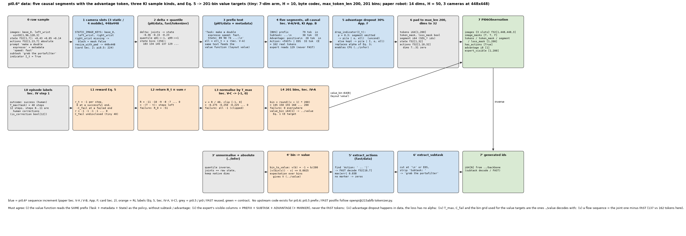
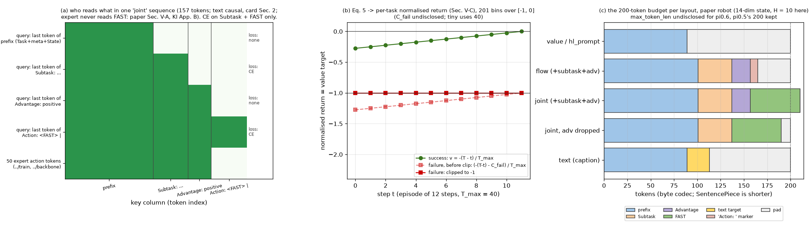

# π0.6* · data: 五段因果序列与 advantage token, KI 的三类样本, Eq. 5 奖励到 201 bin 的价值目标

**TL;DR.** π0.5 的一条序列是 "双向 prefix + 一段 postfix"; π0.6* 把它改成 **五段全因果** 的序列: `[BOS] Task: <prompt + metadata>, State: <分箱>;\n` → `Subtask: ℓ̂\n` → `Advantage: positive|negative\n` → `Action: <FAST> |[EOS]`, 对应论文 Sec. V-A 的因子分解 log π(ℓ̂ | o, ℓ) + log π(a^ℓ | o, ℓ, ℓ̂) + log π(a | o, ℓ, ℓ̂), 以及 Sec. V-B 把二值 advantage 指示放在 ℓ̂ 之后、动作之前 "such that only the action log-likelihoods are affected" (模型卡 §2: 图像间双向, **文本间因果**, action token 间双向). 这是 **训练侧的增量**: RECAP 的策略提取 (Eq. 3) 不改 loss 形式, 只改输入, 所以数据层要做三件事: (1) 按 Appendix F 以 30% 概率省略 advantage token, 让同一模型同时表示 π(a | o, ℓ) 与 π(a | I, o, ℓ) (代替 Eq. 3 的 α, 并让 `../infer` 能做 CFG); (2) 给 KI (arXiv:2505.23705v1 Eq. 4) 的三类样本 (仅 VLM 数据 / 仅动作 / 动作 + 子任务) 生成 M^ℓ (哪些 token 算 CE) 与 M^act (这条样本是否算 expert 的 MSE); (3) 把人工的 episode 成功标签变成 Eq. 5 的奖励 (每步 −1, 成功终止 0, 失败终止 −C_fail), 求回报, 按任务最大长度归一到 (−1, 0) (Sec. V-C), 再离散成 B = 201 个 bin (Sec. IV-A) 作为价值函数的 CE 目标. 代价: 序列更长 (14 维机器人的 flow 序列在字节编码下约 165 token, 见图 (c)), 图像从 224 涨到 448 (模型卡 §2, 单张 patch 数 ×4). 收益在 `../train` / `../value` 里兑现: 论文 Fig. 7-8, throughput 翻倍以上, 失败率减半.

**流程图**: 上排是一个 tiny 样本 (7 维臂, H = 10, 3 相机) 从 raw 到 `Pi06Observation` 的每一步, 第 4 框是五段的 token 数与 loss 归属; 中排是 RL 标签链 (Eq. 5 → 回报 → 归一 → bin), 其输出 `value_bin` 进 contract; 下排是镜像的逆过程. 数值来自一次真实 tiny 运行.



**第二幅图的论点**: (a) 一条 joint 序列里 "谁能读谁": 文本 token 因果, 50 个 expert 动作 token 读 prefix + Subtask + Advantage 但永远读不到 FAST 段, CE 只落在 Subtask 与 FAST 段; (b) 同样长度的成功 / 失败 episode 的价值目标, 失败被 C_fail 压到 −1; (c) 14 维机器人各 layout 的 200 token 预算.



本 module 只写 π0.6* 数据侧相对 π0.5 的增量. 上游 openpi @ `215abfb217dbac7d5f1273282331b9b1866c0479` **没有** π0.6 代码; prefix 文本 (`Task: …, State: …;\n`), quantile 归一化, FAST postfix, 缺相机的 mask 规则全部复用 `pi.pi05.data` / `pi.fast.data` / `pi.pi0.data`. 论文 π0.6* [arXiv:2511.14759v2](https://arxiv.org/abs/2511.14759v2) Sec. IV-A, IV-B, V-A, V-B, V-C, V-D, Appendix F; π0.6 模型卡 (2025-11-17) §2; KI [arXiv:2505.23705v1](https://arxiv.org/abs/2505.23705v1) Sec. 5.1, Appendix B. NumPy / PyTorch 重写.

## 1. I/O 契约

### 1.1 文本片段

| 函数 | 入 | 出 | 来源 |
|---|---|---|---|
| `with_metadata(prompt, metadata)` | str, str \| None | `"<prompt> <metadata>"`, 都过 `clean_prompt` | 论文 Sec. V-A "ℓ = ℓ_t + s"; 模型卡 §2 "conditioning metadata in the prompt". 拼接格式未披露 (→ §8) |
| `subtask_text(subtask)` | str | `"Subtask: <subtask>\n"` | 措辞来自 π0.5 Fig. 4 (`pi.pi05.data.hl_target_text`); 结尾 `\n` 是本仓库的段分隔 (→ §8) |
| `advantage_text(indicator)` | True / False / None | `"Advantage: positive\n"` / `"Advantage: negative\n"` / `""` | 论文 Sec. V-B 原文 "Advantage: positive" / "Advantage: negative"; None = 省略 (App. F) |
| `drop_indicator(indicator, rng, p=0.3)` | bool | bool \| None | App. F "randomly drop out the conditioning on the advantage indicator 30% of the time" |

### 1.2 `Pi06SequenceTokenizer(text, fast, max_len=200).tokenize(prompt, state, *, layout, actions=None, subtask=None, advantage=None, target_text=None, metadata=None)`

| 出 | shape / dtype | 说明 |
|---|---|---|
| `tokens` | int64[max_len] | 右侧 0 填充; 超长截尾并警告 (π0.5 `tokenizer.py` L40-L48 的行为) |
| `token_mask` | bool[max_len] | True = 真实 token |
| `segment` | int64[max_len] | `SEG_PREFIX` 0 / `SEG_SUBTASK` 1 / `SEG_ADVANTAGE` 2 / `SEG_ACTION` 3 / `SEG_TEXT` 4 / `SEG_MARKER` 5 |
| `loss_mask` | bool[max_len] | True = 算 CE 的位置 (Subtask 与 FAST 段, 仅 `"joint"`; text 目标, 仅 `"text"`) |

| layout | prefix 之后 | loss | 用途 | 来源 |
|---|---|---|---|---|
| `"joint"` | `[Subtask: ℓ̂\n]? [Advantage: x\n]? Action: <FAST> \|[EOS]` | Subtask + FAST 段 CE; `has_actions` True ⇒ expert MSE | KI 联合训练样本 (`../train`) | Sec. V-A/V-B; KI Eq. 4 |
| `"flow"` | `[Subtask: ℓ̂\n]? [Advantage: x\n]? Action: ` (SEG_MARKER) | 无 | 推理 / flow-only 微调; `advantage=None` 是 CFG 的无条件分支 | π0.5 `tokenizer.py` L28 的 marker 约定; App. E |
| `"text"` | `<target>[EOS]` (SEG_TEXT) | 全段 CE | VLM co-training (caption / VQA / bbox / 单独的 subtask 标注) | KI Sec. 5.1 "VLM data" |
| `"value"` | 无 | 无 (`value_bin` 是目标) | 价值函数输入: 同样的 ℓ, 无 subtask, 无 advantage | Sec. V-C "takes as input the same language inputs" |
| `"hl_prompt"` | 无 | 无 | 模型自己续写 `Subtask: …\n` (`../infer`) | Sec. V-A |

段的可见性规则 (`expert_visible(segment, token_mask)`): expert 的 50 个连续动作 token 可读 PREFIX / SUBTASK / ADVANTAGE / MARKER, **不可读** ACTION (FAST) 与 TEXT (Sec. V-A "The action expert does not receive these as input, such that discrete and continuous actions are predicted independently"; KI App. B). 文本 token 之间因果 (模型卡 §2); mask 本身由 `../train` / `../backbone` 从 `segment` 构造.

逆变换: `extract_subtask(ids)` 在第一个 `\n` 或 EOS 处截断并剥掉 `Subtask: `; `extract_text(ids)` 在 EOS 截断; `extract_actions(ids, H, d)` 是 FAST 的 `Action: … |` 搜索 + 解码 (没有 marker 时返回零, FAST `tokenizer.py` L124-L125).

### 1.3 RL 标签 (Sec. V-C Eq. 5, Sec. IV-A)

| 函数 | 入 | 出 | 说明 |
|---|---|---|---|
| `episode_rewards(num_steps, success, c_fail)` | T + 1 步 | f32[T + 1] | r_t = −1; r_T = 0 (成功) 或 −C_fail (失败). C_fail 未披露 (→ §8) |
| `returns(r)` | f32[T + 1] | f32[T + 1] | R_t = Σ_{t' ≥ t} r_{t'}, 无折扣 (Sec. III) |
| `normalize_return(R, max_episode_len)` | | f32 ∈ [−1, 0] | 按任务最大 episode 长度除, 再 clip (Sec. V-C "normalize the values per task based on the maximum episode length"); clip 是本仓库读法 (→ §8) |
| `bin_values()` / `value_to_bin(v)` / `bin_to_value(b)` | | 201 个均匀 bin, v(0) = −1, v(200) = 0 | Sec. IV-A "B = 201 bins"; 均匀是推断 (→ §8) |
| `EpisodeLabels(task, success, max_episode_len, num_steps, is_correction).value_targets(c_fail)` | | (归一回报 f32[T + 1], bin i64[T + 1]) | Sec. IV 步骤 1 的标签: 人工成功标签 + 纠正段 flag (纠正段的 I_t 强制 True, Sec. IV-B, 在 `../value` 用) |

### 1.4 `build_pi06_batch(raw, norm_stats, seq, *, layout, image_keys=STATIC_IMAGE_KEYS, action_horizon=50, action_dim=32, delta_mask, train, subtasks=None, advantages=None, target_text=None, value_bins=None, metadata=None)` → `(Pi06Observation, actions | None)`

| 字段 | shape / dtype | 说明 |
|---|---|---|
| `images` | {slot: f32[B, 448, 448, 3]} ∈ [−1, 1] | 模型卡 §2 "448×448"; `resize_with_pad` 与 π0 相同; 缺槽位黑图 + `image_masks[slot]` False |
| `image_masks` | {slot: bool[B]} | 静态双臂 3 槽 `STATIC_IMAGE_KEYS` (Fig. 5), 移动臂 4 槽 `IMAGE_KEYS` (模型卡 §2 "optional backward camera") |
| `state` | f32[B, 32] | quantile 归一, 零填充; 模型不读 (state 在文本里), 留给逆变换 |
| `tokens` / `token_mask` / `segment` / `loss_mask` | [B, 200] | §1.2 |
| `has_actions` | bool[B] | KI Eq. 4 的 M^act: 只有 `"joint"` 为 True |
| `advantage` | int8[B] | 1 / 0 / −1 (省略或不适用), 记账用, 序列里已编码 |
| `value_bin` | int64[B] \| None | `"value"` layout 的 Eq. 1 目标 |
| 返回 `actions` | f32[B, H, 32] \| None | delta + quantile 归一 + 零填充 (π0.5 链) |

`expert_visible` 属性: bool[B, 200].

### 1.5 符号 / 约定差异

| 论文 | 本仓库 | 说明 |
|---|---|---|
| I_t = 1[A > ε_ℓ] 是 "delta 分布" 的指示 | `advantage: bool \| None` | None 是 App. F 的 dropout, 不是第三个取值 |
| 值域 "(−1, 0)" 开区间 | `[−1, 0]` 闭区间, 201 个 bin 含两端 | 成功终止步 R = 0 必须可表示 |
| Eq. 5 里 T 是 "the last step" | `num_steps = T + 1` | 数组长度 |

## 2. 复现范围

| 有代码 | 只有事实 (背景) |
|---|---|
| 五段序列 + segment / loss mask; advantage token 与 dropout; metadata 拼接; 448 图像与 4 槽位; Eq. 5 → 回报 → 归一 → bin; batch | π0.6 预训练数据的构成 (π0.5 配方 + 更多平台, 模型卡 §3); 各任务的示范 / 自主 / 纠正 episode 数 (`../train` cost 表); 人工打分聚合成功标签的细则 (Sec. VI-C "multiple quality metrics", 未披露) |

## 3. 推理侧

推理只用 `"flow"` (低层) 与 `"hl_prompt"` (子任务解码) 两种 layout. 一次低层调用: raw → 448 图像 ×3 → prefix 文本 (含 metadata) → `Subtask: ℓ̂\n` (上一次高层输出) → `Advantage: positive\n` (Sec. V-D: 部署时取 I = True, 即 Eq. 2 的 β = 1) → `Action: ` → 200 token. CFG (App. E) 需要第二条序列 `advantage=None`. 具体链路与延时在 `../infer`.

## 4. 训练侧

### 4.1 数据组织形式

三类样本 (KI Sec. 5.1) 与价值函数样本:

| 样本 | layout | 来自 | CE 段 | expert MSE |
|---|---|---|---|---|
| 动作 + 子任务标注 | `"joint"` + `subtasks` | 机器人数据中有 HL 标注的部分 (π0.5 Sec. IV-C "HL") | Subtask + FAST | 是 |
| 仅动作 | `"joint"`, `subtasks=None` | 其余机器人数据 | FAST | 是 |
| 仅 VLM | `"text"` | web 数据 (caption / VQA / bbox), 单独的子任务预测样本 | text | 否 |
| 价值函数 | `"value"` + `value_bins` | 全部 episode 的每一步 (Sec. IV-A "over the trajectories in the current dataset") + 少量 web 数据 (Sec. V-C) | 无 (201 类 CE 在 `../value`) | 否 |

RECAP 的数据聚合 (Algorithm 1): D_ℓ = 示范 ∪ 自主 rollout ∪ 带纠正的 rollout, 每条 episode 带成功标签; 纠正段 `is_correction` True. advantage 指示由 `../value` 算出后, 经 `drop_indicator` 再进 `build_pi06_batch`.

### 4.2 数据预处理, 逐步

1. 相机槽位: 静态 3 槽 / 移动 4 槽, 缺的黑图 + mask False (π0.5 规则).
2. delta action (`pi.pi0.data.to_delta_actions`), quantile 归一化 q01 / q99 (`pi.fast.tokenizer`), 与 π0.5 相同.
3. `resize_with_pad` → 448×448 (模型卡 §2).
4. 文本: `Task: <prompt> <metadata>, State: <256 分箱>;\n` (π0.5 `tokenizer.py` L23-L28 + metadata) → `Subtask: …\n` → `Advantage: …\n` (30% 省略) → `Action: <FAST> |[EOS]`; 段 id 与 loss mask.
5. 200 token 填充 / 截断; state 与 actions 零填充到 32 维.
6. 图像 → [−1, 1]; 训练时增广 (π0 Appendix E 参数; π0.6 未披露 → §8).
7. RL 标签: Eq. 5 → 回报 → / T_max, clip → 201 bin.

### 4.3 training objective / curriculum

见 `../train` (KI Eq. 4, α = 1, stop-gradient) 与 `../value` (Eq. 1). 本 module 只保证: (i) CE 的 mask 与段一致; (ii) advantage token 是输入不是目标; (iii) M^act 只在 `"joint"` 为 True; (iv) 价值目标与 `bin_to_value` 互逆.

## 5. 评测

本 module 没有评测; 端到端评测在 `../infer/eval.py`. `test_parity.py` (CPU, 约 1 s) 检查:
- advantage / subtask 措辞逐字符 = 论文; dropout 率 30% ± 1%, 且从不翻转符号.
- `"joint"` 的四段顺序与连续性; CE 只在 Subtask + FAST 段; advantage 段无 loss; expert 可见集合 = 前三段.
- 省略 subtask / advantage 时段消失, prefix 逐 token 不变; `"flow"` 以 `Action: ` 结尾且全无 loss; `"value"` 与 `"hl_prompt"` 序列相同.
- 三个逆变换 (subtask / text / FAST) 各自 round-trip.
- Eq. 5 奖励与回报; 按 T_max 归一; 失败 clip 到 −1; 201 bin 的端点与间距 0.005; 最近 bin 取整; bin ↔ 值往返误差 ≤ 半个 bin.
- batch: 448 图像, 4 槽位 mask, 32 维填充, `has_actions` / `advantage` / `value_bin` / `expert_visible` 契约; 14 维机器人 flow 序列在 200 以内.

```
uv run pytest pi/pi06/data -q
uv run python -m pi.pi06.data.data      # 五种 layout 的一次 batch, 逐步 shape, 一条 episode 的标签链
uv run python pi/pi06/data/figs/make_pipeline.py
uv run python pi/pi06/data/figs/make_figs.py
```

## 6. cost 信息

| 项目 | 值 | 来源 |
|---|---|---|
| 预训练数据 | "tens of thousands of hours of demonstrations from numerous tasks and a variety of different robots"; 构成沿用 π0.5 + 更多平台 | 论文 Sec. IV; 模型卡 §3; 小时数未披露 → §8 |
| 每任务的经验数据 | T 恤 / 短裤: 每轮 300 条自主 (4 台); diverse laundry: 450 自主 + 287 纠正; strict T 恤: ~1000 自主 + 280 + 378 纠正 (3 台); box: 每轮 600 示范 + 360 纠正 (3 台); cafe: 429 纠正 + 414 自主 (1 轮) | App. F "Dataset composition" |
| 阈值估计样本 | 10k 个数据点 | App. F |
| 序列长度 | 200 token (沿用 π0.5) | 未披露 → §8 |
| 图像 | 4 × 448×448 | 模型卡 §2 |
| 训练算力 / 模型大小 / 延时 | → `../train`, `../backbone`, `../infer` | |

## 7. reference 映射表

| 本仓库 | 上游 / 论文 |
|---|---|
| `with_metadata` | 论文 Sec. V-A (ℓ = ℓ_t + s); 模型卡 §2 |
| `subtask_text`, `extract_subtask` | 论文 Sec. V-A (ℓ̂ 先于动作); 措辞 π0.5 Fig. 4 |
| `advantage_text`, `ADVANTAGE_TEXT` | 论文 Sec. V-B |
| `drop_indicator`, `ADVANTAGE_DROPOUT` | 论文 App. F "Advantage conditioning dropout"; Sec. V-B 末段 |
| `Pi06SequenceTokenizer.tokenize` | 论文 Sec. V-A 因子分解, V-B 位置; 模型卡 §2 (因果文本); π0.5 `tokenizer.py` L22-L48 (prefix, `Action: `); FAST `tokenizer.py` L83-L87 (postfix) |
| `SEG_*`, `EXPERT_READS`, `expert_visible` | 论文 Sec. V-A "The action expert does not receive these as input"; KI App. B 的可见性规则 |
| `episode_rewards` | 论文 Eq. 5 |
| `returns` | 论文 Sec. III (R_t, 无折扣), Sec. IV-A (R_t(τ)) |
| `normalize_return`, `VALUE_RANGE` | 论文 Sec. V-C |
| `bin_values`, `value_to_bin`, `bin_to_value`, `NUM_BINS` | 论文 Sec. IV-A (B = 201, v(b)) |
| `EpisodeLabels` | 论文 Sec. IV 步骤 1, IV-B (纠正强制 True), V-D |
| `Pi06Observation`, `build_pi06_batch` | π0.5 `config.py` L126-L138 的链 + 本 module 的字段; `has_actions` = KI Eq. 4 的 M^act |
| `IMAGE_RESOLUTION`, `IMAGE_KEYS`, `STATIC_IMAGE_KEYS` | 模型卡 §2; 论文 Fig. 5 |

## 8. gap ledger

| 未披露 / 未复现 | 说明 |
|---|---|
| metadata s 的内容与拼接格式 | 论文只说 "metadata that further modulates how the task is performed"; 本仓库 `"<prompt> <metadata>"`, 例子 `speed: fast` 是随手写的占位 |
| Subtask 段的分隔符 | π0.5 的 HL 目标以 EOS 结尾; π0.6 里 ℓ̂ 在序列中间, 结束符未披露; 本仓库用 `\n`, 解码在 `\n` 或 EOS 停 |
| Advantage 段的结束符与位置细节 | 原文只给了两个字符串与 "after ℓ̂ but before the actions"; `\n` 与 `Action: ` marker 是本仓库的拼法 |
| `max_token_len` | 未披露; 沿用 π0.5 的 200 (`pi0_config.py` L39). 图 (c) 表明字节编码下 joint 序列可能超 200; 真实 SentencePiece 更短 |
| H, action_dim | 论文只说 50 Hz 的 chunk; 沿用 π0.5 的 50 / 32 |
| C_fail | "a large constant"; 未披露. tiny 用 40 (= T_max) 仅为跑通, 使失败 episode 全部落到 −1 |
| 归一化的精确形式 | "normalize the values ... between (−1, 0) ... per task based on the maximum episode length"; 本仓库 R / T_max 后 clip 到 [−1, 0]; 是否 clip、失败 episode 的值是否保留 "离成功多远" 的信息未披露 |
| bin 到值的映射 v(b) | 未披露; 本仓库 201 个均匀 bin 覆盖 [−1, 0] |
| 图像 token 数 | 448×448 在 SigLIP 400M (patch 14) 下是 1024 patch; Gemma 3 pool 到 256; π0.6 是否 pool 未披露 (`../backbone`) |
| 增广参数 | π0.6 未披露; 用 π0 Appendix E 的值 |
| 人工成功标签的细则 | Sec. VI-C "multiple quality metrics ... aggregate ... into a success label"; 无代码, `EpisodeLabels.success` 直接给 bool |
| tiny 文本编码 | `ByteTextCodec` 逐字节 (仅为跑通), 不是 Gemma 3 的 SentencePiece (262,144 词表) |

## 9. 领域概念表

### domain 概念

**advantage 指示 token (binarized advantage indicator)**
- shape: 序列里的一小段固定文本 (`Advantage: positive\n`, 字节编码 20 token), 或没有.
- 含义: 这条样本的动作相对于采集它的行为策略是否 "比平均好" (A^{π_ref}(o, a, ℓ) > ε_ℓ), 二值.
- 来源: 由 `../value` 的价值函数在训练时在线算出 (预训练 A = R_t − V(o_t); post-training N = 50 步), 阈值按任务分位数; 人工纠正段强制 positive.
- 为什么需要: 用监督学习在全部数据 (好的和坏的) 上训练, 但推理时只要 positive 那一支, 就得到改进的策略 (Eq. 2, β = 1); 不需要 AWR 式的丢数据或 PPO 式的似然比.
- 系统联系: 部署时固定写 positive; 30% 的省略让模型也学会无条件分支, `../infer` 用两支做 CFG.

**Eq. 5 稀疏奖励与 "剩余步数" 价值**
- shape: 每步一个标量 r_t, 回报 R_t 一个标量, 归一后 ∈ [−1, 0], 离散成 0..200 的整数.
- 含义: −R_t = 距成功还差多少步 (成功 episode); 失败 episode 额外扣 C_fail. 归一后 0 = 已完成, −1 = 该任务最差.
- 来源: 只需要人工给每条 episode 一个成功 / 失败标签 (Sec. V-C "obtain a label indicating whether that episode was successful"); 步数来自记录.
- 为什么需要: 价值函数同时编码 "会不会成功" 与 "还要多久", throughput (成功 / 小时) 正是这两者的乘积 (Sec. VI-C).
- 系统联系: T_max 按任务给 (任务表), 与评测时限相关 (`../infer/eval.py`); C_fail 与 bin 网格必须和 `../value` 解码用的一致.

**人工纠正 (expert intervention)**
- shape: episode 内的一段连续步, `is_correction` bool[T + 1].
- 含义: 自主执行时遥操作专家接管的那些步; 动作来自人而不是策略.
- 来源: 部署时专家监视, 出错时介入 (Sec. V-D), 整条 episode (自主段 + 纠正段) 都进数据集.
- 为什么需要: 纠正示范 "怎么从错误里恢复" 这一类自主数据里罕见的行为; 它们的 I_t 强制 True (Sec. IV-B).
- 系统联系: 遥操作设备的接管信号就是这个 flag 的来源.

### application 概念

**KI 的三类样本与 loss mask**
- shape: 每条样本一个 `loss_mask[200]` (M^ℓ) 与一个 `has_actions` 标量 (M^act).
- 含义: 一个 batch 里混着 "只有文本目标" (web 数据)、"只有动作" 和 "动作 + 子任务" 的样本, 每条只对自己有的目标算 loss.
- 来源: KI Eq. 4 的构造; π0.6 沿用 (模型卡 §2 "co-training examples, such as multi-modal web data").
- 为什么需要: 让 VLM 数据在同一个前向里训练底座, 保住预训练知识 (KI Fig. 6-7).
- 系统联系: `../train` 按 `has_actions` 决定要不要跑 expert 分支.
