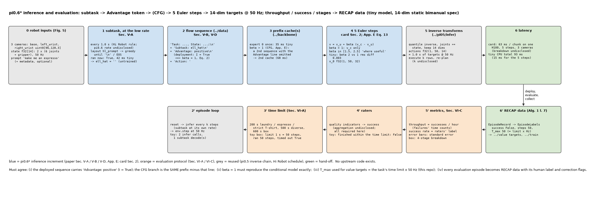
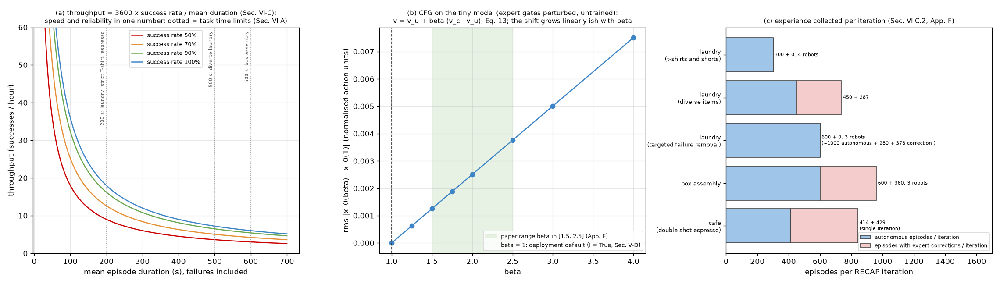

# π0.6* · infer: 子任务 → Advantage token → (CFG) → 5 步 flow → 14 维 50 Hz 目标; throughput / 成功率评测与经验回收

**TL;DR.** 部署时 π0.6* 的推理与 π0.5 只差三处 (论文 Sec. V-A, V-D, Appendix E; 模型卡 §2): (1) 序列里多了 `Subtask: ℓ̂\n` (同一模型以更低频率先解码出来) 与 **`Advantage: positive\n`** (Sec. V-D: 部署固定 I = True, 即 Eq. 2 的 β = 1), (2) Euler 从 10 步减到 **5 步**, (3) 可选 **classifier-free guidance**: 再算一条省略 Advantage 行的 prefix, 每步 v = v_u + β (v_c − v_u), β ∈ [1.5, 2.5] "where useful" (App. E Eq. 13; 大 β 会把动作推到支撑集边界, 所以论文主要靠训练时的阈值 ε_ℓ). 这是 **推理侧的增量**, 代价是 CFG 时 prefix 与 expert 前向各 ×2; 收益 (推理延时) 由模型卡给出: 3 相机 5 步 **63 ms / chunk, 1 × H100** (π0.5 未披露; Hi Robot 在 4090 上 73 ms). 评测 (Sec. VI-A, VI-C): 五个任务各有时限 (200 / 500 / 200 / 200 / 600 s), 两个指标 **throughput = 成功次数 / 小时** (失败的时间也计入, 所以同时惩罚慢与错) 与人工打分聚合的 **成功率**; 每条评测 episode 连同人工标签直接成为 RECAP 的训练数据 (Algorithm 1 第 7 行). 论文结果 (Fig. 7-12): throughput 翻倍以上, 失败率减半, strict T 恤 97%; 本仓库不复现数字, 只复现流程.

**流程图**: 上排是一次控制步 (机器人输入 → 低频子任务 → flow 序列 → prefix cache (CFG 两条) → 5 步 Euler → 逆变换 → 延时); 下排是评测与数据回收 (episode 循环 → 时限 → 人工打分 → 指标 → `EpisodeLabels`). tiny 模型, 14 维静态双臂 spec, 假环境.



**第二幅图的论点**: (a) throughput 的算术: 成功率与平均 episode 时长 (含失败) 的双重函数, 任务时限标在横轴; (b) CFG 在 tiny 模型上的几何: x_0(β) 偏离 x_0(1) 的量随 β 近线性增长, 论文的 β 区间与 β = 1 默认; (c) 每轮 RECAP 每个任务采集的自主 / 纠正 episode 数.



本 module 装配 π0.6* 的端到端推理并写评测流程. 论文 π0.6* [arXiv:2511.14759v2](https://arxiv.org/abs/2511.14759v2) Sec. IV-B (Eq. 2), V-A, V-D, Appendix E (Eq. 12-13), Fig. 5, Sec. VI-A, VI-B, VI-C, Appendix F; 模型卡 §2 (5 步, 63 ms). 上游 openpi @ `215abfb` 无 π0.6 代码; 阶段划分与逆变换沿用 `policy.py` L67-L106 与 `transforms.py` (经 `pi.pi05.infer`); 高层节奏沿用 Hi Robot [arXiv:2502.19417v2](https://arxiv.org/abs/2502.19417v2) Sec. 4.1 的 1 s. PyTorch / NumPy 重写.

## 1. I/O 契约

### 1.1 机器人 spec (`model.py`, Fig. 5)

| 名称 | 值 | 来源 |
|---|---|---|
| `STATIC_DIMS_14` | 左 6 关节 + 左夹爪 + 右 6 关节 + 右夹爪 | Fig. 5 "two 6 DoF arms with parallel jaw grippers"; 顺序是本仓库的 (→ §8) |
| `static_delta_mask()` | 关节 delta, 夹爪绝对 | π0 约定 |
| `CONTROL_HZ` | 50 | Sec. V-A; Fig. 5 |
| `STATIC_CAMERAS` | base → `base_0_rgb`, left_wrist, right_wrist | Fig. 5 "a base camera mounted between the arms, and a wrist-mounted camera on each arm" |
| `static_spec(norm_stats)` → `Pi05RobotSpec` | native_dim 14, H 50, 50 Hz | `pi.pi05.infer` 的 spec 类, 不变 |
| `static_obs_to_raw(obs, prompt)` | {"base", "left_wrist", "right_wrist", "state": f32[14]} → raw (batch 1) | |

### 1.2 `guided_velocity_fn(v_cond, v_uncond, beta)` → `VelocityFn` (App. E Eq. 13)

β = 1 时返回 `v_cond` 本身; 否则 v(x_t, t) = v_u + β (v_c − v_u). 论文以 ∇_a log π 写, flow 模型 "effectively learns the gradient of the likelihoods", 本仓库把同样的线性组合作用在速度场上 (CFGRL 的做法, → §8).

### 1.3 `Pi06Policy(model, seq, robot, *, num_steps=5, beta=1.0, hl_period_s=1.0, image_keys=STATIC_IMAGE_KEYS, max_new_tokens=64, metadata=None)`

| 方法 | 入 | 出 | 说明 |
|---|---|---|---|
| `predict_subtask(raw)` | raw | (str, n_tokens) | layout `"hl_prompt"` → greedy 到 `\n` / EOS → `extract_subtask` (Sec. V-A "ℓ̂ first") |
| `hl_due(t_now)` | 秒 | bool | 首次, 或距上次 ≥ `hl_period_s` (Hi Robot 1 s; π0.6 频率未披露 → §8) |
| `infer(raw, t_now=0.0, noise=None)` | raw = {"images": {slot: uint8[1, h, w, 3]}, "state": f32[1, 14], "prompt": [str]} | {"actions": f32[1, 50, 14] 绝对目标, "x_0": f32[1, 50, 32], "subtask", "hl_ran", "timing": {阶段: ms}} | 阶段: 子任务解码 (若到期) → 数据预处理 (layout `"flow"`, `advantages=[True]`; β > 1 时再建 `advantages=[None]` 的序列) → prefix 前向 (×2) → 5 步 Euler (×2 每步) → 逆变换 |
| `reset()` | | | 新 episode: 清子任务与计时 |

`tiny_pi06_policy(seed, **kw)` → (policy, robot): tiny 模型 + 字节编码 + 恒等 quantile + 静态 spec.

### 1.4 评测 (`eval.py`, Sec. VI)

| 对象 | 说明 | 来源 |
|---|---|---|
| `Task(name, prompt, time_limit_s, success, stages, notes)`, `TASKS` | 五个任务: laundry (T 恤 / 短裤) 200 s; diverse laundry 500 s (11 类, 报告 button-up shirt); strict T 恤 200 s (领口朝上, 固定对抗初始); double espresso 200 s (无致命错误); box 600 s (四阶段) | Sec. VI-A; prompt 除 "make me an espresso" (Sec. V-A) 外未披露 (→ §8) |
| `EpisodeRecord` | task, steps, duration_s, timed_out, quality (打分项), success, stages_done, infer_calls, hl_calls, subtasks, is_correction | Sec. VI-C |
| `EpisodeRecord.to_labels(max_episode_len)` → `EpisodeLabels` | 评测 episode → RECAP 数据 (成功标签 + 纠正 flag) | Algorithm 1 第 7 行; Sec. V-D |
| `success_from_quality(quality)` | 全部打分项为真 (聚合规则未披露 → §8) | Sec. VI-C |
| `throughput_per_hour(records)` | 成功数 / 总时长 (小时), 失败的时间计入 | Sec. VI-C "number of successful task executions per hour" |
| `success_rate`, `standard_error` | 均值; 误差棒 = 标准误 | Sec. VI-C, Fig. 7 |
| `stage_success(records, 4)` | 完成 ≥ k 阶段的比例 | Fig. 8 右 (取板 / 折盒 / 贴标 / 入箱) |
| `max_episode_len(task, hz)` | T_max = 时限 × 50 Hz (本仓库读法 → §8) | Sec. V-C |
| `run_episode(policy, env, task, idx, *, execute_steps, hz)` | reset → 每 `execute_steps` 步一次 `infer` (子任务按自己的节奏) → `env.step` 到 done 或时限 → 打分 | |
| `evaluate(policy, env, tasks, *, trials, execute_steps, hz)` | 每任务: throughput, 成功率, 标准误, 平均时长, (box) 阶段分解, 记录与 labels | |
| `RatedEnv` | `reset(name, idx) → (obs, prompt)`, `step(a[14]) → (obs, done, info)`, `quality() → {项: bool}`, `stages() → int` | 接口 |
| `StaticToyEnv` | 假环境: 噪声图像, 左夹爪目标 > 0.1 连续 `need` 步过一个阶段, 打分项脚本化; 不模拟任务语义 | |
| `EPISODES_PER_ITERATION` | 每轮采集数 | Sec. VI-C.2, VI-C.4, App. F |

### 1.5 符号 / 约定差异

| 论文 | 本仓库 | 说明 |
|---|---|---|
| Eq. 13 以 score ∇_a log π 写 | 作用在 flow 的速度场 v 上 | 同一线性组合; π0 的 v 预测 ω − a (噪声减数据), 与 score 只差符号与尺度, 组合形式不变 |
| "throughput" 的时间基 | 全部 episode 的时长之和 (含失败与超时) | Sec. VI-C 未明说失败时间是否计入; 计入才能 "capture both speed and success rate" |

## 2. 复现范围

| 有代码 | 只有事实 (背景) |
|---|---|
| 策略装配, 子任务节奏, Advantage token, CFG 双分支, 5 步采样, 逆变换, 延时表; 任务表, 两个指标, 阶段分解, 时限循环, 假环境, 经验回收 | 机器人硬件细节 (Fig. 5); 长时运行 (espresso 13 h, 新家 2 h+, Sec. I); 基线策略 (π0.5, π0.6 SFT, RL 预训练, offline RL + SFT, AWR, PPO, Sec. VI-B; 详见 `../train` README); 论文数字 |

## 3. 推理侧

一次控制步 (§1.3): 3 相机 448 + 14 维 state + prompt → (每 1 s) 子任务 → `Task/State + Subtask + Advantage: positive + Action: ` → expert 0 一次 (CFG: 两次) → 5 步 Euler → 50 步 chunk 的前 k 步执行 (k 未披露 → §8). 延时: 模型卡 63 ms / chunk (H100, 3 相机, 5 步); 子任务解码与 CFG 的额外开销未披露. tiny CPU 的分段计时由 `main()` 打印.

## 4. 训练侧

本 module 无训练代码; 但 `evaluate` 的每条记录经 `to_labels` 成为 `../value` / `../train` 的输入 (Algorithm 1 第 7 行 "Collect data with π^{k−1}, add it to D_ℓ"). 纠正 flag 由遥操作接管信号写入 `is_correction` (假环境没有).

## 5. 评测

- (a) 接口: `RatedEnv` (§1.4); 观测 = 3 相机 + 14 维 state; 动作 = 14 维关节 / 夹爪目标 @ 50 Hz; 终止 = 任务完成或时限.
- (b) 任务: `TASKS` 五项 (Sec. VI-A).
- (c) 指标: throughput (成功 / 小时), 成功率 (人工聚合), 标准误; box 四阶段.
- (d) 循环: `run_episode` / `evaluate`, `StaticToyEnv` 跑通 (`main()`).
- (e) 对齐: 任务、时限、成功定义、指标定义与论文一致; prompt 措辞、打分聚合规则、执行长度 k 未披露 (→ §8); 数字不复现.

`test_parity.py` (CPU, 约 2 s) 检查:
- 14 维 spec 与 delta mask, 50 Hz, 1 s chunk, 相机适配, 常量 (63 ms, β 区间).
- `infer` 与直接调用 `../backbone` 的 `sample_actions` 数值一致; 夹爪绝对 / 关节 delta 的逆变换; 子任务节奏 (0.5 s 不重跑, 1.0 s 重跑); timing 键.
- CFG: β = 1 返回条件模型本身; 组合公式; β = 2 改变 x_0 且 timing 记录 ×2.
- 任务表时限, box 阶段, `max_episode_len`, 每轮采集数; throughput / 成功率 / 标准误 / 阶段分解的算术; 打分聚合.
- 时限循环: 20 步上限 → 超时、失败、调用计数; `to_labels`; `evaluate` 的返回结构.

```
uv run pytest pi/pi06/infer -q
uv run python -m pi.pi06.infer.model     # 一次推理的各阶段与计时, 子任务节奏, CFG 对比
uv run python -m pi.pi06.infer.eval      # 任务表, 一条 box episode, 假环境上的 throughput / 成功率
uv run python pi/pi06/infer/figs/make_pipeline.py
uv run python pi/pi06/infer/figs/make_figs.py
```

## 6. cost 信息

| 项目 | 值 | 来源 |
|---|---|---|
| 推理延时 | 63 ms / chunk, 1 × H100, 5 步, 3 相机 | 模型卡 §2 |
| 模型大小 | 约 5.16B (底座 4.3B + expert 0.86B) | `../backbone` §6 |
| chunk | 50 步 @ 50 Hz = 1 s (H 沿用 π0.5 → `../data` §8) | Sec. V-A |
| 每轮评测 / 采集 | T 恤 300 (4 台); diverse 450 + 287; strict ~1000 + 280 + 378 (3 台); box 600 + 360 (3 台); cafe 414 + 429 | Sec. VI-C.2, VI-C.4, App. F |
| 长时运行 | espresso 13 h 连续; 新家洗衣 2 h+ 无中断 | Sec. I |
| 子任务解码延时, CFG 开销 | 未披露 → §8 | |

## 7. reference 映射表

| 本仓库 | 论文 / 上游 |
|---|---|
| `STATIC_DIMS_14`, `STATIC_CAMERAS`, `CONTROL_HZ`, `static_spec`, `static_obs_to_raw` | Fig. 5; Sec. V-A (50 Hz) |
| `LATENCY_H100_MS` | 模型卡 §2 |
| `guided_velocity_fn`, `CFG_BETA_RANGE` | App. E Eq. 12-13; Sec. IV-B 脚注 2 |
| `Pi06Policy.predict_subtask`, `hl_due` | Sec. V-A (ℓ̂ 先于动作, 更低频率); Hi Robot Sec. 4.1 (1 s) |
| `Pi06Policy.infer` | openpi `policy.py` L67-L106 (阶段); Sec. V-D (I = True); App. E (CFG); 模型卡 (5 步) |
| `to_executable_actions` (复用) | openpi `transforms.py` L175-L181, L226-L245 |
| `TASKS`, `DIVERSE_LAUNDRY_ITEMS`, `LONG_RUNS` | Sec. VI-A; Sec. I |
| `EpisodeRecord`, `success_from_quality`, `throughput_per_hour`, `success_rate`, `standard_error` | Sec. VI-C; Fig. 7 |
| `stage_success` | Fig. 8 右 |
| `max_episode_len` | Sec. V-C |
| `EpisodeRecord.to_labels`, `EPISODES_PER_ITERATION` | Algorithm 1 第 7 行; Sec. VI-C.2, VI-C.4; App. F |
| `run_episode`, `evaluate`, `RatedEnv`, `StaticToyEnv` | 本仓库 (`pi.pi0.infer.eval` 的 Env / 循环模式) |

## 8. gap ledger

| 未披露 / 未复现 | 说明 |
|---|---|
| 14 维的排列 | 只知 2 × (6 关节 + 夹爪); 顺序是本仓库的 |
| 子任务预测的频率 | "lower frequency than action generation"; 沿用 Hi Robot 1 s |
| 执行长度 k (每 chunk 执行多少步再重规划) | 未披露; `run_episode` 的 `execute_steps` 参数 |
| CFG 的具体实现 | Eq. 13 以 score 写; 本仓库对速度场做同样的线性组合; 是否在所有 5 步都用、β 默认值未披露 (部署默认 β = 1) |
| CFG 时无条件分支是否也省略 Subtask | 本仓库只省略 Advantage 行 (App. E 只谈 I 的有无) |
| 延时分解 | 只有总数 63 ms; 子任务解码、CFG 未计 |
| 任务 prompt 措辞 | 只有 "make me an espresso" (Sec. V-A) 与 "pick up the coffee cup" (子任务例); 其余是本仓库的占位 |
| metadata 内容 | 见 `../data` §8; `Pi06Policy(metadata=...)` 直接透传 |
| 人工打分项与聚合规则 | "multiple quality metrics ... aggregate"; 本仓库全部为真才算成功 |
| T_max | "maximum episode length of the task"; 本仓库取时限 × 50 Hz |
| throughput 的时间基 | 失败 / 超时的时间是否计入未明说; 本仓库计入 |
| 评测 trial 数 | Fig. 7-8 未给 n (只给标准误); 迭代实验给了 episode 数 (§6) |
| 假环境 | 不是模拟器; 成功 / 打分脚本化, 数字无意义 |

## 9. 领域概念表

### domain 概念

**throughput (成功次数 / 小时)**
- shape: 每个 (任务, 策略) 一个标量, 误差棒是标准误.
- 含义: 单位时间完成的成功次数; = 成功率 / 平均 episode 时长 (含失败), 见图 (a).
- 来源: 连续运行的评测 (espresso 13 h 等), 人工判成功.
- 为什么需要: RL 的目标之一是 "更快" (Sec. I "improve speed and robustness beyond the level of human teleoperation"); 成功率饱和后 (T 恤任务 > 90%) 只有它还在涨 (Fig. 9-10).
- 系统联系: 价值函数的 "剩余步数" 目标直接对应它; 时限进 T_max.

**classifier-free guidance (β > 1)**
- shape: 每步两次 expert 前向, 一个标量 β.
- 含义: 用条件 (I = True) 与无条件两支的差放大 "改进方向" (Eq. 12-13), 训练时 30% 的 Advantage dropout 就是为它准备的.
- 来源: CFGRL [4]; 论文 App. E.
- 为什么需要: 训练后无需再训就能再 "锐化" 策略; 但大 β 推到支撑集边界导致激进动作, 论文主要靠 ε_ℓ, β ∈ [1.5, 2.5] 只在有用时用.
- 系统联系: `../data` 的 `advantage=None` 序列; 延时 ×2.

### application 概念

**评测 episode 即训练数据**
- shape: `EpisodeRecord` → `EpisodeLabels(success, T_max, steps, is_correction)`.
- 含义: RECAP 没有独立的 "采集" 阶段, 部署 / 评测的 rollout (加上专家可选的接管) 就是下一轮的 D_ℓ.
- 来源: Algorithm 1 第 7 行; Sec. V-D; App. F 的 episode 数.
- 为什么需要: 让策略修正 "自己在部署中真正犯的错" (Sec. I).
- 系统联系: `../value` 重训 V, `../train` 重训 π, 都从预训练 checkpoint 出发.
