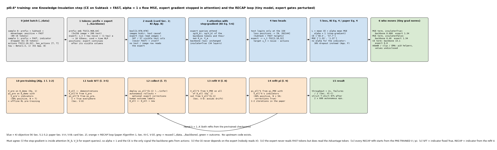
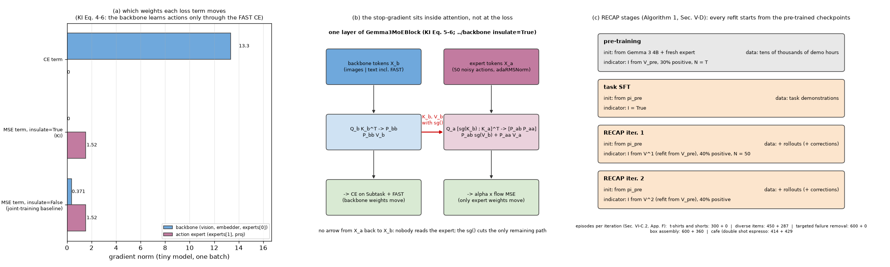

# π0.6* · train: KI 单阶段联合目标 (attention 内 stop-gradient, α = 1), 三个阶段的指示规则, RECAP 循环

**TL;DR.** π0.5 的训练是两阶段 (280k 步纯离散 α = 0 → 80k 步 α = 10 加随机初始化的 expert, 且 expert 的梯度可以回传底座); π0.6 改用 **Knowledge Insulation** (KI, arXiv:2505.23705v1; 模型卡 §2): **单阶段** 同时训 FAST token 的 CE 与 expert 的 flow MSE, 但 expert 的 query 只看 **stop-gradient 后的** 底座 K_b、V_b (KI Eq. 5-6), 于是 flow loss 一点也进不了底座, α 可以直接取 1 (KI Sec. 5.2), 底座只通过 FAST token 的 CE 学动作, web 数据 co-training 保住 VLM 知识. π0.6* 在此之上加 RECAP (论文 Algorithm 1, Sec. IV-B, V-D): 训练目标 **不变** (Eq. 3 / Eq. 4 只是把指示 I_t 放进输入), 变的是三个阶段的指示来源: 预训练用 V_pre 的 advantage (30% 为正, N = T), 每任务 SFT 固定 I = True, RECAP 每轮 {部署采集 → 从 **V_pre** 重训 V → 从 **π_pre** 重训 π (40% 为正, N = 50, 纠正段 True)}, 指示 30% 随机省略代替 α (App. F). 这是 **训练侧的增量**. 代价: KI 每步约多 20% 算力 (KI Sec. 7); 每轮 RECAP 要几百条真机 episode (App. F). 收益: KI 让 π0 式训练所需步数减到 1/7.5 (KI Fig. 6b); RECAP 在 diverse laundry 与 espresso 上 throughput 翻倍以上, 失败率减半, strict T 恤 97% (Sec. VI-C). 优化器 / lr / batch / 步数 / 算力全部未披露.

**流程图**: 上排是一次 KI 训练步 (joint batch → prefix + expert token → mask → 带 sg 的 attention → 两个 head → loss → 各项梯度落在谁身上); 下排是 Algorithm 1 的 RECAP 循环. tiny 模型 (expert 的门控扰动过, 否则零初始化让 sg 无从体现); 数值来自一次真实运行.



**第二幅图的论点**: (a) 三种 loss 项各自推动的参数: CE 只动底座, KI 的 MSE 只动 expert, 去掉 sg 后 MSE 泄漏到底座; (b) sg 在一层 attention 里的位置: expert 行的 K_b、V_b 被 detach, 而底座行本来就读不到 expert; (c) 四个阶段各从哪个 checkpoint 起、用哪条指示规则、吃什么数据.



本 module 复现 π0.6* 训练侧的增量. 论文 π0.6* [arXiv:2511.14759v2](https://arxiv.org/abs/2511.14759v2) Sec. IV-B (Eq. 3), IV-C / Algorithm 1, V-A (KI 配方, 因子分解), V-B (Eq. 4, 指示 dropout 代替 α), V-D, VI-B, VI-C, Appendix C (Eq. 9), D (Eq. 10-11), F; KI [arXiv:2505.23705v1](https://arxiv.org/abs/2505.23705v1) Sec. 5.1 (Eq. 4), 5.2 (Eq. 5-6), 7, Fig. 6b, App. B; 模型卡 §2. 上游 openpi @ `215abfb` 无 π0.6 / KI 训练代码; 优化器 / EMA / clip 沿用 `pi.pi0.train` (openpi `optimizer.py`), 时间步与插值沿用 `pi.pi0.flow_matching.train`. PyTorch 重写.

## 1. I/O 契约

### 1.1 `ki_forward(model, obs, x_t, t, *, insulate=True)` → `(logits, targets, sample_index, v_t)`

| 名称 | shape / dtype | 说明 |
|---|---|---|
| 入 `obs` | `Pi06Observation` layout `"joint"` 或 `"text"` | `segment` / `loss_mask` / `expert_visible` / `has_actions` 来自 `../data` |
| 入 `x_t`, `t` | f32[B, H, 32], f32[B] 或 None | None = 只跑文本分支 (VLM 数据) |
| mask | bool[B, S + H, S + H] | `../backbone` `prefix_mask(obs, n_img, n_expert=H, expert_visible)`: 图像双向, 文本因果, expert 读 PREFIX + SUBTASK + ADVANTAGE + 自身, 不读 FAST; 没人读 expert |
| expert 位置 | i64[B, H] | 接在 "有效图像列 + expert 可见文本列" 之后 (推理时无 FAST, 与之一致; 推断 → §8) |
| 出 `logits` | f32[N, 262,144] | 只在 N 个 "下一 token 有 CE" 的位置过 tied head (Subtask + FAST 目标; KI 的 M^ℓ) |
| 出 `targets`, `sample_index` | i64[N], i64[N] | 每个 logit 的目标 id 与所属样本 |
| 出 `v_t` | f32[B, H, 32] 或 None | expert 的速度场 |

`insulate=True`: `Gemma3MoEBlock` 让 expert 行的 attention 用 `K_b.detach()`, `V_b.detach()` (KI Eq. 5-6); 前向数值不变, 只改梯度.

### 1.2 `ki_loss(model, obs, actions, *, alpha=1.0, t, noise, insulate=True)` → `{"loss", "ce" f32[B], "mse" f32[B]}` (KI Eq. 4; 论文 Eq. 4)

loss = mean_b CE_b + α · mean_{b: has_actions} MSE_b. CE_b 按该样本的 loss token 数归一 (`pi.fast.train` 规则); MSE_b = mean_{H × 32} (v_t − u_t)², u_t = noise − actions, x_t = t·noise + (1 − t)·actions (π0 约定); t ~ Beta(1.5, 1)·0.999 + 0.001 (KI App. B = π0). `ALPHA = 1.0` (KI Sec. 5.2). 论文 App. C 的噪声权重 w(η) = e^{−η/2} "subsumed in α", 本仓库取常数 (→ §8). `actions=None` 或 `has_actions` 全 False 时不跑 expert.

### 1.3 梯度归属

`backbone_parameter_names(model)` = vision + embedder + 每层 `experts[0]` + `final_norms[0]`; `expert_parameter_names` = 每层 `experts[1]` + `final_norms[1]` + `proj`; `grad_norms_by_part(model)` → {"backbone", "expert"} 的梯度范数 (test_parity 用它验证 sg).

### 1.4 配置 `Pi06TrainConfig(stage, indicator, advantage_dropout, positive_fraction, init_from, alpha=1, insulate=True, optimizer=None)`

| 配置 | 指示 | 阈值 | 起点 | 来源 |
|---|---|---|---|---|
| `pretrain_config()` | `"value"`: I = 1[A > ε] 由 V_pre 算, N = T | 30% 为正 | Gemma 3 4B + 新 expert | Algorithm 1 第 1-2 行; Sec. V-D; App. F |
| `sft_config()` | `"true"`: 全部 True | 无 | π_pre | Algorithm 1 第 5 行; Sec. V-D "corresponds to supervised finetuning (SFT)" |
| `recap_config(positive_fraction=0.4)` | `"value"`: 由本轮 V_ℓ^k 算, N = 50, 纠正段 True | 40% (T 恤 10%) | π_pre | Algorithm 1 第 9 行; Sec. V-D; App. F |
| `tiny_config()` | | | | 仅为跑通, 非论文值 |

`optimizer=None` = 未披露 (→ §8). 三个阶段的 loss 完全相同, 只有指示来源与数据不同 (Sec. IV-C "The only thing that changes between different steps of the method is the data provided to each subroutine").

### 1.5 `stage_indicators(vf, episodes, cfg, vcfg, rng)` → 每条 episode 一个 object 数组 (True / False / None)

`"true"`: 全 True 再 30% 省略; `"value"`: `../value` 的 `label_episode` 逐条算 advantage, 在整个池上取分位数阈值 (App. F 的 10k 采样), 纠正段强制 True, 再 30% 省略 (`drop_indicator`). 输出直接喂 `build_pi06_batch(advantages=...)`.

### 1.6 `train_step(model, batch, params, optimizer, ema, cfg, step, *, alpha=1, insulate=True, generator)` → dict

batch = (`Pi06Observation`, actions | None). 采样 t 与 noise → `ki_loss` → backward → clip / AdamW (`pi.pi0.train`) → EMA. 返回 loss / ce / mse / grad_norm / lr.

### 1.7 `recap(pi_pre, v_pre, demos, *, collect, fit_value, fit_policy, iterations, log)` → {"policy", "value", "dataset", "history"} (Algorithm 1 第 3-10 行)

| 步 | 做什么 | 来源 |
|---|---|---|
| 3 | D_ℓ ← 示范 | |
| 4 | V_ℓ^0 = `fit_value(V_pre 的 state_dict, D_ℓ)` | |
| 5 | π_ℓ^0 = `fit_policy(π_pre 的 state_dict, D_ℓ, V_ℓ^0, sft_config())` | Sec. V-D: I = True |
| 7 | `collect(π_ℓ^{k−1})` → 新 episode (自主 + 可选纠正, 人工标签); D_ℓ ← D_ℓ ∪ 新 | `../infer` 的 `EpisodeRecord.to_labels` |
| 8 | V_ℓ^k = `fit_value(V_pre, D_ℓ)` | Sec. V-D "finetuned from the pre-trained checkpoint, rather than ... the last iteration" |
| 9 | π_ℓ^k = `fit_policy(π_pre, D_ℓ, V_ℓ^k, recap_config())` | 同上 |

三个子程序以可调用对象注入, 循环本身只做聚合与 "总是从预训练 checkpoint 出发" 这两件事; `main()` 用 tiny 的替身跑两轮.

### 1.8 事实常量

`BASELINES` (Sec. VI-B, App. D), `RESULTS` (Sec. VI-C), `COST` (KI Sec. 7 等), `KI_EXTRA_COMPUTE = 0.20`, `KI_STEPS_VS_PI0 = 7.5`. 只陈述.

### 1.9 符号 / 约定差异

| 论文 | 本仓库 | 说明 |
|---|---|---|
| Eq. 3: −log π(a\|o,ℓ) − α log π(a\|I,o,ℓ) 两项加权 | 一项, 指示 30% 省略 | Sec. V-B / App. F: "randomly omit the indicator instead of tuning the loss multiplier α" |
| Eq. 4 / Eq. 9: α_η (可依赖 η 的权重), w(η) = e^{−η/2} | α = 1 常数 | App. C "subsuming the weighting terms in α"; KI 的 α = 1 |
| KI Eq. 4: f_θ^a 预测 ω − a (噪声减数据) | u_t = noise − actions | 相同 |
| Algorithm 1 的 "Train V from V_pre on D_ℓ" | `fit_value(v_pre_state, dataset)` 每次从 state_dict 重载 | 保证不从上一轮出发 |

## 2. 复现范围

| 有代码 | 只有事实 (背景) |
|---|---|
| KI 联合前向与 loss (mask, sg, α = 1, M^ℓ / M^act); 梯度归属检查; 三阶段配置与指示规则; 一步训练; Algorithm 1 循环 (注入子程序) | 优化器 / lr / batch / 步数 / EMA / 算力; 预训练混合权重; AWR 与 PPO (SPO 信任域 Eq. 10-11, η = 0.01) 的实现; KI 的消融 (Fig. 4-9: 语言跟随, 收敛速度, 冻结底座不可行); 论文数字 |

## 3. 推理侧

训练后的部署在 `../infer`: I = True (β = 1) 或 CFG (β > 1), 后者依赖训练时 30% 的指示省略.

## 4. 训练侧

### 4.1 数据组织形式

见 `../data` §4.1: joint (动作 + 可选子任务), text (web / 子任务标注), value (`../value`). 指示由 `stage_indicators` 给出后进 `build_pi06_batch`. 混合权重未披露.

### 4.2 数据预处理, 逐步

`../data` §4.2 + 本 module 的: (1) 指示 (`stage_indicators`); (2) t ~ Beta(1.5, 1), noise ~ N(0, I), x_t 插值 (`pi.pi0.flow_matching.train`).

### 4.3 training objective / curriculum

- 预训练 (Algorithm 1 第 1-2 行): 先 V_pre (Eq. 1, `../value`), 再 π_pre 在全部示范上按 KI Eq. 4 训练, 指示来自 V_pre (30% 为正, N = T, 在线一次前向), 30% 省略; 单阶段, α = 1, sg 开.
- 每任务: SFT (I = True) → K 轮 RECAP (K = 1-2, Sec. V-D "even one iteration often leads to significantly improved results"); 每轮 V 与 π 都从预训练 checkpoint 重训.
- 优化器: 未披露. tiny 用 `pi.pi0.train.TrainConfig` 的 AdamW / warmup-cosine / clip 1 / EMA 只为跑通.

## 5. 评测

端到端评测在 `../infer/eval.py`; 训练侧无独立评测 (论文没有 loss 曲线). `test_parity.py` (CPU, 约 3 s) 检查:
- sg: MSE 项单独 backward 时底座梯度 = 0 (insulate=True) / > 0 (False), expert 梯度 > 0; CE 项单独 backward 时 expert 梯度 = 0.
- `insulate` 不改前向数值; CE 与 expert 是否在场无关; expert 的 v_t 与 FAST token 无关, 但与 Advantage token 有关.
- α = 1 与常量; 三个阶段配置; text batch 的 MSE = 0; α 只缩放 MSE 项.
- 指示: SFT 只有 True / None (≈ 30% None); value 模式下纠正段强制 True.
- 一步训练跑通; `recap` 两轮: 子程序总是收到预训练 state_dict, 数据集 1 → 3 → 5, 阶段序列 sft / recap / recap.

```
uv run pytest pi/pi06/train -q
uv run python -m pi.pi06.train.train     # 一个 KI batch 的 loss, sg 检查, text batch, 两步优化, 两轮 RECAP (tiny 替身)
uv run python pi/pi06/train/figs/make_pipeline.py
uv run python pi/pi06/train/figs/make_figs.py
```

## 6. cost 信息

| 项目 | 值 | 来源 |
|---|---|---|
| KI 每步开销 | 比 flow-only 多约 20%; π0 需 7.5× 的步数达到相近性能 | KI Sec. 7, Fig. 6b |
| 预训练数据 | "tens of thousands of hours", 多机器人; 构成沿用 π0.5 + 更多平台 | Sec. IV; 模型卡 §3 |
| 每轮经验 | T 恤 300 (4 台) / diverse 450 + 287 / strict ~1000 + 280 + 378 (3 台) / box 600 + 360 (3 台) / cafe 414 + 429 | Sec. VI-C.2, VI-C.4, App. F |
| 迭代数 | 1-2 轮 | Sec. V-D, Fig. 9-10 |
| 价值函数标注开销 | "minimal" (670M 底座) | Sec. V-D |
| 优化器 / lr / batch / 步数 / EMA / 卡型 × 卡数 × 时长 | 未披露 → §8 | |
| 模型大小 | `../backbone` §6 (约 5.16B) | |

## 7. reference 映射表

| 本仓库 | 论文 / 上游 |
|---|---|
| `ALPHA` | KI Sec. 5.2 ("we can simply set α = 1") |
| `KI_EXTRA_COMPUTE`, `KI_STEPS_VS_PI0` | KI Sec. 7; Fig. 6b |
| `Pi06TrainConfig`, `pretrain_config`, `sft_config`, `recap_config` | Algorithm 1; Sec. V-D; App. F |
| `ki_forward` | KI Sec. 5.1-5.2, App. B (可见性); 论文 Sec. V-A (expert 不读 FAST); 模型卡 §2 (mask); `../backbone` `Gemma3MoEBlock(insulate)` |
| `per_sample_ce`, `ki_loss` | KI Eq. 4; 论文 Eq. 4 / Eq. 9; `pi.fast.train.cross_entropy` 的归一规则; `pi.pi0.flow_matching.train.interpolate` |
| `backbone_parameter_names`, `expert_parameter_names`, `grad_norms_by_part` | KI Eq. 5-6 的验证 |
| `train_step` | openpi `train.py` L137-L191 的形状 (经 `pi.pi0.train`); KI App. B (Beta 时间步) |
| `Episode`, `stage_indicators` | Sec. IV-B (I_t, 纠正 True), V-D (SFT True), App. F (阈值, dropout); `../value` |
| `recap` | Algorithm 1 第 3-10 行; Sec. V-D |
| `BASELINES`, `RESULTS`, `COST` | Sec. VI-B, VI-C; App. D; KI Sec. 7 |

## 8. gap ledger

| 未披露 / 未复现 | 说明 |
|---|---|
| 优化器, lr schedule, batch, 步数, weight decay, EMA, 混合精度, 算力 | 全部未披露 (π0.6* 与 KI 论文都没给); `optimizer=None`; tiny 用 π0 的值仅为跑通 |
| 预训练与 RECAP 微调的步数 / 数据混合权重 | 未披露 |
| α_η / w(η) 的噪声权重 | Eq. 4 允许依赖 η, App. C 给 e^{−η/2} 又说并入 α; 本仓库 α = 1 常数 |
| expert 的 position id | 接在可见列之后 (推断, 与 `pi05/train` 相同) |
| 底座是否有部分冻结 (视觉编码器?) | 未披露; KI Fig. 4 说冻结整个底座不可行; 本仓库全部可训 |
| 纠正段的动作是否也进 FAST CE | 未披露; 本仓库整条 episode 都进 joint 样本 (Sec. V-D "the entire episode ... optionally added") |
| 指示的 dropout 是否也用于 SFT 阶段 | 未披露; 本仓库三阶段都 30% |
| AWR / PPO (SPO) 基线 | 只陈述 Eq. 10-11 与 η = 0.01; 无代码 |
| 预训练是否真的一次前向算 A (N = T) | Sec. V-D / App. F 说是; 本仓库 `label_episode` 逐步前向 (语义相同) |
| `recap` 的子程序 | 论文没有可复现的训练 loop 细节; 本仓库以注入函数表达, `main()` 的替身只为跑通 |

## 9. 领域概念表

### domain 概念

**Knowledge Insulation (attention 内的 stop-gradient)**
- shape: 每层 attention 里, expert 行看到的 K_b、V_b 是 detach 的副本; 无新参数.
- 含义: 随机初始化的 expert 的梯度不能进入预训练的 VLM; 底座只从 FAST CE 与 web 数据学.
- 来源: KI Sec. 5.2; π0.5 的两阶段 (先纯离散再加 expert) 是它的前身 (KI Sec. 2).
- 为什么需要: KI Fig. 4 / 6: 无 sg 的联合训练损害语言跟随; 只训 flow (π0) 收敛慢 7.5×; 冻结底座又太弱.
- 系统联系: `../backbone` 的 `insulate` 开关; α = 1 依赖它成立.

**advantage 指示作为条件输入 (advantage conditioning)**
- shape: 序列里一段文本, 训练时 70% 在, 30% 不在.
- 含义: 把 "这条动作好不好" 当条件而不是当权重: 全部数据都做监督学习, 推理时只取 positive 支.
- 来源: 论文 Sec. IV-B (Eq. 2-3, CFGRL 的推论: β = 1 时 π̂ = π_ref(a\|I, o, ℓ)).
- 为什么需要: 策略梯度对 flow 模型难算 (无 likelihood), AWR 丢数据; 条件化两者都不用 (Sec. IV-B, Fig. 11).
- 系统联系: 指示由 `../value` 算, 由 `../data` 写进序列, 由 `../infer` 固定为 positive.

### application 概念

**"总是从预训练 checkpoint 重训" 的迭代规则**
- shape: 每轮两次微调, 起点固定.
- 含义: RECAP 的第 k 轮不是在第 k−1 轮的模型上继续, 而是用累计的 D_ℓ 从 π_pre / V_pre 重来.
- 来源: Sec. V-D; Algorithm 1 第 8-9 行.
- 为什么需要: 避免多轮累积漂移 (Sec. V-D); 数据集在变, 起点不变.
- 系统联系: `recap` 每次把 state_dict 传给子程序; 论文说 "也许" 接着上一轮训也行, 未验证.
