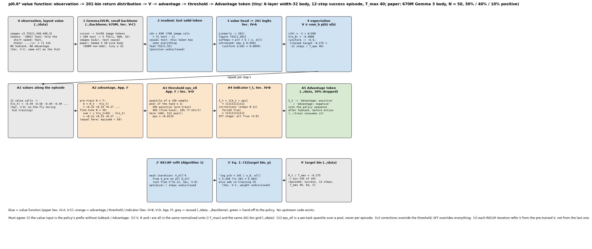
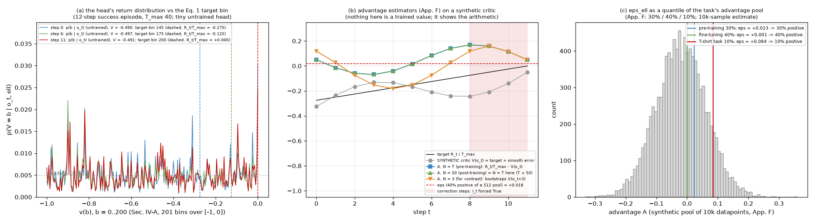

# π0.6* · value: 分布式价值函数 (201 bin), Eq. 1 训练, advantage 估计, 分位数阈值与二值指示

**TL;DR.** RECAP 的策略提取 (论文 Sec. IV-B) 不需要策略梯度, 只需要给每条样本一个 "这步动作比行为策略平均好还是差" 的二值标签; 标签来自一个 **价值函数** V^{π_ref}(o, ℓ): 与策略同架构、但底座换成 670M 的小 Gemma 3, 输出 **B = 201 个 bin 上的分布** (Sec. IV-A), 训练目标是把按任务归一到 (−1, 0) 的经验回报 (= −剩余步数 / T_max, Sec. V-C) 离散后做交叉熵 (Eq. 1), 推理时取期望得到 V. 这是 **训练侧的增量** (推理时策略不调用 V): 预训练时 advantage = R_t − V(o_t) (N = T, 一次前向, 在线算), post-training 时 N = 50 步 lookahead (App. F); 每个任务的阈值 ε_ℓ 取分位数, 使 30% 的示范 (预训练) / 40% 的 rollout (微调) / 10% (T 恤任务) 为正 (App. F, 10k 样本估计); 人工纠正段强制正, SFT 阶段全部为正 (Sec. IV-B, V-D). 代价: 每条训练样本多一次小模型前向 (Sec. V-D "minimal additional cost"), 另加 web 数据 co-training 防过拟合 (Sec. V-C). 收益: Fig. 4 / Fig. 13 里 V 能定位失败与恢复; 整条 RECAP 的 throughput 与成功率收益在 `../train` README. 上游无代码; 优化器 / 步数 / batch 全部未披露.

**流程图**: 上排是一次价值读取 (layout `value` 的 prefix → 小 Gemma 3 → 最后一个有效 token → 201 logits → 期望); 中排是 advantage → 阈值 → 指示 → `Advantage:` token; 下排是训练目标 (Eq. 5 bin → Eq. 1 CE → RECAP 每轮从 V_pre 重训). tiny: 6 层宽 32 的价值底座, 一条 12 步成功 episode, T_max 40.



**第二幅图的论点**: (a) head 输出的 201 bin 分布与 Eq. 1 的目标 bin (未训练的 head 接近均匀, V ≈ −0.5); (b) 两种 advantage 估计在一个 **合成** critic 上的算术 (N = T 与 N = 50 在短 episode 上相同; N = 3 的 bootstrap 形状不同), 以及纠正段的覆盖; (c) ε_ℓ 是任务 advantage 池的分位数, 30% / 40% / 10%.



本 module 复现 π0.6* 的价值函数与 advantage 链. 论文 π0.6* [arXiv:2511.14759v2](https://arxiv.org/abs/2511.14759v2) Sec. III (advantage 定义), IV-A (Eq. 1, 201 bin, 期望读出), IV-B (I_t, 纠正强制 True), V-C (670M Gemma 3 底座, 同样的语言输入, (−1, 0), web co-training), V-D (30% 分位数, 在线计算, SFT 固定 True, 每轮从预训练 checkpoint 微调), Appendix F (N = 50, 阈值, 10k), Algorithm 1. 底座结构 `../backbone` (`gemma@0513283` `Gemma3_1B` L169-L193 作为 670M 的替身). 上游 openpi 无价值函数代码. PyTorch / NumPy 重写.

## 1. I/O 契约

### 1.1 推理: `model.py`

**`ValueFunction(vit_cfg=SIGLIP_400M_448, cfg=VALUE_BACKBONE, num_bins=201)`** (Sec. IV-A, V-C)

| 名称 | shape / dtype | 说明 |
|---|---|---|
| 入 `obs` | `Pi06Observation`, layout `"value"` | 图像 + `Task: <prompt + metadata>, State: …;\n`; **无** Subtask, **无** Advantage (Sec. V-C "the same language inputs as the π0.6* VLA") |
| `forward(obs)` → `(logits, h)` | f32[B, 201], f32[B, S, W] | h 是 prefix 隐状态 (给 `train.py` 的 co-training head) |
| `readout_index(valid)` | i64[B] | 最后一个有效列 (文本因果 ⇒ 它看过全部); 位置未披露 (→ §8) |
| `distribution(obs)` | f32[B, 201] | softmax = p_φ(V = b \| o, ℓ) |
| `value(obs)` | f32[B] ∈ [−1, 0] | V = Σ_b p(b) v(b), v(b) = −1 + b/200 (`../data` `bin_values`) |

`VALUE_BACKBONE = GEMMA3_1B` (Gemma 3 报告 Table 1: 698M 非 embedding + 302M embedding) 是论文 "670M" 的最近替身 (→ §8). `value_param_count()`: head = 1152 × 201 + 201 = 231,753.

### 1.2 训练: `train.py`

| 函数 | 入 | 出 | 来源 |
|---|---|---|---|
| `value_loss(vf, obs)` | layout `"value"` + `value_bin` | CE f32[B] | Eq. 1: H(R^B_t, p_φ(V \| o_t, ℓ)) |
| `cotrain_text_loss(vf, obs)` | layout `"text"` | CE f32[B] (SEG_TEXT 段的 next-token, tied head) | Sec. V-C "co-train the value function on a small mixture of multi-modal web data"; 权重未披露 |
| `advantage_whole_episode(R_norm, V)` | f32[T+1], f32[T+1] | A_t = R_t / T_max − V(o_t) | App. F 预训练 (N = T); 论文式子的求和下标写成 t' = 0 (→ §8) |
| `advantage_nstep(r_norm, V, n=50)` | | A_t = Σ_{t'=t}^{min(t+n−1, T)} r/T_max + [t+n ≤ T] V(o_{t+n}) − V(o_t) | Sec. III; App. F "N = 50 lookahead" (post-training); 越过 episode 末尾不 bootstrap (推断 → §8) |
| `improvement_threshold(A, positive_fraction, rng, sample_size=10k)` | | ε_ℓ = quantile(A, 1 − frac) | App. F: 30% / 40% / 10%, 10k 样本; Sec. V-D 把预训练规则写成 "values 的 30% 分位数" (→ §8) |
| `improvement_indicator(A, ε, is_correction=None, sft=False)` | | bool[T+1] | Sec. IV-B: I_t = 1[A_t > ε_ℓ]; 纠正段 True; SFT 全 True (Sec. V-D) |
| `episode_values(vf, step_batches)`, `label_episode(...)` | 一条 episode 的逐步 batch | V, A, I | Sec. V-D 的在线计算 |
| `train_step(vf, value_batch, params, opt, ema, cfg, step, text_batch=None, cotrain_weight=1.0)` | | dict | Eq. 1 (+ co-training); 优化器用 `pi.pi0.train` 的 AdamW / clip / EMA, 值未披露 |
| `pretrain_config()`, `finetune_config(positive_fraction=0.4)`, `tiny_config()` | | `ValueTrainConfig` / `TrainConfig` | `optimizer=None` = 未披露; tiny 值仅为跑通 |

常量: `LOOKAHEAD_N = 50`, `POSITIVE_FRACTION_PRETRAIN = 0.30`, `POSITIVE_FRACTION_FINETUNE = 0.40`, `POSITIVE_FRACTION_TSHIRT = 0.10`, `THRESHOLD_SAMPLE_SIZE = 10_000` (App. F).

### 1.3 符号 / 约定差异

| 论文 | 本仓库 | 说明 |
|---|---|---|
| Sec. III: A = E[Σ_{t'=t}^{t+N−1} r + V(o_{t+N})] − V(o_t), 原始奖励单位 | 全部除以 T_max 后计算 | 与 `../data` 的归一化目标同单位; 阈值是分位数, 与尺度无关 |
| App. F 预训练: "A = Σ_{t'=0}^{T} r_{t'} − V(o_t)" | Σ_{t'=t}^{T} | 从 0 求和会让 A 依赖 episode 开头; 按 "setting N = T for each episode" 读成从 t 求和 |
| Sec. V-D: "ε_ℓ = 30% percentile of values predicted by the value function" | App. F: "30% of the demonstration data has positive advantage" | 两处说法不同 (values 的分位数 vs advantages 的分位数); 实现按 App. F (advantage 的分位数), 记 §8 |

## 2. 复现范围

| 有代码 | 只有事实 (背景) |
|---|---|
| 201 bin head 与期望读出; Eq. 1; web co-training 项; 两种 advantage; 分位数阈值; 指示 (纠正 / SFT); 一步训练 | 670M 底座的确切配置; 优化器 / 步数 / batch / 算力; co-training 混合比例; Fig. 4 / Fig. 13 的定性观察 (V 在失误处下降、恢复处上升) |

## 3. 推理侧

策略部署时 **不调用** 价值函数 (Sec. V-D: 部署固定 I = True). V 只在训练数据标注时前向: 预训练每样本一次 (N = T 只需 V(o_t)), post-training 每样本两次 (V(o_t), V(o_{t+50})) 或对整条 episode 逐步一次. 延时未披露; Sec. V-D 说 670M 底座让这个开销 "minimal".

## 4. 训练侧

### 4.1 数据组织形式

| 样本 | layout | 目标 | 来源 |
|---|---|---|---|
| 每条 episode 的每一步 | `"value"` + `value_bin` | bin(R_t / T_max) | Sec. IV-A "over the trajectories in the current dataset D": 预训练 D = 示范; 之后 D_ℓ = 示范 ∪ 自主 ∪ 纠正 (Algorithm 1) |
| web 数据 | `"text"` | 文本目标 | Sec. V-C |

### 4.2 数据预处理, 逐步

1. `../data`: 成功标签 → Eq. 5 → 回报 → / T_max → clip → 201 bin (`EpisodeLabels.value_targets`).
2. `../data` layout `"value"`: 与策略相同的 prefix, 不带 Subtask / Advantage.
3. (标注策略数据时) `episode_values` → `advantage_*` → `improvement_threshold` (任务级, 10k 样本) → `improvement_indicator` → `../data` `drop_indicator` (30%) → `Advantage:` token.

### 4.3 training objective / curriculum

- 预训练: V_pre 在全部示范上按 Eq. 1 训练 (Algorithm 1 第 1 行); 然后 ε_ℓ 按任务估计 (30%), 在策略预训练时在线算 I_t (Sec. V-D).
- 每个任务: V_ℓ^0 从 V_pre 在示范 D_ℓ 上微调 (第 4 行); 策略 SFT 时 I = True.
- 每轮 k: 采集后 V_ℓ^k **从 V_pre** 在全部 D_ℓ 上微调 (第 8 行; Sec. V-D "rather than the policy and value function from the last iteration"), 阈值使 40% 的 rollout 为正 (T 恤 10%), 再训策略.
- 优化器 / lr / batch / 步数 / EMA: 未披露 (`optimizer=None`).

## 5. 评测

无独立评测 (论文没有价值函数的定量指标, 只有 Fig. 4 / 13 的可视化); 端到端在 `../infer/eval.py`. `test_parity.py` (CPU, 约 2 s) 检查:
- head 形状 [B, 201], V ∈ [−1, 0], 期望恒等式, 读出位置是最后一个有效列且改动它会改 logits.
- Gemma 3 1B 替身的参数量 = 报告 Table 1 (697,896,064 / 301,989,888); head 参数量.
- Eq. 1 oracle (one-hot logits → CE ≈ 0); `"value"` batch 上 co-training 项恰为 0.
- 完美 critic ⇒ 两种 advantage 都为 0; N ≥ T 退化为整 episode 形式; N = 2 的 bootstrap 位置; N = 50.
- 三个分位数阈值在 10k 采样下误差 < 2%; 指示: 阈值 / 纠正覆盖 / SFT 全 True; 配置常量.
- 一步训练 (Eq. 1 + co-training) 跑通, 梯度有限.

```
uv run pytest pi/pi06/value -q
uv run python -m pi.pi06.value.model     # 一次价值读取: 读出位置, 201 logits, 期望
uv run python -m pi.pi06.value.train     # 一条 episode 的 V / A / ε / I, 三步 Eq. 1 + co-training
uv run python pi/pi06/value/figs/make_pipeline.py
uv run python pi/pi06/value/figs/make_figs.py
```

## 6. cost 信息

| 项目 | 值 | 来源 |
|---|---|---|
| 价值函数底座 | 670M, 从 Gemma 3 初始化 | Sec. V-C; 确切配置未披露 → §8 (替身 Gemma 3 1B: 698M + 302M) |
| head | 201 类 | Sec. IV-A |
| 阈值估计 | 10k 个数据点 | App. F |
| advantage lookahead | N = 50 (post-training), N = T (预训练) | App. F |
| 标注开销 | "minimal additional cost during VLA training" | Sec. V-D; 无数字 |
| 训练算力 / 步数 / batch / 优化器 | 未披露 → §8 | |

## 7. reference 映射表

| 本仓库 | 论文 / 上游 |
|---|---|
| `ValueFunction`, `value_head`, `distribution`, `value` | Sec. IV-A (p_φ(V \| o_t, ℓ) ∈ Δ^B, B = 201; V = Σ p(b) v(b)); Sec. V-C (同架构、小底座); Fig. 3 |
| `readout_index` | 本仓库 (未披露) |
| `VALUE_BACKBONE`, `VALUE_BACKBONE_PARAMS`, `value_param_count` | Sec. V-C "670M"; `gemma@0513283` `Gemma3_1B` L169-L193; 报告 Table 1 |
| `value_loss` | Eq. 1 |
| `cotrain_text_loss` | Sec. V-C |
| `advantage_whole_episode` | App. F "Advantage Estimation" (预训练, N = T); Sec. III |
| `advantage_nstep`, `LOOKAHEAD_N` | Sec. III; App. F (N = 50) |
| `improvement_threshold`, `POSITIVE_FRACTION_*`, `THRESHOLD_SAMPLE_SIZE` | App. F "Advantage threshold"; Sec. V-D |
| `improvement_indicator` | Sec. IV-B (I_t, 纠正强制 True); Sec. V-D (SFT 固定 True) |
| `episode_values`, `label_episode` | Sec. V-D (在线计算) |
| `train_step`, `pretrain_config`, `finetune_config` | Algorithm 1 第 1, 4, 8 行; Sec. V-D (从 V_pre 微调); 优化器 `pi.pi0.train` |

## 8. gap ledger

| 未披露 / 未复现 | 说明 |
|---|---|
| 670M 底座的配置 | 与任何 Gemma 3 尺寸都不严格对应 (1B 是 698M 非 embedding); 本仓库用 `GEMMA3_1B`; 视觉编码器是否与策略共享 / 冻结未披露 |
| 读出位置 | 用最后一个有效 token; 也可能是专用 token 或池化 |
| bin 的取值映射 v(b) | `../data`: 201 个均匀 bin 覆盖 [−1, 0] |
| 归一化的细节, C_fail | 见 `../data` §8 |
| 预训练 advantage 的求和下标 | 论文 App. F 写 t' = 0; 实现按 t' = t |
| N-step 越过 episode 末尾 | 未说; 本仓库: 求和到 T, 不 bootstrap |
| 阈值定义的两种说法 | Sec. V-D (values 的 30% 分位数) vs App. F (30% 的数据 advantage 为正); 实现按 App. F |
| 分位数估计的采样方式 | "random sample of 10k datapoints"; 本仓库无放回均匀采样 |
| web co-training 的混合比例与权重 | 未披露; `cotrain_weight=1.0` 仅为跑通 |
| 优化器 / lr / batch / 步数 / EMA / 算力 | 全部未披露; `tiny_config` 仅为跑通 |
| 是否用 EMA 权重做标注 | 未披露 |
| 价值函数是否也做 30% 的 metadata / 条件 dropout | 未提 |

## 9. 领域概念表

### domain 概念

**分布式价值函数 (distributional value function)**
- shape: 每个 (o_t, ℓ) 一个 201 维概率向量, 期望是一个标量 ∈ [−1, 0].
- 含义: 对 "归一化剩余步数" 的分布估计 (Sec. IV-A [72] 的 C51 式表示), 而不是一个回归值; 期望即 V^{π_ref}.
- 来源: Monte Carlo 目标 (整条 episode 的经验回报), 不是 TD; 数据集 D 的行为策略就是 π_ref.
- 为什么需要: 分类 CE 比回归稳定, 且天然表示 "可能成功也可能失败" 的双峰 (失败 −1 与成功 −剩余/T_max).
- 系统联系: 期望 V 进 advantage; bin 网格与 `../data` 的目标共享.

**advantage 与二值指示 I_t**
- shape: 每步一个标量 A_t, 一个 bool.
- 含义: 这步动作之后的实际回报比 V 预计的好多少; I_t = A_t > ε_ℓ.
- 来源: 预训练用整 episode 回报 (一次 V 调用), post-training 用 50 步 lookahead + bootstrap.
- 为什么需要: Eq. 2-3 的条件策略只认二值指示; 阈值代替了 CFG 的 β 调参 (Sec. IV-B 脚注 2).
- 系统联系: `../data` 把它写成 `Advantage:` 文本; `../train` 的策略目标不含 α.

### application 概念

**RECAP 中 V 的重训规则**
- shape: 每轮一个新的 V_ℓ^k checkpoint.
- 含义: 每轮都从 V_pre 出发在累计的 D_ℓ 上微调, 而不是接着上一轮.
- 来源: Sec. V-D ("useful for avoiding drift over multiple iterations").
- 为什么需要: 数据集在变 (自主 rollout 越来越多), 从固定起点重训避免多轮累积漂移.
- 系统联系: 策略同样从 π_pre 重训 (`../train`).
